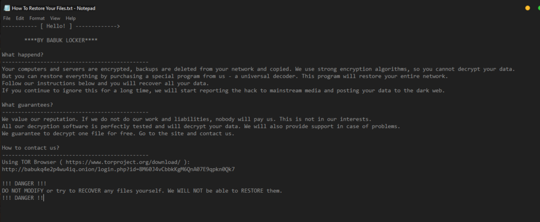

:slug: babuk-locker/
:date: 2021-01-14
:subtitle: The first ransomware (as a gift) for this new year
:category: attacks
:tags: software, security, vulnerability, hacking, mistake
:image: cover.png
:alt: Photo by Guido Hofmann on Unsplash
:description: Here's a post dedicated to the new form of ransomware, Babuk Locker. I mention its encryption scheme, its injection, operation, and other basic things about it.
:keywords: Ransomware, Babuk, Locker, Software, Security, Vulnerability, Hacking, Ethical Hacking, Pentesting
:author: Felipe Ruiz
:writer: fruiz
:name: Felipe Ruiz
:about1: Cybersecurity Editor
:source: https://unsplash.com/photos/iu6OOcloLvY

= Babuk Locker for the 2021

A new form of link:../ransomware/[ransomware] has emerged to welcome the new year, *2021*.
We're referring to the *Babuk Locker*.
Malicious software that is capable of encrypting
some of your essential files to deny you access to them,
and for which you should pay a ransom.
link:http://chuongdong.com[Chuong Dong], a Computer Science student
at link:https://www.gatech.edu/[Georgia Tech] interested in cybersecurity,
link:http://chuongdong.com/reverse%20engineering/2021/01/03/BabukRansomware/[reported it on 03/01/21].
(It seems that Dong saw Babuk mentioned in a tweet by link:https://twitter.com/Arkbird_SOLG[Arkbird] and,
linked to it, finishing the post,
I found an earlier link:https://id-ransomware.blogspot.com/2021/01/babuk-ransomware.html[article in Russian by Amigo-A] published on 01/01/21.)

According to Dong, this malware has not been obfuscated
(link:https://securityboulevard.com/2020/02/what-is-malware-obfuscation/[malware obfuscation] makes the data or code difficult to understand)
and is quite 'standard,' even amateurish in coding.
Besides, it uses "techniques we see such as multi-threading encryption
as well as abusing the Windows Restart Manager similar to Conti and REvil"
(other forms of ransomware).
However, this ransomware's encryption scheme allows it to stand out,
being enough to prevent victims from recovering their systems and files
efficiently and for free.

.Photo by Glen Carrie on link:https://unsplash.com/photos/TGeFx4x4NHU[Unsplash].

== Babuk Locker's encryption scheme

The robust encryption scheme of Babuk Locker, as stated by Dong,
includes "SHA256 hashing, ChaCha8 encryption,
and Elliptic-curve Diffie-Hellman (ECDH)
key generation and exchange algorithm."
link:https://xorbin.com/tools/sha256-hash-calculator[SHA256] (SHA: Secure Hash Algorithm) is dedicated to generating
a 256-bit (32-byte) hash value
(we already saw what a _hash_ is
in link:../pass-cracking/[my first post on `Fluid Attacks'` blog]).
ChaCha8, on the other hand, is a link:https://en.wikipedia.org/wiki/Stream_cipher[stream cipher], a better variant of link:https://en.wikipedia.org/wiki/Salsa20[Salsa20].
These ciphers —both developed by professor link:https://en.wikipedia.org/wiki/Daniel_J._Bernstein[Daniel J. Bernstein]—
encrypt plaintext messages (every bit of the message is encrypted one by one)
by applying an algorithm
with a pseudorandom cipher digit stream or a keystream.
Finally, ECDH constitutes link:https://en.wikipedia.org/wiki/Elliptic-curve_Diffie%E2%80%93Hellman["a key agreement] protocol
that allows two parties, each having an elliptic-curve public-private key pair,
to establish a shared secret over an insecure channel."
Undoubtedly, for many of us, it is sufficient with this information
instead of going into encryption details.
Let's keep an overview of this ransomware currently occupying our attention.

== Babuk Locker's injection and operation

Babuk Locker appears as a 32-bit _.exe_ file
(i.e., "link:https://id-ransomware.blogspot.com/2021/01/babuk-ransomware.html[BABUK.exe]", at least that’s how it was coming),
but, as reported by link:https://threatpost.com/ransomware-babuk-locker-large-corporations/162836/[O'Donnell in Threatpost],
it is not clear how this malware "is initially spread to victims."
However, the vehicle of infection, in this case,
may not be far from the typical link:../phishing/[phishing]
"similar to other ransomware groups' approaches," said Dong to Threatpost.
Indeed, for his part, link:https://howtofix.guide/babuk-locker/[Brendan Smith in Howtofix]
talks about only two forms of Babuk injection: email spam and trojans.

When the threat actors launch Babuk Locker,
they can employ "a command-line argument to control
how the ransomware should encrypt network shares
and whether they should be encrypted before the local file system,"
notes link:https://www.bleepingcomputer.com/news/security/babuk-locker-is-the-first-new-enterprise-ransomware-of-2021/[Abrams in BleepingComputer].
Babuk, following an assigned list,
can close or terminate a wide variety of Windows support services
(e.g., system-monitoring services) and running processes
(e.g., Office apps, mail servers, and web browsers) before encryption.
Snuffing out these services and processes is something necessary
for successful encryption by the malware.
Additionally, Babuk tries to remove link:https://en.wikipedia.org/wiki/Shadow_Copy[shadow copies]
(i.e., backup copies or snapshots of files or volumes)
before and after the encryption.

As Abrams also points out, "When encrypting files,
Babuk Locker [uses] a hardcoded extension
and [appends] it to each encrypted file."
The specific extension currently used is "*.__NIST_K571__*".
So, for example, if you have a file with the name "summary_2020.docx",
it is transformed into "summary_2020.docx.__NIST_K571_".
Linked to this, a ransom note named _How To Restore Your Files.txt_
(see Figure 2) appears in the folders containing encrypted files.
It shows general information about the attack
and instructions to follow for recovering data,
including a link to a link:https://www.torproject.org/[Tor] page
(remember the _.onion_ we talked about
link:../dark-web/[a few weeks ago]) to establish negotiation.

.Image taken from link:http://chuongdong.com/uploads/RansomNote.PNG[chuongdong.com].

In addition, the ransomware operators
can reveal in their notes victims' names and demonstrate through images
that they have stolen unencrypted files with data
that they could expose (leak) on the Dark Web,
specifically on a hacker forum, in case no agreement is reached.
It seems that the subjects behind this Babuk Locker project
do not currently have their own leak site
(that could be launched soon, says Abrams).
So, for now, they only resort to the forum to publish stolen data.

When both parties are chatting on the Tor site,
the criminals start with two questions:
"Are you a recovery company?"
and "Do you have insurance against ransomware programs?"
Then, before discussing prices, they ask the victim for some files
(less than *10MB*) he/she wants to recover
and subsequently request the _ecdh_pub_k.bin_ file,
where they can get the victims' public ECDH key
that allows them to perform the decryption test.
By this, they perhaps intend to demonstrate that this is a serious matter
and that they are the party who calls the shots.

== You should be aware of Babuk Locker

Babuk Locker has already affected
some companies (mainly manufacturers) 'worldwide,'
which seemingly you could count on the fingers of one hand.
(Reviewing the article by Amigo-A,
this ransomware had already shown activity since last December,
and it appears that the first known victim was an Italian company.)
Babuk operators have established a pay range for the systems' release
between *$60,000* and *$85,000* in Bitcoin.
In fact, it was this higher value
that one of the victim companies apparently agreed to pay,
being the only one that has decided to do so,
at least as reported until last week.

Based on O'Donnell's words, the number of ransomware attacks continues to grow,
"jumping by 350 percent since 2018."
One of the most affected has been the healthcare sector,
and how could it not be, when, amid a COVID-19 pandemic,
its work has increased considerably,
and its workers may show difficulties in concentration.
The latter is a factor that many cybercriminals exploit nowadays.
They send emails with files
that some of your employees or coworkers may not think twice before opening.
Babuk Locker, the 32-bit _.exe_ file, is another ransomware to add to the list,
and everyone in your company should be aware of it!

I hope you have enjoyed this post
and remind you that we're looking forward to hearing from you
here at `Fluid Attacks`. link:../../contact-us/[Do get in touch with us!]
