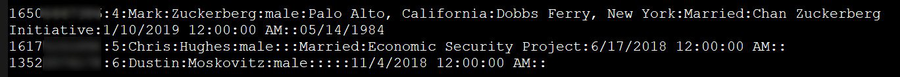
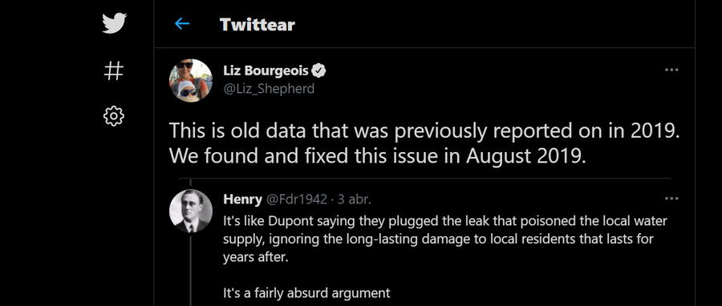

:slug: facebook-data-leak/
:date: 2021-04-09
:subtitle: About 533 million user phone numbers now for 'free'
:category: attacks
:tags: cybersecurity, software, vulnerability, mistake, hacking, application
:image: cover.png
:alt: Photo by Barefoot Communications on Unsplash
:description: This post outlines the most recent Facebook data leak with approximately 533 million records, including users' phone numbers, now posted for free.
:keywords: Facebook, Data, Leak, Breach, Scraping, Vulnerability, Ethical Hacking, Pentesting
:author: Felipe Ruiz
:writer: fruiz
:name: Felipe Ruiz
:about1: Cybersecurity Editor
:source: https://unsplash.com/photos/z2M7JefmTEw

= Familiar With Facebook Data Leak?

A few days ago, someone published the phone numbers
and other account information
of hundreds of millions of Facebook users on a cybercrime forum.
We are talking about information that is now 'free'
but which had been circulating on the web months before and that
even Facebook refers to as material extracted from its platform in 2019.
This case comes in addition to several previous ones
that have cast serious doubt on this widely used social network's security.
We will review some details about it in this post.

If you were asked why you use Facebook, what would you answer?
Perhaps it wouldn't be too far
from the funny idea expressed by link:https://www.zdnet.com/article/new-poll-shows-facebooks-severe-trust-problem/[Gewirtz in ZDNet]:
"We all use Facebook because it's the only way we can know
what people we haven't talked to in years have eaten for dinner."
But, whatever your reason for using this social network,
have you been aware of its security and user data handling issues?
One of the most frequently mentioned incidents
has been link:https://en.wikipedia.org/wiki/Facebook%E2%80%93Cambridge_Analytica_data_scandal[the Cambridge Analytica scandal],
where Facebook shared the data of millions of its users
without their consent to that British company,
mainly for political advertising. Apart from this (also in millions),
there have been cases of link:https://www.zdnet.com/article/facebook-harvested-1-5-million-user-email-contacts-without-permission/[harvesting of user email contacts] without permission,
link:https://www.zdnet.com/article/facebook-we-stored-hundreds-of-millions-of-passwords-in-plain-text/[passwords stored in plain text], and, well, information leaks,
which concerns us at the moment.

On this occasion, the information that has been made public
corresponds to link:https://www.bleepingcomputer.com/news/security/533-million-facebook-users-phone-numbers-leaked-on-hacker-forum/[533,313,128 Facebook users].
Apparently, almost all the records include the user's ID
(a long number linked to the account), name, gender,
and a piece of information that, associated with the above,
makes this situation more alarming: their phone number.
We can also find data such as the user's email address, relationship status,
date of birth, occupation, city, country,
and account creation date in some records.
These data are part of the user profiles,
and the passwords have not been exposed.
However, phone numbers, now public,
are information that usually remains private within accounts.

.link:https://www.bleepingcomputer.com/news/security/533-million-facebook-users-phone-numbers-leaked-on-hacker-forum/[Facebook's founders in data leak].

In this database, the affected users are separated by country
(although Africa is listed, perhaps referring to South Africa).
The threat actor(s) registered 106 nations
(link:https://threadreaderapp.com/thread/1349671294808285184.html[the list may show 107], but there's an error with Tunisia appearing twice)
and specified the total number of users for each of them.
For instance, by rounding the figures, the U.S. has 32.3M records,
Colombia 18.0M, Mexico 13.3M, Peru 8.1M, Chile 6.9M, and Panama 1.5M.

Currently, those are 106 separate download packages
in a public cybercrime forum. Nevertheless, link:https://therecord.media/phone-numbers-for-533-million-facebook-users-leaked-on-hacking-forum/[as Cimpanu in The Record says],
"While the forum is publicly accessible and anyone can register a profile,
the download links for these packages are only available
to users who bought forum credits." Specifically, link:https://www.bleepingcomputer.com/news/security/533-million-facebook-users-phone-numbers-leaked-on-hacker-forum/[it is said]
that any person must pay eight credits to access the database,
with each credit costing approximately $2.19.
This is pretty cheap for the amount of information available;
that's why I found reference to "free data" in almost all sources.

Typically, these stolen data sets are initially sold privately at high prices.
Later, they are sold at lower costs, and, in the end,
they are given for free by their owners mostly to gain reputation
within the hacker community. In this case,
the stolen information corresponds, especially link:https://about.fb.com/news/2021/04/facts-on-news-reports-about-facebook-data/[according to Facebook itself],
to the same data that malicious actors harvested from its platform in 2019.
link:https://www.bleepingcomputer.com/news/security/533-million-facebook-users-phone-numbers-leaked-on-hacker-forum/[Abrams in BleepingComputer says] it was in mid-2020
when this stolen information came to light in a hacker community
with one member selling it to other members.
Later, in January 2021, Hudson Rock's CTO link:https://twitter.com/UnderTheBreach/status/1349674272227266563[Alon Gal tweeted that]
"a user created a Telegram bot
allowing users to query the database for a low fee,
enabling people to find the phone numbers
linked to a very large portion of Facebook accounts."
Finally, at the beginning of this month,
link:https://twitter.com/UnderTheBreach/status/1378314424239460352[Gal tweeted that] those "Facebook records were just leaked for free."

But what happened to Facebook for losing all that information
from link:https://therecord.media/phone-numbers-for-533-million-facebook-users-leaked-on-hacking-forum/["about a fifth"] of its complete user pool?
Several sources refer specifically to a vulnerability
in the 'Add Friend' feature on Facebook
that malicious actors could have exploited.
link:https://www.bleepingcomputer.com/news/security/533-million-facebook-users-phone-numbers-leaked-on-hacker-forum/["It is unknown if] this alleged vulnerability allowed the threat actor
to retrieve all of the information in the leaked data or just the phone number,
which was then combined with information scraped from public profiles."
It was from there that criminals could have created the database of 533M users.

link:https://about.fb.com/news/2021/04/facts-on-news-reports-about-facebook-data/[Facebook, on the other hand], does not mention vulnerability or hacking.
They believe that only the 'scraping' technique was used by criminals
to extract user data before September 2019,
employing their 'contact importer' feature.
Facebook created this function for people
to easily find their friends on the network
(supposedly getting limited but public information from the profiles)
using their contact lists (phone numbers). Apparently,
after realizing how some individuals were using this characteristic,
the company decided to make changes to it and resolve the situation.
"We updated it to prevent malicious actors from using software
to imitate our app and upload a large set of phone numbers
to see which ones matched Facebook users."

Interestingly, on September 4, 2019,
link:https://techcrunch.com/2019/09/04/facebook-phone-numbers-exposed/[Whittaker in TechCrunch reported] many Facebook users' phone numbers
(linked to IDs and other data) recently exposed online.
Expressly, he referred to an exposed, unprotected server
(link:https://www.forbes.com/sites/daveywinder/2019/09/05/facebook-security-snafu-exposes-419-million-user-phone-numbers/?sh=2e0ad5901ab7["not a Facebook one"]) with more than 419M records.
On that occasion, the U.S. had 133M records,
about four times more than in the 'most recent case.'
At that time, Facebook said malicious actors scraped that data
before they restricted access to users' phone numbers on their platform,
i.e., _more than a year ago_. link:https://edition.cnn.com/2019/09/04/tech/facebook-phone-numbers-exposed["Until April 2018],
people could enter another person's phone number
to find him or her on Facebook." But, wait a minute,
wasn't that what they said users could do until August 2019?
I don't get the hang of this!
And while there may be discussions about this imbroglio,
nobody mentioned it in the posts I had the opportunity to review.

.link:https://twitter.com/Liz_Shepherd/status/1378398417450377222[Tweet by Liz Bourgeois], Director, Strategic Response Communications at Facebook.

The thing now is that, for this 533M records situation,
people are talking about 'old data' from 2019,
leaked from a problem that Facebook 'resolved' in August of the same year.
(At that time, Facebook also had to fix link:https://www.forbes.com/sites/zakdoffman/2019/09/12/new-instagram-hack-exclusive-facebook-confirms-user-accounts-and-phone-numbers-at-risk/?sh=629e5b922004[a similar issue with Instagram].
What a mess!) However, even if the data is around two years old,
it can still be valuable to cybercriminals.
Phone numbers and email addresses are often the same over many years.
Threat actors can then engage in phishing (with email addresses),
smishing (mobile text phishing), SIM swap attacks
(link:https://www.bleepingcomputer.com/news/security/533-million-facebook-users-phone-numbers-leaked-on-hacker-forum/["steal multi-factor authentication] codes sent via SMS"),
and other scams or impersonation attacks.
Therefore, if you use Facebook, you should beware of strange messages
with requests for further information or with enclosed links,
possibly even associated with the pandemic.

By the way, to conclude, since Facebook seems not to have made it available,
the renowned website link:https://haveibeenpwned.com/[haveibeenpwned.com] allows you to check
if you are part of the victims of this data leak.
Initially, this page only allowed verification via email address.
But this data is quite limited in quantity in this leak
(link:https://www.bleepingcomputer.com/news/security/how-to-check-if-your-info-was-exposed-in-the-facebook-data-leak/[only for 2.5M of the affected users]), so, a few days ago,
link:https://www.troyhunt.com/the-facebook-phone-numbers-are-now-searchable-in-have-i-been-pwned/#comment-5332905964[the website enabled the search through phone numbers]. Good luck!
