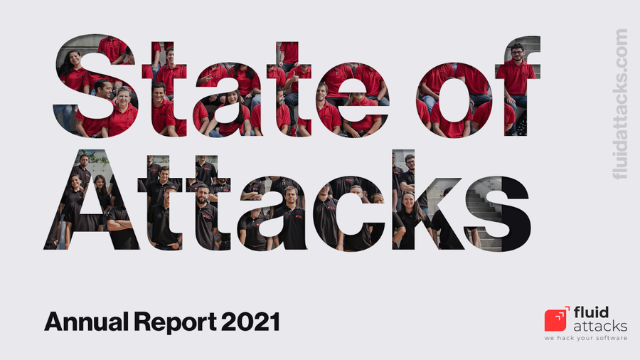

:slug: fbi-2020-report/
:date: 2021-03-25
:subtitle: Get a digest of Internet crime over the last year
:category: attacks
:tags: cybersecurity, social, documentation, risk, social-engineering, hacking
:image: cover.png
:alt: Photo by Joshua Sukoff on Unsplash
:description: This post gives you an overview of the FBI's 2020 Internet Crime Report, based on the activity of the Internet Crime Complaint Center (IC3).
:keywords: FBI, Internet Crime, Report, Coronavirus, Social Engineering, Hacking, Ethical Hacking, Pentesting
:author: Felipe Ruiz
:writer: fruiz
:name: Felipe Ruiz
:about1: Cybersecurity Editor
:source: https://unsplash.com/photos/5DDYHjk_KMU

= What's in the FBI's 2020 Report?

This month, the FBI released the link:https://www.ic3.gov/Media/PDF/AnnualReport/2020_IC3Report.pdf[2020 Internet Crime Report],
based on the activity of the Internet Crime Complaint Center (IC3).
The IC3 serves worldwide citizens
to obtain accurate and up-to-date information about cybercrime
and as a reporting mechanism if they suspect they are victims in cyberspace.
In cases where they are actually victims, they receive assistance from the FBI.
This agency is also responsible for investigating, understanding,
and holding criminal actors accountable in order to prevent additional attacks.
In this post, I want to share with you
some highlights from the mentioned report.

== Intro

It is now commonplace for cybersecurity reports concerning the past year
to begin by referring to the opportunities the COVID-19 pandemic
has brought to cybercriminals.
For instance, a lot more people working remotely,
many more companies turning to digital transformation,
lots of overburdened healthcare workers, and, in general,
almost everyone in substantial uncertainty
about what the virus could represent.
As mentioned by Paul Abbate, Deputy Director of the FBI,
"These criminals used phishing, spoofing, extortion,
and various types of Internet-enabled fraud
to target the most vulnerable in our society."

Last year the IC3 received *791,790* complaints
—a new record with a 69% increase over 2019—
representing losses of more than *$4.2 billion*.
Almost half of these losses (about $1.8 billion)
were related to Business E-mail Compromise (BEC) schemes
where the number of complaints was much lower (19,369)
than for Phishing scams (241,342), for example.
This last type of crime was the leader in the number of complaints,
but even so, related losses were just close to $54 million.
Additionally, according to the report,
the number of ransomware incidents again showed growth,
reaching a total of 2,474 cases reported with losses of over $29.1 million.
(If you want to be clear about phishing and ransomware,
visit these posts: link:../phishing/[Trust Nothing, Verify Everything]
and link:../ransomware/[Your Files Have Been Encrypted!])

It is relevant to highlight at this point a vulnerable population
about which I had honestly heard little in this area
and which has significantly been affected in recent times.
I'm talking about people _over the age of 60_.
Astonishingly, 105,301 of the total complaints in 2020
corresponded to this type of victim.
But get the picture, that's only when they desired to report their age,
so there could have been many more.
Their losses were close to *one billion dollars*.
That's why the FBI and the IC3 have invested a lot of time and effort
in educating this population to protect themselves and not become victims.

== COVID-19 as a tool

The previous year, the IC3 received more than 28,500 complaints
in direct relation to the COVID-19.
"Fraudsters targeted the Coronavirus Aid, Relief,
and Economic Security Act (CARES Act),
which included provisions to help small businesses during the pandemic"
and unemployment insurance benefits.
Loan and grant fraud and phishing for Personally Identifiable Information (PII)
made up the majority of the incidents people complained about
in connection with the CARES Act.
For example, in some U.S. states, there were complaints from citizens
that when they wanted to claim their benefits,
it turned out that criminals had already stolen their identities
and demanded monetary assistance online.

According to the FBI, impersonating government personnel via emails,
social media, and phone calls
has been one of the most frequently observed criminal strategies
throughout the pandemic. Thus,
when talking about COVID-19 vaccinations caught on,
the malefactors knew how to exploit that situation.
They started creating scams with fraudulent advertisements,
asking people to pay out of pocket or provide personal information
to join the waiting list or gain early access to the vaccine.

== Business Email Compromise

Based on the data I referenced above,
Business Email Compromise (linked to the Email Account Compromise; EAC)
is the costliest scheme of attack present in this FBI's report.
Again, 19,369 complaints with losses above $1.8 billion.
BEC/EAC corresponds to an advanced scam
aimed at businesses and individuals making fund transfers.
The fraudsters usually employ social engineering
or any computer intrusion technique to compromise email accounts
and use them to request unauthorized transfers of money
to fraudulent locations. In the early days,
chief executive/financial officers' email accounts
were generally the hacking targets.
"Over the years, the scam evolved to include compromise of personal emails,
compromise of vendor emails, spoofed lawyer email accounts,
requests for W-2 information, the targeting of the real estate sector,
and fraudulent requests for large amounts of gift cards."

On the positive side, the IC3's Recovery Asset Team (RAT) operations
in response to the BEC/EAC schemes are noteworthy.
This team was founded three years ago to facilitate communication
with financial institutions and support the freezing of funds
for victims of fraudulent transfers.
In 2020, the RAT had an extraordinary *82%* success rate,
freezing more than $380 million of the nearly $463 million in reported losses
corresponding to 1,303 incidents.

== Tech Support Fraud

Another form of scam emphasized in the report is Tech Support Fraud,
which apparently continues to grow.
In this scheme, criminals pose as technical support representatives
offering solutions to problems such as compromised email and bank accounts,
software license renewals, and infected systems.
It also seems that they impersonate representatives
of financial and utility companies.
All this to order the innocent victims to make transfers
to fraudulent foreign accounts or acquire lots of prepaid cards.
Statistics for this case reveal 15,421 complaints
with losses above $146 million,
of which approximately *84%* corresponded to victims over 60 years of age.

.Photo by link:https://unsplash.com/@guillaumedegermain[Guillaume de Germain] on link:https://unsplash.com/photos/6Xw9wMJyHus[Unsplash].

Among additional data I would like to highlight
from this FBI's report are the following:

- In the last five years,
IC3 received an average of approximately *440,000* complaints per year.
- The first five types of crime with the highest number of victims were:
(*1*) Phishing/Vishing/Smishing/Pharming (241,342).
(*2*) Non-Payment/Non-Delivery (108,869). (*3*) Extortion (76,741).
(*4*) Personal Data Breach (45,330). (*5*) Identity Theft (43,330).
- California is the state with the highest number of reported victims in 2020,
a total of *69,541*. The next four states on the list are Florida (53,793),
Texas (38,640), New York (34,505), and Illinois (20,185).
- IC3 offers a top 20 countries, excluding the U.S., by the number of victims.
The United Kingdom ranks first with *216,633* victims,
significantly above Canada, which ranks second with 5,399 victims.
Mexico is ranked ninth (1,164), Brazil eleventh (951),
and Colombia nineteenth (418).

For more details on the findings, examples of some incidents,
and even recommendations regarding types of scams,
link:https://www.ic3.gov/Media/PDF/AnnualReport/2020_IC3Report.pdf[here's the link] to the referenced report.

.link:https://fluidattacks.docsend.com/view/td72dfmge9vfcid7[State of Attacks, Annual Report 2021].

Apropos of annual reports, just a week ago,
`Fluid Attacks` released the 2021 link:https://fluidattacks.docsend.com/view/td72dfmge9vfcid7[State of Attacks] report.
It will help you get ideas about practices you can implement
within your company to prevent cyberattacks based on security vulnerabilities.
