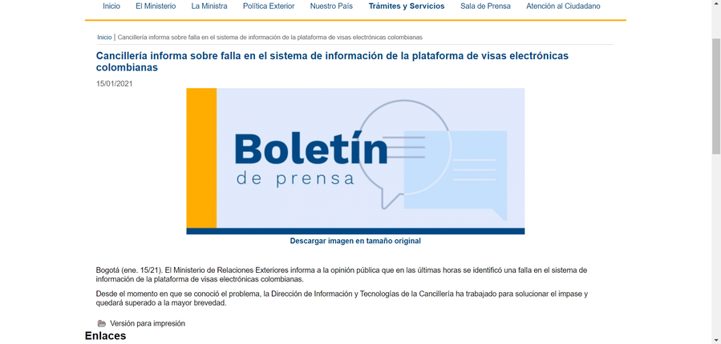

:slug: insensato-reporte/
:date: 2017-01-01
:subtitle: Cancillería colombiana enfrentó un grave problema
:category: opinions
:tags: cybersecurity, vulnerability, information, web, risk, standard
:image: cover.png
:alt: Photo by Jono Hirst on Unsplash
:description: Aquí les doy una visión general de la reciente vulnerabilidad de seguridad de la Cancillería colombiana y su inadecuada divulgación en medios de comunicación.
:keywords: Vulnerabilidad, Cancillería, Colombia, Visa, Datos, Web, Ethical Hacking, Pentesting
:author: Felipe Ruiz
:writer: fruiz
:name: Felipe Ruiz
:about1: Cybersecurity Editor
:source: https://unsplash.com/photos/dKS6CQZ5mgo

= Insensato reporte de vulnerabilidad

Suponga que usted se dispone a revisar y a descargar su visa
a través de la página web de la agencia federal correspondiente
en un país en el que usted es extranjero.
En medio de su curiosidad, para su sorpresa,
usted se da cuenta de que puede hacer algo que se supone
uno no podría hacer en esa web.
Resulta que usted puede ver y descargar las visas de muchas otras personas
con solo hacer un pequeño cambio al final de la URL.
¿Qué cree que debería hacer en este tipo de situación?
¿A quién debería contarle esto, asumiendo, por supuesto,
que usted no tiene intención de ser un ciberdelincuente?

Pues bien, a dicho escenario link:https://www.dw.com/es/colombia-falla-inform%C3%A1tica-expone-datos-de-550000-personas-extranjeras/a-56245939[se enfrentó recientemente] un individuo extranjero
que se disponía a comprobar su visa
(i.e., su documento de identificación como extranjero)
en la plataforma de visas electrónicas de Colombia.
Según informa el portal de noticias colombiano link:https://lasillavacia.com/[La Silla Vacía] (LSV) link:https://twitter.com/lasillavacia/status/1350221344231796747[en Twitter],
fue el pasado *13 de enero de 2021* cuando este ciudadano
con una nueva oportunidad de trabajar en este país sudamericano
descubrió el problema de la plataforma.
En concreto, este hombre podía acceder a un enlace
a través de un código QR adjunto a su visa digital.
Y, a partir de ahí, cambiando los números finales de ese enlace,
podía ver y obtener no solo su visa
sino la de otras personas en PDF sin ninguna restricción.

Tal vez este ciudadano no tenía la menor idea de la magnitud del inconveniente.
Se calcula que *550.000* personas tenían sus datos
en ese sistema de información vulnerable en ese momento.
Por tanto, de cualquiera de ellas,
nuestro individuo podía obtener datos como los siguientes:
fotografía, nombre completo, fecha de nacimiento, nacionalidad,
número de pasaporte y puesto de trabajo.
Por cierto, ¿sería este hombre el primero en darse cuenta de esta falla?
¿Hacía cuánto tiempo existía esta vulnerabilidad? ¿Días, meses?
Preguntas sin respuestas compartidas públicamente hasta ahora, al parecer.

En todo caso, siguiendo lo comunicado en Twitter por LSV,
nuestro individuo en cuestión
decidió escribir correos electrónicos a su embajada,
de la que no obtuvo ninguna solución,
y luego al Ministerio de Asuntos Exteriores, para no recibir respuesta alguna.
¿Cómo carajos puede ser eso posible?
Está bien, olvido de momento que
una _lentitud en los trámites_ es fácil de encontrar
en la burocracia de casi cualquier lugar.
Posteriormente, el individuo al parecer inició comunicación con LSV,
y ellos pudieron comprobar la debilidad de seguridad
en la plataforma de visas electrónicas.

Ese día, el *15 de enero*, estos periodistas,
además de hacerlo en las redes sociales, link:https://lasillavacia.com/bache-seguridad-amenazo-los-datos-extranjeros-y-cancilleria-no-sabia-79749[publicaron en su web]
'TODO' lo que se sabía hasta el momento sobre el asunto.
¿Qué hicieron con su imprudente conducta?
Adelantaron la Navidad para muchos hackers malintencionados,
principalmente en América Latina.
La Silla Vacía reveló una vulnerabilidad de ciberseguridad
para la que no había ninguna solución implementada en ese entonces.
A pesar de censurar las URLs y la información de las personas,
entregaron un gif mostrando el error de la plataforma.
¿No eran conscientes del daño que podían estar haciendo?
¿O solo pensaban apresuradamente en sus beneficios como medio de comunicación?
De nuevo, preguntas sin respuesta.

No obstante, LSV comunicó por chat el embrollo
a las autoridades competentes de la Cancillería.
Quienes respondieron que pronto remediarían la vulnerabilidad
y, horas más tarde, publicaron un link:https://www.cancilleria.gov.co/newsroom/news/cancilleria-informa-falla-sistema-informacion-plataforma-visas-electronicas[escueto boletín oficial]
sobre el tema (véase la Figura 1).
Sin embargo, parece que no sugirieron a LSV que eliminara sus publicaciones
que no estaban lejos de parecer incentivos para la ciberdelincuencia.
Los datos que por ley se supone que están protegidos
estaban a merced de muchas personas astutas con oscuras intenciones
de cometer fraudes como el robo de identidad y la extorsión.
Al día siguiente (no sé cuánto tiempo
inhabilitaron el servicio de la plataforma),
la Dirección de Tecnología cerró la brecha,
y la Cancillería distribuyó link:https://www.cancilleria.gov.co/newsroom/news/cancilleria-informa-fue-solucionada-superada-falla-presentada-sistema-informacion[un nuevo boletín], de una sola frase.

.Tomada de link:https://www.cancilleria.gov.co/newsroom/news/cancilleria-informa-falla-sistema-informacion-plataforma-visas-electronicas[cancilleria.gov.co].

¿Cuántos atacantes podrían haber aprovechado esta vulnerabilidad?
¿Qué imagen de la seguridad nacional de Colombia
ofrece este suceso a los extranjeros?
¿link:https://www.enter.co/empresas/seguridad/la-falla-de-la-cancilleria-colombiana-que-expuso-miles-de-visas/[Existen problemas similares] en los sistemas de este gobierno
(utilizando la misma tecnología) que no han sido resueltos?
Preguntas atractivas, aunque, en este punto,
me gustaría mantenerme enfocado en el asunto del reporte de la vulnerabilidad.

Como dijo link:https://globelivemedia.com/a-computer-error-by-the-colombian-foreign-ministry-made-the-visas-of-some-550000-foreigners-public/[Oakley para GlobeLiveMedia],
algunas otras personas también rechazaron la publicación de La Silla Vacía.
Repito: ¡podían haber estado llamando a la ciberdelincuencia!
Su comportamiento no fue apropiado ni juicioso
en cuanto a la revelación de una vulnerabilidad de un sistema informático.
Sin embargo, antes de eso, el individuo involucrado no debió haber ido
más allá de la comunicación fallida con un par de autoridades
a compartir sus hallazgos con un grupo periodístico.
Tal como sugiere link:../../about-us/people/ralvarez/[Rafael Álvarez], CTO de `Fluid Attacks`,
este hombre debió haber intentado en repetidas ocasiones
establecer una conversación con la Cancillería.
Al no encontrar respuesta o ser ignorado, su siguiente paso
debió haber sido contactar con un intermediario, como la policía.

O, en su posible ignorancia sobre qué hacer,
¿por qué no recurrir a Google?
Este individuo podría haber encontrado fácilmente el link:http://www.colcert.gov.co/[sitio web colCERT],
donde la gente en Colombia puede reportar el cibercrimen
y los incidentes relacionados.
(Aunque, por ejemplo, https://www.elespectador.com/opinion/la-importancia-de-reportar-fallos-en-sistemas-informaticos-del-estado/[Carolina Botero], directora de la Fundación Karisma,
descalifica este sitio para el adecuado reporte de vulnerabilidades).
No obstante, ya en manos de los medios de comunicación,
que buscan continuamente generar tráfico,
difícilmente podríamos esperar un manejo responsable de este tipo de datos.
"Desgraciadamente —como dijo Rafael—, la búsqueda de la fama
por parte de los periódicos o de los pseudo-hackers
siempre hace prisionero al bien común,
que en realidad es lo que más importa aquí".
LSV debería haber transmitido el suceso a las autoridades
y luego esperar el tiempo suficiente para que se resolviera el problema
antes de publicar la noticia.
Los afectados debían ser informados en detalle más tarde,
pero principalmente por la organización responsable
del almacenamiento de sus datos.

Leyendo el link:../iso-iec-29147/[estándar ISO/IEC 29147:2018],
relativo a la "divulgación de vulnerabilidades", encontramos lo siguiente:
"El objetivo de la divulgación de vulnerabilidades es reducir el riesgo
asociado a la explotación de las mismas".
¡Reducir el riesgo! Al final, en este caso,
ninguna de las partes implicadas lo consiguió.
Es real que el Ministerio cometió un error con su infraestructura informática
que mantuvo expuestos los datos de miles de extranjeros.
Pero, por su parte, los periodistas hicieron pública la situación,
transmitiendo un mensaje implícito: _esta gente está en graves problemas,
pero no importa que se jodan aún más; el derecho a la información
(y nuestro reconocimiento) debe estar por encima de otros principios_.

Por último, como dijo Rafael, las oportunidades de mejoría
para organizaciones como la Cancillería
surgen en casos como este
en los que hubo fallos de seguridad técnicos o metodológicos.
También es cierto que las empresas responsables de su seguridad
deberían prestar más atención a la gestión de los informes
y a la implementación de estándares (véase link:https://www.iso.org/ics/35.030/x/["Seguridad informática" de ISO]).
En general, podríamos superar el desconocimiento
sobre el reporte de vulnerabilidades con, por ejemplo,
link:https://www.elespectador.com/opinion/la-importancia-de-reportar-fallos-en-sistemas-informaticos-del-estado/[lo que recomendaba Botero]: el establecimiento de un canal de divulgación
coordinado por el Estado y de fácil acceso
para la transmisión segura y transparente de la información.

Si usted llega a encontrarse en una situación similar
a la del mencionado ciudadano extranjero, no olvide lo siguiente:
*(1)* Acceder a datos sensibles de terceros es un delito.
*(2)* Existen intermediarios como la policía que pueden ayudar.
*(3)* Las redes sociales no son el lugar adecuado
para reportar una vulnerabilidad.
Por otro lado, todos deberíamos esforzarnos por ser más conscientes
del daño que nuestras acciones pueden causar a los demás.
Ese sería un buen comienzo
para responder a algunos signos de principios morales descuidados.
