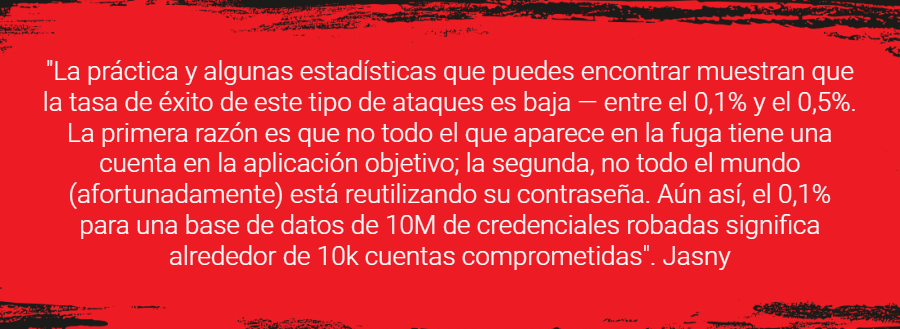

:slug: relleno-credenciales/
:date: 2020-09-25
:subtitle: Podrías ser víctima del relleno de credenciales
:category: techniques
:tags: credential, password, web, application, cybersecurity, business
:image: cover.png
:alt: Photo by Cookie the Pom on Unsplash
:description: He escrito este post para dar una visión general del ataque Credential Stuffing y algunas breves recomendaciones para su prevención.
:keywords: Credential Stuffing, Relleno, Credenciales, Contraseña, Website, Aplicación, Ethical Hacking, Pentesting
:author: Felipe Ruiz
:writer: fruiz
:name: Felipe Ruiz
:about1: Cybersecurity Editor
:source: https://unsplash.com/photos/siNDDi9RpVY

= Mi contraseña favorita: '123456'

La fuga de datos es un fenómeno del día a día,
o al menos eso es lo que he leído.
Los criminales roban listas de pares de usuario/contraseña
de diversos lugares en Internet. Luego, esas montañas de información
son ofrecidas y vendidas en la link:https:../dark-web/[dark web].
Dicha información se constituye como el recurso necesario
para ser utilizado en el _Credential Stuffing_ (relleno de credenciales),
el tipo de ataque del que vamos a hablar en este post.

Esta forma de ataque consiste en la automatización a gran escala
de intentos de inicio de sesión en sitios web específicos,
con la esperanza de que alguno de ellos logre acceder a la cuenta de un usuario
para luego violar su privacidad, actuar en su nombre o robarle.
Por tanto, además de las listas de, normalmente, miles de pares
de usuario/contraseña a probar, también llamadas _Combo lists_
o simplemente _Combos_, es necesario para el ciberdelincuente
poseer un software que le trabaje de forma automatizada.

Así, contrario a lo que tienen que hacer los atacantes en link:../pass-cracking/[_Password Cracking_],
en este caso ellos no tienen que adivinar las contraseñas.
Ellos ya tienen a su disposición las credenciales a probar.
Luce como algo muy sencillo, además de efectivo,
sobre todo cuando la gente tiene la ingenua costumbre
de utilizar las mismas contraseñas en diferentes sitios web o aplicaciones.
Por lo tanto, los atacantes no tienen que ser hackers;
podrían ser meramente link:https://en.wikipedia.org/wiki/Script_kiddie[_script kiddies_]
para llevar a cabo el relleno de credenciales.

Los hackers habilidosos, por su parte, son los que,
explotando las vulnerabilidades, pueden robar
y desencriptar las bases de datos de credenciales.
Ellos son quienes luego deciden si las regalan al mundo
o las ofrecen y venden en comunidades cerradas.
Cuanto más reciente sea el combo filtrado, más valioso puede ser
para quien esté interesado en este tipo de delitos.

Por tanto, una vez que los _script kiddies_ tienen acceso a una lista
usualmente grande de credenciales,
necesitan un programa que trabaje para ellos.
Este software comprobará cada usuario y su correspondiente contraseña
contra una aplicación web previamente seleccionada
(sin saberse si van a conseguir algo allí)
para identificar los que se conectan con éxito.
Si hay una coincidencia con una cuenta existente,
podemos decir que esta ha sido descifrada (_cracked_).
La herramienta guardaría ese par usuario/contraseña junto con los otros
que también tuvieron éxito en el combo.
A partir de ahí, los atacantes procederían según sus propósitos.

== ¿Qué hay de las herramientas?

.link:https://unsplash.com/photos/gySMaocSdqs[Fotografía] por Cookie the Pom en Unsplash

Hoy en día, aunque algunos _crackers_ experimentados utilizan sus _scripts_,
existen herramientas (aparentemente no gratuitas) diseñadas
exclusivamente para el relleno de credenciales.
En Internet podemos encontrar fácilmente consejos
y tutoriales sobre cómo utilizarlas. Algunos de los programas más populares
son *Sentry MBA* y *STORM*. Sin embargo, más recientemente,
ha surgido *SNIPR* con funcionalidades similares,
pero aparentemente con mayor estabilidad y una interfaz más intuitiva.

Las herramientas a emplear en este tipo de ataque
deben tener la capacidad de saltarse diversos mecanismos de seguridad.
Por ejemplo, algunos sitios web tienen protección contra intentos masivos
de inicio de sesión desde la misma dirección IP.
Este comportamiento suele ser sospechoso y es asociado a un _cracking_
por parte de los propietarios de la aplicación web.
Es por esta razón que, en estos casos,
la herramienta de relleno de credenciales suele incorporar listas de _proxies_
que simulan peticiones desde varios sitios en Internet,
asegurando así el anonimato y la automatización ininterrumpida.

Incluso con los _proxies_, un gran número de solicitudes de inicio de sesión
en períodos cortos de tiempo puede llamar la atención (aunque no siempre).
Aquí es cuando los atacantes maduros y pacientes
(no los adolescentes desesperados) pueden realizar un lento relleno
de credenciales con pocas peticiones durante un día. Sin embargo,
pueden tardar meses en probar miles de pares del combo que poseen.
Eso da tiempo a que los usuarios cambien sus contraseñas
y hagan que esas bases de datos filtradas pierdan valor.

Teniendo un combo, una herramienta y _proxies_,
los atacantes comúnmente necesitan encontrar y comprar configuraciones
o _plugins_ para atacar aplicaciones web o sitios web particulares.
Los programas traen algunos de ellos de forma gratuita,
pero los hábiles hackers maliciosos han construido astutamente un mercado
adicional donde ofrecen y venden otros _plugins_ a aquellos atacantes
que no tienen ni idea de cómo hacerlos.
Esa es para ellos otra forma de obtener beneficios.

.Palabras de link:https://medium.com/@mtjasny/how-to-deal-with-credential-stuffing-attacks-c1456e499093[Mateusz Jasny] (imagen de background tomada de link:https://wallhaven.cc/w/q6q92r[Wallhaven]).

== Alguna recomendación de prevención?

=== Para usuarios

No reutilices las contraseñas. Procura que haya diferencias notables
entre todas las contraseñas que usas.
Modifícalas continuamente y de forma creativa.
Puedes crear patrones para ayudar a tu memoria,
pero no me refiero a añadir prefijos o sufijos intuitivos.
Sería algo así como _passphrases_ con palabras que recuerdes fácilmente,
con variaciones peculiares para cada cuenta,
sin olvidar el uso de símbolos, números y mayúsculas.
Por supuesto, puedes utilizar gestores de contraseñas
como link:https://1password.com/[1Password] o link:https://www.lastpass.com/[LastPass]
cuando creas que hay muchas contraseñas que recordar y mantener a salvo.

=== Para administradores de aplicaciones web

En primer lugar, regala los consejos del párrafo anterior a tus usuarios
(por cierto, ¿_los conoces_? Deberías). Adicionalmente,
coteja sus contraseñas con las que han aparecido en brechas conocidas.
Puedes utilizar link:https://haveibeenpwned.com/[HaveIBeenPwned]
para identificar en qué fugas de información han estado
y listas como esta de link:https://github.com/danielmiessler/SecLists/blob/master/Passwords/Common-Credentials/10-million-password-list-top-1000.txt[1000 contraseñas]
para reconocer cuáles de ellas suelen ser las más comunes.
Aunque no son los datos más recientes,
pueden servir de advertencia a tus usuarios.

En cuanto a las solicitudes de inicio de sesión,
es una insensatez no prestar atención al tráfico de usuarios
y a las tendencias de inicio de sesión en tu sitio web,
y especialmente si se salen de los patrones preliminares regulares.
Aquellas veces en las que veas múltiples direcciones IP en acción
como algo inusual (quizás debido a _proxies_ en el relleno de credenciales),
puedes utilizar la geolocalización y averiguar si los países o regiones
a los que pertenecen esas IPs se corresponden con los lugares
desde los que se suele acceder a tu aplicación.
Podrías enviar correos electrónicos a esos usuarios
para garantizar que fueron ellos los que intentaron obtener acceso.

Es importante que establezcas contramedidas frente a posibles ataques
y así hagas saber a los atacantes
que pueden perder tiempo y esfuerzo con tu aplicación web.
Podrías empezar por considerar incluso soluciones sencillas
como link:https://www.fail2ban.org/wiki/index.php/Main_Page[Fail2ban] para bloquear direcciones IP
cuando se generan muchas peticiones fallidas desde una sola.
link:https://en.wikipedia.org/wiki/CAPTCHA[CAPTCHA] puede ser una contramedida adicional,
y link:https://developers.google.com/recaptcha/docs/v3[reCAPTCHA v3], que es fácil de integrar
en las aplicaciones, suele ser más recomendable por estos días
para diferenciar entre _bots_ y humanos.

Una estrategia un poco más avanzada y recomendada
para prevenir el relleno de credenciales
es la link:https://en.wikipedia.org/wiki/Multi-factor_authentication[Autenticación Multi-Factor].
No obstante, esta solución de seguridad podría afectar, en cierta medida,
el 'viaje de tus usuarios' en tu aplicación mientras responden
con cada evidencia (factor) requerida para el acceso a la información.
Por esta razón, debes ser muy cuidadoso, y preferiblemente optar
por utilizar este método en casos de sospecha de ataque
o en circunstancias en las que el usuario requiera datos sensibles.

Por último, y tras considerar las anteriores opciones de bajo costo
para dificultar los esfuerzos de los atacantes,
también puedes recurrir a servicios comerciales
contra el _Credential Stuffing__ como
link:https://www.cloudflare.com/es-es/products/bot-management/[Cloudflare Bot Management] y link:https://www.f5.com/solutions/application-security/bot-management[F5 Bot Management].
Siempre teniendo en cuenta que "la solución mágica no existe,
así que desconfía de cualquier empresa que intente venderte una,"
dijo link:https://medium.com/@jsoverson/10-tips-to-stop-credential-stuffing-attacks-db249cac6428[Overson en Medium].

____________________

Para entender mejor el tema, puedes leer los posts que usé como referencia
para construir este post:
link:https://medium.com/@costask/the-economics-of-credential-stuffing-attacks-c2dd5f77a48e[CK], link:https://medium.com/@jbron/credential-stuffing-how-its-done-and-what-to-do-with-it-57ad66302ce2[jbron], link:https://medium.com/@mtjasny/how-to-deal-with-credential-stuffing-attacks-c1456e499093[Jasny], y Overson link:https://medium.com/@jsoverson/3-misunderstandings-about-credential-stuffing-attacks-3526c618a8d6[(1)] link:https://medium.com/@jsoverson/10-tips-to-stop-credential-stuffing-attacks-db249cac6428[(2)].
