:slug: reversing-vulnserver/
:date: 2020-07-06
:category: attacks
:subtitle: The devil is in the details
:tags: osce, vulnserver, training, vulnerability, exploit
:image: cover.png
:alt: Photo by Pierre Binet on Unsplash
:description: This post will show how use reverse engineering techniques and tools to find vulnerabilities on Vulnserver.
:keywords: Business, Information, Security, Protection, Hacking, Exploit, OSCE
:author: Andres Roldan
:writer: aroldan
:name: Andres Roldan
:about1: Cybersecurity Specialist, OSCP, CHFI
:about2: "We don't need the key, we'll break in" RATM
:source: https://unsplash.com/photos/w50ESgh2h5U

= Vulnserver Reverse Engineering

In link:../tags/vulnserver/[previous posts], we have been able to exploit
several vulnerabilities on `Vulnserver`, a VbD (Vulnerable-by-Design)
application in which you can practice Windows exploit development.

Each article described a technique used to exploit certain `Vulnserver`
command, and the write-up followed along with the creation of the exploit.

All of those articles had something in common in the way the vulnerabilities
were discovered: the use of fuzzing.

In this post, we will use reverse engineering to find the vulnerable commands
in `Vulnserver` and some details that may be overlooked during the fuzzing
phase.

Although
link:https://github.com/stephenbradshaw/vulnserver/blob/master/vulnserver.c[vulnserver source code]
is fully accessible, we will assume a black-box scenario on which we don't
have access to the code.

== Vulnserver first analysis

The first thing to do is a binary reconnaissance of `vulnserver.exe`.
The tools we'll be using during this article are a debugger (`x64dbg`)
and a reverse engineering framework (`radare2`),
the latter using the `Cutter` GUI.

To check the initial characteristics of `vulnserver.exe`, we can load it
into `Cutter`:

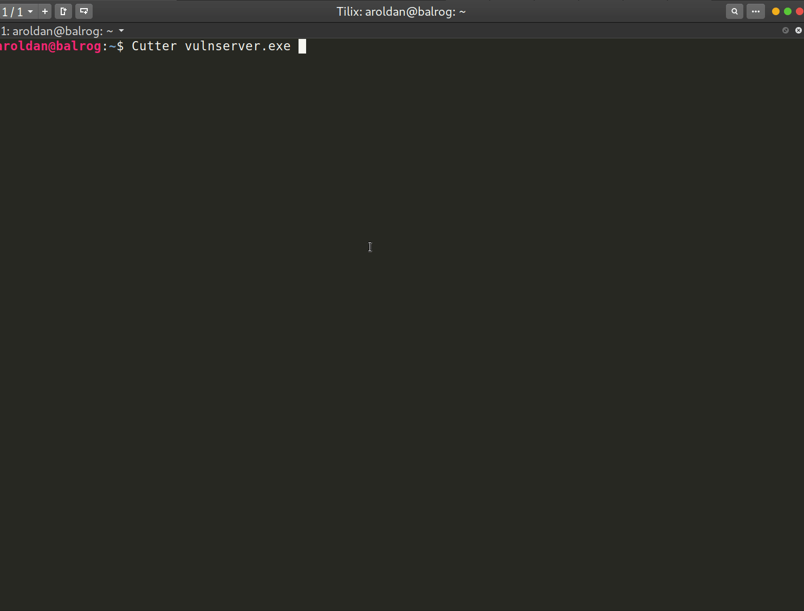

As you can see, there's some information about the file, namely the type,
the class (`PE32`), OS information, etc.

Among the things to notice are the libraries used by `vulnserver.exe`.
They are the following:

. `essfunc.dll`
. `kernel32.dll`
. `msvcrt.dll`
. `ws2_32.dll`

That means that `vulnserver.exe` uses functions which are located directly
or indirectly in those libraries. That information is retrieved from the
`IAT` (Import Address Table) of the `PE` (Portable Executable) header.

To see the functions used by `vulnserver.exe` in `Cutter`, we
can go to the `Imports` tab:

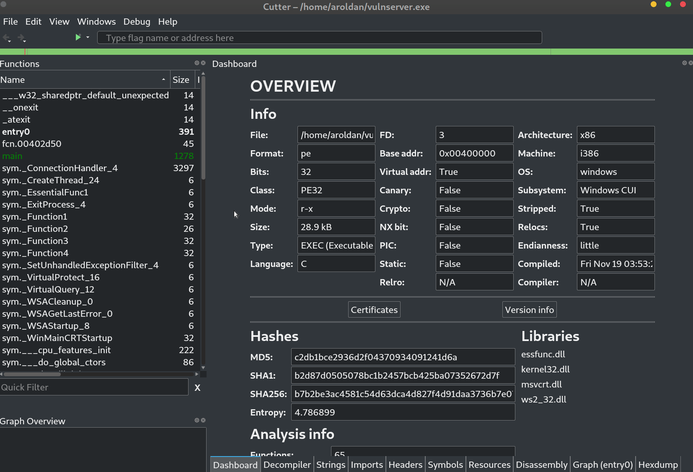

Look at that. Some functions were marked as `Unsafe` by `Cutter`. Those
functions are commonly the cause of vulnerabilities like Buffer Overflow.
We will check that later.

We must also check what the security characteristics of the executable
modules of `vulnserver.exe` are. By checking that, we should be able to
anticipate restrictions for our exploitation phase.

To check that information, we can use our debugger. We will load
`vulnserver.exe` to `x64dbg` and use the `checksec` plugin:

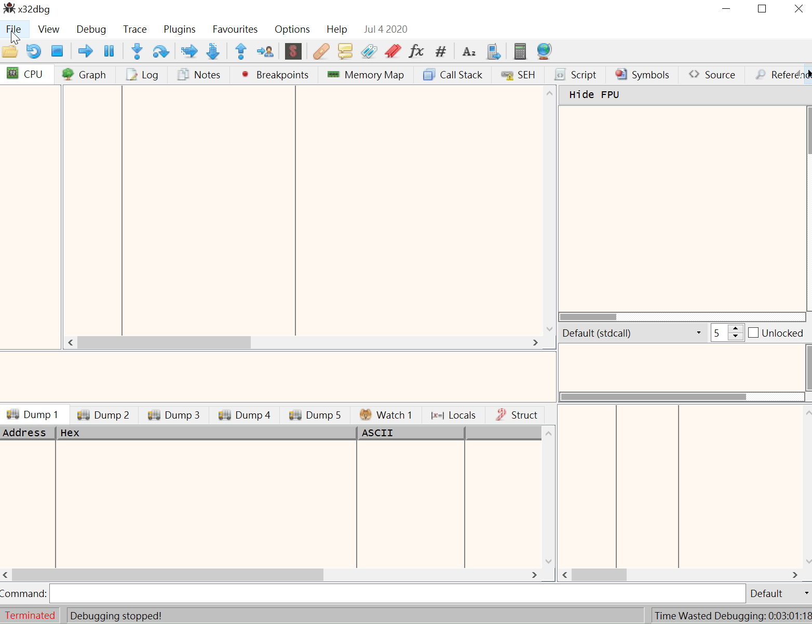

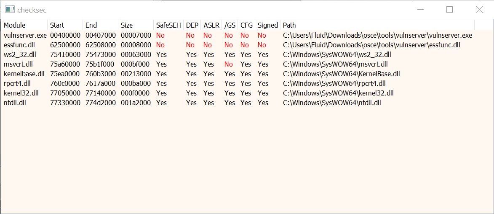

As you can see, we have different columns here:

. `SafeSEH`: Safe Structured Exception Handling enabled
. `DEP`: Data Execution Prevention enabled
. `ASLR`: Address Space Layout Randomization enabled
. `/GS`: Buffer Security Check enabled
. `CFG`: Control Flow Guard enabled

You can notice that both the executable `vulnserver.exe` and the `essfunc.dll`
modules have all those security features disabled, which means that we can
harness instructions on those files when creating our exploits.

We can now make a simple request to `vulnserver` to see how it behaves:

[source,console]
----
aroldan@balrog:~$ telnet 192.168.0.20 9999
Trying 192.168.0.20...
Connected to 192.168.0.20.
Escape character is '^]'.
Welcome to Vulnerable Server! Enter HELP for help.
HELP
Valid Commands:
HELP
STATS [stat_value]
RTIME [rtime_value]
LTIME [ltime_value]
SRUN [srun_value]
TRUN [trun_value]
GMON [gmon_value]
GDOG [gdog_value]
KSTET [kstet_value]
GTER [gter_value]
HTER [hter_value]
LTER [lter_value]
KSTAN [lstan_value]
EXIT
----

It seems that all the commands receive a single parameter on the form
`<command> <value>`. For example, a request to the `TRUN` command would be
`TRUN something`.

We can see this behavior in `Cutter`:

image::iteration1.gif[Command iteration]

As you see, when the `recv()` call is executed, it will iterate over
what's received and check for every command.

When the command string is found, it will stop iterating and will execute
whatever the command does.

With that information, we can start checking for the vulnerabilities.
For the sake of this exercise, I will be reversing only the `KSTET` and
`TRUN` commands.

== Reversing KSTET command

On the main loop, `vulnserver` checks if the received buffer contains
`KSTET`, and if it does,
it will divert the loop and will enter the `KSTET` flow:

image::kstet1.png[KSTET 1]

The `KSTET` execution is lineal and simple:

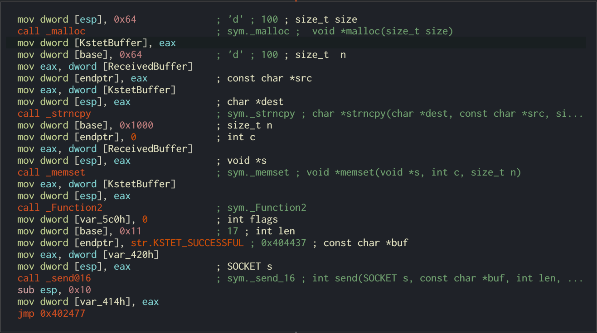

. It will allocate `0x64` or 100 bytes of dynamic memory.
. The pointer to that region is saved in a var I renamed to `KstetBuffer`.
. Then `strncpy()` will copy up to 100 bytes from the `ReceivedBuffer`
to `KstetBuffer`. If `ReceivedBuffer` is more than 100 bytes long,
`strncpy()` will discard the remaining bytes.
. Then the `0x1000` or 4096 bytes of `ReceivedBuffer` is set to `0` using
`memset()`.
. Then a pointer to `KstetBuffer` is put at `ESP` as a parameter for
`Function2`.
. When `Function2` returns, the string `KSTET_SUCCESSFUL` is sent back.

Now, let's check what `Function2` does:

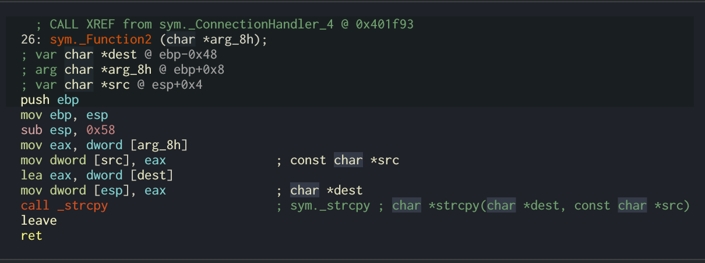

. After the function prologue, it will allocate `0x58` or 88 bytes to the
stack.
. The `*dest` variable will be at `ebp-0x48`.
. The argument on `ESP`, which is a pointer to `KstetBuffer`, will be used
as `*src` variable.
. Now `strcpy(dest, src)` is executed.

That means that, as `*dest` is located at `ebp-0x48`, if we want to overflow
the `KSTET` command, we must inject `72 - len('KSTET ') = 66` or more bytes
to start overflowing the stack:

.Reversed Function2 stack frame
[source,text]
----
._________________________________.__________________.__________________.
             *dest                      Saved EBP         Saved EIP
       epb-0x48 (72 bytes)           ebp+0 (4 bytes)   ebp+0x4 (4 bytes)
----

Let's check it:

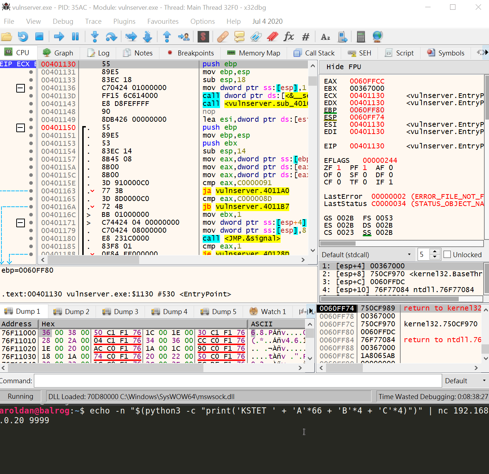

Great! We were able to overwrite `EBP` and `EIP` registers with our values.
That was an easy one.

== Reversing TRUN command

When the `vulnserver` receives the `TRUN <value>`, it will divert the
execution flow:

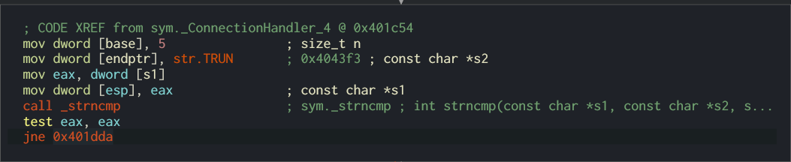

To get clear references later, I renamed the `s1` parameter to
`ReceivedPayloadPtr`:

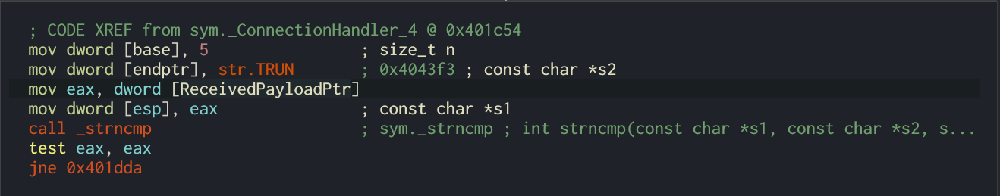

The first thing it does is allocate 3000 bytes of dynamic memory using
`malloc` and then set those 3000 bytes to `0`:

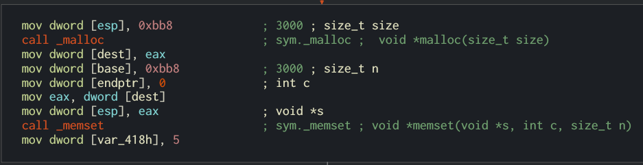

Also, at the end, a new variable `var_480h` is set to value `5`. I will rename
it to `LoopCounter`. It is set to `5` because at that place is where the
buffer after `TRUN<space>` will start:

[source,console]
----
TRUN_
012345
----

Then, a loop is created:

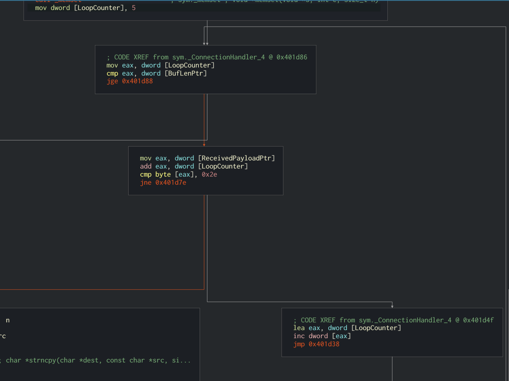

The first node will move the `LoopCounter` to `EAX` and compare that value
with the `recv()` buffer length. If it's greater or equal, the loop will
finish:

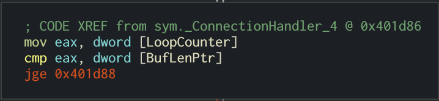

If not, it will move the pointer to where the `TRUN` buffer command was set
and put the pointer 5 bytes forward to remove the `TRUN<space>` part.
Then it compares the current position to `0x2e`, which is the hex
representation of a dot (`.`):

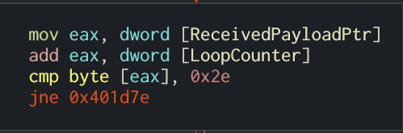

If the dot is found in the buffer, then it will copy the entire
`ReceivedPayloadPtr` to a new variable called `dest` up to `3000` bytes,
using `strncpy`.

Then, a pointer to `dest` is put on the stack and `Function3` is called:

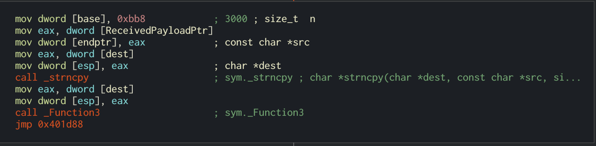

Inside `Function3`, we can see that `0x7e8` or 2024 bytes are allocated on
the stack, and the `*dest` variable will be at `ebp-0x7d8`.
Now a pointer is set to `ESP` to make it the `dest` parameter of `strcpy()`.
Then the pointer to `ReceivedPayloadPtr` is set to `ESP+4` to refer to the
`*src` parameter of `strcpy()`, then `strcpy()` is called:

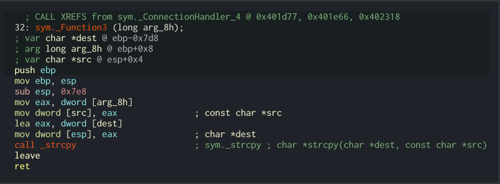

All that means is, to overflow the `TRUN` parameter, we must:

. Inject a dot somewhere on the payload to trigger the `strcpy()` call.
. As `*dest` is located at `ebp-0x7d8`, we must inject
`2008 - len('TRUN ') = 2003` or more bytes to start
overflowing the stack. Let's check it:

.Payload of 2000 bytes without a dot
[source,console]
----
$ echo -n "$(python3 -c "print('TRUN ' + 'A'*2000)")" | nc 192.168.0.20 9999
Welcome to Vulnerable Server! Enter HELP for help.
TRUN COMPLETE
----

.Payload of 2010 bytes without a dot
[source,console]
----
$ echo -n "$(python3 -c "print('TRUN ' + 'A'*2010)")" | nc 192.168.0.20 9999
Welcome to Vulnerable Server! Enter HELP for help.
TRUN COMPLETE
----

.Payload of 2001 bytes plus a dot
[source,console]
----
$ echo -n "$(python3 -c "print('TRUN .' + 'A'*2001)")" | nc 192.168.0.20 9999
Welcome to Vulnerable Server! Enter HELP for help.
TRUN COMPLETE
----

.Payload of 2002 bytes plus a dot
[source,console]
----
$ echo -n "$(python3 -c "print('TRUN .' + 'A'*2002)")" | nc 192.168.0.20 9999
Welcome to Vulnerable Server! Enter HELP for help.
----

As you can notice, with the last command with a payload of 2002 `A` chars
plus a dot, `vulnserver` stopped working and we got an `Access Violation`
exception on our debugger:

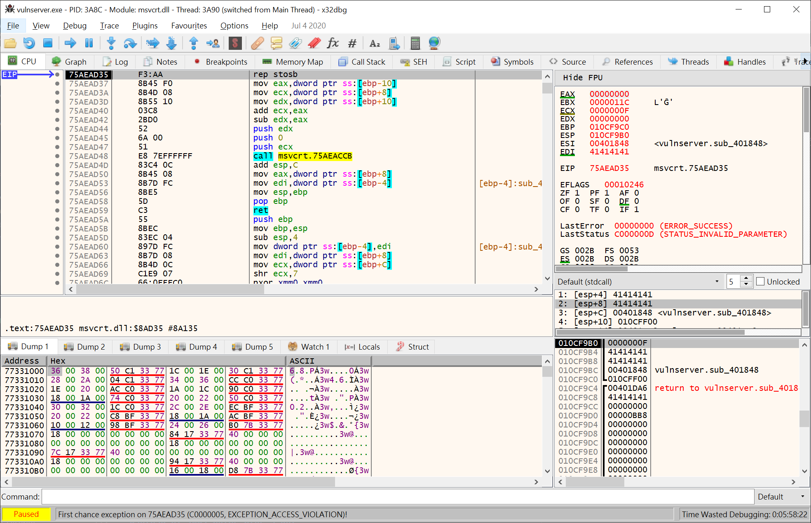

That means that we started to overwrite the `saved EBP` which is next to the
`saved EIP` on the `Function3` stack frame:

.Reversed Function3 stack frame
[source,text]
----
._________________________________.__________________.__________________.
             *dest                      Saved EBP         Saved EIP
      epb-0x7d8 (2008 bytes)         ebp+0 (4 bytes)   ebp+0x4 (4 bytes)
----

So, if we inject 2016 bytes:

. `len('TRUN ')` = 5
. 2002 `A` chars
. 1  dot
. 4 `B` chars
. 4 `C` chars

We should overwrite the `saved EBP` with 4 `B` and the `saved EIP` with 4 `C`,
and when the vulnerable function returns, `EBP` and `EIP` will be overwritten
by our buffer:

Indeed! We were able to identify the vulnerability on the `TRUN` command.

== Inverse approach

The examples above use the known `vulnserver` command inputs to identify
the execution flow and characteristics of the vulnerable commands. That
may be the most natural way to approach a reverse engineering session since
it's the way the application processes user input.

However, as we saw at the beginning, it's possible to get the unsafe
functions used by the application:

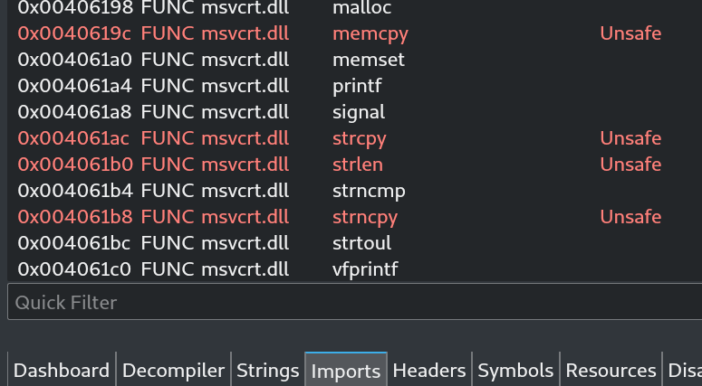

We can work backward from there, searching by cross-references (X refs)
to those functions. For instance, if we'd wanted to know the places on where
the `strcpy()` function is used, we can look for the cross-references of
that function on `Vulnserver`. Once we find those references, we can start
walking in reverse to see if non-validated user input reaches the call of
`strcpy()`:

image::xrefs1.gif[Cross references]

As you can see, we were able to get to the vulnerable `KSTET` function using
cross-references.

== Conclusion

Vulnerabilities can be found using static, dynamic and interactive ways.
Fuzzing is a dynamic approach to find vulnerabilities, but it is prone to
overlook details of vulnerabilities. Using reverse engineering, we apply
an interactive approach that, as you see, gives a full detailed view
of the vulnerable software. If you take a look at the
link:../vulnserver-kstet/[KSTET] and the link:../vulnserver-trun/[TRUN]
articles, you can see that the analysis performed using reverse engineering
matched the one using fuzzing, with some additional details. And remember
that we use all link:../../products/drills/[these approaches] at
`Fluid Attacks` to find vulnerabilities!
