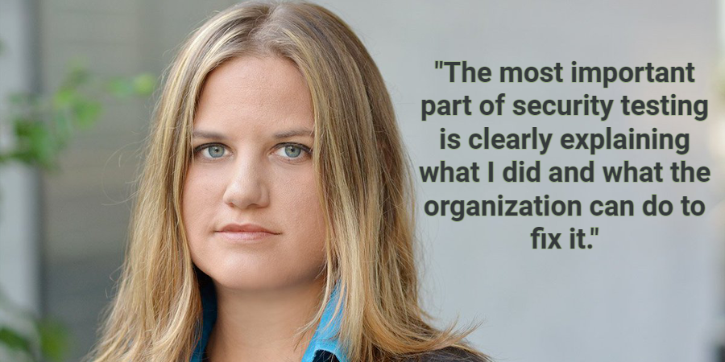

:slug: tribe-of-hackers-3/
:date: 2020-12-09
:subtitle: Learning from the red team expert Georgia Weidman
:category: opinions
:tags: cybersecurity, red team, hacking, pentesting, ethical hacking, blue team
:image: cover.png
:alt: Photo by Dorinel Panaite on Unsplash
:description: This post is based on the book 'Tribe of Hackers Red Team' by Carey and Jin. Here we share content from the interview with Georgia Weidman.
:keywords: Cybersecurity, Red Team, Hacking, Pentesting, Ethical Hacking, Blue Team, Knowledge, Tribe
:author: Felipe Ruiz
:writer: fruiz
:name: Felipe Ruiz
:about1: Cybersecurity Editor
:source: https://unsplash.com/photos/oTrebzk1v54

= Tribe of Hackers Red Team 3.0

Here we are in a third post with link:https://www.amazon.com/Tribe-Hackers-Red-Team-Cybersecurity/dp/1119643325[Tribe of Hackers Red Team]
by Marcus J. Carey and Jennifer Jin (2019) as reference.
On previous occasions, we had appreciated opinions
and received advice from two men, red teaming experts:
link:../tribe-of-hackers-1/[(1.0) Marcus Carey] and link:../tribe-of-hackers-2/[(2.0) Benjamin Donnelly].
Now is the time to open up space for the female gender
within this enthralling context.
Few women appear in the cited book, just as few women work in red teams
such as `Fluid Attacks`. In fact,
they still don't have much presence in the area of Ethical Hacking,
something we would like to contribute to change.
That's why in this post, like a little incentive,
we want to focus on the viewpoint
and some recommendations of link:https://twitter.com/georgiaweidman[Georgia Weidman]
—"serial entrepreneur, penetration tester, security researcher, speaker,
trainer, and author"— for those of us interested in red teaming.

.Photo by link:https://unsplash.com/@santabarbara77[Varvara Grabova] on link:https://unsplash.com/photos/6Jm_LSrf4Zc[Unsplash].

== For those hoping to be eager beavers on red teams

As it happened with Benjamin Donnelly (see link:../tribe-of-hackers-2/[the previous post]),
Georgia started his red teaming career
after participating at college in a cyber defense competition.
And although she declares herself as a person with reduced social skills,
at least "to talk to someone one on one,"
that hasn't stopped her from establishing networks
and from getting opportunities to work on red teams.
This has been strengthened by her research on security,
lecture presentation, and training classes as a volunteer.

In 2014, Georgia published a book
titled link:https://www.amazon.com/Penetration-Testing-Hands-Introduction-Hacking/dp/1593275641[Penetration Testing: A Hands-On Introduction to Hacking].
She recommends it "for new people
to learn about hacking in a controlled environment."
Besides, for those interested in gaining red team skills
(without illegal activity), Georgia suggests participating in competitions
like link:https://medium.com/@thehackersmeetup/beginners-guide-to-capture-the-flag-ctf-71a1cbd9d27c[capture the flag (CTF)],
where you have consent to attack the targets in different time frames.
She says: "In general, as long as you are practicing
on systems, applications, etc., that you own
or have express permission to attack, you are learning ethically."

It is striking something that Georgia mentions
in relation to what she expects from people
who apply for interviews as potential red team members.
Besides good communication skills with technical and non-technical audiences,
she requests professionals passionate about the field.
Then she says, "*I'm not looking for people
who work their 9 to 5 and go home and play video games all night.*"
(Have you noticed how many hours a day you spend on video games?
Do you think you really know how to manage your time?)
It is essential for her to have persons who do security research
and present it to the world through any available means of communication.
Georgia looks for individuals who,
when they recognize they lack some skill in a particular area,
do their best to acquire the corresponding knowledge.

== For those already sweating blood on red teams

When Carey and Jin ask Georgia about rules of engagement
(arrangement to work for a client),
she poses something that we can often find in this field.
"Naturally, given how so much of our society sees hackers
—as criminal masterminds dead set on destroying the world
just to show their rivals they can—
many organizations have an understandable reluctance
to allow security testers to attack their organization."
For this reason, the rules of engagement defined
before starting the security testing within each project
will vary in their rigor according to the client's comfort,
and it is something we must always respect.

As Georgia later accurately expresses, "breaking the rules of engagement,
even if you think it makes the testing more real-world authentic,
only feeds into the notion
that ethical hackers are just malicious attackers with a cover job."
Well, and not only that.
Violating the rules of a contract can even lead to some penalty
or merely the annulment of the agreed fee,
as well as to the loss of a client for the future
and, why not, to damage the reputation of the team.

Georgia says that "the most valuable part of security testing
is not getting domain admin but rather leaving the customer
with a clear understanding of their security shortcomings
and an actionable plan for how to fix them."
According to her, remediation recommendations from automated tools
are often not in line with business plans and, therefore, not applicable.
It is for this reason that detailed and contextualized suggestions
from security professionals can be much more valuable.

Immediately afterward, what Georgia remarks
connects perfectly with what we at `Fluid Attacks` do
through our Integrates platform.
"For me it's important to not only clearly explain my results
but also keep an open dialogue with the client blue team
as they work through remediating the issues
in case they have any questions."
In addition, as an essential complement to the above,
she mentions remediation validation —which, for instance, in our company,
we carry out with re-attacks—
always to ensure that the identified and reported vulnerabilities
have been successfully closed.

.Georgia's original picture taken from link:https://pbs.twimg.com/media/CrYuOfaWcAAXM3u.jpg[pbs.twimg.com].

== For firms that in security aspire to be on the ball

"Many customers reach out to me looking for red teaming or penetration testing
when really what they need to start is vulnerability scanning
or help developing a basic security program."
This is a crucial point Georgia remarked for companies.
In their ignorance, some organizations believe that
red teaming is necessary _immediately_
when their security posture is not yet robust,
and what will be detected first are "missing patches,
default passwords, and similar low-hanging fruit."
In these cases, according to Georgia, scanners or automated processes
should be used more often, as we do in `Fluid Attacks`
with our tool link:../../products/asserts/[Asserts] at the beginning of projects,
looking for known superficial and deterministic vulnerabilities
to be remediated ASAP.

Make sure you resolve the most straightforward security problems first,
then beef up your system with all the measures suggested by security experts,
and finally submit it to the dexterity of ethical hackers
for a thorough evaluation.

[quote]
"It takes a more sophisticated attacker to gain access
to a more robust organization, and thus it takes more skill,
time, and effort on the part of the security testers." Georgia Weidman

== That's all, folks!

If you desire to know about our security testing services for your company,
you can link:../../contact-us/[contact us here].
I hope you enjoyed reading this post,
the third in the Tribe of Hackers Red Team series. See you soon!
