:slug: windows-kernel-debugging/
:date: 2020-09-09
:category: attacks
:subtitle: Getting in the deeps of the OS
:tags: osee, training, exploit, windows, kernel, hevd
:image: cover.png
:alt: Photo by Wesley Caribe on Unsplash
:description: This post will guide you to setup a lab environment for start exploiting Windows Kernel drivers
:keywords: Bussiness, Information, Security, Protection, Hacking, Exploit, OSEE, Ethical Hacking, Pentesting
:author: Andres Roldan
:writer: aroldan
:name: Andres Roldan
:about1: Cybersecurity Specialist, OSCE, OSCP, CHFI
:about2: "We don't need the key, we'll break in" RATM
:source: https://unsplash.com/photos/74JeU2jfnfk

= Windows Kernel Exploitation: Lab

This post will be the first of a new series in which we will get deep
into Windows Kernel Exploitation. I'll be using
link:https://github.com/hacksysteam/HackSysExtremeVulnerableDriver[HEVD]
(HackSys Extreme Vulnerable Driver) as the target and, just as we did with the
link:../tags/vulnserver[Vulnserver] series, there's going to be a different
articles on the ways to exploit it.

Before dealing with vulnerabilities, we must setup the lab environment first.
Kernel exploiting is different than application exploiting. When you are
attacking an application, if something goes wrong, you can simply restart
it. In kernel mode, you will likely get an infamous blue screen of
death `BSOD`.

This post will guide you to setup a testing lab for kernel debugging
on a Windows 10 target machine and finally we will be able to install
`HEVD` driver that will be our kernel space victim.

== Pre-requisites

Unlike common user-land applications, the Windows Kernel is commonly debugged
remotely. This is because, as I mentioned earlier, when you mess with
kernel memory, you're likely making the OS unusable. For that, we will
setup a testing environment with a target Windows OS system (the debuggee)
and some tools in the debugger machine.

The following are the tools needed to setup the environment:

* WinDBG. We'll use the version that's included in the
link:https://developer.microsoft.com/en-us/windows/downloads/windows-10-sdk/[Windows 10 SDK]
* WinDBG dark theme (optional): Because I like
link:https://github.com/lololosys/windbg-theme[fancy debugging]
* Pykd: To run Python scripts on WinDBG. Download
link:https://githomelab.ru/pykd/pykd[here].
* Windbglib + Mona: Download link:https://github.com/corelan/windbglib[here]
* Windows 10 1703 (Creators Update): For now, we'd only need the 32 bits
link:https://www.getmyos.com/windows-10-1703-home-pro-education-32-64-bit-free-download[version]
* A virtual machine player. I'll be using VMWare Workstation Player.
* HackSys Extreme Vulnerable Driver: Our
link:https://github.com/hacksysteam/HackSysExtremeVulnerableDriver[target].
We'll be using the latest stable release (`HEVD v3.00` to the date of this
post).
* OSR Driver Loader: To load `HEVD` into the OS. Download
link:https://www.osronline.com/article.cfm%5earticle=157.htm[here]

With all the requirements in place, we can start setting up our lab, which
will be composed of a debugger machine, that will be the host machine from
which we will run `WinDBG`; and the debuggee machine, on which we will install
`HEVD` that will be running as a virtual machine.

== Setting up debugger

The first stage is to download and install the Windows 10 SDK. If you
want to install only WinDBG, you can choose only the `Debugging Tools for
Windows` option:

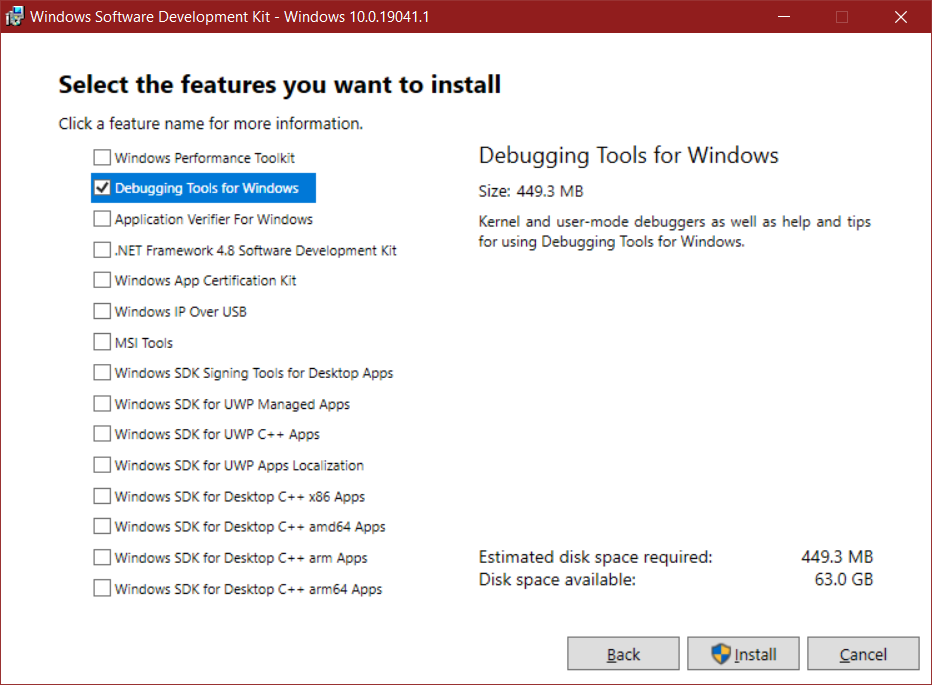

Once installed, if you search for `windbg` on Windows, you should get
something like this:

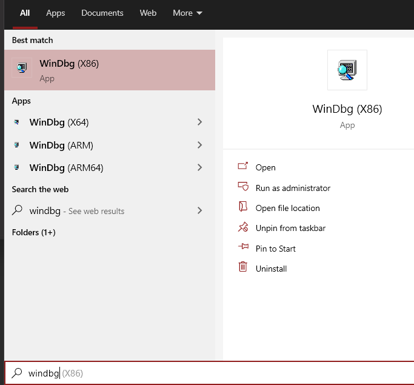

The default `WinDBG` configuration provides a not so friendly UI. However
we can use a dark theme for `WinDBG` (see the Pre-Requisites section). To do
that, just download the `dark.reg` file and install it. You will get
a much friendly UI:

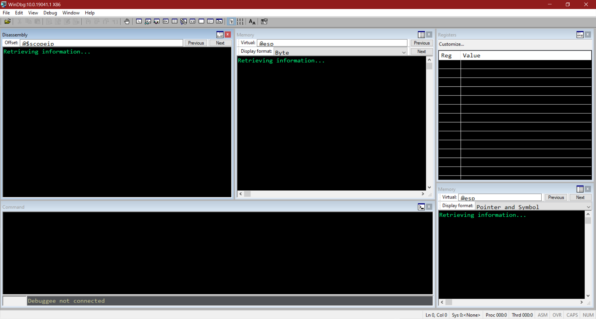

Next, we need to adjust the Windows symbols resolution. It is done by
creating a new environment variable `_NT_SYMBOL_PATH` with the value
`srv*https://msdl.microsoft.com/download/symbols`, like this:

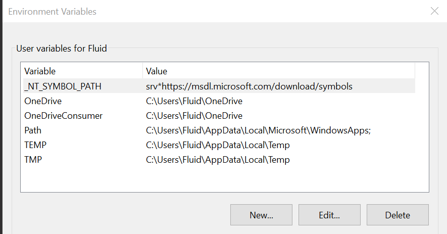

Now, we need to install our friend `mona`. To do that, we need to grab
the `pykd.zip` file located
link:https://github.com/corelan/windbglib/tree/master/pykd[here].

That ZIP has two files. The `pykd.pyd` file should be placed at
`C:\Program Files (x86)\Windows Kits\10\Debuggers\x86\winext`.
Now run `vcredist_x86.exe` and follow the installing instructions.

Now, all that's left is to download `windbglib.py` from
link:https://github.com/corelan/windbglib/raw/master/windbglib.py[here]
and `mona.py` from
link:https://github.com/corelan/mona/raw/master/mona.py[here]
and move them to `C:\Program Files (x86)\Windows Kits\10\Debuggers\x86`.

To check if that worked, load an executable on `WinDBG`, type `.load pykd.pyd`
and then `!py mona`. You should see something like this:

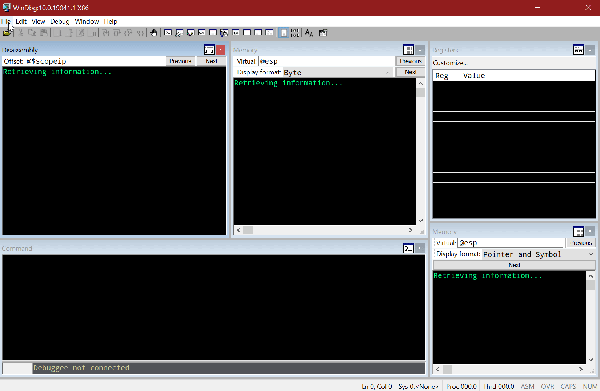

With that, we have now debugger machine set.

== Setting up the debuggee

Now it's time to setup our target OS. The first thing is to launch a new
virtual machine with a Windows 10 1703 (Creators Update) instance.

It's recommended to disable Windows Update service to avoid messing with
our lab results.

With the target machine up an running, it's time to load `HEVD` in the
system. This is done by copying the `osrloaderv30.zip` and `HEVD.3.00.zip`
files to this target OS and uncompressed them. Then, we must run
`OSR Driver Loader` (run the one in the `WNET -> i386 -> FRE` folder)

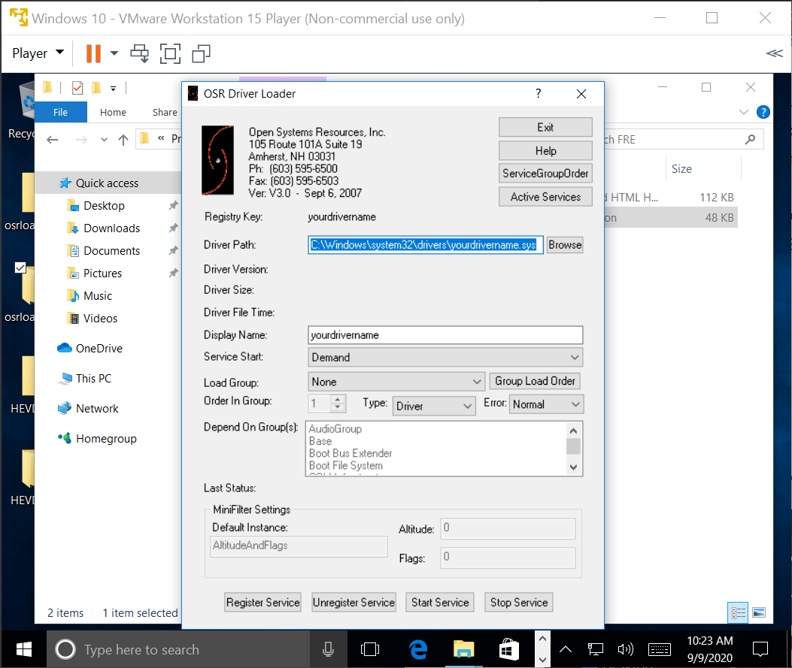

Now browse for the `HEVD.sys` file, click on `Register Service` and then
`Start Service`:

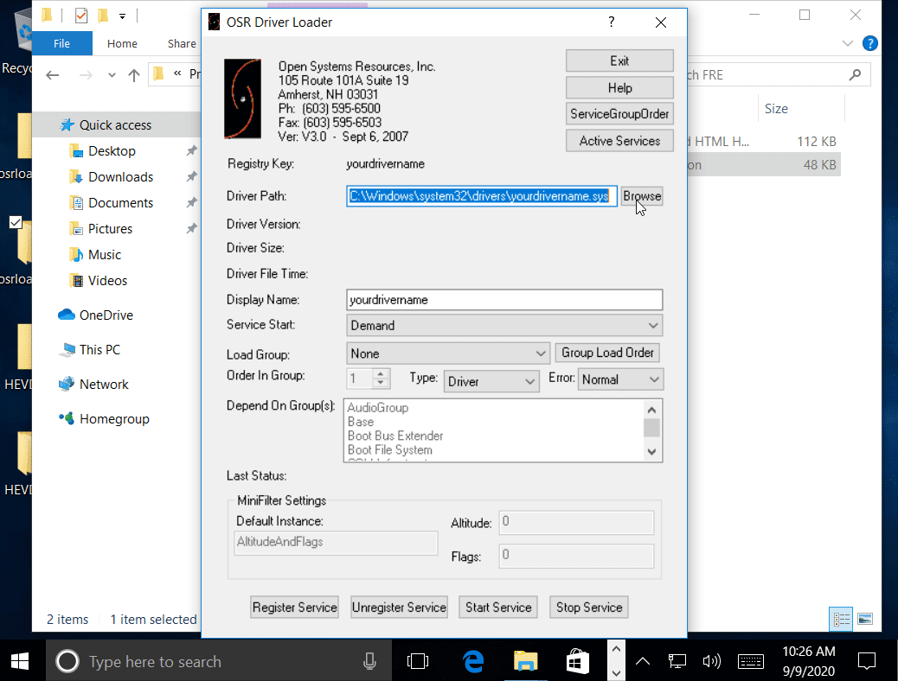

To check if that went well, open a terminal and type
`driverquery | findstr HEVD`. You should see something like this:

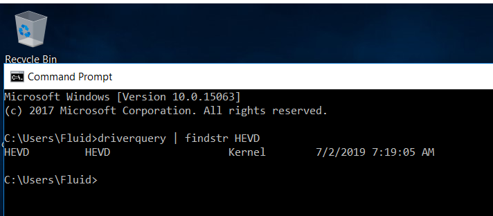

Great! To ensure that the `HEVD` driver is load every time, open
a terminal as administrator and run

[source,powershell]
----
> sc config HEVD start=system
----

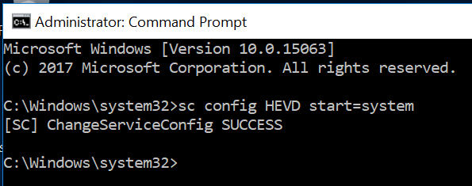

Now we must connect our target OS with the debugger. You need to launch a new
terminal windows as administrator:

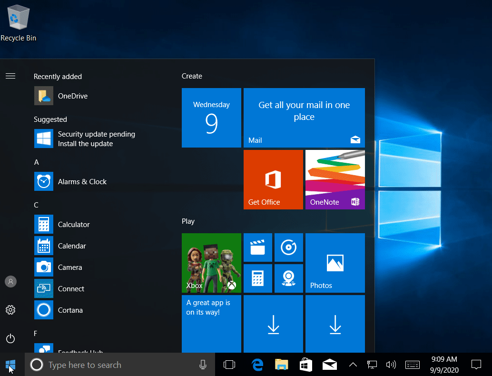

And then you need to enable remote debugging by issuing the following
command:

[source,powershell]
----
> bcdedit /dbgsettings NET HOSTIP:192.168.20.31 PORT:50000
----

You need to change the `HOSTIP` param with the IP of the debugger machine.

This will return a key that will be used for `WinDBG` to expect for a
connection with that identifier.

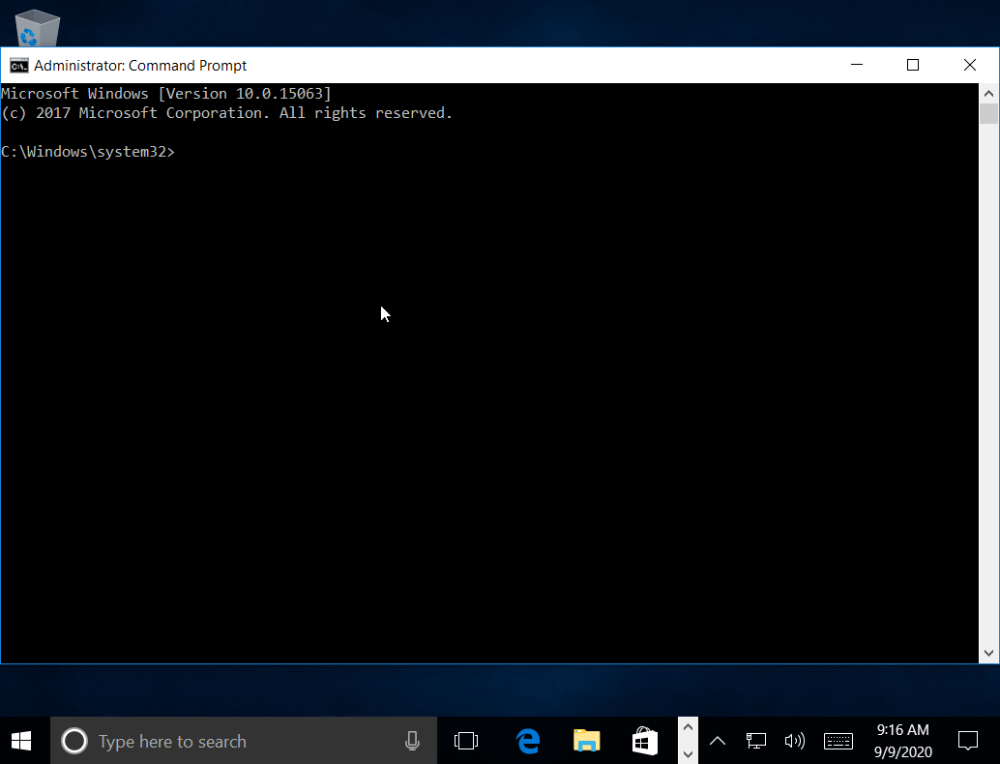

In the debugger machine, setup `WinDBG` to listen for a connection with
that key:

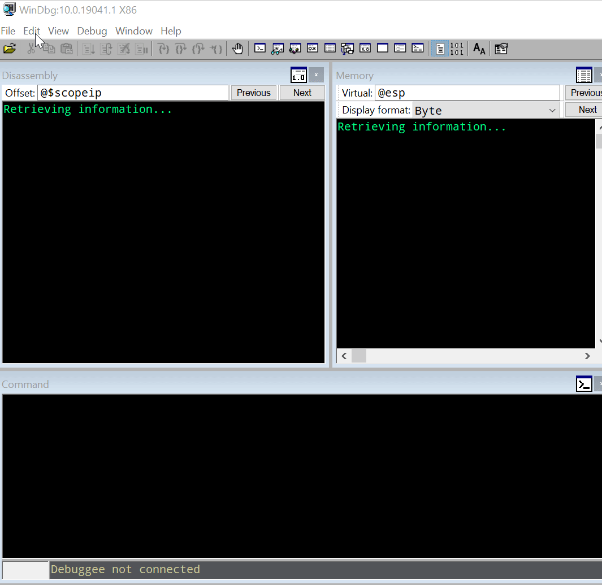

Now, we need to make Windows to start in `DEBUG` mode and restart.
To that, we should issue the following command:

[source,powershell]
----
> bcdedit /debug ON
> shutdown -r -t 0
----

The target OS will restart and the debugger machine should now get a
connection from the target OS:

image::dbg2.gif[WinDBG]

Great. Now break the execution (`Debug -> Break`) and type `.reload` to
load the debugging symbols:

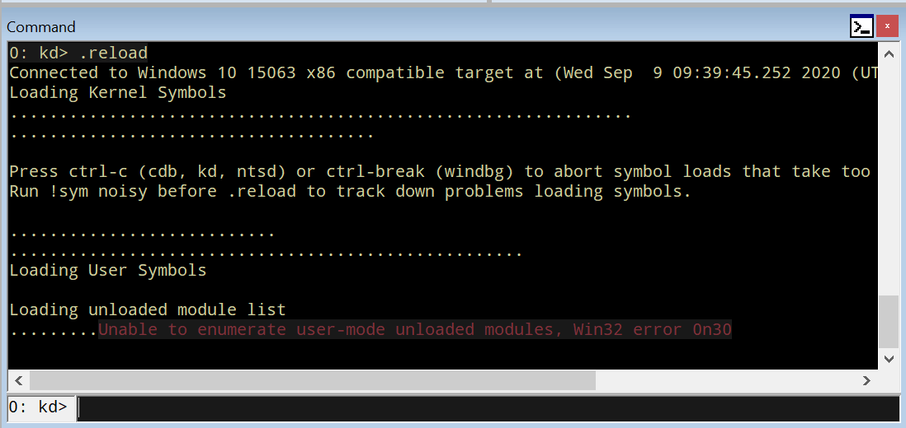

To check if everything's working, type `x /f nt!*Create*Process*`. This will
list all the functions in the `NT` module that contain `Create` and `Process`.

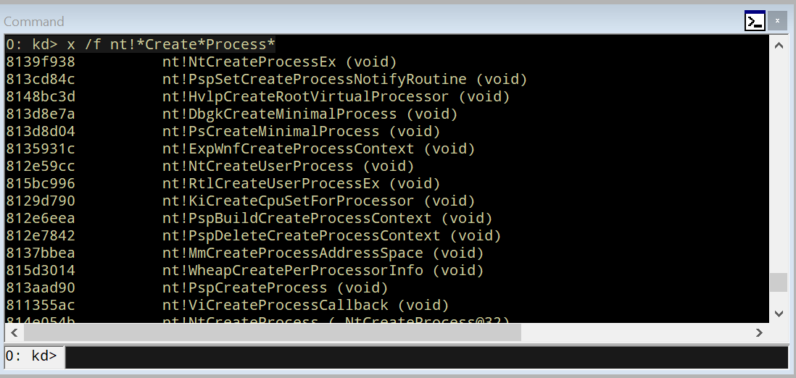

Now, set a breakpoint in `nt!MmCreateProcessAddressSpace` and resume execution:

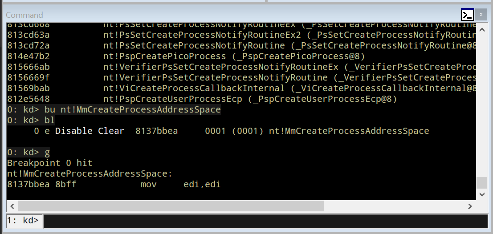

Great! But as we are going to debug `HEVD`, we must add the debugging symbols
to our environment. If you look at the folder `HEVD.3.00\driver\vulnerable\x86`
you can see several files, including the `HEVD.sys` driver file and `HEVD.pdb`.
The latter is the file containing the `HEVD` debugging symbols. To load it
on our debugger, follow this steps:

* Create a folder called `C:\projects\hevd\build\driver\vulnerable\x86\HEVD`
* Copy the `HEVD.pdb` file in that directory.

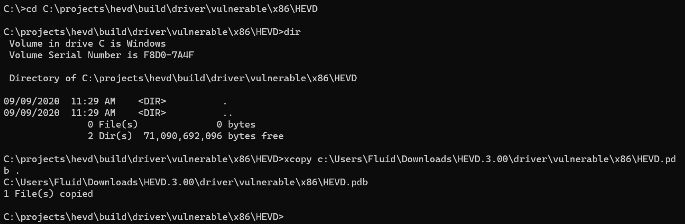

* On `WinDBG`, type `.reload`
* Type `lm m HEVD` to check if the `HEVD` module is loaded.
* And type `x HEVD!*` to check if the symbols were successfully added.

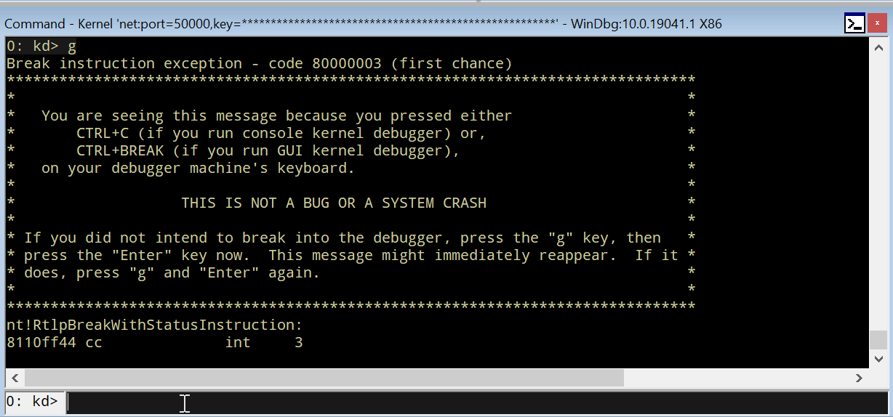

With that, we can start debugging our target machine's kernel space!:

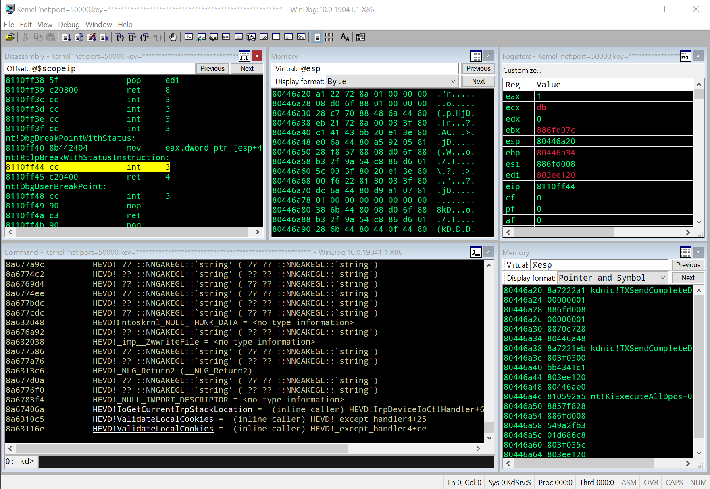

In the link:../hevd-dos/[next post], you can see a short reference of
`WinDBG` commands that we will be using during this process.

== Conclusions

This post will help you to setup a working Windows Kernel debugging lab.
In the next posts we will be dealing with some theory on Windows Kernel
and will start link:../hevd-dos/[exploiting HEVD].
