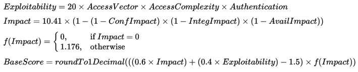

:slug: rules/015/
:category: rules
:description: En el presente documento se detallan los requerimientos de seguridad relacionados a los activos de información de la empresa. El objetivo de este requerimiento de seguridad es profundizar en la importancia de clasificar y priorizar las vulnerabilidades detectadas en los activos.
:keywords: Requerimiento, Seguridad, Activos, Información, Priorizar ,Vulnerabilidades.
:rules: yes

= REQ.015 Priorizar vulnerabilidades de activos

== Requisito

Las vulnerabilidades halladas en los activos de información
deben estar priorizadas según la criticidad de cada vulnerabilidad.

== Descripción

Es necesario definir el mecanismo
para establecer la criticidad de una vulnerabilidad
de forma que se pueda priorizar la solución,
esto permite concentrar recursos en evitar las vulnerabilidades
que pueden causar mayor impacto de ser explotadas.

== Implementación

Para realizar la labor de asignar criticidad a las vulnerabilidades,
existe un estándar internacional denominado
`Common Vulnerability Scoring System ( CVSS ).`<<r1,^[1]^>>

El `CVSS` intenta asignar puntuaciones de gravedad de las vulnerabilidades,
lo que permite dar prioridad a las respuestas
y asignar los recursos de acuerdo con criticidad.
La puntuación va de 0 a 10,
siendo 10 la vulnerabilidad más grave,
estas se calculan en base a una fórmula que depende de varios parámetros:

* Explotabilidad

** Vector de acceso (`AV`): muestra cómo una vulnerabilidad puede ser explotada.
+
[cols="^,,^",options="header"]
|====
|Valor
|Descripción
|Puntuación

|Local (`L`)
|El atacante tiene acceso físico al sistema vulnerable
o una cuenta local (por ejemplo, un ataque de elevación de privilegios).
|0.395

|Red adyacente (`A`)
|El ataque tiene acceso a la emisión o la colisión de dominio
del sistema vulnerable (por ejemplo, ARP Spoofing, ataques `Bluetooth`).
|0.646

|Red (`N`)
|La interfaz vulnerable está trabajando en la capa 3
o por encima en el modelo `OSI`.
Este tipo de vulnerabilidades son a menudo descritos
como vulnerables de forma remota
(por ejemplo, un desbordamiento de memoria remota en un servicio de red).
|1.0

|====

** Complejidad de acceso (`AC`): escribe qué tan fácil o difícil
es explotar la vulnerabilidad descubierta.
+
[cols="^,,^",options="header"]
|====
|Valor
|Descripción
|Puntuación

|Alta (`H`)
|Existen condiciones especializadas que deben ser superadas
por personas con conocimientos.
|0.35

|Media (`M`)
|Hay algunos requisitos adicionales para el acceso a ser superadas.
|0.61

|Baja (`L`) |No hay condiciones especiales para el acceso a la vulnerabilidad.
|0.71
|====

** Autenticación (`Au`): describe el número de veces que un atacante
debe autenticarse para explotar la vulnerabilidad.
+
[cols="^,,^",options="header"]
|====
|Valor
|Descripción
|Puntuación

|Múltiple (`M`)
|La explotación de la vulnerabilidad requiere que el atacante
se autentique dos o más veces, incluso si las mismas credenciales
se utilizan cada vez.
|0.45

|Individual (`S`)
|El atacante debe autenticarse una vez
con el fin de explotar la vulnerabilidad.
|0.56

|Ninguno (`N`)
|No hay ningún requisito para que el atacante se autentique.
|0.704

|====

* Impacto

** Confidencialidad (`C`): describe el impacto sobre la confidencialidad
de los datos procesados por el sistema.
+
[cols="^,,^",options="header"]
|====
|Valor
|Descripción
|Puntuación

|Ninguno (`N`)
|No hay impacto en la confidencialidad del sistema.
|0.0

|Parcial (`P`)
|Hay divulgación considerable de información,
pero el alcance de la pérdida está limitada
de tal manera que no todos los datos están disponibles.
|0.275

|Complete (`C`)
|Hay divulgación total de información,
proporcionando el acceso a todos los datos del sistema.
|0.660
|====

** Integridad (`I`): describe el impacto en la integridad del sistema
de explotación.
+
[cols="^,,^",options="header"]
|====
|Valor
|Descripción
|Puntuación

|Ninguno (`N`)
|No hay impacto en la integridad del sistema.
|0.0

|Parcial (`P`)
|La modificación de algunos archivos de datos o del sistema es posible,
pero el alcance de la modificación es limitado.
|0.275

|Complete (`C`)
|Hay una pérdida total de la integridad; el atacante puede modificar
los archivos o información sobre el sistema de destino.
|0.660

|====

** Disponibilidad (`A`): describe el impacto de la disponibilidad
del sistema de destino.
+
[cols="^,,^",options="header"]
|====
|Valor
|Descripción
|Puntuación

|Ninguno (`N`)
|No hay impacto en la disponibilidad del sistema.
|0.0

|Parcial (`P`)
|Hay rendimiento reducido o pérdida de alguna funcionalidad.
|0.275

|Complete (`C`)
|Hay una pérdida total de la disponibilidad del recurso atacado.
|0.660

|====

* Calculo de gravedad de la vulnerabilidad
+
Las 6 variables se utilizan para calcular la criticidad de la vulnerabilidad
con la siguiente fórmula:
+

== Ataques

. Un usuario, empleado o anónimo
ejecuta acciones en contravía
de la seguridad de cualquier activo de la organización,
la vulnerabilidad aprovechada no fue solucionada con prioridad
debido a la no identificación adecuada de la criticidad.

== Atributos

. Capa: Capa de Recursos
. Activo: Activos de Información
. Alcance: Adherencia
. Fase: Pruebas
. Tipo de Control: Recomendación

== Referencias

. [[r1]] link:https://www.first.org/cvss/[Common Vulnerability Scoring System SIG].
