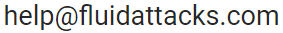

:slug: advisories/policy/
:description: This Disclosure Policy describes the details referring to the parameters used by Fluid Attacks on disclosing public vulnerabilities
:keywords: Fluid Attacks, Disclosure, Policy, Vulnerability, CVE.

= Fluid Attacks Disclosure Policy

_This document was last updated on February 17, 2021_

This disclosure policy ("Policy") describes how `Fluid Attacks`
("Fluid Attacks", "we", "us" or "our") discloses vulnerabilities,
on third-party products found by our Offensive Team.

This policy does not apply to vulnerabilities found on
the customers of the 
link:../../services/continuous-hacking[Continuous Hacking] and
link:../../services/one-shot-hacking[One-Shot Hacking] services,
unless explicit approval, as they are covered by 
a Non-Disclosure Agreement.

== Goal

Fluid Attacks commitment is to find all vulnerabilities and report
them as soon as possible. In order to accomplish that, we adhere 
to `ISO-IEC 29147-2018` standard which describes the 
accepted responsible disclosure guidelines to ensure the 
maximum benefit for the vendors, customers and the 
community in general, which includes:

* Providing the maximum level of detail of the vulnerabilities found
in a way that the vendors are able to reproduce the problem. 
* Ensuring a coordinated disclosure of the vulnerabilities with the 
affected vendors, minimizing the harms that may occur with
early disclosures.
* Release the details of the vulnerabilities on our 
link:../[advisories] page, including a risk level score
using `CVSSv3.1` and proof-of-concept artifacts.

This leads to an overall risk reduction on the users.

== Scope

Fluid Attacks will apply this Policy to disclose vulnerabilities
to third-party products we will issue CVE IDs not in the scope 
of another CNA  (CVE Numbering Authority).

== Disclosure process

Fluid Attacks is always looking for vulnerabilities. Once a new 
unpublished vulnerability is found by our team, we will proceed
as follows:

1. An initial report is created with all the details of
the vulnerability with any applicable proof of concept.
1. If the vulnerability is found conducting the 
link:../../services/continuous-hacking[Continuous Hacking]
or the link:../../services/one-shot-hacking[One-Shot Hacking] 
services, it will be reported only to the affected customer on
link:../../products/integrates[Integrates].
1. If the vulnerability is found by our Research Team on
a third-party product, the report will be sent to the 
affected vendor.
1. A new advisory draft is created on our 
link:../[advisories] page with only the product
affected, the current status of the report and the timeline. 
This will be updated on every relevant event around the 
vulnerability (vendor reply, patch availability, 
proof of concept availability, on-wild exploitation 
indicators, etc).
1. We will wait up to five (5) days for the vendor to 
acknowledge the report. If there is not response in that time,
we will proceed with our 
link:#Responsible_disclosure[Responsible Disclosure] 
process.
1. If the vendor acknowledges the report but there are not
updates on the issue after fifteen (15) days, we will proceed 
with our 
link:#Responsible_disclosure[Responsible Disclosure] 
process.
1. Otherwise, we may agree with the vendor a coordinated
disclosure of the vulnerability, which we suggest to be
done in no more than ninety (90) days after the discovery.

Fluid Attacks also reserves the right to disclose the
vulnerability at any time in cases when an early disclosure 
will provide benefit to the stakeholders.

== Responsible disclosure

The disclosure of the vulnerability is done according to the
parameters described before. The process is as follows:

1. The advisory draft at link:../[advisory] will be 
updated with the details of the vulnerability and any relevant 
proof-of-concept.
1. If necessary, a new CVE will be issued.
1. The advisory will be published to relevant public email 
lists, social media or link:../../blog/[blog] posts.

== References

* ISO-IEC 29147-2018
* ISO-IEC 30111-2019

=== Contacting us

If you would like to contact us to understand more about this Policy
or wish to contact us concerning any matter
relating to our Disclosure Policy, you may send an email to

_This document was last updated on February 17, 2021_
