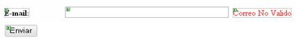
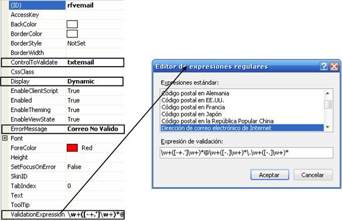

:slug: defends/aspnet/validar-email/
:category: aspnet
:description: Nuestros ethical hackers explican como evitar vulnerabilidades de seguridad mediante la programacion segura en ASP.NET al validar los correos electrónicos. Una práctica recomendada para desarrollar aplicaciones seguras es la validación de entradas para evitar vulnerabilidades como XSS o SQLi.
:keywords: ASP.NET, Validación, Correos, Email, Expresion Regular, Regex
:defends: yes

= Validar Correo Electrónico

== Necesidad

Validar correo electrónico en +ASP.NET+.

== Contexto

A continuación se describen las circunstancias
bajo las cuales la siguiente solución tiene sentido:

. Se está desarrollando una aplicación en +ASP.NET+.

== Solución

. La especificación de correos electrónicos
tal como lo define el estándar internacional
de direcciones en internet +RFC 5322+ y predecesores <<r1, ^[1]^>>,
es demasiado permisiva.
Es recomendable el uso del control +RegularExpressionValidator+
cuando debemos verificar que los datos introducidos por un usuario
coinciden con un modelo predefinido,
como un número de teléfono, un código postal o una dirección electrónica,
utilizamos el control +RegularExpressionValidator+.
Este control de validación compara el modelo de caracteres,
dígitos y símbolos introducidos por el usuario
con uno o más modelos en el control.
+
Un control +RegularExpressionValidator+
funciona conjuntamente con otro control, por ejemplo, un +TextBox+ (control).
Agregue el control que desee validar a la página
antes de agregar el control +RegularExpressionValidator+
para poder así asociarlo a +RegularExpressionValidator+ fácilmente.

. Para agregar un control +RegularExpressionValidator+ a una página
es necesario seguir la siguiente serie de pasos:
+
* Arrastre el control +RegularExpressionValidator+ del panel de tareas
al cuadro de herramientas a la página.
+
* En la vista Diseño,
seleccione el control +RegularExpressionValidator+,
haga clic con el botón secundario en él
y haga clic en Propiedades en el menú contextual.
+
* En el panel de tareas +Propiedades de etiqueta+,
seleccione el control que desea validar
con el control +RegularExpressionValidator+
en el menú desplegable de propiedades de +ControlToValidate+.
+
* Establezca en la propiedad +ValidationExpression+
la expresión regular
con la que deberá coincidir el texto del control para ser válido.

. *Ejemplo:* Colocaremos una caja de texto (+txtmail+) un +label+,
un botón y un +RegularExpressionValidator+,
tal y como se muestra en la siguiente imagen:
+
.Campo de texto a validar

+
A continuación vamos a verificar que sea un correo valido.
Para ello modificaremos las propiedades
del control +RegularExpressionValidator+.
Es necesario destacar los siguientes campos:
+
* +ControlToValidate:+ Contendrá el nombre del +textfield+ a validar.
En este caso será +txtemail+.
+
* +Display+: Define el comportamiento del mensaje de error de la validación.
al establecerlo en +Dynamic+ el mensaje de error cambiará inmediatamente
si se detecta que la validación falla.
+
* +ErrorMessage+: Contendrá el mensaje que mostraremos
en caso de que falle la validación.
+
* +ValidationExpression+: Define la expresión regular que se utilizará
para efectuar la validación.
Como vamos a validar un correo electrónico,
asignaremos su valor a +Dirección de correo electrónico de Internet+.
También podemos utilizar nuestras propias expresiones regulares.
+
Como resultado obtenemos algo similar a lo que se ve en la siguiente imagen:
+
.Validación utilizando RegularExpressionValidator

== Referencias

. [[r1]] link:../../../173/[REQ.173 Descartar entradas inseguras].
. [[r2]] link:../../../121/[REQ.121 Garantizar unicidad de correos].
. [[r3]] link:http://misite.obolog.es/controles-validacion-asp-net-102484[Controles de Validación en +ASP.NET+].
. [[r4]] link:https://docs.microsoft.com/en-us/dotnet/api/system.web.ui.webcontrols.regularexpressionvalidator?view=netframework-4.7.2[RegularExpressionValidator Class]
