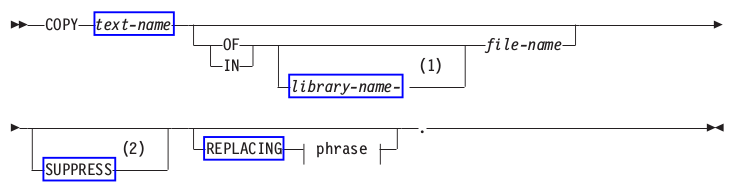

:slug: defends/cobol/usar-estructuras-optimizadas/
:eth: no
:category: cobol
:description: Nuestros ethical hackers explican como evitar vulnerabilidades de seguridad mediante la programacion segura en COBOL al utilizar estructuras optimizadas. Las estructuras optimizadas mejoran el rendimiento del programa y pueden ser incluidas al utilizar la sentencia COPY.
:keywords: Cobol, Seguridad, Estructuras, Optimizadas, Datos, Buenas Prácticas.
:defends: yes

= Usar Estructuras Optimizadas

== Necesidad

Usar la instrucción +COPY+
para incluir estructuras de datos optimizadas en +COBOL+.

== Contexto

A continuación se describe las circunstancias
bajo las cuales la siguiente solución tiene sentido:

. Se está desarrollando una aplicación en +COBOL+.
. El código debe utilizar contenedores
o estructuras de datos optimizadas<<r1,^[1]^>>.

== Solución

. La sentencia +COPY+ es muy diferente
a otras sentencias en +COBOL+.
Mientras que otras son ejecutadas en tiempo de ejecución,
la sentencia +COPY+ es ejecutada en tiempo de compilación.

. Esta sentencia es similar a la sentencia +include+ de C/C+\+,
el código contenido en el miembro declarado en la sentencia +COPY+
es copiado directamente en el código fuente
y posteriormente compilado.
Este proceso ayuda a mantener estructuras de datos optimizadas
y centralizadas para su posterior uso.
En la siguiente solución encontrará
la forma de copiar código almacenado
en bibliotecas reusables desde +COBOL+.

. Creamos un nuevo miembro llamado +QPHONE+
en la biblioteca +fluidattacks+ del archivo +QRPGSRC+.
Este archivo contiene una estructura de datos optimizada
para el almacenamiento de registros telefónicos:

* +PHONE-LAST-NAME:+ Contiene el apellido.

* +PHONE-FIRST-NAME:+ Contiene el nombre.

* +PHONE-NUMBER:+ Contiene el número telefónico.

+
[source,cobol,linenums]
----
      *** START HEADER FILE SPECIFICATIONS ****************************
      *
      *Header File Name: QPHONE.CBLINC
      * LANGUAGE:     COBOL                                            *
      *
      *Descriptive Name: Estructura de datos para registros telefonicos
      *
      *Description: Estructura reutilizable para registros telefonicos
      *
      *** END HEADER FILE SPECIFICATIONS ******************************

       01 PHONE-RECORD.
           05 PHONE-LAST-NAME  PIC X(10).
           05 PHONE-FIRST-NAME PIC X(10).
           05 PHONE-NUMBER     PIC X(10).
----
. En el momento de crear un nuevo programa
que requiera el uso de registros telefónicos,
se incluye el código reutilizable
a través de la sentencia +COPY+.

. Se define el nombre del programa
mediante la división +IDENTIFICATION DIVISION+:
+
.cobolcopyb.cbl
[source,cobol,linenums]
----
       IDENTIFICATION DIVISION.
      ******************
      * Identification *
      ******************
       PROGRAM-ID. COBOLCOPYB.
----
+
En este caso, mediante la sentencia +PROGRAM-ID+
se designa al programa bajo el nombre de +COBOLCOPYB+.

. En la división de datos +DATA DIVISION+
hacemos uso de la sentencia COPY
la cual debe seguir el siguiente formato^<<r2,[2]>>,<<r3,[3]>>^:
+

. Si +file-name+ no es especificado,
el archivo +QCBLLESRC+ es asumido por defecto.
Puede especificar el nombre del archivo
y la biblioteca usando el formato +MYLIB-MYFILE+.

. Copiamos el código contenido
en el miembro QPHONE que se encuentra
en la biblioteca +fluidattacks+ del archivo +QRPGSRC+:
+
[source,cobol,linenums]
----
      ********
      * Data *
      ********
       DATA DIVISION.
       WORKING-STORAGE SECTION.
       COPY QPHONE OF fluidattacks-QRPGSRC.
----
. Hacemos uso de la estructura +PHONE-RECORD:+
+
[source,cobol,linenums]
----
      ********
      * Main *
      ********
       PROCEDURE DIVISION.
       MAIN.
           MOVE "Apellido  Nombre    3001234982"
           TO PHONE-RECORD.
----
. Mostramos los datos usando cada variable de la estructura:
+
[source,cobol,linenums]
----
       DISPLAY "Nombre: " PHONE-FIRST-NAME.
       DISPLAY "Apellido: " PHONE-LAST-NAME.
       DISPLAY "Numero tel: " PHONE-NUMBER.

       STOP RUN.
----
. La biblioteca +QSYSINC+ provee todos los archivos de inclusión
para las interfaces de programación de aplicaciones
incluidas en el sistema operativo.
Para el lenguaje de programación +COBOL+,
los archivos de inclusión
se encuentran en la biblioteca +QSYSINC+ del archivo +QCBLLESRC+.

. A través del comando para trabajar con miembros
podemos obtener la lista completa
de archivos de inclusión para +COBOL+:
+
[source,cobol,linenums]
----
       WRKMBRPDM FILE(QSYSINC/QCBLLESRC)
----
+
Algunos de ellos están especificados en la siguiente tabla:
+
.Lista de algunos archivos de inclusión.
[options="header"]
|===
|Nombre |Descripción

|DSQCOMMB
|API de administración de sentencias

|JNI
|Interfaz nativa de Java

|QC3CCI
|API de Criptografía

|QSY
|API de seguridad

|QTEDBGS
|API de depuración

|QUS
|API de espacio de usuario

|QUSEC
|Parámetro de la interfaz para errores de código

|===

== Descargas

Puedes descargar el código fuente
pulsando en los siguientes enlaces:

. [button]#link:src/qphone.cbl[qphone.cbl]# contiene
una estructura de datos optimizada
para el almacenamiento de registros telefónicos.
. [button]#link:src/cobolcopyb.cbl[cobolcopyb.cbl]# contiene
las instrucciones del programa principal.

== Referencias

. [[r1]] link:../../../rules/164/[REQ.164 Utilizar estructuras optimizadas].
. [[r2]] link:https://www.ibm.com/support/knowledgecenter/ssw_i5_54/books/sc092539.pdf[ILE COBOL Reference, página 586].
. [[r3]] link:https://www.ibm.com/support/knowledgecenter/SSAE4W_9.0.0/com.ibm.etools.iseries.langref.doc/c0925395663.htm[COPY Statement - Format 1].
