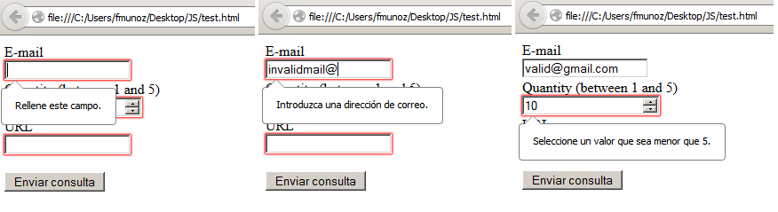

:slug: defends/html/validar-formulario/
:category: html
:description: Nuestros ethical hackers explican como evitar vulnerabilidades de seguridad mediante la programacion segura en HTML al validar formularios. Las entradas en los formularios deben ser validadas para prevenir los ataques más comunes como es el caso de XSS o SQLi.
:keywords: HTML, Seguridad, Validar, Formulario, Navegador, Error.
:defends: yes

= Validar Formularios HTML

== Necesidad

Validación de formularios en +HTML+.

== Contexto

A continuación se describen las circunstancias
bajo las cuales la siguiente solución tiene sentido:

. Se desea utilizar validación de campos de un formulario +HTML+.
. Las versiones de los navegadores utilizados son iguales o superiores
a +Firefox 10+, +Chrome 10+ o +Internet Explorer 10+.
. El sistema debe descartar
toda la información potencialmente insegura
que sea recibida por entradas de datos.<<r1,[1]>>

== Solución

Al crear un formulario en +HTML+,
hay que ser consciente de un detalle ineludible:
los usuarios se equivocan al rellenar un formulario.
Ya sea que dicha equivocación
se de por ambigüedad del formulario,
o tal vez algún error del creador del mismo,
o incluso, que el usuario se equivoque deliberadamente.
El caso es que hay que estar preparado
y por consiguiente anticiparse a dichos errores,
para intentar que los datos lleguen correctamente a su destino
y evitar cualquier tipo de moderación, revisión posterior
o, peor aun, algún ataque que ponga en peligro
la confidencialidad e integridad de la información.

Para evitar estos casos, se suele recurrir
a un tipo de proceso automático llamado validación.
En este, se establecen algunas pautas para que,
si el usuario introduce alguna información incorrecta o invalida,
deba modificarla o, en caso contrario,
no podrá continuar ni enviar el formulario correctamente.

Tradicionalmente, la validación de un formulario
se ha hecho siempre en +JavaScript+.
Sin embargo, +HTML+ en su versión +HTML5+
introduce unos nuevos atributos para formularios
que permiten realizar la validación del formulario directamente
sin necesidad de recurrir a +JavaScript+.^<<r2,[2]>>,<<r3,[3]>>^

. Algunos de esos atributos son:

* +min+: Es un atributo de valor númerico
y establece el número mínimo permitido.
* +max+: Es un atributo de valor númerico
y establece el número máximo permitido.
* +required+: Se usa para determinar que un campo es obligatorio,
y por tanto se debe rellenar para enviar formulario.

. Creamos un formulario, con algunos campos que se utilizarán para validación:
+
.formulario.html
[source, html, linenums]
----
<form action="" autocomplete="off">
  E-mail <input type="email" name="email" required="true">  
  Quantity (between 1 and 5)
  <input type="number" name="quantity" min="1" max="5" required="true">
  URL <input type="url" name="homepage" required="true">  
  <input type="submit">
</form>
----

. Como se puede ver en este formulario,
utilizamos campos de tipo especial,
por ejemplo, +email+, +number+, +url+,
los cuales son validados por el navegador de manera automática.

. Podemos observar que, al intentar enviar el formulario
utilizando información inválida o dejando los campos vacíos,
aparecen diversos errores en el formulario:
+

. En el caso que el navegador utilizado no sea reciente,
no se realizará ninguna validación de los campos de los formularios.

. Toda validación que se haga desde el cliente
debe ser acompañada por una validación del lado del servidor.

== Referencias

. [[r1]] link:../../../rules/173/[REQ.173 Descartar información insegura].
. [[r2]] link:https://developer.mozilla.org/es/docs/Learn/HTML/Forms/Validacion_formulario_datos[Validación de formulario de datos].
. [[r3]] link:http://www.um.es/docencia/barzana/DAWEB/Desarrollo-de-aplicaciones-web-teoria-formularios-ejemplo-1.html[DAWeb. Verificación de formularios].
