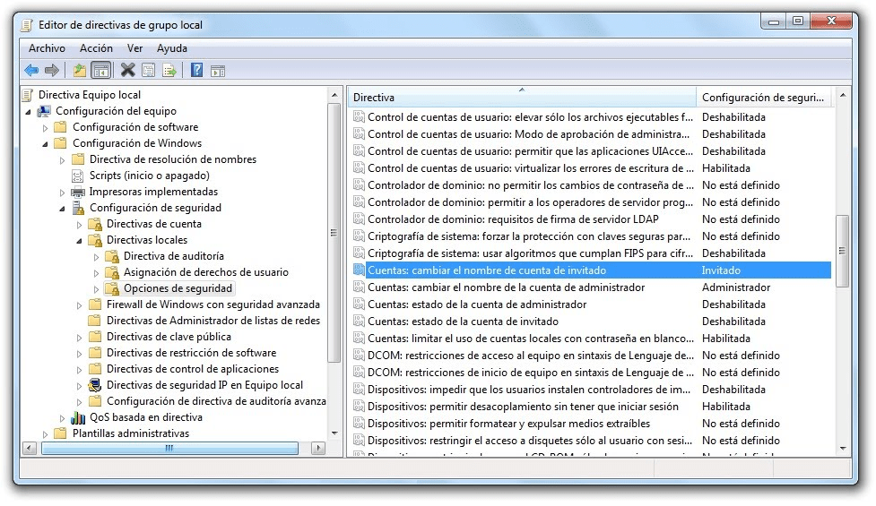
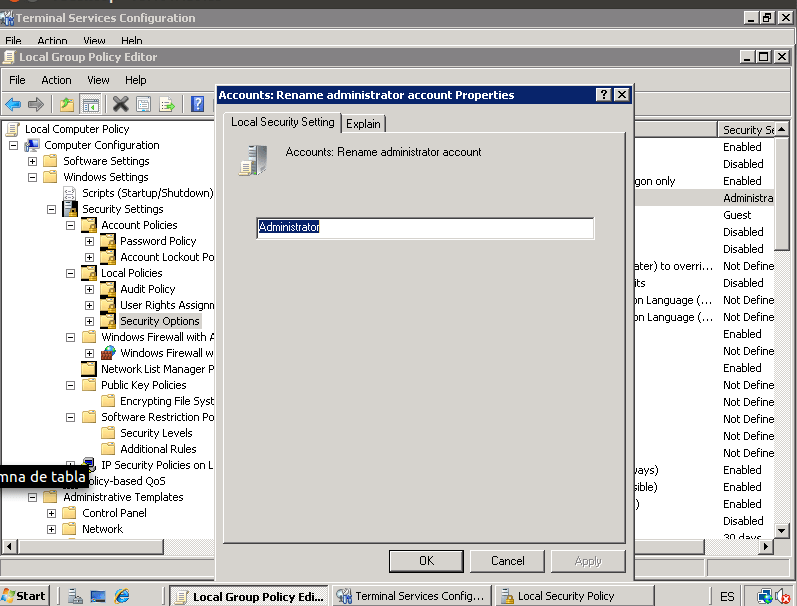

:slug: defends/windows/cambiar-credenciales/
:category: windows
:description: Nuestros ethical hackers explican como evitar vulnerabilidades de seguridad en Windows 7 al cambiar las credenciales predeterminadas del sistema. Es altamente recomendable modificar las configuraciones iniciales del sistema para evitar ataques que utilizan credenciales predeterminadas.
:keywords: Windows 7, Credenciales, Predeterminadas, Renombrar, Usuarios, Buenas Prácticas
:defends: yes

= Cambiar Credenciales Predeterminadas

== Necesidad

Cambiar nombres de usuario predeterminados en +Windows 7+.

== Contexto

A continuación se describen las circunstancias
bajo las cuales la siguiente solución tiene sentido:

. Se tiene una máquina bajo el sistema operativo +Windows 7+.
. Se desean cambiar los nombres de usuarios predeterminados
para la cuenta de Administrador e invitado.
. Opcionalmente se desea propagar la configuración
a equipos pertenecientes a un dominio +Windows+.

== Solución

A la hora de desarrollar aplicaciones,
debemos asumir que el usuario final
está en capacidad de vulnerar nuestro sistema.
Siguiendo pautas de programación segura,
podemos reforzar la seguridad de nuestro sistema.
Esto funciona para evitar una gran cantidad de ataques.
Sin embargo, también debemos considerar
las configuraciones iniciales
de los sistemas en los que corren nuestras aplicaciones.
Así como las posibles vulnerabilidades que se pueden presentar.

Las configuraciones predeterminadas de los sistemas,
por lo general son bastante conocidas.
Debido a ello representan un blanco común de los atacantes.
Una buena práctica de programación consiste en modificar
las credenciales y configuraciones iniciales
para evitar algunos escenarios de ataque.
Por ejemplo, si un usuario malicioso
realiza un ataque de fuerza bruta con diccionario con usuario predeterminados.
Una mala configuración podría resultar en un robo de credenciales.
Debido a esto es altamente recomendable
modificar las credenciales por defecto de los sistemas.
Para ello debemos seguir la siguiente serie de pasos:

. Hacemos clic en +Inicio+, +Ejecutar+ y escribimos +gpedit.msc+.
Alternativamente podemos acceder a la función +Ejecutar+ de +Windows+
al presionar el botón +Windows+ y la tecla +R+.

. Esto abrirá el +Editor de directivas de grupo local+,
allí encontraremos una lista con varias directivas.
Nos dirigiremos a las directivas
+Cuentas: Cambiar Nombre de cuenta de invitado+ y
+Cuentas: Cambiar Nombre de cuenta de administrador+,
como se muestra en la siguiente figura:

.Editor de directivas de grupo local

. En el +Editor de directivas de grupo local+ dirigirse a la sección
+Configuración del Equipo+,
luego a +Configuración de Windows+,
+Configuraciones de Seguridad+,
+Directivas Locales+, +Opciones de Seguridad+
y finalmente a +Renombrar Cuentas.

. Daremos clic derecho en la directiva del invitado.
Luego abriremos sus propiedades en una nueva ventana.

. A continuación nos dirigimos a la pestaña
+Configuraciones Locales de Seguridad+.
En el campo de texto ingresamos
el nuevo nombre de la cuenta invitado
para modificarlo,
como se muestra a continuación:
+
.Modificación de usuario invitado
image::rename-guest.png["Modificación de usuario invitado"]

. Posteriormente ingresamos a la directiva del administrador
y se repite el mismo procedimiento.
+
.Modificación de usuario administrador

. Los cambios serán efectivos luego de reiniciar el equipo.

== Referencias

. [[r1]] link:http://www.intowindows.com/how-to-rename-guest-account-in-windows-7/[How To Rename Guest Account In Windows 7].

. [[r2]] link:https://www.howtogeek.com/howto/6754/rename-the-guest-account-in-windows-7-for-enhanced-security/[Rename the Guest Account in Windows 7 for Enhanced Security].

. [[r3]] link:../../../rules/142/[REQ.142 Modificar credenciales de acceso por defecto].
