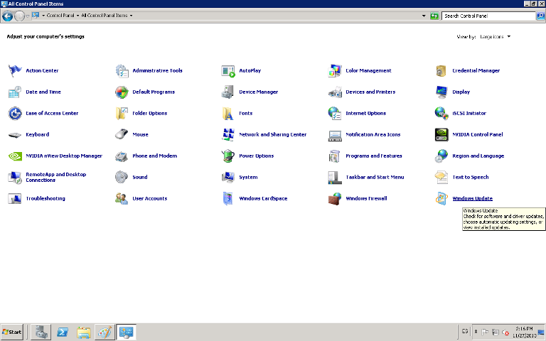
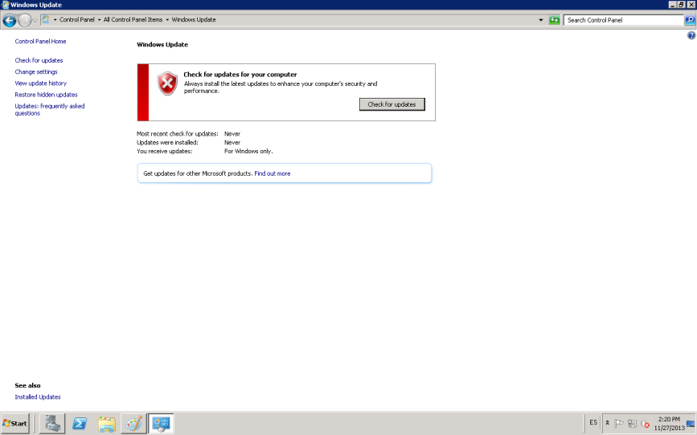
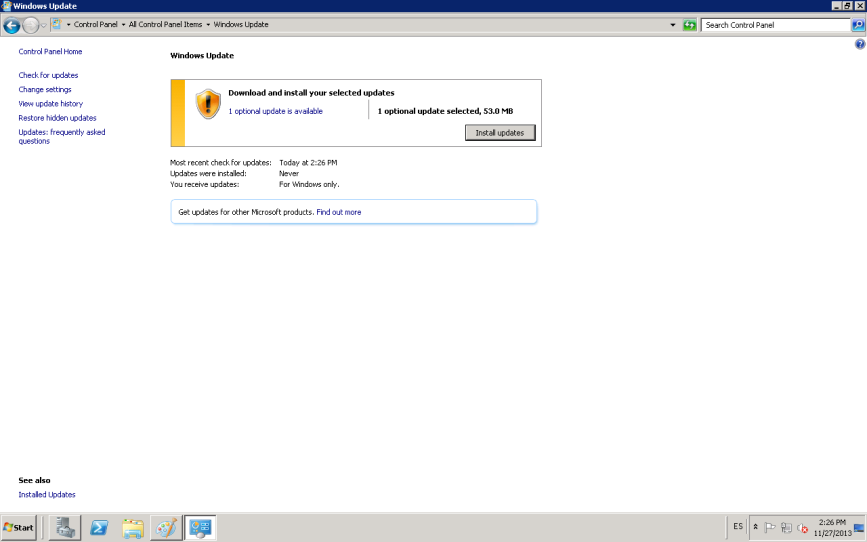

:slug: defends/windows/configurar-actualizaciones/
:category: windows
:description: Nuestros ethical hackers explican como evitar vulnerabilidades de seguridad mediante la configuracion segura de Windows. En este instructivo, explicaremos paso a paso cómo actualizar y mantener versiones estables del sistema operativo en Windows Server 2008.
:keywords: Seguridad, Buenas Prácticas, Windows, Windows Server 2008, Actualizaciones, Automáticas.
:defends: yes

= Configurar Actualizaciones Automáticas

== Necesidad

Actualización automática en +Windows Server 2008+

== Contexto

A continuación se describen las circunstancias
bajo las cuales la siguiente solución tiene sentido:

. Se tiene una máquina bajo el sistema operativo +Windows Server 2008+.
. Se desea mantener actualizado el sistema
a las últimas versiones estables disponibles.

== Solución

Mantener el sistema operativo actualizado es de fundamental importancia.
Es el único modo de evitar posibles problemas de vulnerabilidades
y de mal funcionamiento del sistema en general.

Por tanto, las actualizaciones del sistema operativo,
tanto automáticas como manuales,
cumplen la función de proteger
los diferentes equipos de múltiples amenazas.
Esas amenazas pueden ser: los diferentes tipos de +malware+,
errores del sistema y las diferentes vulnerabilidades.
Además, las actualizaciones permiten
garantizar un funcionamiento rápido y eficaz de la máquina
reduciendo en gran medida las probabilidades de fallos.
Es por ello que es tan necesario permitir que se ejecuten
las actualizaciones automáticas que constantemente se liberan.

Por otra parte, las actualizaciones son esenciales
para impedir la acción de amenazas durante la navegación por la red
y el intercambio de distintos tipos de archivos.

. Para actualizar un sistema operativo +Windows+
se siguen los siguientes pasos:

. Se ingresa al panel de control.

. Se hace doble clic en el icono de +Windows Update+.
+

. Después, se da clic
sobre la opción +Check for updates+(buscar actualizaciones).
+

. Se muestran todas las actualizaciones disponibles.

. Se selecciona +Install updates+ (instalar actualizaciones),
así se actualiza por primera vez el sistema.
+

. Si el sistema tiene configurado +UAC+ (Control de cuentas de usuario),
es probable que solicite usuario y contraseña,
solo se puede continuar si el usuario utilizado tiene los
privilegios para cambiar esta configuración.

. Para activar actualizaciones automáticas se usa la opción +Change settings+
y allí se selecciona +Install updates automatically (recommended)+.
La hora configurada, por defecto, es a las +3:00 a.m+ de cada día.
Esa hora es adecuada
si se espera poco trabajo en la máquina a esta hora.
Finalmente se hace clic en +OK+.
+
image::configurar.png[configuracion]

. Nota: Se deben realizar pruebas de las actualizaciones a implementar,
previo a la instalación en los ambientes de producción.

. Para concluir: hay que ser conscientes
de que actualizar no es una acción dirigida
a complicar la vida de los usuarios.
Muy por el contrario, se trata de un hábito invaluable
destinado a proteger la información alojada en los ordenadores y,
además ayuda a optimizar el trabajo de los equipos.

== Referencias

. [[r1]] link:https://salesystems.es/la-importancia-de-mantener-el-software-actualizado/[La importancia de Mantener el Software Actualizado]
. [[r2]] link:https://support.microsoft.com/en-us/help/3067639/how-to-get-an-update-through-windows-update[Actualizar Windows]
. [[r3]] link:../../../rules/262/[REQ.262 Verificar componentes de terceros]
