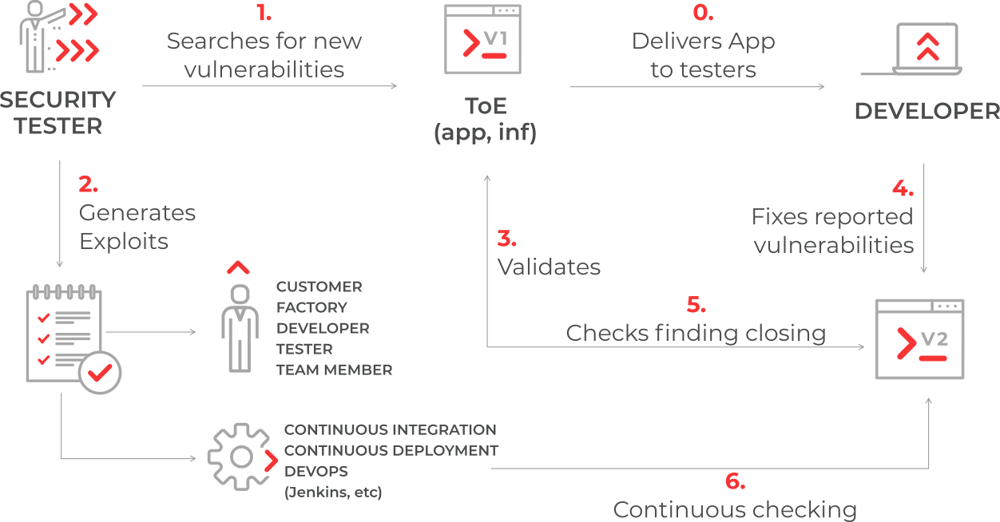

:slug: products/asserts/
:description: Fluid Attacks presents Asserts, an open-source tool that looks for deterministic and peripheral vulnerabilities verifying their status by automated attacks.
:keywords: Fluid Attacks, Resources, Asserts, Security, Vulnerabilities, Automated Attacks, Pentesting, Ethical Hacking
:assertsindex: yes
:banner: asserts-bg

= Asserts

== General description

*Asserts* is an open-source tool
that looks for deterministic and peripheral vulnerabilities
performing Dynamic and Static Application Security Testing (`DAST` - `SAST`).
*Asserts* also automates attacks to verify the status (*open*/*closed*)
of vulnerabilities on your system
and gives you fast feedback on the proposed solutions.
Therefore, *Asserts* can be included in `CI`/`CD` environments
as a security gate.

.Graphical representation

=== Technology stack

- Python for the source code.
- `AWS` to host the infrastructure.
- Terraform to define as Code the infrastructure.
- Docker to pack environments.
- `PGP`, `KMS`, and `SOPS` to encrypt secrets
and ensure safe-transport and storage of critical information.

== Key benefits

*Asserts* will allow you to

- perform generic security tests during the software life cycle;
- perform custom security tests during the software life cycle;
- encapsulate organization security policies as code,
and enforce them across your software life cycle;
- identify the status of deterministic vulnerabilities on your system;
- recognize the exact moment a vulnerability appeared
(for every vulnerability check, *Asserts* prints the `ToE` fingerprint);
- have an interactive cycle of vulnerability closing.

[button-asserts]#link:https://fluidattacks.com/resources/doc/asserts/[Read API Documentation]#
