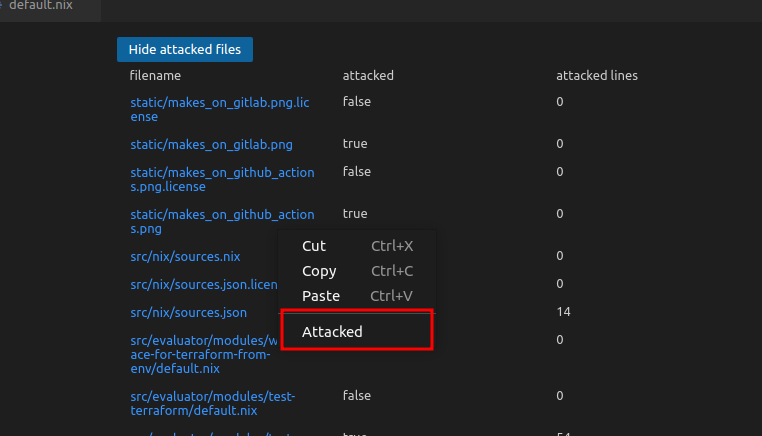

# Fluid Retrieves

Fluid retrieves is an extension designed to mange the resources of
continuous hacking.

Retrieves run automatically on startup and can detect if the current file is
inside the fusion folder in the services repository. If it is in a services
retrieves repository it will be activated.

So far, Retrieves will:
  - list the groups to which the user has access
    - list the repositories of each group
      - clone repositories
      - get toe lines
      - go to file from toe lines
  - Obtain the toe lines of each repository, with information of each file
    - Hide files that have already been attacked
    - Mark a file as attacked. Right click in the file path
     
  - When opening a file, the vulnerabilities reported for the file are
    consulted and listed as vscode diagnostics

To use the extension, it must be used on a directory named `groups`,
in this directory the repositories are cloned. You can open the subdirectories
of `groups`, the extension still uses `groups` as the base directory.

## Installation

Retrieves only requires the `INTEGRATES_API_TOKEN` as an environment variable,
if it doesn't load the groups add the token manually, add the token to
vscode settings `.vscode/settings.json`
```json
{
    "retrieves.api_token": "your token"
}
```

Some admin roles have access to most or all of the groups,
but these groups are not directly assigned to the user, which causes
the groups to not be listed in the retrieve menu. To list additional
groups they must be added to the configuration
```json
{
  "retrieves.extraGroups": ["yali", "titribi"]
}
```
