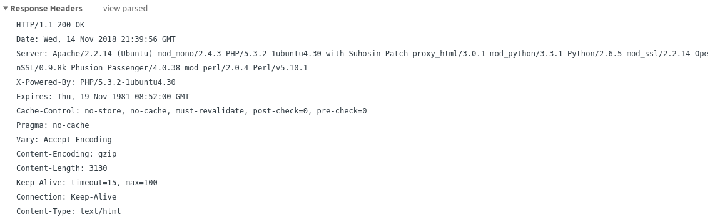
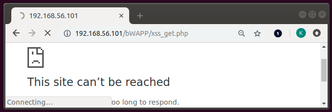

:slug: asymmetric-dos-slow-http-attack/
:date: 2018-11-15
:category: attacks
:subtitle: The story of David and Goliath
:tags: security, vulnerability
:image: cover.png
:alt: image of a DoS in action
:description: After reading this post you'll know about asymmetric attacks, denial of service attacks, you'll know how an slow http attack works, how to inspect the http requests and responses, and you'll see how to perform an asymmetric denial of service against bWAPP with slowhttptest!
:keywords: DoS, Vulnerability, Slowhttptest, Slow Body, HTTP, Asymmetric attacks.
:author: Kevin Amado
:writer: kamadoatfluid
:name: Kevin Amado
:about1: Civil Engineer
:about2: "An algorithm must be seen to be believed" Donald Knuth

= Asymmetric DoS, slow HTTP attack

Have you ever heard about that beautiful story of David and Goliath where an
underdog, expected to lose and highly underestimate guy, shut down the biggest
and strongest of the enemies?

Fine! because today we are going to talk about those unequal scenarios.
Furthermore, we are going to battle one ourselves.

== Lets get started

So, lets imagine for a moment that all you need to kill the giant that
everyone fears is a little slingshot, not a big maze,
nor the strength of a thousand men...
Sounds crazy? Well it is. But it's possible.

A cyber attack is considered "asymmetric" in the sense
that you need a little amount of resources,
(in this case, our tiny slingshot, or laptop),
in order to cause a considerably level of resources malfunction or failure in
the target, (in this case, the giant, or the server).

If we push hard enough, the server is going to stop providing the service to
other users, in other words, we will cause a _Denial of Service_, (DoS).

== How a slow http attack works?

Imagine a line at the local fast food restaurant and a customer at the cashier
who is taking an eternity to decide if he wants a burger or a hot-dog, making
everyone else become anxious and stopping down the food delivery.

If you look at it in more detail, all this customer needed was to "not know what
to order" to make the fast food restaurant stop the food delivery, (DoS).

Now imagine the same line, but you are supposed to know what to order before
reaching the cashier, so there shouldn't be a problem. Bad thing is that now
a customer is ordering a thousand burgers and a hundred hot-dogs, making again
everyone else wait and making the restaurant tell the other customers, "hey,
we'll be busy for the rest of the day cooking this, we can't serve more food!"

The HTTP protocol works similar, it requires requests to be fully received by
the final user before they are processed.

Two things can happen, if a request is not completed,
the server can either wait, or set the request as timed out after some seconds.
But if you let the request complete, but at a slow rate,
then the server will keep the resource busy waiting for the end of the data.

What would happen if you order a thousand burgers and a hundred hot-dogs at
your turn,
but you don't decide fast what sauce and what drink in each one of them,
and you are intentionally indecisive about your order and speaking slowly?

The answer:

[button]#link:https://cwe.mitre.org/data/definitions/400.html[D.o.S.]#

This is exactly the idea behind and http attack.

A web server keeps its active connections in a relatively small connection pool,
and we will try to tie all the connections in this pool to slow requests,
making the server reject another users.

== Lets do an HTTP request

First of all, lets run a
[button]#link:http://www.itsecgames.com/[bWAPP]#
server on ip _192.168.56.101_

.BWAPP server

For now let assume that we are at

|====
|http://192.168.56.101/bWAPP/xss_post.php.
|====

And we entered in the form

.XSS page and input
image::xss-login-form.png[xss-login-form]

Once we access a page,
the browser is going to ask the server for some resources,
(images, texts, HTML pages, .css and .js files, etc),
and we can see this requests and responses from Google Chrome's developer tools
(or Firefox, or BURP).

.HTTP requests headers and form data

Every single resource, is going to have a request, and a corresponding response.
In other words, we are asking the server for the _xss_post.php_ resource, with
the parameters:

|====
|firstname=test1&lastname=test2&form=submit
|====

And the server replies with

.HTTP response headers

At this point, nothing stop-us from sending multiple requests:

|====
|firstname=test1&lastname=test2&form=submit
|====

(wait some seconds)

|====
|firstname=FASLDKJFEI&lastname=test2&form=submit
|====

(wait some seconds)

|====
|firstname=IEU182KSZ&lastname=test2&form=submit
|====

And nothing stop us to simulate a slow connection on each one of this requests,
so the server is going to have to wait until we receive the full resource.

Why not to do a thousand requests until every single connection available on the
server pool is busy with us?

To do this, we are going to use a tool.

== Using slowhttptest

First of all, lets pull the
link:https://hub.docker.com/r/frapsoft/slowhttptest/[slowhttptest docker image]
from the docker hub

.Bash command
[source, bash, linenums]
----
$ docker pull frapsoft/slowhttptest
----

And write the following command:

.Bash command
[source, bash, linenums]
----
$ sudo docker run --name DoSBWAPP --rm  frapsoft/slowhttptest -c 65539 -B -i 10 -l 300 -r 10000 -s 16384 -t firstname -u "http://192.168.56.101/bWAPP/xss_get.php" -x 10 -p 300
----

The parameters you see are described below:

.Slowhttptest description
|====
|-c 65539| use 65539 connections
|-B|specify to slow down the http in message body mode
|-i 10|seconds of interval between follow up data, per connection
|-l 300| duration of the test in seconds
|-p 300|timeout in seconds to wait for HTTP response on probe connection,
after which server is considered inaccessible
|-r 10000| connections per second
|-s 16384|value of Content-Length header
|-x 10|max length of follow up data in bytes
|-t firstname|add ?firstname=(-x 10bytes) to the target url
|-u URL|target URL
|====

While the attack is running a user that tries to access the service is going
to see:

.BWAPP is trying to connect without success

If the attack is long enough, it is going to get timed out:

.BWAPP gets timed-out

Once the attack is finished everything returns to a normal state:

.BWAPP working normally after attack

Since we need a little amount of resources, (a laptop, and internet connection),
we can even do it on a low-bandwidth connection. Moreover, since we don't need
too much bandwidth, we can pass everything through a proxy in the tor network
and hide ourselves.

== Sounds scary, how do I protect myself?

The set of counter measures depends mainly on your service.

Some useful mechanisms to prevent this kind of attacks,
in order of usefulness, are:

* Limit the amount of resources that an unauthorized user can cause
to be expended.
* Set the header and message body to a maximum reasonable length.
* Define a minimum incoming data rate, and drop them if they are slower.
* Set an absolute connection timeout.
If the timeout is too short, you may risk dropping legitimate slow connections;
and if it's too long, you don't get any protection from attacks.
Find this value from your statistics, and give a margin of two or three
standard deviations.
* Use a Web Application Firewall.

== Finally

I really hope that you liked this article.

Wish you a nice week, and see you in another post!

== References

. [[r1]] Wikipedia (2018).
'Hypertext Transfer Protocol'.
link:https://en.wikipedia.org/wiki/Hypertext_Transfer_Protocol[Wiki].

. [[r2]] Sergey Shekyan (2018).
'Slowhttptest - Instalation and usage'.
link:https://github.com/shekyan/slowhttptest/wiki/InstallationAndUsage[Github wiki].

. [[r3]] Sergey Shekyan (2018).
'Application Layer DoS attack simulator'.
link:https://blog.qualys.com/tag/slow-http-attack[Docker hub].
