:slug: devoops-writeup/
:date: 2018-10-16
:category: attacks
:subtitle: How to resolve HTB DevOops
:tags: security, htb, pwn, web
:image: cover.png
:alt: Developers programming in an office
:description: DevOops is a Linux Hack the Box (HTB) machine that has several vulnerabilities where an attacker can gain remote code execution (RCE) and finally system access as root. In this article we present how to exploit the vulnerabilities of that machine and how to gain access as root and obtain the root flag.
:keywords: HTB, Security, Hack the Box, Web, Writeup, DevOops.
:author: Jonathan Armas
:writer: johna
:name: Jonathan Armas
:about1: Systems Engineer, Security+
:about2: "Be formless, shapeless like water" Bruce Lee

= DevOops Writeup

== Scanning Phase

First of all we check the IP of
link:https://www.hackthebox.eu/home/machines/profile/140[DevOops]
machine and try a +ping+
to see if we have access

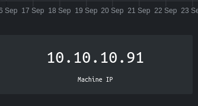
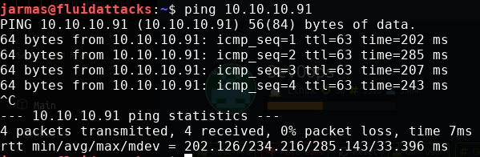

Then scan the ports with +nmap+,
in this case we're going to use basic +nmap+

----
nmap 10.10.10.91
----

And we see that the port +5000+ and +22+ are open

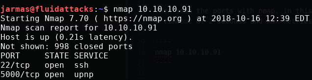

Then we try to access to the +port 5000+ with our browser
and it opens a web page with the contents of some feed

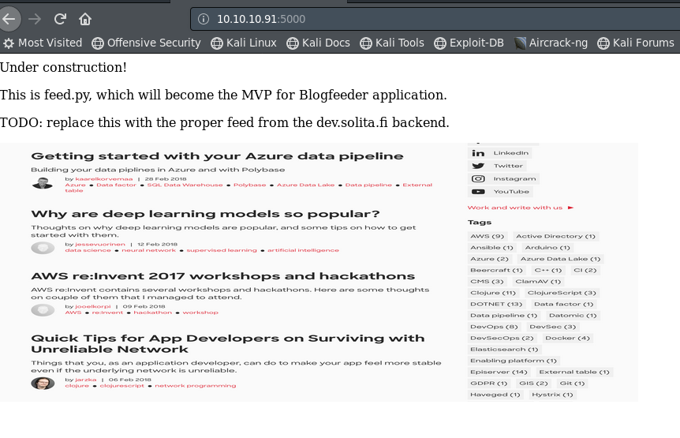

As we see in this page
there is nothing in there more than an image,
so we're going to scan the whole web server with +dirbuster+
to check if we can access something useful

----
dirb http://10.10.10.91:5000
----

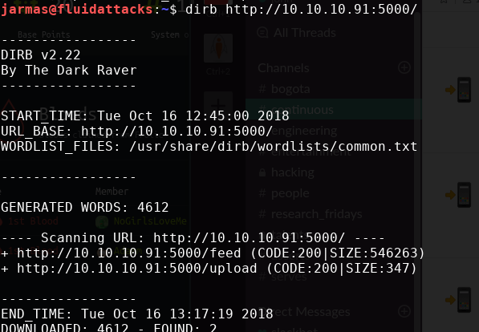

image::upload-page.png[upload-page]

== Getting user

In the last step we got an upload page,
as the page says we can upload +XML+ files
with the tags Author, Subject and Content,
then we try to upload the following +XML+ file

.xml
[source, xml,linenums]
----
<post>
<Author>johnarmas</Author>
<Subject>test</Subject>
<heading>Reminder</heading>
<Content>test</Content>
</post>
----

The response of the server is

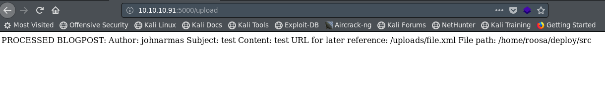

So, because there is no other functionality on the server,
we can suspect that there is an +XML External Entity+ (+XXE+) injection,
this is a type of attack against an application that parses +XML+ input.
This may lead to the disclosure of confidential data,
denial of service, among others,
and we can exploit it to retrieve the content of files
by uploading a malicious +XML+ file.

To test this we can upload the following file:

[source, xml,linenums]
----
<?xml version="1.0" encoding="ISO-8859-1"?>
<!DOCTYPE foo [ <!ELEMENT foo ANY >
   <!ENTITY xxe SYSTEM "file:///etc/passwd" >]>
<post>
<Author>johnarmas</Author>
<Subject>hola</Subject>
<heading>Reminder</heading>
<Content>&xxe;</Content>
</post>
----

With this we can retrieve the content of +/etc/passwd+ from the web server
and test for +XXE+ injection,
we can do it by manually upload the file
or using a proxy like +burpsuite+
and send the request to the repeater
like in this example

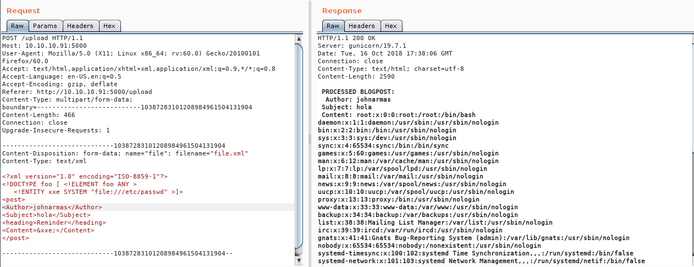

What to do next?
When we uploaded our first +XML+ file
on the response we can see that the file is stored on +/home/roosa/deploy/src+,
with this information we could retreive the user flag,
usually this file is on +/home/roosa/user.txt+,
and modifying our +XXE+ we can do it
but what about remote code execution?

In our scans we saw the port 22 open
so maybe we could retrieve a private key
to access the server with +ssh+.

In general the +ssh+ keys are named +id_rsa+
so what happens if we try to obtain the file +/home/roosa/.ssh/id_rsa+?

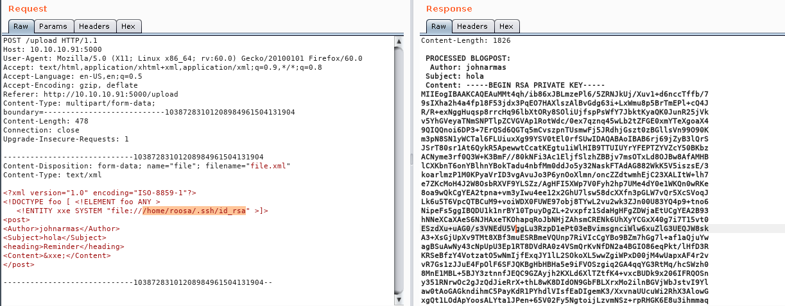

We save the content in a file
and change the permissions to +0600+
to be able to use it with +ssh+ without trouble.

I like +nano+ but it could be with any other text editor,
then we access the server with those credentials.

----
nano roosekey
chmod 0600 roosekey
ssh -i roosekey roosa@10.10.10.91
----

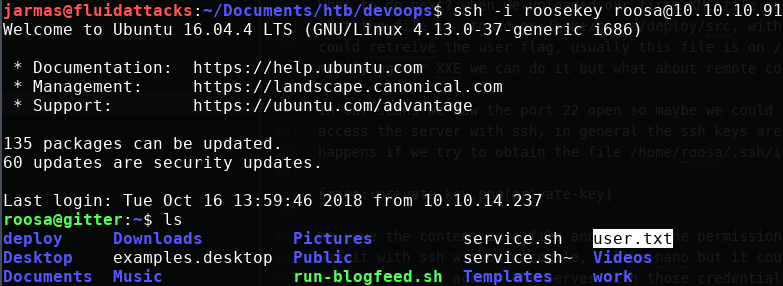

== Enumerating the server

When we access to the server
the first thing that we should do is
to check the files and the folders that we can access.

On this server we can see that there is a folder named +deploy+,
lets see what is in there.

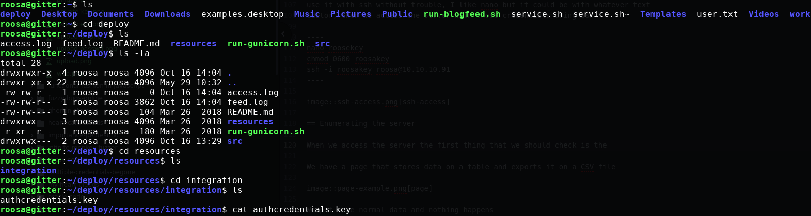

There is another private key,
but when we try to elevate as +root+ we get an error
so what could be happening?
Lets see what commands our user has typed.

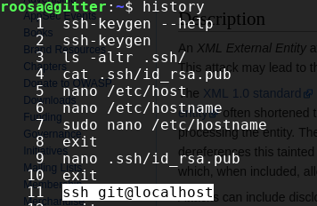

There we can see that our user has done a +ssh+ to +localhost+
with the user +git+,
lets try the same and see what happens.

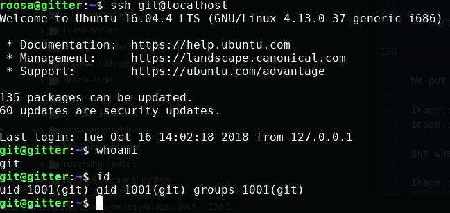

== Getting root

We do the same with our user +git+
to check the history
and there is a command to a route
that we didn't know that is +/srv/git/+,
and we access another folder named +blogfeed.git+
and check what is in there.

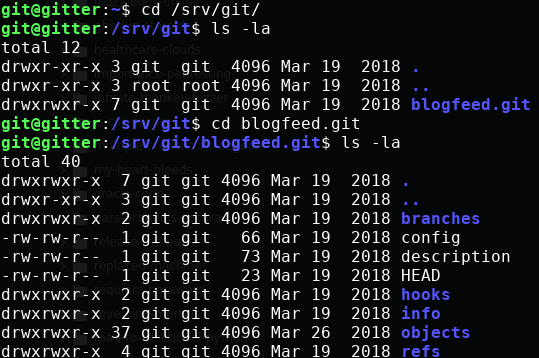

It looks like a normal +git+ folder
but there is no code in it,
lets see what is on their log with:

----
git log
----

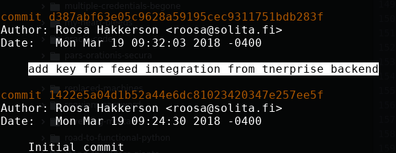

Surprise, surprise...

In their log is an authentication key,
but to see its content
we need to use +git log+ with more verbosity

----
git log -p -8
----

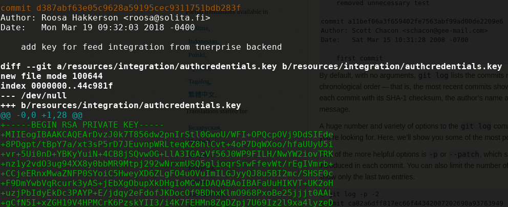

And when we scroll down
we can see the authentication key,
then we need to copy it,
remove the trailing plus symbols (only the first one)
and do the same as the first key we encounter.

We don't know from who user is that key
so we could try with the +root+ user,
it wont hurt anyone.

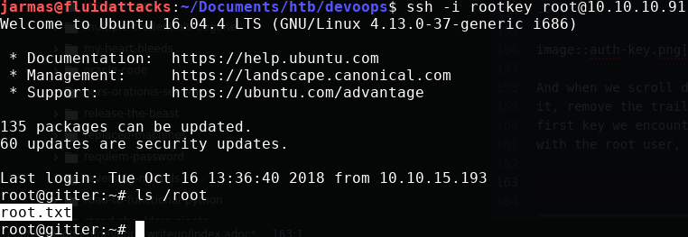

The key is in fact of the user +root+,
then we can retrieve our +root flag+
and the challenge is completed.

We learned on this challenge +XXE+,
to always check the +history+ when we access as an user on a machine
and to check +git+ repositories for credentials.
