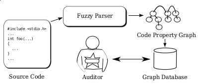
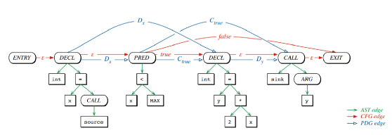
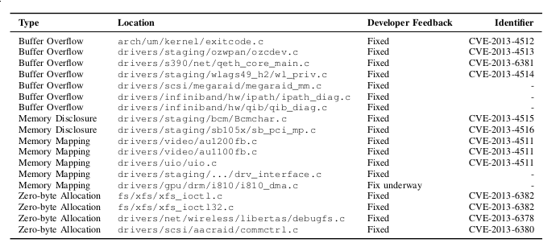
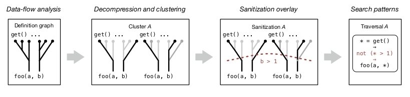

:slug: exploit-code-graph/
:date: 2018-11-27
:subtitle: Mining graph representations for vulnerabilities
:category: attacks
:tags: vector, security, application
:image: cover.png
:alt: Cartoonized dragon book cover
:description: How to exploit graph representations of code in order to find security vulnerabilites. We introduce Yamaguchi's concept of code property graphs, which combines standard graph representations, how to traverse them, and how to guide a computer to traverse it on its own.
:keywords: Machine learning, Clustering, Code property graph, Graph traversal, Vulnerability, Security
:author: Rafael Ballestas
:writer: raballestasr
:name: Rafael Ballestas
:about1: Mathematician
:about2: with an itch for CS
:source-highlighter: pygments

= Exploiting code graphs

As we have seen in our previous
link:../machine-learning-hack/[revision article],
probably the most interesting and succesful approach to
automated vulnerability detection is the
link:../machine-learning-hack/#pattern-recognition-approaches[pattern-based approach].
Since we expect to extract meaningful patterns from the code we also need
a "comprehensive and feature rich representation"<<r1, ^[1]^>> of it.
Other authors have tried to work on the code as if it were merely
a collection of words or documents with no regards to syntax
or inherent order, but with poor results.

== Combining standard code representations

The basic idea is to parse the source code,
represent it as a graph which extends on the standard
link:../oracle-code/#databases-out-of-programs[abstract syntax tree]
(`AST`) to include information about data and control flow,
and store it in a database which can be queried by the analyst.

.Overview of the process

Besides the `AST`, another couple of useful code representations are:

* the _control flow_ graph (`CFG`),
which represents the order in which statements are executed
depending on the conditions, and

* the _program dependence_ graph (`PDG`),
which tells us how variables are modified by statements.

These are better understood by example.
Consider the following `C` snippet:

[source,C]
void foo() {
  int x = source();
  if( x < MAX ) {
    int y = 2*x;
    sink(y);
  }
}

The `AST`, `CFG` and `PDG` for such a snippet would be like this:

.Comparison of graph representations of code
image::graphs.png[Code graph comparison]

Neither of them alone can tell us the whole story
about what is happening in that code, which is
of course necessary to identify vulnerabilities,
since these are generally very context-dependent,
// example malloc with placemente

Yamaguchi and his team put forward the idea of
combining these three graphs into a single
link:https://en.wikipedia.org/wiki/Multigraph[_multigraph_]
(basically a graph that allows multiple edges for a pair of nodes),
which they call the _code property graph_:

.A code property graph

Essentially, it's like the `AST` with additional edges
"borrowed" from the `PDG` and `CFG`, which are
therefore represented with different colors and labels.
The authors provide detailed explanations
regarding how these graphs are mathematically defined,
operationally built from source and later traversed.
However here we will continue using only the intuition
of how this works with the discovery of
a Buffer Overflow vulnerability in the `Apple`
implementation of `SSH` which exposed many `iOS` applications.
Here is the culprit code:

[source,C]
if channelp {
  uint32_t namelen = _libssh2_ntohu32(data + 9 + sizeof("exit-signal"));
  channelp->exit_signal = LIBSSH2_ALLOC(session, namelen + 1);
  [...]
  memcpy(channelp->exit_signal, data + 13 + sizeof("exit_signal"), namelen);
  channelp->exit_signal[namelen] = '\0';
}

Memory is allocated in line 3 using the `LIBSSH2_ALLOC` function
depending on the variable `namelen`.
The problem is that this variable is controlled by the user,
so if it is made to be large enough,
we have a buffer overflow which might give
the attacker control of the program execution.
The vulnerability was originally discovered using
a regular expression which looks for a pattern
where the use of functions containing 'ALLOC' are combined
with arithmetical operations:

....
ALLOC[A-Z0-9_]*\s*\([^,]*,[^;]*[*+-][^>][^;]*\)\s*;
....

However, link:../pars-orationis-secura/#specifying-the-targets[as we know],
regular expressions fail to match the nested structure of code,
miss the whole context behind a potentially interesting situation
and are prone to false-positives.
Instead, a _traversal_ over the code property graph can be defined
which selects third arguments to `memcpy` which have been
tainted by first arguments to `get_user` that have not been sanitized.

By manually crafting such graph traversals,
the authors were able to identify *88* vulnerabilities in
the `Linux` kernel.
Out of those, these 18 were previously unknown:

.Zero-day vulnerabilites found using `CPG`

That's 15 `CVE` s right there,
made with a graph representation of code and
four measly traversals.

== Automating traversals

However good the results, they wouldn't be pertinent
for our research purposes if they couldn't be
automated using machine learning (`ML`).
Since we already know how to traverse the `CDG`
to look for potentially dangerous patterns,
now we need a way to automatically infer
what those patterns are.

The procedure is not universal, though,
as it does not apply to all kinds of vulnerabilites,
but to those of the _taint-style_, like Heartbleed.
Furthermore, it is not entirely automated, i.e.,
don't expect to give it your code and obtain every bug.
Rather, you have to feed it a sink of interest,
such as `memcpy`, whose unsanitized use caused Heartbleed).

Having selected a sink,
we find all invocations of it and _slice_
the whole part of the program that involves it,
and represent that as graph.
This graph is then divided into individual calls.
This information is then encoded as features
i.e. mapped to a vector space, which is
a precondition to apply any `ML` algorithm.
Then these invocations are
link:../crash-course-machine-learning/#k-means-clustering[clustered]
to determine sets of invocations with similar argument initializers.
This, however is not enough,
as some of those arguments could be sanitized.
Thus the second to last step is to create a
_sanitization overlay_ in order to avoid false positives.
Here is a depiction of the process:

.Clustering to get traversals

The product of this process is set of graph database traversals
such as the ones described in the previous section.
These traversals follow a template and are written
in the `Gremlin` language:

.Template for traversals
[source,C]
getCallsTo(sink)
  .taintedArgs(
          [arg1Source, ..., argnSource]
  ).unchecked(
          [arg1Sanitizer, ..., argnSanitizer)
  )

The method was checked against five well-known
CVE-causing sinks in five different open source projects,
with good results, summarized as follows:

In this case, the quality of results is measured by the
_reduction_ made to manual code auditing,
which is above 90% for all of them.

''''

This was an interesting combination of the
link:../oracle-code[code-as-data] approach and
link:../crash-course-machine-learning[machine learning] techniques
to find vulnerabilities in source code.
However many details are missing in the
pattern-based approach to `ML`-guided vulnerability discovery.
In particular, we have yet to discuss
_vulnerability extrapolation_ using dimensionality reduction
and _missing check_ detection via
link:../crash-course-machine-learning/#anomaly-detection-via-k-nearest-neighbors[anomaly detection.]
Stay tuned for more details on applying this and
other `ML` techniques to security.

== References

. [[r1]] Yamaguchi, F., Golde, N., Arp, D., and Rieck, K. (2014).Modeling
and discovering vulnerabilities with code property graphs.
In _Proc. of IEEE Symposium on Security and Privacy (S&P)_.

. [[r2]] Yamaguchi, F., Maier, A., Gascon, H., and Rieck, K. (2015).
Automatic inference of search patterns for taint-style vulnerabilities.
In _Proc. of IEEE Symposium on Security and Privacy (S&P)_.
