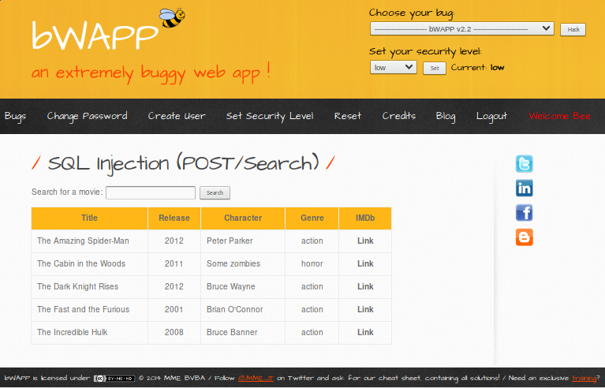
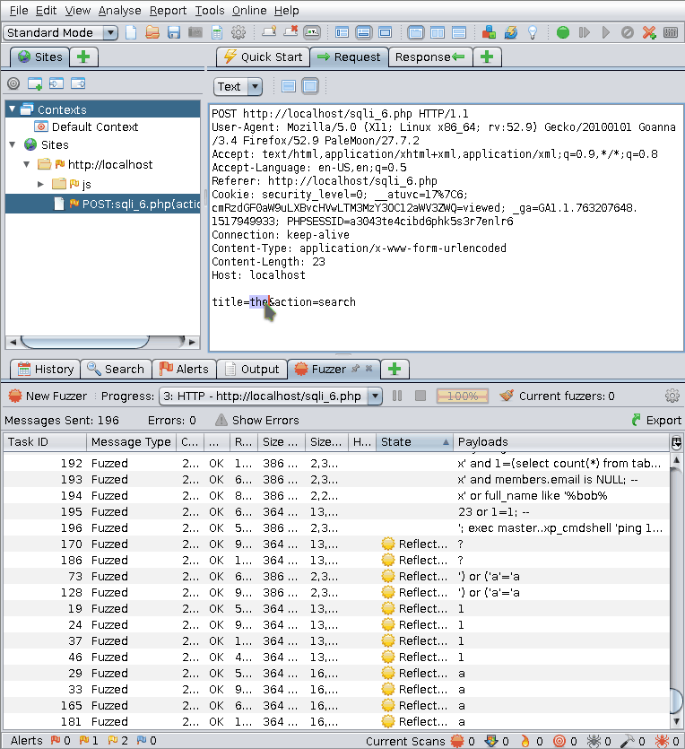
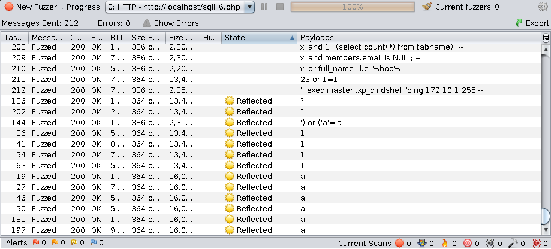
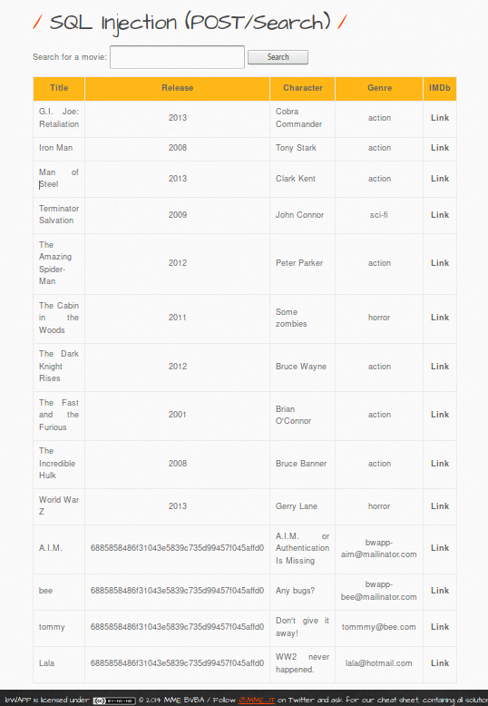

:slug: fuzzing-web/
:date: 2018-02-08
:category: challenges
:tags: SQL, fuzzing, injection
:Image: cover.png
:alt: Fuzzy caterpillar
:description: How to perform basic fuzz testing on web applications. Especifically we fuzz over SQL injections on a vulnerable DB search site from bWAPP, using OWASP ZAProxy, obtaining mixed results. Only the most trivial injections succeded. We also show an example of an injection not feasible via fuzzing.
:keywords: sql injection, fuzzing, attack, vulnerability, security, application.
:author: Rafael Ballestas
:writer: raballestasr
:name: Rafael Ballestas
:about1: Mathematician
:about2: with an itch for CS
:source-highlighter: pygments

= Fuzzy bugs online

Web fuzzing is a technique
to find bugs and vulnerabilities
in an automated fashion.
If you thought protecting your site
was a matter of boring attackers by
blocking the most common types of malicious requests,
think again.
Read on.

== Injecting +SQL+ into a vulnerable site

A fairly common situation is a website
which provides the ability to search, add, and remove
elements from a database.
But introducing this kind of feature
implies being very careful about
how you set up and access that database.

Let's look at +link::http://itsecgames.com/[bWAPP]+, which
has a movie database, and
allows us to search for a given title:

.+bWAPP+'s movie search site

It looks like this site takes the user input
as a +POST+ request,
searches the database for that term,
and prints back the result in table form.
We can tell it's a +POST+ request
since there is nothing in the +URL+ that hints +GET+
(other than the huge title that says +POST+,
of course, but that wouldn't be there in a real app).

Let's check that using the +OWASP ZAP+ proxy.
Indeed, we see that the request is +POST+:

.+POST+ request when you search for a movie
....
POST /sqli_6.php HTTP/1.1
Host: localhost
User-Agent: Mozilla/5.0 (X11; Linux x86_64; rv:52.9) Gecko/20100101 Goanna/3.4 Firefox/52.9 PaleMoon/27.7.2
...
Content-Length: 24
title=the&action=search
....

Now we can intercept this request using +ZAP+ and
edit the +title=the+ bit above,
changing +the+ by some +SQL+.
For example, if we change it to:

.Naive SQL injection
[source,sql]
----
Iron Man' OR 1=1;
----

Then we should get all entries in the table,
since the +1=1+ is always true,
making the overall condition true.

But it doesn't happen. We get an error:

....
Error: You have an error in your SQL syntax; check the manual
that corresponds to your MySQL server version for the right
syntax to use near '%'' at line 1
....

Well, at least now we know for sure
they are using +MySQL+.

There are infinitely many strings we could try to use
in order to complete the unknown +SQL+ query
the server is asking from the database.

What if we could try a bunch of them all at once
in an automated fashion?

Well, that's what ``fuzzing'' is all about.

== Web fuzzing

There are other kinds of fuzzing:
desktop application fuzzing,
both via command-line options
or the +GUI+ (testing combinations of buttons, inputs, etc.),
protocol fuzzing and file format fuzzing, at least.<<r0 ,^[0]^>>

In this article,
we will focus only on web application fuzzing,
the semi-automated, pseudo-random manipulation
of +URLs+, forms, user-generated content<<r0 ,^[0]^>>, requests, etc.
We may tackle other kinds in upcoming articles.

For a given fuzzing attack,
the most comprehensive and sure-fire way of
doing it
would be to try every possible combination.
For example,
if we're fuzzing on an input string,
we should try every posible string,
starting with the empty string.
This is due to the fact
that sometimes programs have unexpected reactions
to odd input,
like the bug found in +Mac OS+ last year,
where you could log in as root
by pressing the login button enough times
(see link:https://nvd.nist.gov/vuln/detail/CVE-2017-13872#vulnDescriptionTitle[CVE-2017-13872] for more info).

But this approach is not really feasible or practical:
the space complexity of such an attempt
would be enormous.
Thus we must bound the so-called
'explorable solutions space'.
This is usually achieved by limiting
the tried inputs
to values that have a higher probability
of triggering a bug.
These are known as 'fuzz vectors'.
In our case,
they would be +SQL+ queries.
Some examples from +OWASP+:<<r1 ,^[1]^>>

[source,sql]
----
' OR 1=1;--
' OR 'a'='a
%22+OR+isnull%281%2F0%29+%2F*
Admin' OR '
'%20SELECT%20*%20FROM%20INFORMATION_SCHEMA.TABLES--
HAVING 1=1--
' OR username LIKE char(37);
' ; DROP TABLE temp --
GRANT CONNECT TO name; GRANT RESOURCE TO name;
----

Your fuzzer of choice will probably provide
a healthy dose of fuzz vectors,
as does ours,
the +OWASP ZAP Fuzzer+.
All we need to do is
selected the string we want to fuzz over,
invoke the fuzzer,
select the 'payloads',
which is just a fancy word to mean
loading up the fuzz vectors.
+ZAP+ includes several of those by default,
and we will use the +SQL+ injection vector
from +jbrofuzz+:

.How to run +ZAP+ fuzzer

The +SQL+ queries inserted by the fuzzer
that were successful are marked with the state ``reflected'' in the list:

.Reflected +SQL+ injections in fuzz testing

Here we see a fuzz test is only as good
as its payloads or fuzz vectors.
Only the most trivial injections succeded, i.e.
the ones of the form

[source,sql]
----
whatever' OR (something truthy)
----

which simply show all entries in the table +movies+.

That is, at the same time,
a blessing and a curse of fuzzing:
sometimes the most simple injections
produce unexpected outcomes but,
usually, they don't.
Thus, fuzzers tend to find only simple bugs<<r0 ,^[0]^>>
but when they do,
they are real surprises
like the +Apple+ bug above.

== Comparison with manual injection

With some information about the app
and the database structure,
we can inject more effective queries.
For example, suppose that
you've otherwise found out that
there is another table called +users+
and we want to see what's in there.

If we try to inject the following query:

[source,sql]
----
%'; SELECT * FROM users;
----

we get an error,
because the database management system
does not allow query concatenation.

If we try with +union+ instead:

[source,sql]
----
%' UNION SELECT * FROM users;#
----

we still get an error,
because the tables don't match in size.

Suppose, for the sake of the example,
that we also know (or guess) the names of the columns
and select the most interesting ones:

[source,sql]
----
%' UNION SELECT id, login, password, email, secret,
activated, admin FROM users;#
----

Then we get the most of the users' info
(passwords are hashed, but still)

.Succesful manual +SQL+ injection

''''

So that's fuzzing in the context of web applications,
in a nutshell.
We have only covered the tip of the iceberg here,
but hopefully this introduction has been as useful to you
as it would have been to me at the time.

Fuzz testing,
as our last queries show,
does not replace human methods,
but adds a sometimes useful extra point of view.
As mentioned before,
its greatest weakness is also
a potential source of great surprises.

== References

. [[r0]] link:https://www.owasp.org/index.php/Fuzzing[OWASP wiki article on Fuzzing]
. [[r1]] link:https://www.owasp.org/index.php/OWASP_Testing_Guide_Appendix_C:_Fuzz_Vectors[OWASP Testing Guide appendix - Fuzz vectors]
