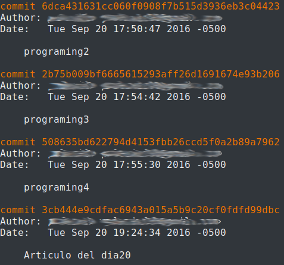
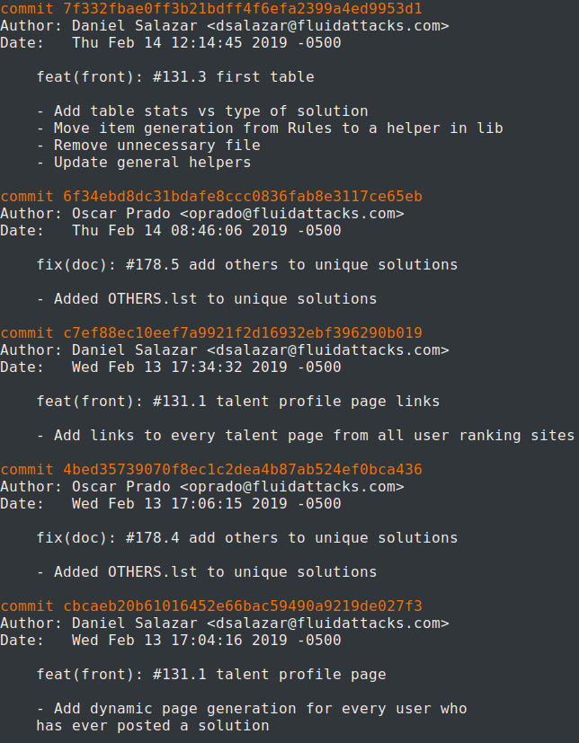
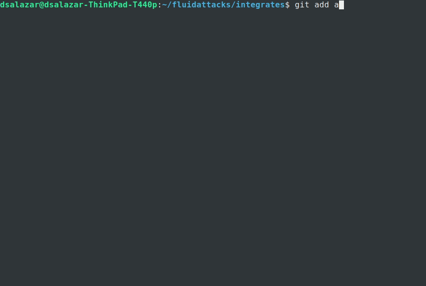
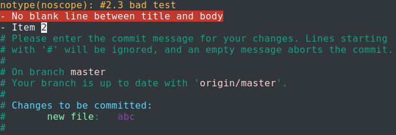
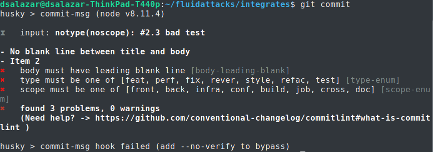
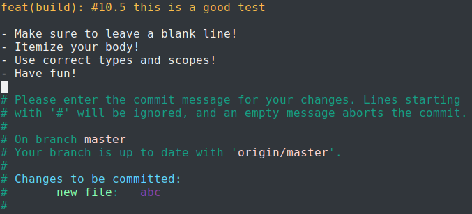
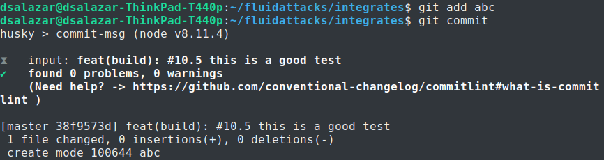

:slug: git-next-lvl/
:date: 2019-02-28
:subtitle: Why tech companies need a Git commit message syntax
:category: documentation
:tags: git, software, documentation, standard, engineering, business, linters
:image: cover.png
:alt: Git On Steroids
:description: Learn why it is important and how to define a Git commit message syntax and use real-time commit message linters to improve your Git history, reduce documentation and set the foundations to implement Data Analytics processes in your Git repositories.
:keywords: Git, Standardization, Commitlint, Data Analytics, Efective Logging, Documentation
:author: Daniel Salazar
:writer: dsalazaratfluid
:name: Daniel Salazar
:about1: Software Engineer
:about2: “An intellectual says a simple thing in a hard way. An artist says a hard thing in a simple way.” Charles Bukowski

= Taking Git to the next level

There is a universal law
that anyone in the tech world should know:
If you ask a programmer to do something,
he/she will do it their way.

Even though creativity, abstract thinking,
and putting your signature in your source code
is a link:https://venturebeat.com/2013/10/19/841449/[fundamental]
part of programming,
sometimes it also becomes a barrier
when it comes to maintainability,
readability and usability
due to lack of code standardization.

Many efforts to help programmers to
implement best practices in their code have been made,
being Python's link:https://www.python.org/dev/peps/pep-0008/#introduction[PEP 8]
and Ruby's link:https://github.com/github/rubocop-github/blob/master/STYLEGUIDE.md[Rubocop Style Guide]
some of the most popular examples.
link:https://develoger.com/linting-is-parenting-878b2470836a[Linting tools]
are also of the essence for this task,
as they provide a dynamic way for programmers
to check if their code is
following all the established conventions.

So far, it seems like the standardization problems can be easily solved
and never again a bunch of crazy programmers
will make a mess out of something.

.It's all good
image::thumb-up.gif["Rambo"]

But wait a minute... Is there any other activity
involving a creative process
that programmers frequently do?
Oh yes, we have link:https://git-scm.com/[Git] commit messages.

== Most Git repositories have messy logs

Thanks to the link:../../services/continuous-hacking/[+Continuous Hacking+]
service we offer at +Fluid Attacks+,
we get to see +Git+ repositories
from different organizations in several countries.
A vast majority of these repositories have messy logs.

Such problem can be easily explained:
Teams do not stick to a specific standard
when it comes to commit messages
and general +Git+ logging.
Programmers just fill out their commit messages
the way they personally think it is best.

You may say:
____
Ok, logs may be a little messy,
but should I really care that much about them?
____

The short answer is: Yes, you definitely should.

For the long answer,
I am first going to number
the cons of having
messy +Git+ logs.

=== Cons

. *Logs fail to accomplish their purpose:*
+
Usually, due to vague or incomplete commit messages,
a commit message log can only be understood
by the one who wrote it (just like it happens with source code),
thus making the log useless.

. *Reverting becomes a headache:*
+
If there is not a clear history of your repo,
reverting to a previous version given the need
will always be painful, as you will have
to decipher such history in order to know
to what point you want to go back.

. *Knowing who did what becomes harder:*
+
Good commit messages express,
from a high level perspective, what changes were made.
Not-so-good commit messages usually have two or three words
and do not actually tell the reader what was changed,
forcing him/her to look at the source code.

Lastly, let me bring it down to a specific example
of how a +Git+ repository history looks
when programmers do whatever they want:

.Bad Git Log

Notice how these commit messages
do not communicate anything regarding
the changes that were made,
they're basically trash logs.

=== Pros

Other than solving all the cons mentioned above,
there are two extra pros:

. *Data Analytics for the repo becomes possible:*
+
When you have one hundred developers
working simultaneously on a repository,
you definitely want to know things like:
+
  * What percentage of time do they spend fixing bugs?
  * What percentage of the programmers focus on creating new features?
  * What are the main causes of reverts in the repo?
+
And an endless number of questions
whose answers might be incredibly useful
for both business insights
and development performance/quality
improving within the company.
By having a defined commit message syntax,
such answers can be found by using link:https://www.techopedia.com/definition/26418/data-analytics[Data Analytics]
techniques

. *Logs (partially) become your documentation:*
+
By standardizing commit messages,
you will no longer have to create huge documentation manuals
explaining all the details of how a product internally works.
Each file within the repo will have its related history
with detailed information
about how it currently works and worked in the past.
Some documentation will probably still be needed
(user documentation, for example),
but we have witnessed how the amount of documentation required dramatically
diminishes thanks to good logs.

After setting a standard syntax for commit messages,
your repo history will start to look like this:

.Good Git Log

I want you to notice the three most important details to begin with:

. Titles include keywords like +feat+, +front+, +fix+, +doc+...
These tags will be essential for the Data Analytics efforts,
as they will allow link:../crash-course-machine-learning/[algorithms]
to know what the purpose of the commit was.
. Body section is usually itemized, with every item describing
relevant changes made in the commit.
. An issue (#N.N) is always referenced
with the purpose of
understanding what the programmer was
trying to do with the commit.
This is useful for version control services
with issue trackers like link:https://gitlab.com/[Gitlab],
link:https://github.com/[Github], etc.

== Implementing a commit message Syntax

If by this point you are convinced
about the importance of having a standard commit message syntax,
and are interested in implementing it,
make sure to keep reading,
as I will show the syntax we use,
the tools that support it,
and the benefits we get from it.

In +Fluid Attacks+ we use the link:https://docs.google.com/document/d/1QrDFcIiPjSLDn3EL15IJygNPiHORgU1_OOAqWjiDU5Y/edit[Angular JS Commit Message Conventions]
syntax with a few modifications
inspired by our specific needs.

=== Syntax

The syntax is as follows:
----
[type]([scope]): #[issue-number]{.issue-part} [title] // This is the commit title
               // This blank line separates the commit title from the commit body
[body]         // This is the commit body. It CAN have multiple lines
----
Where:

* *[variable]* are *required* variables
that must be replaced in a final commit message
(**[]** symbols must be removed).
* *\{variable\}* are *optional* variables
that must be replaced or removed
in a final commit message (**{}** symbols must be removed).
* *// Comment* are comments that must be removed in a final commit message.

In the following sections I will explain
in detail what this syntax can help us achieve.

=== Types

Types offer a high level perspective of the commit purpose.
They are explicitly defined in a closed list
that covers most (if not all) possible scenarios.

In the syntax, the *[type]* variable has to be one of the following:
----
rever  // Revert to a previous commit in history
feat   // New feature
perf   // Improves performance
fix    // Bug fix
refac  // Neither fixes a bug or adds a feature
test   // Adding missing tests or correcting existing tests
style  // Do not affect the meaning of the code (formatting, etc)
----

Notice how types are short words
that can be easily read by anyone,
but also represent keywords
that can be processed by a machine.

=== Scopes

Scopes provide specific detail
about what part of the repository/system
was modified in the commit.
Just like types,
they are explicitly defined in a closed list.

In the syntax, the *[scope]* variable has to be one of the following:
----
front  // Front-End change
back   // Back-End change
infra  // Infrastructure change
conf   // Configuration files change
build  // Build system, CI, compilers, etc (scons, webpack...)
job    // asynchronous or schedule tasks (backups, maintenance...)
cross  // Mix of two or more scopes
doc    // Documentation only changes
----

Notice how scopes, just like types,
are also human-readable and machine-readable.

=== Other important rules

Articles like link:https://chris.beams.io/posts/git-commit/[this one]
and learning on the fly helped us to define other rules
for improving general commit message quality:

. A *Commit title* must exist.

. A *Commit title* must *not* contain
the '*:*' character aside from the one specified in the syntax.

. A *Commit title* must have 50 characters or less.

. A *Commit title* must be lower case.

. A *Commit title* must not finish with a dot '*.*'.

. A *Commit title* must reference an issue.

. A *Commit title* must be meaningful.
Avoid using things like ``feat(build): #5.1 feature``.

. A *blank line* between commit title and commit body must exist.

. A *commit body* must exist.

. Lines in *commit body* must be 72 characters or less.

. Try to itemize your *commit body*.

. Do *not* use the word '*part*' for splitting commits for a single issue.
Use *#[issue-number]{.issue-part}* instead as specified in the syntax.

== Make syntax usage a reality

You may be thinking:

____
Ok, we just defined a huge commit message syntax with a ton of rules.
But, how are we actually going to make
programmers follow it in a pragmatic way?
____

Enter the savior: link:https://conventional-changelog.github.io/commitlint/#/[Commitlint].

+Commitlint+ is an incredible tool
that can check all the syntax we just defined.
Not only it runs all the checks instantly,
but it works as a
link:https://git-scm.com/book/uz/v2/Customizing-Git-Git-Hooks[Git hook],
which means that it runs all the checks
right after a programmer runs a *git commit* command
on his/her local machine.
It is even capable of *failing* the commit attempt
if the commit message the programmer just provided
happens to be non-syntax-compliant.

=== Proof of concept

We won't be setting up +Commitlint+ for this specific syntax
as it would make the article too technical.
Nevertheless, I will show you how it currently works
in one of our repos:

==== Bad commit message

.Failed commit

The commit we entered was:

.Bad Commit message

The +Commitlint+ output was:

.Failed Commitlint output

Notice how +Commitlint+ dynamically tells the programmer
what specific rules
his/her commit message is not following,
making the fix process a lot easier.
The commit attempt was also stopped by +Commitlint+,
as it doesn't allow commits to pass unless
their message is syntax compliant.

==== Good commit message

.Passed commit
image::passed-commit.gif["Passed commit"]

The commit we entered was:

.Good Commit message

The +Commitlint+ output was:

.Passed Commitlint output

Notice how +Commitlint+ tells the programmer
that all checks passed
and proceeds to accept the commit.

== Conclusion

In this article we've covered
from the importance of +Git+ logs
to what benefits we can obtain
by standardizing our commit message syntax
and implementing tools for checks like +Commitlint+.
That was it! Have a good one!
