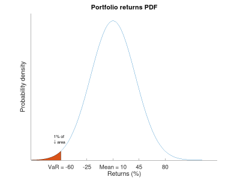
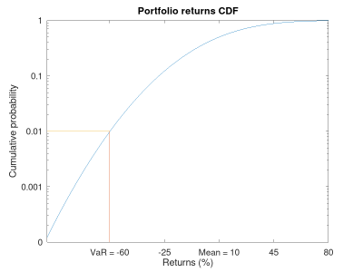

:slug: para-bellum/
:date: 2019-03-26
:subtitle: Prepare for the worst risk
:category: philosophy
:tags: business, security, risk
:image: cover.png
:alt: Fire extinguisher. Photo by Tommaso Pecchioli on Unsplash: https://unsplash.com/photos/XG_wi3W4-m8
:description: Value at Risk (VaR) is a measure of the risk of loss in the context of uncertainty, v.g., for investment. It is the upper bound for loss in a period of time with a certain degree of confidence, usually 99%, so we know that in that percent of the scenarios, loss will not exceed the VaR.
:keywords: Risk, Probability, Impact, Measure, Quantify, Security
:author: Rafael Ballestas
:writer: raballestasr
:name: Rafael Ballestas
:about1: Mathematician
:about2: with an itch for CS
:source-highlighter: pygments

= Para bellum

"_Si vis pacem, para bellum_", goes the old adage.
If you want peace, prepare for war.
In our case, the worst possible risky scenario
our information assets could go into.
While probability distributions,
loss exceedance curves,
simulated scenarios, etc,
are all great for the quants in the office,
at the end of the day big, important decisions
need to be supported by single numbers
that can be easily compared to one another.
In risk management, this number is
the _Value at Risk_ or +VaR+.
Fortunately, once you have one you have the other,
and also their close cousins,
which are also useful.

Value at risk measures the mentioned worst-case scenario
by telling us beyond how much our losses
will most likely _not_ go,
up to a certain degree of confidence,
in a definite period of time
(as we have stressed throughout this blog,
all measurements need to be time-framed to make sense).
Thus a daily 1% `VaR` of $10 million means
that the probability that you will lose more than
ten million is 1%, which is the same as saying
that you are 99% confident that the losses
will not exceed $10 million.

So we need to define over what time period
our `VaR` will be taken and, more importantly,
what confidence we want or, rather,
how extreme the worst-case scenario we want to analyze.
Typical periods in the industry are
a single day or week, but they can be anything,
as long as your risky investment lasts.
Since we are interested in extreme cases,
confidence levels of 95% or 99%,
which correspond to the extreme 5% and 1% cases
are not uncommon.

There are at least three workable ways
to compute the value at risk:

. Examining the distribution of the returns.
. Simulation using historical values.
. Using the loss exceedance curve.

We will focus on the first,
because it illustrates the `VaR` definition,
and the last, because it is more compatible
with what we have done so far,
since our research on risk has mostly
revolved around computing the distribution of loss
due to cybersecurity events, i.e.,
the loss exceedance curve.
As a bonus, this will be the easiest method.

The link:https://www.investopedia.com/terms/n/normaldistribution.asp[normal distribution]
is perhaps the most popular one
for modeling real-word situations and natural phenomena, and with
link:https://www.thoughtco.com/importance-of-the-central-limit-theorem-3126556[good reason].
It could be used,
for example, to model the final value of a given portfolio
over a one-year period.
Suppose the mean return is 10%,
with a standard deviation, i.e., volatility, of 30%.
Thus the final value of the portfolio
can be modeled by a normal random variable
with mean 110 and standard deviation of 30:

// for maintainability
// x = [0:1:210];
// y = normpdf(x,110,30);
// plot(x,y)
// xlabel('Final portfolio value')
// ylabel('Probability density')
// title('Portfolio value pdf')
// h = [0:1:40];
// y = normpdf(h,110,30);
// hold on
// area(h,y)
// xticks([40.2,70,110,140,170,200])
// xticklabels({'VaR','70','110','140','170','200'})
// yticks([])
// text(20,0.002,0,{'1% of area','\downarrow'})
// xlim([0 210])
// hold off
.Normal distribution of value

Knowing the probability distribution,
which tells us probabilities of point values,
we can find probabilities of ranges
with the corresponding _cumulative_ distribution function or `CDF`
(which is nothing but the integral of the density, i.e., adding them up):

// figure()
// cdf = normcdf(x,110,30)
// semilogy(x, cdf)
// xlim([0 210])
// ylim([1e-4,1])
// hold on
// xlabel('Final portfolio value')
// ylabel('Cumulative probability')
// xticks([40.2,70,110,140,170,200])
// xticklabels({'VaR','70','110','140','170','200'})
// line([40.2,40.2],[eps,0.01])
// line([eps,40.2],[0.01,0.01])
// yticks([1e-4,0.001,0.01,0.1,1])
// yticklabels({'0','0.001','0.01','0.1','1'})
// title('CDF')
// hold off
.Cumulative distribution function of value

Notice how this is similar to
the loss exceedance curve,
only vertically reflected.
In a cumulative probability plot
the `VaR` is just the x-value
corresponding to the probability we need.
In this case it's just the x-value for 1% probability,
as shown in the graph.

We can use a simple
link:https://www.libreoffice.org/discover/calc/[spreadsheet],
which is a tool we all probably already have,
to put this model to work.
In this case we will use the
link:https://help.libreoffice.org/Calc/Statistical_Functions_Part_Four#NORM.DIST[+NORM.DIST+] function
since the distribution is normal.
If we want to know the probability that the loss
will be less than, say, 20%,
i.e., the final value will be 80%,
we can compute

----
=NORM.DIST(80,110,30,1)
0.158655253931457
----

i.e., around 15.8%.
The 110 and 30 above are the distribution parameters,
and the 80 is of course the value whose probability we need.
The 1 means to make the computations cumulative
(as opposed to 0 which just calculates the density function)s
i.e., to find the probability that
the loss will be less than or equal to 80.

We can also use the inverse function so that,
given a probability,
we get the point at which this probabilty is attained.
It is the same process as above, but backwards.

At what point is the 1% probability?
More exactly, for which value _V_
is it true that the probability that
the final value is less than or equal to _V_ is 1%?
That's just the 1% `VaR`:

----
=NORM.INV(0.01,110,30)
40.2095637787748
----

This is also the 1% link:https://en.wikipedia.org/wiki/Quantile[_quantile_],
or the first _percentile_ of the distribution,
the point under which
the remaining 1% of points are,
weighing by the probability.
Since this is the distribution for the final value
(remember we added 100 before, so we must subtract again),
the _Value at Risk_ in this example will be
100 - 40.2 = 50.8% of what we invested.
Had we invested $100 million,
then we know the +VaR+ is $50.8,
and hence that the losses will not exceed that amount
in 99% of the cases, only in that rare 1%.
Notice that the +VaR+,
being a single figure,
does not tell us exactly or otherwise
what the losses might be in that catastrophic 1%.
But if we are ready to lose that much,
we are halfway prepared for the metaphoric war.

The _tail_ (or _conditional_) value at risk,
or `TVaR` (`CVaR`) for short,
tries to fill that void by giving us
the expected value or mean
in the catastrophe region, i.e.,
in case of a `VaR` breach.
Much like the actual mean of a distribution
is a center of gravity of sorts,
where we could "hold" the `PDF` in balance,
besides being the value with more repetitions
if we repeatedly draw numbers from such a distribution:

.Expected value of a link:../hit-miss/[beta distribution]. Via link:https://upload.wikimedia.org/wikipedia/commons/thumb/8/82/Beta_first_moment.svg/220px-Beta_first_moment.svg.png[Wikimedia].
image::beta-mean.png

The `TVaR` is thus the expected value of the loss,
given that the `VaR` has been surpassed.
In terms of the above analogy,
it is the center of gravity
of the "catastrophe" region of the distribution plot:

.Illustration of `VaR` and `TVaR`. Via link:http://www.nematrian.com/TailValueAtRisk[Nematrian].

In our case, since we are mainly interested
in cybersecurity risk, which we quantify
via [button]#link:../monetizing-vulnerabilities/[simulations]#,
we can always re-run them and
aggregate the results differently
in order to obtain the density function and
recreate the example above.
But given that the main result of our
simulations was a loss exceedance curve,
which already involves loss:

.Loss exceedance curve

We can just use this to obtain the +VaR+,
just like we did with the distribution `CDF`.
This graph is already cumulative,
so there is no need to compute areas under the curve
behind the scenes.
We simply obtain the value in millions corresponding
to the percentage of the scenario in which we are interested.
In this particular graph, the 5% yearly +VaR+
appears to be $500 million
(recall that this graph has a logarithmic scale in the x-axis).
The 1% is not even visible here,
but at least that tells us that it must be beyond $1000 million.

''''

So,  the Value at Risk tells us in a single number
what can happen with an investment or any risky situation
what the worst that might happen is,
and allows us to easily compare, for example,
two investments or cybersecurity policies.
However its greatest strength is also where it falls short.
This particular number,
while it gives an upper bound for the losses,
is also unable to tell us anything else
about what happens in that 1% of the cases.

== References

. [[r1]] S. Benninga and Z. Wiener (1998). _Value-at-Risk (+VaR+)_.
link:http://simonbenninga.com/wiener/MiER74.pdf[Mathematica in Education and Research 7(4)]

. [[r2]] N. Pearson (2002).
_Risk Budgeting: portfolio problem solving with value-at-risk_.
link:https://www.goodreads.com/book/show/1274693.Risk_Budgeting[Wiley].
