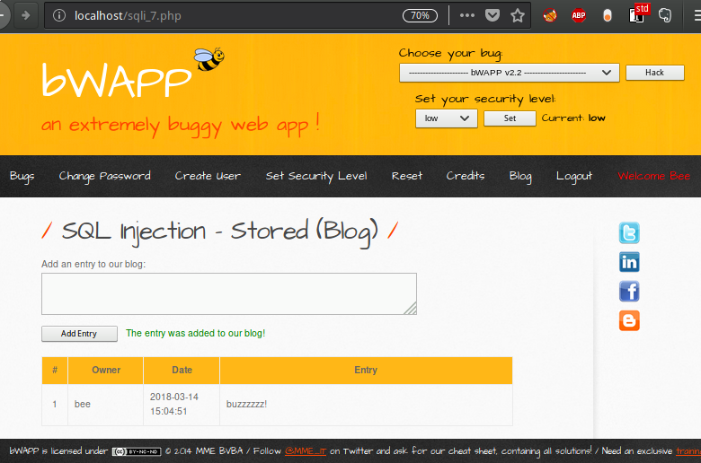
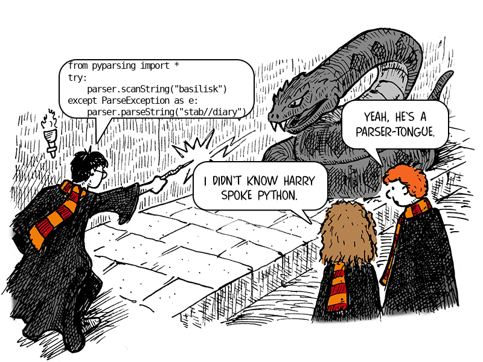

:slug: pars-orationis-secura/
:date: 2018-03-22
:subtitle: Using parsers to detect code flaws
:category: techniques
:tags: detect, injection, scanner
:image: cover.png
:alt: Python proofreading a document
:description: How to use Python and pyparsing to parse application code in order to find SQL injections in bWAPP. A SQL injection is defined as a SQL query with concatenations to PHP variables or function calls. The parser detects most of the SQL injections despite its limitations, and no false positives.
:keywords: testing, detection, parser, python, injection, bwapp
:author: Rafael Ballestas
:writer: raballestasr
:name: Rafael Ballestas
:about1: Mathematician
:about2: with an itch for CS
:source-highlighter: pygments

= Pars orationis non est secura

We like
link:http://itsecgames.com/[+bWAPP+]
around here,
because it's 'very buggy!'.
We have shown here how to find and exploit
vulnerabilities like
link:../fuzzy-bugs-online/#comparison-with-manual-injection/[+SQL+]
link:../protect-organization-hacker-lamer/#[injection],
link:../gherkin-steroids/#dynamic-detection-and-exploitation/[directory traversal],
link:../xml-exploitable-markup-language/#injecting-xpath-into-a-vulnerable-app/[+XPath+ injection],
and
link:../app-pickle-document-gherkin/#documenting-attack-vectors/[+UNIX+ command injection].
All of these have one thing in common, namely:
they could have been prevented with a little
link:https://www.owasp.org/index.php/Data_Validation[Input Validation].
In +PHP+ this could have been done
with functions such as +fgetss+,
link:../app-pickle-document-gherkin/[+str_replace+] or
link:../gherkin-steroids/[+strpos+].

Taking some ideas from
link:../stand-shoulders-giants/[static code analysis]
and the
link:../oracle-code/['code-as-data']
approach,
what if we could use
some sort of
code or syntax analysis tool
in order to gain intelligence about
where an apps's weaknesseses lie?
That's what 'parsers' are for.

== Manual detection

Let us consider, for example,
this site in our favourite buggy web app:

.Adding an entry to the ``blog.''

Every time we load the page,
the current entries in the blog are
+SELECTed+ from a +MySQL+ database.

The page itself is pretty simple:
a header, menu, sidebar and footer
which are pretty much uniform across the site,
with the real stuff inside a +
+ of its own.
The source code for such a page is like this:

.Adapted from +bWAPP+. Braces and loads of lines removed.
[source,php,numbered]
----
include::/web/content/blog-en/pars-orationis-secura/redux-sqli-7.php[]
----

Of course, we're mainly interested in
the +PHP+ and +HTML+ mixed in the
+
+,
which is just what we cropped here,
because that's where the +SQL+ is.
Looking at a few more sources,
we see we always exploit the same weakness:

An +SQL+ query is made up by 'concatenating'
literal values, php function calls and
php variables like +$entry+ above.
That variable comes
from a +POST+ request and
passed through the sanitizing function +sqli+.
After concatenating and building the query,
it is sent to the database for processing.

Thus we could type

[source,sql]
----
a','b'; drop table blog;--
----

into the entry field
to turn the query into
a dangerous, blog-deleting one.

In order to succesfully identify these +SQL+ injections,
we need to look for strings which contain +SQL+ code,
and also use the +PHP+ concatenation (+first . last+).
That's not enough,
because we also need to relate the concatenated variable
with the input or parameter where we are going to place
the malicious +SQL+ code.

To hunt +SQL+ injections in +bWAPP+,
our tool of choice will be a set of 'parsers',
i.e., a piece of software used to scan a string
or file to look for parts that conform
to a specific set of rules.

== Specifying the targets

Before going into parsing and grammar issues,
let us first reflect about what we want to find.
We want to detect pieces of text in the code that
conform to the syntax of
an +SQL+ +SELECT+ or +INSERT+ statement.
But also they must have concatenations, because
a simple statement like

[source,sql]
----
SELECT * FROM blog;
----

is perfectly safe.
Where could we possibly inject anything?

So we need +SELECT+ or +INSERT+ with concatenations.
Also, we want our tool to be able to identify

* which variable is at risk,

* where and how it is defined,

* whether or not it is protected by some function, and

* everything else we can find out about it, really.

The +INSERT+ syntax, according to
link:https://dev.mysql.com/doc/refman/5.7/en/insert.html[+MySQL+],
goes as follows:

[source,sql]
----
INSERT [LOW_PRIORITY | DELAYED | HIGH_PRIORITY] [IGNORE]
    [INTO] tbl_name
    [PARTITION (partition_name [, partition_name] ...)]
    [(col_name [, col_name] ...)]
    {VALUES | VALUE} (value_list) [, (value_list)] ...
    [ON DUPLICATE KEY UPDATE assignment_list]
----

This works as an excuse for us to introduce the
link:https://en.wikipedia.org/wiki/Backus%E2%80%93Naur_form#Example['Backus-Naur form']
(+BNF+) language syntax notation.
Essentially, inside square brackets is +[optional]+,
the pipe stands for ``or'' and
inside curly braces means +{mandatory}+ and
+...+ means optionally repeat.

For our purposes, the +INSERT+ statement has this form:

[source,sql]
----
INSERT INTO tbl_name [column-names] VALUES (value-list)
----

We'll use subparsers to define
what each of these elements mean.
For example +tbl_name+ is any +SQL+ identifier,
which can consist of alphanumeric symbols and underscores (+_+).
And +value-list+ is either a single value or
a comma-separated list of values.

But what is a value?
That's where things get interesting.
Consider this rich example:

[source,sql]
----
INSERT INTO table VALUES ('1', NOW(), '" . $var1 . "','" . clean($var2, 1) . "'
----

A value can thus be:

* a fixed number or string,

* a +MySQL+ function like +NOW()+,

* a concatenation of a string or number obtained from

** a +PHP+ variable (+$var1+) or

** a +PHP+ function (+clean()+), which may also take arguments.

This is where parsers shine and
the alternative approach,
link:https://en.wikipedia.org/wiki/Regular_expression[regular expressions],
fail.
Imagine trying to write a +regex+ to match
such an +INSERT+ with concatenations.
It would be humongous, not to mention
very hard to understand.
Other disavantages of regular expressions are
that they have to deal with white space explicitly and
are hard to maintain when
there are any changes to the language syntax.
As the famous saying goes:

[quote,Jamie Zawinski]
Some people, when confronted with a problem,
think "I know, I'll use regular expressions."
Now they have two problems.

== Learning the 'parsertongue'

Now that we've opted out of regular expressions,
we have to choose a parser.
Apparently, the standard for a time
used to be the combination of
link:http://dinosaur.compilertools.net/[+lex+ and +yacc+],
which was pretty complicated.
Nowadays we have two solid choices:
link:http://www.antlr.org/[+ANTLR+] for the +Java+ people,
and link:http://pyparsing.wikispaces.com/[+pyparsing+] for us.

.You don't need to be a wizard to use +pyparsing+!

Some nice features about +pyparsing+:

* uses a simple syntax that makes the grammar transparent

* fits well in your +Python+ code,

* uses standard class constructs and
plain language instead of cryptic odd symbols.

* is tolerant to change and
easy to adapt to different input or targets to match,

* includes a few nice helper functions,
like parsing actions
(v.g. convert a string of digits to an actual integer)

In +pyparsing+,
the outermost parser for the +INSERT+ above translates to:

[source,python]
----
sql_insert = CaselessKeyword("INSERT INTO") + sql_identifier + Optional(column_names)
       + CaselessKeyword("VALUES") + values
----

The functions in +SentenceCase+ are built into +pyparsing+,
and their names are pretty self-explanatory.
The `+` operator is overloaded to mean "followed by" and is
insensitive to white space.
The +snake_case+ identifiers are just identifiers and
we have to define them:

[source,python]
----
sql_identifier = Word(alphanums + "_")
values = Group( Literal("(") + delimitedList(value) + Literal(")") ).setResultsName("values")
----

Take +Word+ to mean any combination of the given characters.
Thus +sql_identifier+ is just a combination of
alphanumeric characters and the underscore.
+values+ is just a delimited list of values,
enclosed in parentheses.
We +Group+ that list into a single entity
so that we may refer to it by name later.

+PHP+ identifiers are like +SQL+ names,
but *must* start with the symbol +$+.
We also define function calls:

[source,python]
----
php_identifier = Combine( Literal("$") + sql_identifier ).setResultsName("php identifier")
php_funcall = Combine( sql_identifier + Literal("(") +
             + Optional(delimitedList(php_identifier)) + Literal(")") )
----

Unlike +Group+,
+Combine+ squashes all matched tokens into one.
We do that because
we don't really care about
every single part of a function call,
only the +php_identifiers+ inside,
and we can access that
by the name with which we
baptised +PHP+ identifiers above.
Note that,
although +sql_identifiers+ don't belong here logically,
they have the same syntax as function names and
the tails of identifiers,
so we might as well reuse that parser.

Finally, we get to the heart of the matter:
a +value+ to be inserted is either
a literal word or number,
the result of a function,
or a 'dangerous concatenation':

[source,python]
----
value = varchar ^ php_funcall ^ danger_concat
danger = ( ... + (php_identifier ^ php_funcall) + ... ).setResultsName("danger identifier")
----

Here +^+ is the logical connector +or+, and
we've omitted a bunch of +Literal+ parsers
for all the quotes and dots.
By the way,
notice that all these named parts
of our big parser
are parsers themselves,
and we can use them on their own.

One way to use a parser
is the +parseString+ method.
This will return the structure of tokens,
if it is a match, or
throw a +ParseException+ if not.

----
>>> print(test_values)
('1', now(), '" . $var1 "')
>>> result = values.parseString(test_values)
>>> print(result)
[['1', 'now()', '$var', '3']]
>>> print(result["values"]["danger identifier"])
['$var']
>>> print(values.parseString("not a list of values")
...
pyparsing.ParseException: Expected "(" (at char 0), (line:1, col:1)
----

Notice how we refer to
the list of returned values as +result["values"]+,
and from that we can get the identifiers
which take part in the dangerous concatenation.

The function +scanString+ looks
for substrings that match the grammar.
Quite useful. It also tells you
where the substring was found.
We use it to tell the user the line and column
where the potential +SQL+ injection was found:

[source,python,numbered]
----
for tokens, start, end in sql_injection.scanString(content):
    sqli_line = line(start, content)
    print("In file {0}, line {1}, col {2}:\n{3:^}"
          .format(path.split("/")[-1], lineno(start,content),
          col(start,content), sqli_line.strip() ))
----

These are just some of
the +pyparsing+ built-in helper functions
mentioned earlier:
+scanString+ returns an iterator which
gives +tokens+, just like +parseString()+,
but also starting and ending 'characters'.
To convert them to 'line' and 'column' numbers,
we use the functions +lineno()+ and +colno()+,
respectively.

Thus far, this is nothing out of this world:
nothing we couldn't have done with +grep+ or +Python+\'s +re+.
Where parsers actually beat regular expressions is
in extracting information and structure from the input,
as we did above to identify the inserted values
and from those, which are the variables where we can inject +SQL+.
For that, sadly,
we need to parse again because we don't know beforehand
whether the inserted value is a function call or a +PHP+ identifier:

[source,python]
----
injectable_variables = tokens["values"]
for injectable_variable in injectable_variables:
    res = (php_identifier ^ php_funcall).parseString(injectable_variable)
    injectable_variable = res["phpvar"]
    print(" Injectable variable {0}. Other ocurrences:".format(injectable_variable))
----

Remember we need to
detect lines with +SQL+ queries that
contain dangerously concatenated variables,
but also 'where' those variables
are taken from user input and
whether they are protected.
But since we already have the ``injectable variable''
as a regular +string+,
we can create 'yet another' parser on-the-fly
to find the lines where that variable is mentioned.
This one is simple:

[source,python,numbered]
----
tpar = Literal(injectable_variable)
for tokens, start, end in tpar.scanString(content):
    print("  L{0:<3} {1}".format(lineno(start2, content),
                                 line(start2,content).strip()))
----

At any point,
if a +ParseException+ or +KeyError+ is thrown,
that just means a +parseString+ failed,
or we tried to access an element that wasn't previously parsed.
In plain language,
it means that particular query was not really dangerous.

Finally, we run this code
for every +PHP+ file in the +bWAPP+ server root.
The output we get is very long
(see the link:results.txt[full report])
Here is part of it:

----
In file sqli_4.php, line 131, col 17:
$sql = "SELECT * FROM movies WHERE title = '" . sqli($title) . "'";
 Injectable variable $title. Other ocurrences:
  L129 $title = $_REQUEST["title"];
  L131 $sql = "SELECT * FROM movies WHERE title = '" . sqli($title) . "'";
Found 1 SQL injection in bWAPP/sqli_4.php.
...
In file sqli_1.php, line 143, col 13:
$sql = "SELECT * FROM movies WHERE title LIKE '%" . sqli($title) . "%'";
 Injectable variable $title. Other ocurrences:
  L141 $title = $_GET["title"];
  L143 $sql = "SELECT * FROM movies WHERE title LIKE '%" . sqli($title) . "%'";
Found 1 SQL injection in bWAPP/sqli_1.php.
...
In file xss_stored_1.php, line 253, col 31:
$sql = "SELECT * FROM blog WHERE owner = '" . $_SESSION["login"] . "'";
 No dangerous concatenations in this query.
...
Total SQL injections found: 56
----

Boy, that's a load of +SQL+ injections!
However, we do not expect every single one
of these matches to be an actual +SQL+ injection ('false positives')
and maybe some files contain effective +SQL+ injections
have 'escaped' our scrutiny.

In the +bugs.txt+ file,
+bWAPP+ classifies 18 bugs as +SQL+ injection
in 22 files whose names start with +sqli_+.
Out of those,
our parser found 0 +SQL+ queries in 3 files,
some non-dangerous queries in 8 files,
which gives an approximate 'yield' of 85%.

Some of those +SQL+ injections were not found
because of self-imposed limitations on the parser.
For example,
one of those queries uses the +?+ +SQL+ wildcard,
which we did not consider.
Another is called +SQL injection - Drupal+,
which (1) refers to a +../drupal+ folder
that our copy of +bWAPP+ lacks because
(2) this bug is +bee-box+ only.

However, considering that we found 56 (!)
dangerous concatenations in queries,
out of 18 expected, that's not too bad.
Even counting all bugs listed as ``injections'',
which are 41, our report is still a good number.

Of course, there are bound to be some false positives.
However, given the parser design,
and checking the script output,
we see that only really dangerous concatenations are reported.
Some of those might be protected by good
input sanitizers like +mysqli_real_escape_string+,
but none is bullet-proof.

Thus we might say,
with a statistically sound 95% confidence,
that our +pyparsing+ parser reports

[quote]
zero false positives.

== References

* McGuire, Paul (2008). 'Getting started with pyparsing'. O'Reilly shortcuts.

== Appendix: Full SQLi parser

Download link:code and test cases.+
Run from the root of the tested +PHP+ server.

.+sqli_parser.py+
[source,python,numbered]
----
include::/web/content/blog-en/pars-orationis-secura/sqli-parser.py[]
----
