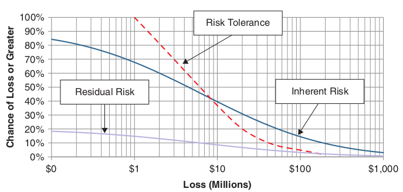
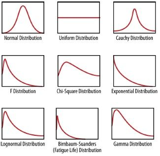

:slug: quantifying-risk/
:date: 2019-02-19
:subtitle: From color scales to probabilites and dollars
:category: attacks
:tags: business, ethical hacking, risk
:image: cover.png
:alt: Risky poker move. Credits: https://unsplash.com/photos/5jkCyS8HOCY
:description: A survey of probabilistic methods that can be applied to quantify cybersecurity risk in terms of probabilities, confidence intervals, dollars and cents. We discuss why we believe these methods do not apply, and the kind of results that can be achieved by using them.
:keywords: Risk, Probability, Impact, Measure, Quantify, Security
:author: Rafael Ballestas
:writer: raballestasr
:name: Rafael Ballestas
:about1: Mathematician
:about2: with an itch for CS
:source-highlighter: pygments

= Quantifying risk

One of the least understood parts of a vulnerability
is the _risk_ it poses to the target.
On the tester side, we tend to confuse them with
the _threat_, the _attack vector_ and the _actor_.
On the client side, it tends to get confused with impact
and ocurrence likelihood,
due to devices like the so-called ``risk matrix'',
which are supposed to help us
better understand risks:

.Risk ``matrices''. Via link:https://safestart.com/news/think-about-risk-adds-third-dimension-risk-matrix/[Safestart].
image::risk-matrix.png[Risk matrix]

While in other sectors like insurance and banking
risk is measured quantitatively and
thus converted into dollars and cents,
we are content with leaving the treatment
of security vulnerabilities, basically, to chance,
by using these inaccurate scales for scoring risk.

But better methods exist in
link:https://en.wikipedia.org/wiki/Actuarial_science[actuarial science],
statistics, link:https://en.wikipedia.org/wiki/Game_theory[game theory]
and link:https://en.wikipedia.org/wiki/Decision_theory[decision theory],
and they can be applied to measure cybersecurity risk

Among the main reasons why
these methods are not widely accepted in the field are:

  * Security breaches are rare,
    so we can't possibly have enough data to analyze.
    It wouldn't be ``statistically significant''.

  * We do not see how we can measure risk, or even
    understand what measuring is nor
    what it is that we want to measure, nor how.

Before going into ground definitions,
let me show you what we can achieve
by following the methods proposed by the authors:

.Loss Excedance Curve <<r1, ^[1]^>>

This curve tells you the probability of losing any amount of money or more.
You can enrich it with your _risk tolerance_
(what is the probability that you can accept to lose _n_ millions?)
and the _residual risk_ shows
how the risk is mitigated by applying some controls.
With this kind of tools you can make
more informed decisions regarding your security investments.
If such a level of detail interests you, please read on.

== Measuring requires specification

First we need to define _what_ we want to measure.
Is it posible to measure the impact of a breach
on my company's reputation?
Is reputation even measurable?
What makes some things measurable and others not?
Well, we need to be able to assign a number to it.
But also no measurement can represent reality or nature with 100% accuracy,
so there must be some uncertainty in measurement.

In the lab, the length of an ant
could be reported as 1.2 cm plus or minus 0.1 cm,
which yields an _interval_:
the real size of the ant is somewhere between 1.1 and 1.3 cm.
There might also be some error due to
random mistakes or improper use of the measuring device,
so we can assign a _confidence_ of, say, 90%, to this measurement.
Observations reduce the uncertainty in a quantitative way.
First we might have estimated the length of the ant
to be between say, 0.5 and 3 centimeters, with 60% confidence.
After measurement we have less uncertainty.

Now, what we think is intangible or unmeasurable
could actually be measured.
Continuing with the reputation example,
this might be measured indirectly by the drop in sales,
or by the costs incurred in trying to repair the reputation damage.
Another possibility for measuring could be
_decomposing_ the problem into smaller ones.
For example instead of trying to
directly estimate the cost of a security breach,
you might break it up into affectation to
confidentiality, integrity and availability.
How many records could be stolen or wrongfully modified?
What is each of them worth?
For how long could our servers be out of service?
How much money would be lost per hour?

Furthermore, events like the ones in security
need to be time-framed.
It doesn't make much sense to ask
"how likely is it that our organization suffers a major data breach?"
because, given unlimited time and resources,
it is almost certain to happen.
Plus, we probably don't care if it were to happen eons from now,
when mankind might not even exist.
We need to set a reasonable time frame, like a year.
Once we achieve a result such as

* There is a 40% chance of suffering a succesful denial of service
  lasting more than 8 hours in the next year.

* If such a denial of service happens,
  there is a 90% chance the loss will be between $2 and $5 million.

We could indirectly compute what might happen in 2 or any number of years.

Finally there is the issue of not having enough data to
perform measurements or estimations, or rather,
thinking we don't have enough data.
That is not the case or,
if it were, then the established qualitative methods
like assigning arbitrary names on a scale of 1 to 5,
are just as inappropriate or more,
actually introducing noise or error.
The most illuminating example of how small data is usable is
the so-called "Rule of Five".
If you want to estimate the median of a (large, unkown) population,
taking a sample of 5 can already give you a 93.75% confidence interval.
How? The median is 93.75% likely to fall between the maximum
and the minimum of your tiny sample.

Why? Consider the opposite event:
the median is not between the maximum and mininum of the sample.
That means that either all are above the median or all below.
Now the probability of one element being above the median is,
by definition, 50%, because it splits the data in two,
so the probability of all 5 being above
would be 0.5^5^ = 3.125%,
by multiplying the 5 indepent event's probabilties.
Same for the case that they are all below.
So the probability of the opposite event is twice that: 6.25%,
making the probability of the original event 93.75%.

== Subjective probability

The ultimate goal will be
to perform a simulation of random events, also known as
link:https://www.investopedia.com/terms/m/montecarlosimulation.asp[Monte Carlo simulations].
This type of simulation runs many times on single events,
and their happening or not happening is based on a
link:https://www.investopedia.com/terms/p/probabilitydistribution.asp[probability distribution],
and such distributions require parameters as input.
In the case of the normal and lognormal distributions,
the parameters determine the location and width of the curve,
and thus thefir 90% confidence intervals:

.Some probability distributions

These parameters are to be estimated by experts,
just like they estimate risk on a scale from 1 to 5.
Just as imprecise, perhaps, but the math performed
with the distributions obtained from these parameters
sort of rights the wrong in the initial guess.
Actually, subjective probability estimation can be calibrated to
a point where it can be done consistently and accurately.

Even if the estimates are completely wrong,
the good thing is that they can be further refined by
a simple rule from basic probability theory:
link:https://towardsdatascience.com/what-is-bayes-rule-bb6598d8a2fd[Bayes rule].
It involves the prior probabilities (i.e., our estimates or initial beliefs)
and the posterior probabilities,
the ones computed after observing a certain evidence.

Without going into details,
which we will leave for the next articles,
it can be shown that, from five expert inputs,
including that the probability of a succesful
[button]#link:../importance-pentesting/[penetration test]#,
and the probability of remotely exploitable vulnerabilities
when the pentest is positive, that in that case the
probability of suffering a major data breach can go
from a prior of 1.24% goes up to a resounding 24%.
If the test is negative, it goes down to 1.01%.
This shows, by the way, the value of a proper pen test
regarding the value of perfect information.

Later we will also discuss two methods presented in the book,
both based on Bayes rule, namely,
iteratively adjusting a beta distribution,
which allows to make forecast with very scarce data, and
decomposing probabilities with many conditions.

''''

This article merely pretended to be an introduction to
the whole slew of methods that exist in other fields
to estimate risk, uncertainty and the unknown,
but have not been adopted in the field of cybersecurity.
In upcoming articles we will try to show in a little more detail
how a selection of these methods work.

== References

. [[r1]] D. Hubbard, R. Seiersen (2016).
_How to measure anything in cibersecurity risk_.
link:https://www.howtomeasureanything.com/[Wiley].
