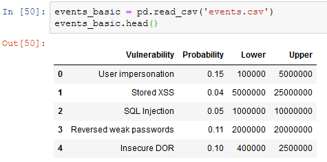
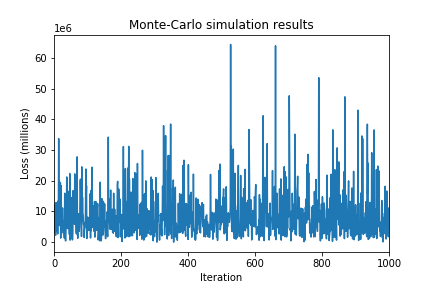
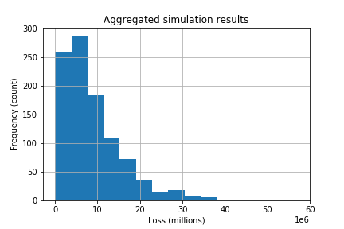
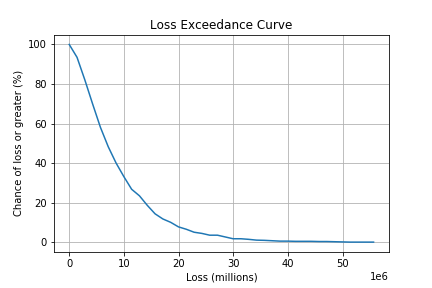

:slug: quantitative-python/
:date: 2019-04-09
:subtitle: Risk management with Python
:category: philosophy
:tags: business, security, risk
:image: cover.png
:alt: Finance simulation. Photo by M. B. M. on Unsplash: https://unsplash.com/photos/ZzOa5G8hSPI
:description: How to implement the previously discussed risk management tools and concepts such as the loss exceedance curve and value-at-risk in Python using the numerical and data analysis ecosystem consisting of Numpy, Pandas, Matplotlib and the Jupyter notebook.
:keywords: Risk, Probability, Impact, Measure, Quantify, Security
:author: Rafael Ballestas
:writer: raballestasr
:name: Rafael Ballestas
:about1: Mathematician
:about2: with an itch for CS
:source-highlighter: pygments

= Quantitative Python

Now that we have an understanding of  link:../quantifying-risk[risk concepts]
such as the link:monetizing-vulnerabilities[loss exceedance curve],
link:../para-bellum[value-at-risk], link:../updating-belief/[Bayes Rule],
and link:../hit-miss/[fitting distributions],
we would like to have a realiable, extensible and preferably open tool
to perform these computations.
In the background, we have used a spreadsheet, which is hard to extend.
We have used link:https://gnu.org/software/octave/[GNU Octave],
which is good, but not a proper programming language.
Our favorite language at Fluid Attacks, `Python`,
has modules for
link:https://docs.python.org/3/library/statistics.html[statistics],
link:https://www.scipy.org/[scientific computation] and even
link:https://pypi.org/project/finance/[finance] itself.
Let's take it for a spin around this risky neighborhood.

`Python` has a whole ecosystem
for numerical computing (v.g. link:www.numpy.org[`Numpy`]) and
data analysis (link:http://pandas.pydata.org/[`Pandas`])
and is well on its way to becoming a standard in
link:https://www.linuxjournal.com/content/jupyter-future-open-science[Open Science].
Being a free and open source tool,
there are also many derived projects which make life easier
when coding, such as the link:https://jupyter.org/[`Jupyter` Notebook],
which allows us to selectively run code snippets,
much like in commercial packages such as
link:https://mathworks.com/products/matlab[`Matlab`] and
link:http://www.wolfram.com/mathematica/[`Mathematica`].
This enables and encourages, at least, initial exploration,
although it might not be the best fit for developing more involved code.

Let us see how we can automate the generation of a loss exceedance curve
via Monte Carlo simulation.
Here we will closely follow our
link:../monetizing-vulnerabilities/[article on the subject],
so as not to duplicate information.
In that article, we wanted to find a distribution for losses
based on expert estimations of occurrence likelihood
and confidence intervals for the impact:

.Table with input data
image::../monetizing-vulnerabilities/loss-risks-table.png[Table with input data]

So we need to read those values in our script.
Since this is tabular information of the kind that would be
useful to view, say, in a spreadsheet,
it will be convenient to read this into a `Pandas` dataframe:

.Importing pandas and reading data
[source,python]
----
import pandas as pd
events = pd.read_csv('events.csv')
events.head()
----

.Data as imported into Jupyter.

We declare an event happens if a number
taken at random is beyond a certain threshold,
given by the second column in the table above:

[source,python]
----
def event_happens(occurrence_probability):
    return np.random.rand() < occurrence_probability
----

If and when the event happens,
we next need to know the extent of the loss
due to this single event.
Recall that we modeled this with a lognormal variable,
whose parameters we got from the estimated confidence interval:

[source,python]
----
def lognormal_event_result(lower, upper):
    mean = (np.log(upper) + np.log(lower))/2.0
    stdv = (np.log(upper) - np.log(lower))/3.29
    return np.random.lognormal(mean, stdv)
----

All of the events in the above table
can happen in a single year,
so to simulate a scenario,
we need to find out, for each of them,
if they happen, and how much money they will cost us.
Finally, we add all the losses and
return that single number as a summary of the losses in a simulated year:

[source,python]
----
def simulate_scenario():
    total_loss = 0
    for _, event in events.iterrows():
        if event_happens(event['Probability']):
            total_loss += lognormal_event_result(event['Lower'], event['Upper'])
    return total_loss
----

Now, the crucial step in Monte-Carlo simulation
is to simulate many scenarios and record those results.
Let us write a function that does just this,
returning the results in a basic `Python` list,
which we could later turn,
if we so wished,
into a `Pandas` or `Numpy`-native structure
for statistical analysis.
The function takes as input the number of times
we want to simulate scenarios:

[source,python]
----
def monte_carlo(rounds):
    list_losses = []
    for i in range(rounds):
        loss_result = simulate_scenario()
        list_losses.append(loss_result)
    return list_losses
----

Just to get a feeling for the results,
let us plot them, that is,
the result of each simulated year,
in the order in which they were obtained.
As foretold, we could convert the results
into a `Pandas` `DataSeries`, if anything,
to illustrate how they work.
We also need to import link:https://matplotlib.org/[`Matplotlib`]
for visualization:

[source,python]
----
import matplotlib.pyplot as plt
results = monte_carlo(100)
results_series = pd.Series(results)
results_series.plot()
----

.Raw Monte-Carlo results

It can be observed that the vast majority of them
are in the fringe between 0 and 15 million.
However, these results are not as useful as they could be
until we aggregate them, v.g., in a histogram.
`Pandas` also provides a shorthand for this:

[source,python]
----
results_series.hist()
----

.Histogram of results

We're getting closer to the loss exceedance curve, but not there yet.
Recall that the loss exceedance curve gives,
for every value in dollars,
the probability that the loss will be greater than or equal to that value.
Since we don't have, and can't possibly have,
a real probability distribution, i.e., a mathematical function,
but only an approximation to one in the form of a table,
we estimate probabilities simply by counting occurrences.
Hence the "probability", or estimation thereof,
of a single value, is the number of times that value appeared in the simulation.
So let us take evenly spaced values,
and count the number of times each of those values is _exceeded_ (or matched).
The `numpy` function `cumsum` does just that,
except in the opposite order:
it adds the values seen up to a moment.
So if we take the intervals and the counts separately,
revert the counts list and then do `cumsum` on it,
we get what we need, in reverse order.
To fix that we simply revert again:

[source,python]
----
import numpy as np

result_nparray = np.array(results_list)
hist, edges = np.histogram(results_nparray, bins = 20)
cumrev = np.cumsum(hist[::-1])[::-1]
plt.plot(edges[:-1], cumrev)
----

And voilá, we get our loss exceedance curve as we sought:

.Simple loss exceedance curve

Now obtaining the 5% value at risk is simply a matter
of asking for the fifth percentile of
the "distribution", i.e., the actual simulation results,
in its `Numpy`-array incarnation:

[source,python]
----
>>> np.percentile(arr, 5)
942174840.5763189
----

Hence the `VaR`, according to this particular simulation
is a little more than $942 million.

''''

Let this article serve merely as a taste of
what can be done using data analysis tools
in the numerical `Python` ecosystem.
There are plenty of modules specifically for finance
and Monte Carlo simulations.
Imagine what those could do for your organization
in regards to risk management.
Stay tuned for more of risk-applied `Python`.

== References

. [[r1]] C. Davidson-Pilon (2019).
link:https://nbviewer.jupyter.org/github/CamDavidsonPilon/Probabilistic-Programming-and-Bayesian-Methods-for-Hackers/blob/master/Chapter1_Introduction/Ch1_Introduction_PyMC3.ipynb[_Probabilistic Programming and Bayesian Methods for Hackers._]

. [[r2]] C. Motiff (2019).
link:https://pbpython.com/monte-carlo.html[_Monte Carlo Simulation with Python_]

. [[r3]] B. Mikulski (2018).
link:https://mikulskibartosz.name/monte-carlo-simulation-in-python-d63f0cfcdf6f[_Monte Carlo simulation in Python_]
