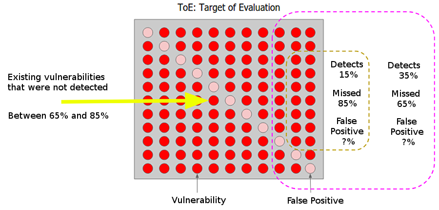

:slug: replaced-by-machines/
:date: 2018-02-13
:category: opinions
:tags: application, detect, vulnerability, scanner
:Image: humano-vs-maquina.png
:alt: Person playing chess against a robotic arm
:description: Vulnerability detection at the hands of an automated tool is not enough to reach the conclusion that an app is secure. The knowledge and experience of a person are still necessary to compliment the analysis and achieve an effective and detailed evaluation of the security of said application.
:keywords: vulnerability detection, manual detection, automatic detection, security, web application
:author: Andres Cuberos
:writer: cuberos
:name: Andrés Cuberos Lopera
:about1: Electronic Engineer
:about2: Enjoy the small things in life like a good beer, music and sleep

= Will We Be Replaced By Machines?

More than 20 years have passed
since Garry Kasparov, the chess world champion,
was defeated by +Deep Blue+, the supercomputer designed by +IBM+.
For many people that event was proof that
machines had managed to exceed human intelligence <<r1,^[1]^>>.
This believe raised many doubts and concerns
regarding technological advance
that went all the way from workers worried about their job
to believes that the apocalypse was coming, incentivated by +Hollywood+,
and machines would conquer and suppress our world.

Leaving all fiction aside
The first concern was well grounded and made some sense.
Each year we witness new machines out in the market
with the ability to complete a task with precision and speed
and capable of outdoing tenths of experienced workers.
By machine we are not talking about a robot
with the appearance of a young Arnold Schwarzenegger and sunglasses.
It could be any device programmed
to complete a specific task.

Cars that drive themselves,
robotic arms that minimize costs and increase the efficiency of a process,
and talking about information security,
tools that can detect errors and vulnerabilities in a web app.
What can we, information security specialist, expect from all of this?
Are we becoming more and more expendable?

.The inevitable outcome that +Hollywood+ shows us

Fortunately our future is not that bad.
Even though there are many powerful automated tools
for vulnerability detection in web applications,
the human role is still vital
if a detailed and effective security analysis is desired.
There are still situations in which we have the advantage:

* Tools can have knowledge of many vulnerabilities,
know how to find them and what risk level they imply.
However, they do not have that human factor and malice that comes with experience,
that instinct that allows a security analyst
to identify what vulnerabilities can be combined
in order to create a more critical attack vector.
Malice can allow a person
to find vulnerabilities a machine may overlook.

* Yes, analyzers generate a report with all their findings
and criticality but, how complete is said report?
It tells you how many input fields are affected by a vulnerability but,
does it tell you which of those inputs allow for extraction of sensitive data?
Does it tell you how to take advantage of a form in order to modify the database?
Sadly, the answer is not, automated tools only
determine the existence of a flaw
the "how"  that flaw can be exploited and leveraged
to an attackers favour in order to affect a particular business scenario
is strictly a human ability, acquired thanks to the malice we previously mentioned.

* False positives, perhaps an analyzer´s greatest flaw,
report the finding of a vulnerability that,
in reality, does not exist <<r2,^[2]^>>.
A very common problem among these tools,
that is the result of the inability to exploit a certain flaw.
A tool that does not properly filter out false positives
can bring more damage than benefits.
If it was used to avoid the cost
of hiring a security professional,
you know have X vulnerabilities reported.
Out of those X, you have no idea which ones are false positives.
The task of filtering those out now falls on the developer,
someone who does not necessarily dominate the topic of security.

Was the remedy worse than the illness?
+
False positives
are also one of the reasons for which these tools
are not very commonly used in Continuous Integration environments.
If we program an integrator to check
every change done in a source code,
and stop the deployment of the app if an error is encountered,
false positives could make the deployment of an app
a pain in the behind.

* +Netsparker+ (the developer of one of these tools),
agrees with this position <<r3,^[3]^>>,
there does not exist an analyzer capable of detecting
all vulnerabilities classified as critical in the following document
link:https://www.owasp.org/index.php/Top_10-2017_Top_10[Top 10]
He reaches the conclusion that an analyzer
can not determine if an application is working as it is intended,
if it is aligned with the companies objectives,
if the sensitive information (which can vary depending on the type of business)
is being properly protected,
if the users´ privileges are being properly assigned,
and many more cases where human reasoning must make a decision.

Our goal is not to take merit away from these tools,
we use many of them in our professional lives
and they are very strong allies.
What we want is to correct the mistaken believe
that they are sufficient in order to decide
if a web app is secure or not.

To do this, we developed our own experiment.
We used the insecure web application +bWAPP+
and the automated analyzers +W3af+, +Wapiti+ y +OWASP ZAP+.
These all share a common characteristic of being
+Open Source+ and can be ran from a command line prompt.
Thanks to this, it is possible to use them in
a Continuous Integration environment.
+bWAPP+ has over 150 vulnerabilities,
for the experiment we assumed a total of 170,
based on the results of the company that developed the app
<<r4,^[4]^>>.
Let's see how we did:

[role="tb-row"]
.+bWAPP+ Vulnerability Analysis
[cols="^,^,^,^"]
|====
s| Tool s| Detected s| % Not Detected) s| Time

a|+W3af+ | 28 | 83.5% | 00:02:30

a|+Wapiti+ | 26 | 84.7% | 00:02:00

a|+ZAP-Short+ | 42 | 75.3% | 00:19:00

a|+ZAP-Full+ | 59 | 65.3% | 01:30:00
|====

In the previous information,
+ZAP-Short+ refers to the +ZAP+ tool
with only +XSS+ and +SQLi+ +plugins+ enabled.
+ZAP-Full+ refers to the same tool
with all of its +plugins+ enabled.
It is important to note that
the application authentication had to be disabled.
This was done in order to allow
the tools to work properly from a command line.
This fact not only takes away from the reality of the experiment
but also leaves a layer of the web app unanalyzed.

Another important detail is that
the analyzers were not aimed at the main site,
as a real test would have.
The target of the attack was a specific +bWAPP+ page
where links to all the other pages were listed.
This way a complete identification is achieved by the tool.
+bWAPP+ uses forms to reach all other pages,
which is why aiming the attack at the main page
would result in 0 sites of interest being found.
There are tools such as +Burp+ that solve this problem
through the evaluation of the forms <<r5,^[5]^>>,
but there are others that fail in the same situation
due to their inability to navigate to the main site.

To facilitate the analysis of the results,
let's take the best result (+ZAP-Full+) and
the worst one (+Wapiti+),
and we will compare them against the whole application,
let's see what coverage was achieved.

.Visual representation of the best and worst result from Table 1- +ZAP-Full+ y +Wapiti+

We can see, that even the best of the tools we used
left out over half of the vulnerabilities and,
the ones that were found, can contain false positives.
Also, it took an hour and a half
to finish the analysis,
time that is not appropriate for a Continuous Integration environment.

A developer who wishes to reduce costs
avoiding to hire a security analyst
and depended solely on the automated tools,
would remediate the vulnerabilities and acquire
a false sense of security.
He would ignore more than half of the flaws
that are present, just waiting to be found and exploited
by a malicious user.
This way, the resources that were saved during the development
will be spent, with interest, in the production stage.

== Conclusions

If, the rivalry between humans and machines has been present
for a long time now and will remain that way for a lot more.
However, it is not necessary to look at it
as a rivalry in all aspects.
In Information Security,
more than a rivalry,
a complimentary relation can exist, where the tool
helps the analyst achieve repetitive task faster
and the analyst adds his/her instinct and experience
to detect the most amount of vulnerabilities in an efficient manner.
Therefore giving a greater sense of security
and satisfaction to the web application developers.

Paraphrasing Garry Kasparov in his +TED+ talk <<r6,^[6]^>>,
where he uses a freestyle chess tournament as an example,
in which amateur players with three common machines,
defeat big names of the chess game and supercomputers,
the relationship between human and machine, through an effective process,
is the perfect recipe to achieve our biggest dreams.

.Alternative outcome to the human-machine relationship

== References

. [[r1]] link:https://theconversation.com/twenty-years-on-from-deep-blue-vs-kasparov-how-a-chess-match-started-the-big-data-revolution-76882[Twenty years on from Deep Blue vs Kasparov: how a chess match started the big data revolution]
. [[r2]] link:http://resources.infosecinstitute.com/automated-tools-vs-a-manual-approach/#gref[Automated Tools vs a Manual Approach]
. [[r3]] link:https://www.netsparker.com/blog/web-security/owasp-top-10-web-security-scanner/[An Automated Scanner That Finds All OWASP Top 10 Security Flaws, Really?]
. [[r4]] link:http://www.mmebvba.com/sites/default/files/downloads/bWAPP_sample_report.pdf[BWAPP OWASP TOP TEN 2013 SCAN REPORT SUMMARY]
. [[r5]] link:https://support.portswigger.net/customer/portal/questions/12285606-spidering-form-submission[Burp Pro - Spidering + Form Submission]
. [[r6]] link:https://www.ted.com/talks/garry_kasparov_don_t_fear_intelligent_machines_work_with_them[Dont't fear intelligent machines. Work with them - Garry Kasparov en TED]
