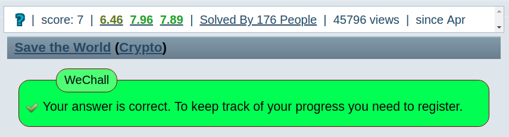

:slug: save-the-world/
:date: 2018-11-21
:category: attacks
:subtitle: How to solve Save the World from We Chall!
:tags: security, vulnerability, information
:image: cover.png
:alt: calling a super-hero
:description: Save the World is a cryptography challenge at We Chall. The objective is to break the asymmetric RSA algorithm from three intercepted messages and three public keys. Once one decrypt the message, an RSA symmetric key is revealed, and the government can intercept high-tech weapons from the enemy.
:keywords: RSA, Coppersmith's attack, Save the World, WeChall, WriteUp, Solution.
:author: Kevin Amado
:writer: kamadoatfluid
:name: Kevin Amado
:about1: Civil Engineer
:about2: "An algorithm must be seen to be believed" Donald Knuth

= Save the world!

First of all let's review the problem statement at
[button]#link:http://www.wechall.net/challenge/Z/save_the_world/index.php[WeChall]#

[quote, WeChall, Solve the World!]
____
It is year 2018, the world war III is upcoming between USA and China.
You are a secret agent working for the USA.
The USA Information Gathering Agency gathered three RSA enciphered messages.
All messages were originated from the same "clear text message",
which is a symmetric key [red]#m#.
With this symmetric key there is a document encrypted.
This document contains all the secret information about the newest high-tech
weapons made in China.
This document was symmetrically encrypted with the CSEA
(Chinese Super Encryption Algorythm).
This algorythm is almost unbreakable.

You know, that the chinese government used RSA to encrypt the symmetric key.
Your boss, general Eromzig bought a new supercomputer to factorize
the RSA public keys.
Scientists say they need 2 weeks to factorize one of the public keys.
That's why he hired you,
because he thinks you can break the RSA algorithm in 1 hour.
Your mission is to get the symmetric key in decimal format.

The solution is the last 20 digits of the symmetric key [red]#m#
____

The RSA encryption equation for a single message is:

|====
|C~i~ = pow(m, e~i~) (mod n~i~)
|====

Please note that [red]#pow(m, e)# denotes
link:https://en.wikipedia.org/wiki/Exponentiation[exponentiation]
of [red]#m# to the power of [red]#e#, and [red]#mod# denotes the
link:https://en.wikipedia.org/wiki/Remainder[euclidian division remainder]

The parameters that were used to encrypt the message are [red]#300# digits long
so they are shown here as [red]#n~i~# and [red]#c~i~# for simplicity:

.General Sun Tzu
|====
|first part of public key|n~1~
|second part of public key|e~1~ = 3
|encrypted message sent to him|c~1~
|====

.General Qin Jiushao
|====
|first part of public key|n~2~
|second part of public key|e~2~ = 3
|encrypted message sent to him|c~2~
|====

.General Ymenetn Gnauq
|====
|first part of public key|n~3~
|second part of public key|e~3~ = 3
|encrypted message sent to him|c~3~
|====

== Understanding the problem

Since all messages were generated from the same clear text message.
Then the main objective is to find a message [red]#m# that once encrypted yields
the message sent to each one of the receivers.

In mathematical language,
the problem is to find [red]#m# that simultaneously solves the equations:

|====
|C~1~ = pow(m, 3) (mod n~1~)
|C~2~ = pow(m, 3) (mod n~2~)
|C~3~ = pow(m, 3) (mod n~3~)
|====

One of the main characteristics of RSA,
is that it's a very strong algorithm,
but there are a lot of things one must be aware before implementing an RSA based
crypto system.
There is no secure RSA in three steps,
and we'll be exploiting the most known vulnerabilities in order to see which one
let us solve the challenge.

=== Low encryption exponent Attack

If we look again at the asymmetric RSA encryption equation, we see that it is
being normalized with respect to [red]#n~i~#:

|====
|C~i~ = pow(m, 3) (mod n~i~)
|====

If for some reason someone uses a low exponent (in this case 3),
the encryption process may exhibit the following behavior:

|====
|pow(m, 3) < n~i~
|====

If this is the case,
then the asymmetric encryption equation is reduced to:

|====
|C~i~ = pow(m, 3)
|====

And one can easily compute the message as:

|====
|m = cubic_root(C~i~)
|====

We can adapt this method to our problem

|====
|first compute:

m~1~ = cubic_root(C~1~)

m~2~ = cubic_root(C~2~)

m~3~ = cubic_root(C~3~)
|====

And if we get that the messages are the same for the three receivers:

|====
|m~1~ == m~2~ == m~3~
|====

Then we've solved the problem.

Let's write this in Python:

.Python code for a Low Encryption Exponent Attack
[source, python, linenums]
----
# define constants from problem statement here
# define a function to get the cubic root of a big number here

def test_lee_attack():
    print "test: assume pow(m, e) < n"
    m_1 = find_cube_root(C_1)
    m_2 = find_cube_root(C_2)
    m_3 = find_cube_root(C_3)
    if m_1 == m_2 == m_3:
        print "  it worked"
    else:
        print "  it didn't worked"

test_lee_attack()
----

But once we run it, we get:

[source, bash, linenums]
----
$ python test_lee_attack.py
  test: assume pow(m, e) < n
    it didn't worked
----

=== Coppersmith's Attack

. Suppose the receivers share the same first part of the exponent [red]#e#.
+
Generals Sun Tzu, Qin Jiushao, and Ymenetn Gnauq share the same first part of
the exponent ([red]#e = 3#).

. And suppose one sender sends the same message in encrypted form to [red]#e#
number of people:
+
We have [red]#e = 3#, and we have three encrypted messages received by the three
generals.

Then we can perform this kind of attack.

The process is the following:

Compute a constant [red]#C# that simultaneously satisfies:

|====
|C = C~1~ (mod N~1~)

C = C~2~ (mod N~2~)

C = C~3~ (mod N~3~)
|====

Any method is valid, but using the
link:https://en.wikipedia.org/wiki/Chinese_remainder_theorem[Chinese Remainder Theorem]
is particularly fast and handy,
because it's been already
link:https://rosettacode.org/wiki/Chinese_remainder_theorem#Python[implemented in Python].

Once we have computed [red]#C#,
then we can get the message by taking the [red]#e~th~# root of [red]#C#.
In this case, the cubic root.

Since the answer to the problem is the last 20 digits of [red]#m#
then we can take the remainder by [red]#1e20# as our solution:

.Python code for a Coppersmith's Attack
[source, python, linenums]
----
# define constants from problem statement here
# define a function to get the cubic root of a big number here

def test_copper_attack():
    vector_n = [N_1, N_2, N_3]
    vector_c = [C_1, C_2, C_3]
    value_C = chinese_remainder(vector_n, vector_c)
    value_M = find_cube_root(value_C)
    solution = value_M % 100000000000000000000
    print 'enter this on wechall: ' + str(solution)

test_copper_attack()
----

Once we run it we get:

[source, bash, linenums]
----
$ python test_copper_attack.py
  enter this on wechall: 21987654321987654321
----

=== Brute Force Attack

At this point we know the message in base ten:

|====
|9876543219876543219876543219876543219876543219876543219876543219876543219876543
2198765432198765432198765432198765432198765432198765432198765432198765432198765
4321987654321987654321987654321987654321987654321987654321987654321987654321
|====

Did you noticed that the message is "987654321" repeated 26 times?
Maybe we could have exploited this, however, who did know it?

This message have around 777 bits of length,
and proves that a [blue]#blind# brute force approach would have take,
as the statement says, weeks.

In fact, the strength of asymmetric RSA is
that nowadays you can't solve relatively fast (in
link:http://mathworld.wolfram.com/PolynomialTime.html[polynomial time]
) two mathematical problems:

* The
link:https://en.wikipedia.org/wiki/Integer_factorization[Integer Factorization Problem], and
* The
link:https://en.wikipedia.org/wiki/RSA_problem[RSA Problem].

Despite the mathematical background on RSA is pretty solid,
you should pay attention to the mathematical conditions
that make the algorithm solid,
otherwise you are risking what you encrypted.

As a conclusion to the attacks explained on this article,
don't send a message to people that share the same first part of the exponent,
nor use low values for them.
If you are to implement an RSA crypto-system,
tie yourself from the beginning to a cryptography standard like
link:https://en.wikipedia.org/wiki/PKCS[PKCS v2.0] or superior.
It introduces some random salt in the clear text
so messages are not equal for different receivers.

== Finally

Thanks for reading, see you in another post!

== References

. [[r1]] WeChall.
'Save the World challenge'.
link:http://www.wechall.net/challenge/Z/save_the_world/index.php[Web].
