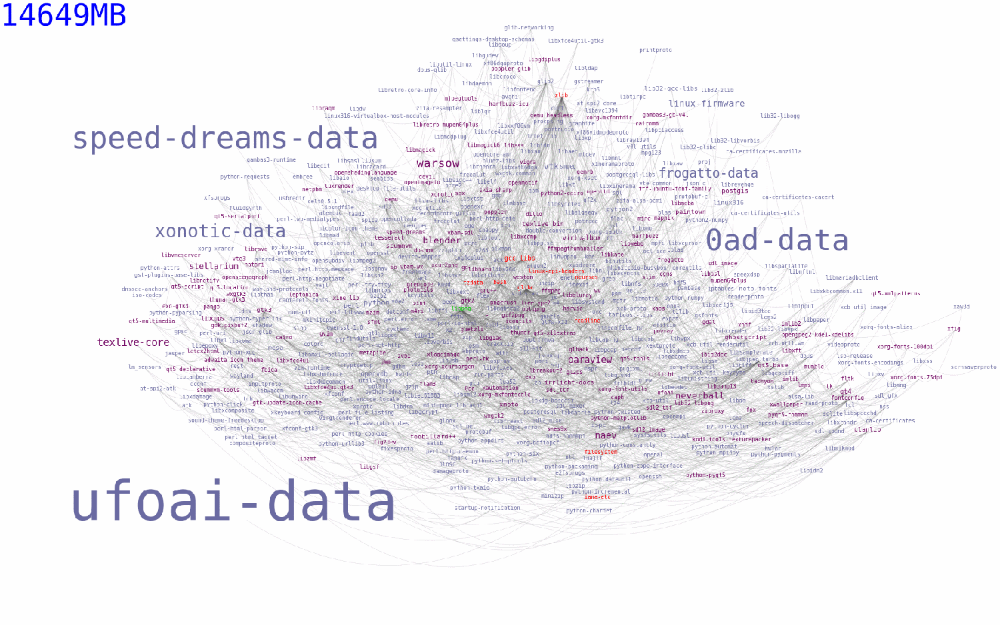

:slug: stand-shoulders-giants/
:date: 2018-02-14
:category: opinions
:tags: testing, dependency, vulnerability
:Image: cover.png
:alt: Orion carrying Cedalion
:description: A discussion of OWASP top 10 - A9: Using components with known vulnerabilities, in particular free and open software libraries. Comparison with the marketing buzzword Software Composition Analysis. A survey of free tools to do it yourself. Also an apology of free software in component analysis.
:keywords: software composition analysis, dependency, vulnerability, linux, attack
:author: Rafael Ballestas
:writer: raballestasr
:name: Rafael Ballestas
:about1: Mathematician
:about2: with an itch for CS

= Stand on the shoulders of giants

In our link:../infinite-monkey-fuzzer/[last post],
we reproduced the discovery of
a vulnerability in +libpng+.
But that is only a small library,
you might say,
with a very limited scope
and only +556 KiB+ installed.
However, many, many packages depend on it.
To see how many packages
in the Arch Linux repository depend on +libpng+
we can use +pacgraph+
by link:http://kmkeen.com/pacgraph/[Kylee Keen]:

.+libpng+ reverse dependencies in +Arch Linux+ (link:libpng-pacgraph.png[click] to view larger)

More than +14 GiB+ worth of software depend on +libpng+!
And that is only in the +Arch Linux+ repositories,
which is hardly the most popular +Linux+ distribution.
Also, the library is the official +PNG+ reference library and
is cross-platform,
so certainly many other packages in
other operating systems depend on it.

Now, back in 2015 when
+libpng+ had not yet fixed the low-high palette bug,
all the programs and libraries above
were also automatically vulnerable to the same issue.

If this could happen to such flagships as
link:https://www.gnu.org/software/bash/[+bash+],
link:https://www.qt.io/[+qt+],
link:https://services.math.duke.edu/computing/tex/latex.html[+TeX+]
and link:https://xfce.org/[+xfce+],
it could happen to your organisation.
In fact, this problem is so common that
it is part of the 2017 +OWASP+ Top 10:
they call it
``A9: Using components with known vulnerabilities''.

Given the rapid adoption of Free and Open Source Software (+FOSS+)
by large companies,
all of a sudden dependency vulnerability
appears to be one hell of a problem.
Or rather, as yuppies would like to point out,
a ``bussiness opportunity''?

Many providers of so-called
``software composition analysis''
(don't google it)
have since appeared in the security scene.
Some of them are backed by
long-standing companies,
most are not.

In fact this bussiness has gained such momentum,
that it is expected to grow more than 20% each year
from now to 2022,
according to link:https://www.prnewswire.com/news-releases/the-software-composition-analysis-market-is-expected-to-grow-from-usd-1540-million-in-2017-to-usd-3984-million-by-2022-at-a-compound-annual-growth-rate-cagr-of-209-300595028.html[PR Newswire].

Worse, it makes the +FOSS+
that all these company owe to,
look bad.
Yet its adoption is not slowing down and,
as we will try to elucidate here,
it's not its fault, but rather,
companies' and their advisors'.

Instead of going from
the alleged solution to the source of the problem,
let's do it backwards.

== The bad

Without going into many details,
let us use the following working definition of +FOSS+:
software that can be (and is) developed, used
by thousands around the world.

This can be a double-edged blade:
on the one hand, we have the so-called ``Linus' Law''
according to which bug-finding and patching
should be easier as more eyes are involved,
which makes perfect sense.

On the other hand, we have the fact
that humans make mistakes, and
the lack of a centralised guiding and reviewing
makes room for bugs.
A certain empirical study points out that
beyond nine developers actively working on a piece of software,
it is more likely to have vulnerabilities than
if it had fewer developers.<<r4, ^[4]^>>

At any rate, +FOSS+ 'does' have bugs,
there's no deying that, as do
other kinds of software.
If your company's applications depend on
proprietary software that has vulnerabilities,
you're just as vulnerable to them as well.

The difference with proprietary software is that,
because of the more restricted audience,
the lack of access to the code and their
testing procedures,
it is 'less likely' that their bugs
will become public as soon as they would be
on the freer side of things.

This is actually 'good':
if you rely on a piece of free software and
a vulnerability in it is found,
you will know as fast as is possible
and it will likely be fixed just as fast.

But... will you know?

The main reason why so many companies
are suffering from vulnerabilities inherited from
free and open source are:

* Ignorance of the dependencies in use.
* Ignorance of the vulnerabilities recently discovered in dependencies.
* No active, continuous scanning for vulnerabilities.
* Not testing for compatibility.
* Not securing those component's configurations.

In essence,
it all boils down to a lack of communication
between the user and the +FOSS+ community.
If you base your company's software on community-maintained libraries,
the least you can do is keep them up-to-date with the upstream.

== The good

So what can you do?
OWASP recommends
the following guidelines to prevent +A9+:<<r1, ^[1]^>>

* Trim the unnecessary dependencies, features, components etc.
That way you have less to check.
* Continuously monitor components for updates and vulnerability reports.
* Only obtain components from trusted sources.
* Make these guidelines into a real company policy,
so it is done frequently.

There are specific tools for this purpose:
they compare the version of the dependency you are using against both
remote repositories (to check for updates) and
vulnerability databases (like
link:https://cve.mitre.org/[CVE] and link:https://nvd.nist.gov/[NVD])
to find out if any of your dependencies has
reported vulnerabilitites that have not been fixed yet.

* For +JavaScript+ you can use link:https://github.com/retirejs/retire.js/[+retire.js+].
* +Java+ users have the link:http://www.mojohaus.org/versions-maven-plugin/[+Versions+] plugin for +Maven+.
* Also for +Java+ and +.NET+, you can use the
link:https://www.owasp.org/index.php/OWASP_Dependency_Check[+OWASP Dependency-Check+] tool.
* There's a link:https://github.com/stevespringett/dependency-check-sonar-plugin/tree/master/examples/single-module-maven[Dependency check] +SonarQube+ plugin.

As you see,
there is no shortage of +FOSS+ to
check for the alleged +FOSS+ flaws.

== The ugly

I know you did search for ``Software Composition Analysis''
when I suggested you not to.
I just know you did.
If you didn't,
good for you!
Here's what you're missing out on:

.``Software Composition Analysis'' providers.

All of these industry-leading, award-winning,
breakthrough-makers, oracles of the tech future
want to sell you one thing:
static code analysis
plus the tools we discussed above.

While static analysis is a valid tool,
it's just a tool.
It can scan code and detect vulnerabilities
and unhealthy practices,
but also encourages late detection
and produces a lot of false positives.

You could try hiring such a service, and maybe
even try to complement it with dynamic analysis tools
like link:..//infinite-monkey-fuzzer[fuzzing] and debuggers,
but those have their own issues.

But these are no replacement for good old-fashioned
human code review. At least at the moment.
According to <<r3 ,[3]>>,

[quote]
The only way to deal with
the risk of unknown vulnerabilities in libraries is
to have someone who understands security
analyze the source code.
Static analysis of libraries is best thought of as
providing hints where security vulnerabilities might be
located in the code,
not a replacement for experts.

In the future, we might see things like
distributed on-demand security testing and
machine learning algorithms<<r2 ,^[2]^>> using
support vector machines to
try to predict which commits
are likely to open vulnerabilities,
but in the meantime,
stick to the tried-and-true.

== References

. [[r1]] OWASP Top 10-2017. Using Components with Known Vulnerabilities. link:https://www.owasp.org/index.php/Top_10-2017_A9-Using_Components_with_Known_Vulnerabilities[Link].
. [[r2]] Millar, S. (2017). Vulnerability Detection in Open Source Software: The Cure and the Cause. Queen's University Belfast. Available link:https://pure.qub.ac.uk/portal/en/publications/vulnerability-detection-in-open-source-software-the-cure-and-the-cause(94ec148c-80e4-448e-a267-c9ffb992b285).html[here].
. [[r3]] Williams, J. and Dabirsiaghi, A. (2014). The Unfortunate Reality of Insecure Libraries. Aspect Security. Available link:https://www.contrastsecurity.com/the-unfortunate-reality-of-insecure-libraries[here].