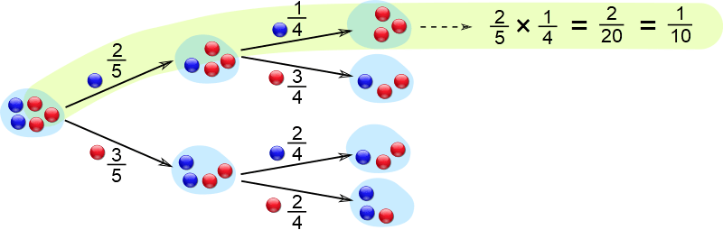

:slug: updating-belief/
:date: 2019-03-5
:subtitle: How Bayes Rule affects risk
:category: philosophy
:tags: business, ethical hacking, risk
:image: cover.png
:alt: New information. Photo by M. Parzuchowski on Unsplash: https://unsplash.com/photos/GikVY_KS9vQ
:description: How to use Bayes rule and basic probability theory to reduce uncertainty, refining initial estimates through evidence. An application to the information provided by a penetration test regarding the probability of having vulnerabilities and suffering its consequences.
:keywords: Risk, Probability, Impact, Measure, Quantify, Security
:author: Rafael Ballestas
:writer: raballestasr
:name: Rafael Ballestas
:about1: Mathematician
:about2: with an itch for CS
:source-highlighter: pygments

= Updating your beliefs

Usually, changing our beliefs is seen as a negative thing.
But when those beliefs represent our state of uncertainty
regarding a particular cybersecurity risk,
you'd better use all the tools at hand
to reduce that uncertainty, i.e., measuring.

Why do we speak of "belief" and not probability here?
Intuitively, when we have mentioned probabilities,
we're meaning some belief or measure of uncertainty.
For example, when giving a confidence interval,
we say we _believe_ the actual value is
between the boundaries of the interval,
up to a certain degree of confidence.
That's a belief.
When we simulate multiple scenarios in
link:../monetizing-vulnerabilities[Monte Carlo simulations]
and finally aggregate the results,
we're expressing that we believe
that the loss will be so many millions or larger.

In science, hypotheses are disproven trough appropriate evidence.
It should be observable and measurable.
Similarly, testing in general
--and link:../../[penetration testing] in particular--
can change our beliefs, that is,
our initially proposed or _prior_ probabilities,
based on our very own flavor of evidence.
The mathematical tool for updating these beliefs
is a simple one: Bayes Rule.
However, it does require us to discuss a
few basic probability theory facts.
If you're familiar with it,
feel free to skip the next section.

== Mathematical interlude

Let us consider a simple example for
illustrating the basic rules of probability:
we have a bag with 2 blue marbles and 3 red ones,
and we're going to draw marbles from the bag (without looking!)
and we want to find the probabilities of drawing each kind.
Let us call<<f1, ^[1]^>> R the event of picking a red marble
and B for blue ones.
Event B has probability P(B) = 2/5, and P\(R) = 3/5, in principle.

What if now we draw a second marble?
Now the probabilities are subject to the result
of the first draw.
For example, if we're given that the first marble picked was blue,
then the probability of drawing a red marble is now 3/4
since now there are only 4 balls altogether.
This is a _conditional_ probability;
it is the probability of event R subject given B happened,
denoted P(R|B).
This situation can be illustrated with a tree diagram like this:

// to be changed into native
.Probability tree diagram. Via link:https://www.mathsisfun.com/data/probability-events-conditional.html[MathsIsFun]

We can find the probability of a branch,
that is, of the succession of two events,
by multiplying the probabilities on the arrows,
as seen above.<<f2, ^[2]^>>
And we can add related branches to make up single events:
The probability of the third branch from top to bottom
is 30%, so if we add that to the previous result,
we get that the probability of the second marble being red is 40%.
This is an application of the _total probability theorem_.<<f3, ^[3]^>>

We know the conditional probabilities for the second ball given the first,
but what if they only show us the second one
and we had to guess what the first one was?
That's where Bayes Rule <<f4, ^[4]^>> comes in:

["latex","bayes-cause-evidence.png",align="center"]
----
\LARGE $$\rm P(cause\,|\,evidence) =
\frac{P(evidence\,|\,cause)\,P(cause)}{P(evidence)}$$
----

If we think of the first event as the cause
and the second one as the effect,
we can find the probability of the evidence by
using the conditional probabilities
as we did above, with the total probability theorem.
In this particular case,
let the "evidence" be that the second ball is blue,
so P(evidence) = 40%.
We know that the _a priori_ chance of
the first ball being red is 60%,
and the probability of observing the evidence
given the cause, i.e., P(B|R) = 50%.
Hence

["latex","first-given-second.png",align="center"]
----
\LARGE
$$\rm P(first\ marble\ red\,|\,second\ marble\ blue) =
\frac{0.5\times0.6}{0.4} = \frac{3}{4} = 75\,\%.$$
----

Notice how the extra piece of information,
namely that the second marble is blue,
narrows down the chance of the first marble being red
from the prior probability of 60% to 75%.
Hence the probability of the first being blue is
the remaining 25%.
So I would bet on the first one being red,
and I would give you 3 to 1 odds.

This is the power of Bayes Rule:
observable evidence,
whose likelihood generally depends on
the assumed probabilities of the causes,
can _update_ or _refine_ our estimates
on the likelihoods of the causes.

== So how does this apply to cyber risk?

Since Bayes Rule helps us reduce our uncertainty,
it works as a measurement technique.
While our initial estimates about an event
such as suffering a denial of service or data breach
may be way off,
we can still get a measurement with those bad estimates,
plus evidence, plus their probabilities.

Consider the following random events:

* V: there is a critical vulnerability leading to remote code execution,
* A: suffering a successful denial of service attack
  (in a reasonable time period v.g. a year)
* T: penetration test results are positive,
  indicating the possibility of critical vulnerabilities.

Normally, the chain of events here would be that
a positive pen test points to the existence of vulnerabilities,
and such a vulnerability might lead to the threat
(in this case, the denial of service) materializing.
Suppose that we know, from the false positive rate,
the probability of the existence of vulnerabilities
based on a positive and negative pen test, i.e.,
P(V|T) and P(V|&#126;T).
Here the ~ symbol denotes an event not happening.

Now, the existence of a vulnerability does not
necessarily imply that the organization _will_ suffer an attack
so we might estimate the probabilities of an attack
in the case vulnerabilities exist and in the case they don't.
Let P(A|V) = 25% and P(A|~V) = 1%.
This, together with P(T) = 1%,
the _a priori_ probability that a given penetration test
will yield positive results
(which we may estimate based on historical data),
is all we need to know in order to estimate the
posterior probabilities for V, A, and, in fact,
anything we might ask about this particular situation.

We might draw a tree diagram like this
to describe the situation:

["graphviz", "prob-tree-cyber.png"]
----
digraph probtree {
    rankdir=LR;
    size="8,5"

    n1 [label="", shape=none]
    ppt [label="T"]
    npt [label="~T"]

    exv [label="V"]
    nex [label="~V"]
    exv2 [label="V"]
    nex2 [label="~V"]

    dos [label="A"]
    ndo [label="~A"]
    dos2 [label="A"]
    ndo2 [label="~A"]
    dos3 [label="A"]
    ndo3 [label="~A"]
    dos4 [label="A"]
    ndo4 [label="~A"]

    n1 -> ppt [label="1%", fontcolor=blue]
    n1 -> npt
    ppt -> exv [label="95%", fontcolor=blue]
    ppt -> nex

    subgraph clusterpositive{
        exv -> dos [label="25%", fontcolor=blue]
        pabr1 [label="0.24%", shape=none]
        dos -> pabr1 [arrowhead = none, style=dotted]
        exv -> ndo
        nex -> dos2 [label="1%", fontcolor=blue]
        pabr2 [label="0.05%", shape=none]
        dos2 -> pabr2 [arrowhead = none, style=dotted]
        nex -> ndo2
        color = grey
        style = dashed
    }

    npt -> exv2 [label="0.05%", fontcolor=blue]
    npt -> nex2
    exv2 -> dos3 [label="25%", fontcolor=blue]
    pabr3 [label="0.01%", shape=none]
    dos3 -> pabr3 [arrowhead = none, style=dotted]
    exv2 -> ndo3
    nex2 -> ndo4
    nex2 -> dos4 [label="1%", fontcolor=blue]
    pabr4 [label="1.00%", shape=none]
    dos4 -> pabr4 [arrowhead = none, style=dotted]
}
----

Probabilities in blue are the given ones.
Since branching in a probability tree implies that
the involved probabilities are complementary, i.e.,
they add up to one.
So we can compute that P(\~V|~T) = 99.95%,
but we chose not to write them
in the above diagram to keep it tidy.

Recall that the probability of a single branch
is the product of the probabilities that lead to it
so that P(T~VA) = 0.01*0.05*0.01 = 0.05%
for the second branch.
The probability of suffering an attack would be
the sum of the probabilities of every branch that ends in A.
So P(A) = 1.3% without any additional information.

If the pen test is positive,
what is the probability of being attacked?
We could fiddle with formulas,
but it's easier to just look
at the subtree after the T,
the part of the tree that is framed above.
In that case, we have shorter branches ending in A:

["latex","attack-postest.png",align="center"]
----
\LARGE
$$\rm P(A\,|\,T) = 0.95\times0.25 + 0.05\times0.01 = 23.8\%.$$
----

What if it is negative?

["latex","attack-negtest.png",align="center"]
----
\LARGE
$$ \rm P(A) = 0.0005\times0.25 + 0.9995\times0.01 = 1.012\%.$$
----

Whatever its results,
penetration testing gives you more information
about the risk your organization is facing.
It is especially remarkable that the initial estimate
of 1.3% goes up by more than 18 times
when the test is positive.

Suppose a year passed,
and no denial of service attack happened.
Does that mean there are no vulnerabilities?
We know the probabilities of attack given the existence of vulnerabilities,
but not the other way around.
First, we find P(V) by total probability
(ignoring all the A nodes):#

["latex","prob-vuln.png",align="center"]
----
\LARGE
$$\rm P(V) = 0.01*0.95 + 0.99*0.0005 = 1.0\%$$
----

We already know that P(A) = 1.3%, so P(~A) = 98.7%.
Finally, by Bayes Rule:

["latex","cyber-bayes.png",align="center"]
----
\LARGE
$$\rm P(V\,|\,\sim A) = \frac{P(\sim A\,|\,V)\,P(V)}{P(\sim A)} = 0.76\,\%.$$
----

''''

This is yet another example of how we can measure risk,
even when our initial estimates are bad,
using basic probability theory facts and
through appropriate decomposition of the problem.
We can estimate the probabilities of events given certain assumed conditions,
put that together in a probability tree diagram and
use the tools learned in this article to generate the rest.

== References

. [[r1]] D. Hubbard, R. Seiersen (2016).
_How to measure anything in cibersecurity risk_.
link:https://www.howtomeasureanything.com/[Wiley].

== Technical details

. [[f1]] To be precise, the events should have different names
for each draw: R~1~ for drawing a red marble in the first draw
and R~2~ for the second. B's are not needed since they are just the
complement of R's.

. [[f2]] From the diagram, it is clear that
if we performed the experiment of drawing two
marbles (in succession, without replacing the first)
a hundred times, then
2/5 = 40% of the time the first drawn ball would be blue.
We may expect to observe that around 40 times out of the 100 trials.
_Out of those_ 40 times,
3/4=75% of the time the _next_ ball would be red.
We could expect to observe this event 30 times, i.e., 30% of the time.
Thus the probability of drawing a blue marble
followed by a red one is 30%.
Generalizing,
the probability of two independent events happening simultaneously is
the product of their probabilities
since what we did was multiplying the proportions,
2/5 times 3/4 which makes 3/10.
Thus P(X and Y) = P(X)P(Y), in general,
and in this particular case we have
P(B and R) = P(B)P(R|B).

. [[f3]] If two events are mutually exclusive, i.e.,
they have no results in common,
their probabilities may be added to obtain the probability of their union.
What is the probability that the second ball is blue?
That event is the union of the events RB and BB,
whose probabilities are, respectively, 30% and 10%,
so the probability that the second marble is blue is 40%.

. [[f4]] Since P(B and R) = P(B)P(R|B),
but also, due to symmetry,
we also have that
P(B and R) = P\(R)P(B|R),
then it is also true that
+
["latex","bayes-proof.png",align="center"]
----
\LARGE
$$\rm P(B)P(R\,|\,B) = P(R)P(B\,|\,R)$$
----
+
which we can use to switch the "condition" in "conditional probability".
So if we know the probability of an effect being observed
due to a cause,
we can find the probability that the cause actually happened
if we know the probability of the effect being observed,
and we get Bayes Rule as above.
