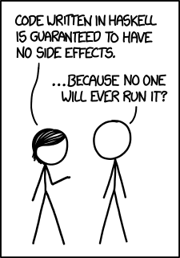

:slug: why-we-go-functional/
:date: 2018-07-23
:category: programming
:subtitle: Functional vs Imperative
:tags: application, functional, imperative, stateless
:image: cover.png
:alt: Rubber ducks depicting Karl Marx
:description: An analysis of why it is necessary to go functional even with non-functional languages. Benefits of functional programming. A comparison between the imperative and the functional. How to migrate from object-oriented to functional in a non-traumatic way.
:keywords: Functional paradigm, Object-oriented, Stateless, Multiparadigm application, Laziness, Programming revolution.
:author: Oswaldo Parada
:writer: oparada
:name: Oswaldo José Parada Cuadros
:about1: Mechanical Engineer
:about2: Family, friends and little details. There is the answer.

= Why we go functional?

In 1848, Karl Marx released into public opinion
a controversial document called The Communist Manifesto.
From then until today, for better or for worse,
this document has influenced societies.
If you have ever thought that the government is not doing its job well,
that they are draining your life on taxes
or that the state should not exist,
you should probably read the manifesto.
But my dear comrade, this article is not a communist declaration,
quite the opposite.
We just want to rescue an idea of the bearded Marx:
The state should not exist.<<r1 ,^[1]^>>

With the motivation of developing a programming revolution
(not a social one),
the functional paradigm has been strengthening in the communities of developers
and in the large technology companies.

.Your face until this point.

Maybe you are wondering what are we talking about? what is functional?.
Do not despair.
In a nutshell, functional programming aims to solve the question
What are you doing? instead of How are you doing?
proposed by object-oriented programming.
For this, functional programming has a special feature: it is stateless,
meaning that,
programs does not save or share information through data structures,
forcing functions to not modify that information.
Functions use inputs just to create new information in the output.
You can look at the following example
to understand the difference between functional and imperative:

.Javascript function for multiply 2 integers, imperative and functional approximation.
[source, javascript]
----
// Multiply function in an imperative way.
class Integer {
  constructor (number = 0) {
    this.number = number;
  }
  multiply (x) {
    this.number = this.number * x;
  }
}
const myInteger = new Integer (2);
myInteger.multiply (6);
console.log (myInteger.number); //12

// Multiply function in a functional way.

const multiply = a => b => a * b;
console.log (multiply (2) (6)); // 12

----

== More benefits, less problems.

The true benefits of functional programming
lies where imperative programming has flaws.
The first advantage is the possibility of using laziness,
which allows to delay the evaluation of an expression as much as possible,
usually until the result is strictly required.
This brings out another important benefit.
The functions cease to be “imperative”,
now the runtime has more control on what is executed and  at what moment,
so like electricity in a circuit,
it is always going to take the shortest route.

If throughout your life, you have programmed in C language,
you probably remember that for each variable,
you had to assign, through the +malloc+ function, the number of bytes
the variable would occupy in the computer memory.
This was a complete headache, it brings you down almost at the machine level.
The functional language seeks to separate the developer
from all these trivialities of execution
so he can concentrate completely on solving the problem.

Another important benefit is related to the correlation
between the mutable state and the tests:
more of the first requires mores of the latter.
The mutable state brings with it,
side effects that are generally unexpected,
leading in the need to create more tests to avoid surprises,
so we can infer that a functional code allows to generate fewer tests
to cover more functionalities.

.Main problem with imperative languages.
image::functional-joke.png["Student asking to teacher in classroom"]

== Why now?

The functional paradigm is not a new topic,
in fact, it has its origins in theories
about lambda functions and recursion developed in 1930.
In the 50’s, LISP was born,
the first language with functional characteristics,
since then,
many languages with similar characteristics
have emerged: Clojure, haskell, etc. <<r2 ,^[2]^>>
But why just in recent years is that this paradigm is resonating so much?.

The functional language was overshadowed
by the existence of object-oriented languages ​​such as Java,
which propose a greater facility to code for the general public.
During the 20th century,
functional languages ​​ran slower than object-oriented languages,
a problem related to the low capacity of the processors at that time.

.Probably the situation of all functional languages in the nineties.

Today, the hardware barrier was overcome.
The biggest motivation
to use functional is that currently the applications are too complex
and huge, with users flow that exceed millions per hour,
so deficient functions which do not allow flexibility,
concurrency and parallelism in their execution are no longer profitable.
Functional approximation brings us an immense scalability,
a fast maintenance and robust expressions with long useful life.

== Change your way of thinking instead of your code syntax!

Migrate from imperative to functional is not easy.
You can see and analyze thousands of lines of functional code
and still not understand, it is not because the syntax is more difficult,
it is because you just keep thinking in an imperative solution!.
Before you even start thinking about reading the documentation
of the functional module of your favourite programming language,
first stop going directly to apply a very specific implementation
for a particular problem,
better take the time to learn
where you can apply high level abstractions in your problem. <<r3 ,^[3]^>>
In this business is necessary to think outside the box,
categorize the problems in a different way,
seeing the common points of your implementation.

== Conclusions

In addition to discovering
that Karl Marx would have been a functional programming genius,
we now know that functional programming is not a matter of fashion,
it is a matter of survival:

[quote,Charles Darwin]
It is not the strongest of the species that survives,
nor the most intelligent that survives.
It is the one that is most adaptable to change.

Surely you are thinking that it is a lot of time analyzing and
less on the keyboard,
that you have the pressure of your boss on your shoulders,
that there are deadlines to be met,
however, think ahead, how much time your imperative code will start to rust?
Probably, you will have performance problem
thanks to the endless tangle of methods and classes,
code will eventually rot and end up being devoured by scavengers.
so, think ahead, go functional.

== References

. [[r1]] link:https://en.wikipedia.org/wiki/Marx%27s_theory_of_the_state[Marx's theory of the state]
. [[r2]] link:https://en.wikipedia.org/wiki/Functional_programming[Functional Programming]
. [[r3]] _Functional Thinking: paradigm over syntax_, Neal Ford, book, 2014
