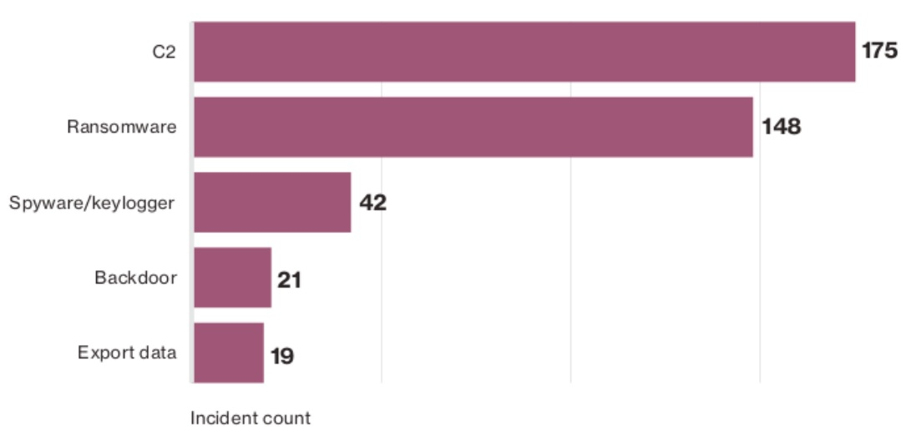
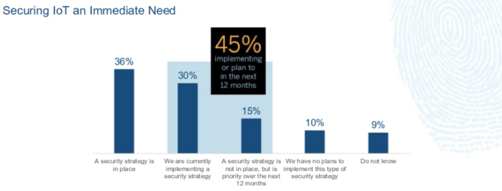

:slug: amenaza-fantasma-iot-crimenware
:date: 2016-11-01
:category: opiniones-de-seguridad
:tags: crimenware, iot, seguridad, atacar
:Image: crimenware.png
:author: Camilo Cardona
:writer: camiloc
:name: Camilo Cardona
:about1: Ingeniero de sistemas y computación, OSCP, OSWP
:about2: "No tengo talentos especiales, pero sí soy profundamente curioso" Albert Einstein

= La amenaza fantasma: IoT y crimenware

Con el uso de nuevas tecnologías llega igualmente nuevas responsabilidades y
retos frente a la seguridad y protección de nuestros activos, lo vemos por
ejemplo con IoT (*Internet of things*) ha nacido lo hoy conocido como IoT Botnet 
o IoT Evil (los tostadores y televisores se han unido al lado oscuro) y es que 
según recientes reportes de organizaciones como Verizon y Symantec, el número de
incidentes relacionados con crimenware han aumentado en el último año, siendo
C2 (Command & Control) y Ransomware las principales variantes. Malware diseñado 
para ser silencioso, indetectable y con el único objetivo de infectar y 
propagarse en diferentes tipos dispositivos dentro de una red.

.*_Figura 1. Reporte de incidentes 2016 relacionados con crimenware – http://www.verizonenterprise.com/[Verizonenterprise.com]_*

En el ultimo año han existido varios casos informados por el FBI donde se ha
encontrado que electrodomésticos, vehículos, utensilios médicos, gadgets y todo
tipo de dispositivos conectados a la red han sido infectados y usados para
crímenes cibernéticos, sin ir más lejos el ataque del pasado mes de octubre
contra *Dyn DNS* fue a causa de dispositivos de IoT infectados por Mirai Bonet,
*¡Miles de dispositivos vulnerables en la red!* pero es aquí donde se centra el
asunto, muchas de las organizaciones que han empezado a usar IoT no cuentan
con un plan de seguridad o no lo tienen planeado a futuro, no tienen un
inventario detallado de su hardware y software, o entre otras cosas cuentan con:

* Software desactualizado.
* Conguraciones
* inseguras.
* Permisos innecesarios.
* Poco entrenamiento.

Estos y muchos otros factores facilitan a criminales de la red alcanzar su
objetivo, siendo así la falta de un plan de mantenimiento y control uno de los
principales problemas contra las amenazas del crimenware.

.*_Figura 2. Seguridad en IoT 2016 – http://usblogs.pwc.com/cybersecurity/[PwC]_*

Así que en conclusión ¡La rebelión de las maquinas ha empezado, Skynet ha 
llegado! Ahh... bueno en realidad no, la verdadera conclusión es que los 
tiempos cambian y debemos adaptarnos a las nuevas tecnologías diseñadas para 
ayudarnos a mejorar nuestros procesos, pero siempre hay que ver las dos caras 
de la moneda, el riesgo que estamos dispuesto a aceptar y que debemos mitigar, 
y que la mejor medida siempre es contar con un plan de seguridad en el que se 
tenga en cuenta:

* Inventario del software y hardware
* Plan de mantenimiento y actualización del software y hardware
* Aislamiento de dispositivos de las redes principales
* Buenas practicas de conguración
* Malware protección
* Gestión y mitigación de vulnerabilidades
* Entrenamiento y sensibilización del personal.