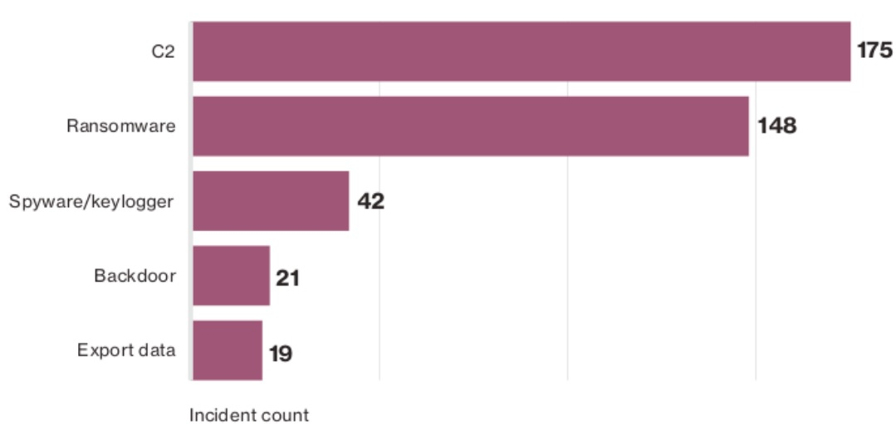
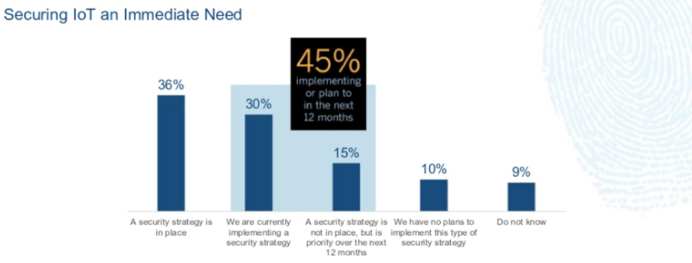

:slug: amenaza-fantasma-iot-crimeware/
:date: 2016-11-01
:category: opiniones
:subtitle: Los peligros intrínsecos de IoT
:tags: crimeware, iot, seguridad, atacar
:image: crimenware.png
:alt: Ladrón entrando a un computador como si fuera una caja fuerte
:description: El internet de las cosas (IoT) permite que cada dispositivo electrónico esté conectado a Internet, lo cual supone una enorme facilidad de acceso a la información. Sin embargo ésto también puede ser utilizado por criminales cibernéticos para obtener información y cometer delitos informáticos.
:keywords: Seguridad, IoT, Crimeware, Internet, Dispositivos, Software.
:author: Camilo Cardona
:writer: camiloc
:name: Camilo Cardona
:about1: Ingeniero de sistemas y computación, OSCP, OSWP
:about2: "No tengo talentos especiales, pero sí soy profundamente curioso" Albert Einstein

= La amenaza fantasma: IoT y Crimeware

Con el uso de nuevas tecnologías llega igualmente nuevas responsabilidades
y retos frente a la seguridad y protección de nuestros actvos,
lo vemos por ejemplo con +IoT+ (+Internet of things+).
Con esto ha nacido lo hoy conocido como +IoT Botnet+
o +IoT Evil+ (los tostadores y televisores se han unido al lado oscuro) y es que
según recientes reportes de organizaciones como +Verizon+ y +Symantec+,
el número de incidentes relacionados con +Crimeware+
ha aumentado en el último año,
siendo +C2+ (+Command & Control+) y +Ransomware+ las principales variantes.
+Malware+ diseñado para ser silencioso, indetectable
y con el único objetivo de infectar
y propagarse en diferentes tipos dispositivos dentro de una red.

.Reporte de incidentes 2016 relacionados con +Crimeware+ – link:http://www.verizonenterprise.com/[Verizonenterprise.com]

En el último año han existido varios casos informados por el +FBI+
donde se ha encontrado que electrodomésticos,
vehículos, utensilios médicos, +gadgets+
y todo tipo de dispositivos conectados a la red han sido infectados
y usados para crímenes cibernéticos,
sin ir más lejos el ataque del pasado mes de octubre
contra +Dyn DNS+ fue a causa de dispositivos de +IoT+
infectados por +Mirai Bonet+,
*¡Miles de dispositivos vulnerables en la red!*
pero es aquí donde se centra el asunto,
muchas de las organizaciones que han empezado a usar +IoT+
no cuentan con un plan de seguridad
o no lo tienen planeado a futuro,
no tienen un inventario detallado de su +hardware+ y +software+,
o entre otras cosas cuentan con:

* Software desactualizado.
* Configuraciones inseguras.
* Permisos innecesarios.
* Poco entrenamiento.

Estos y muchos otros factores
facilitan a criminales de la red alcanzar su objetivo,
siendo así la falta de un plan de mantenimiento y control
uno de los principales problemas contra las amenazas del +Crimeware+.

.Seguridad en IoT 2016 – link:http://usblogs.pwc.com/cybersecurity/[PwC]

Así que en conclusión ¡La rebelión de las máquinas ha empezado,
+Skynet+ ha llegado! Ahh... bueno en realidad no,
la verdadera conclusión es que los tiempos cambian
y debemos adaptarnos a las nuevas tecnologías diseñadas
para ayudarnos a mejorar nuestros procesos,
pero siempre hay que ver las dos caras de la moneda,
el riesgo que estamos dispuestos a aceptar y que debemos mitigar.
La mejor medida siempre es contar con un plan de seguridad,
para ello debemos considerar:

* Inventario del +software+ y +hardware+.
* Plan de mantenimiento y actualización del +software+ y +hardware+.
* Aislamiento de dispositivos de las redes principales.
* Buenas prácticas de configuración.
* Protección contra +Malware+.
* Gestión y mitigación de vulnerabilidades.
* Entrenamiento y sensibilización del personal.
