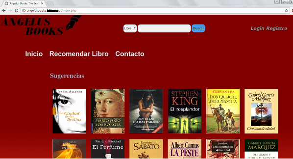
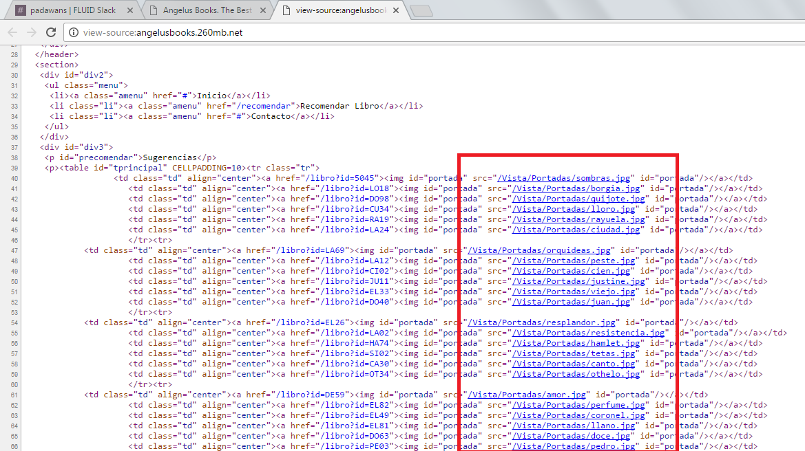
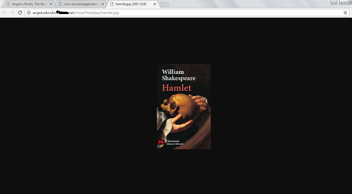
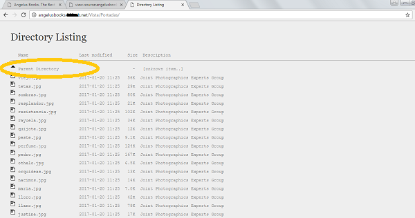
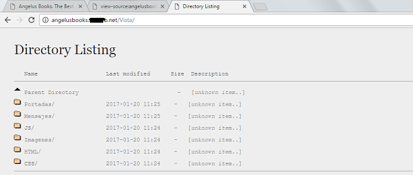
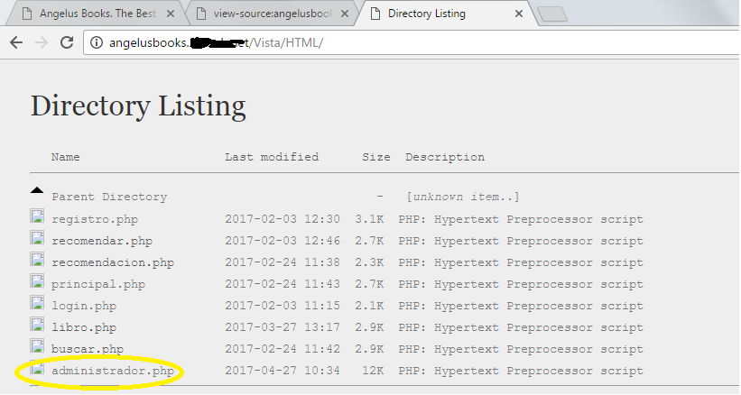
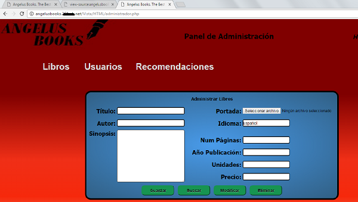
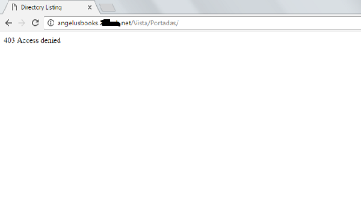

:slug: apache-ocultar-tienda/
:date: 2017-05-23
:subtitle: Cómo configurar adecuadamente los directorios
:description: Muchos sitios web utilizan Apache como servidor HTTP debido a su simplicidad y fácil manejo. Sin embargo a pesar de que Apache es un servidor potente y seguro, su configuración por defecto no lo es. En este artículo mostraremos una vulnerabilidad común de la configuración por defecto de Apache.
:keywords: Seguridad, Web, Apache, Listado,  Directorios, Index.
:author: Jhony Villa
:category: retos
:tags: configurar, indexof, reto
:image: apache.png
:alt: Nativos apaches sentados junto a una tienda
:writer: jhony
:name: Jhony Arbey Villa Peña
:about1: Ingeniero en Sistemas.
:about2: Apasionado por las redes la música y la seguridad.

= Apache debe ocultar tienda

Con más de 40 años desde su creación,
Internet no es solo una innovación tecnológica
que ofrece múltiples servicios a las personas que lo usan.
Internet es, más bien, todo un mundo de oportunidades
que permite a todas las personas la posibilidad de buscar, encontrar
y explotar la mejor oportunidad para su vida.

Con esa idea, muchas personas, sin importar su área o nivel de conocimiento,
han optado por mostrar y ofrecer sus servicios a todo el mundo
mediante el uso de sitios +Web+.
Para entender qué es un sitio +Web+, primero hay que definir
qué es una página +Web+, y ésta no es más que la composición
de diferentes archivos, documentos de texto, videos,
entre otros, definida bajo un código, por lo general escrito en +HTML+,
que dice dónde debe ir colocado cada uno de esos elementos.
Entonces, un sitio +Web+ es la recopilación de varias páginas +Web+
con una temática en común y enlazadas mutuamente,
que pertenecen a una persona u organización empresarial.

Estos sitios +Web+, para poder ser visibles en Internet,
deben ser alojados o almacenados en un servidor +Web+
que, entre otras cosas, traduce el protocolo +HTTP+.
El +Hypertext Transfer Protocol+ (+HTTP+) es un protocolo
o conjunto de reglas que permite la transferencia de información en la +Web+.

En esa línea, +Apache+ es un servidor desarrollado
para los fines previamente descritos.
Debido a su fácil instalación y configuración,
cuenta con alta demanda a nivel mundial.
Sin embargo, a causa de esto, la seguridad inicial del servidor es muy pobre,
y muchos de los creadores de sitios +Web+ no están al tanto
de dicha problemática, y terminan compartiendo sus sitios
con altas deficiencias de seguridad.

Así pues, en el presente artículo se pretende explicar
uno de los problemas más comunes en sitios +Web+
alojados en servidores +Apache+: el listado ded irectorios.
Para ello usaré un sitio +Web+ vulnerable,
con el fin de mostrar, en tiempo real, cuáles son las consecuencias
de permitir esta vulnerabilidad.
Por último, enseñaré de manera sencilla la forma más efectiva de evitarla.

El listado de directorios, mejor conocido como +Index Of+,
se produce cuando un navegador +Web+ está intentando acceder a la raíz
o a un subdirectorio de un sitio +Web+,
y éste no tiene definido un archivo +index+.
Un archivo +index+ es el archivo inicial o página principal
de un sitio +Web+ o directorio del mismo.
Entonces, cuando el navegador solicita acceder,
el servidor +Apache+ busca el archivo +index+ en la ubicación solicitada
y, al no encontrarlo, todos los archivos contenidos en ese directorio específico
son listados en el navegador.

Veamos un ejemplo. La página +Web+ de prueba es de mi propiedad,
y previamente fue configurada para mostrar los riesgos existentes
al permitir el listado de directorios.

.Página inicial del sitio

Como se puede apreciar, cuando se accede a la página,
ésta carga el archivo +index.php+, el cual, entre otras cosas,
muestra varias imágenes de diversos libros.
Ahora, revisemos el código fuente de la página.
Ésto se hace dando click derecho en cualquier parte de la página y, después,
del menú que aparece, se da click en la opción “ver código fuente” (`Ctrl + U`).

.Código fuente de la página

Al revisar el código, vemos que las imágenes están alojadas
dentro de un directorio llamado ``Portadas'' y, a su vez,
este es un subdirectorio de la carpeta ``Vista''.
Ahora accedamos a una de esas imágenes, dando click en el enlace.

.Imagen seleccionada aleatoriamente

Vemos como la imagen se carga en otra pestaña del navegador,
lo cual es normal y no representa ningún problema.
Pero, ¿qué pasaría si borro el nombre de la imagen
en la barra de navegación, dejando solo ``/Vista/Portadas/''?

.Listado de archivos del directorio Portadas

Como se puede ver, y debido a que el directorio ``Portadas'' no tiene
un archivo +index+, el navegador muestra todos los archivos contenidos en él.
Además, existe la posibilidad de escalar la estructura de directorios del sitio
por medio del botón +parent directory+ (resaltado en amarillo en la imagen).
Los archivos son solo imágenes, por lo que carecen de importancia,
así que escalemos un directorio más arriba.

.Listado de subdirectorios de la carpeta Vista

Efectivamente accedemos al directorio ``Vista'' y, como al igual
que el subdirectorio ``Portadas'', no posee archivo +index+,
puedo ver el listado de carpetas pertenecientes a ``Vista''.
Exploremos un poco cada una de las carpetas.

.Listado de archivos del directorio +HTML+

Después de explorar los subdirectorios y darme cuenta de que no poseen
archivos importantes, llegué a la carpeta +HTML+,
la cual posee todas las páginas +Web+ del sitio,
incluida una llamada +administrador.php+.
Veamos a ver qué pasa cuando accedo a dicha página.

.Página de administración del sitio +Web+

Es posible acceder al panel de administración del sitio +Web+,
sobra decir que en este punto, y con algo de malicia, astucia
y mucha curiosidad, se puede llegar a modificar el sitio a nuestro antojo,
además de que es posible acceder a información confidencial.

A partir del ejemplo anterior, es posible entender cómo un administrador +Web+
que permite listar los directorios indirectamente, también está permitiendo
que un atacante conozca la estructura de su sitio +Web+,
lo cual puede ser usado para perjudicar el mismo.
Y, además, debido al +Index Of+ y una mala programación,
es posible el acceso a lugares y archivos que, se supone,
deberían ser inaccesibles por parte de terceros.

Uno de los métodos más usados por los administradores +Web+
es crear en cada directorio un archivo +index+ vacío
o que contenga algún mensaje de advertencia.
En sí, es una buena solución para sitios +Web+ sencillos, es decir,
que usan pocos directorios o carpetas.
Pero para sitios bastante robustos que, por lo general,
tienen decenas e incluso cientos de directorios,
la simple tarea de crear un archivo +index+ por cada uno de ellos
resulta compleja y extenuante.

Así que, la mejor manera de hacerlo, es creando y/o modificando
un pequeño archivo llamado +.htaccess+.
Un archivo +.htaccess+ (+hypertext Access+) es un archivo
que permite definir diferentes directivas de configuración y políticas de acceso
a los diferentes directorios y archivos de un sitio +Web+.
Su funcionamiento es simple, cuando se visita cualquier sitio +Web+,
y antes de que el servidor muestre la información, +Apache+ consulta el archivo
con la idea de mirar qué es lo que está y no está permitido mostrar.
En caso de que alguna solicitud no esté permitida,
en el navegador se mostrará un mensaje de error por defecto o personalizado.

El archivo .+htaccess+ es un archivo en formato +ASCII+,
y por ende se puede crear con cualquier editor de texto simple.
Además, éste debe ser almacenado en la raíz del sitio +Web+.
Una vez creado, y para evitar el listado de directorios,
se debe agregar en una línea *Options –Indexes*

.Problema solucionado

Una vez agregada la línea mencionada,
cuando se intenta acceder al directorio ``Portadas'',
muestra un mensaje de acceso denegado.

En conclusión, si bien hay administradores +Web+ que recomiendan
permitir el listado de directorios filtrando los archivos y directorios
que se desean mostrar u ocultar, yo lo considero una mala práctica,
puesto que con un poco de astucia y conocimiento,
es posible llegar mucho más allá de lo que el administrador desea.
Por otra parte, aplicar esta configuración no es difícil,
y cualquier persona con deseo de montar un sitio +Web+,
está en la posibilidad de hacerlo.
Para terminar, hay que tener en cuenta que,
si bien +Apache+ es un servidor +Web+ muy potente y seguro,
la configuración por defecto no lo es, por lo que es necesario
emplear el tiempo suficiente en configurarlo adecuadamente.
