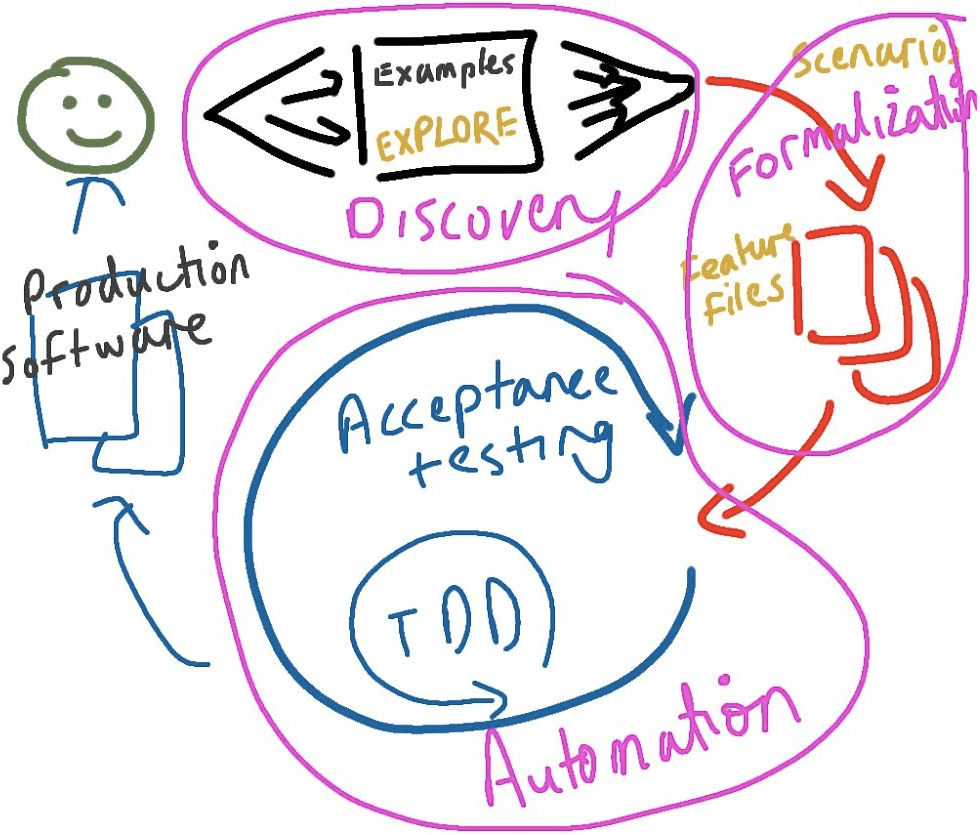
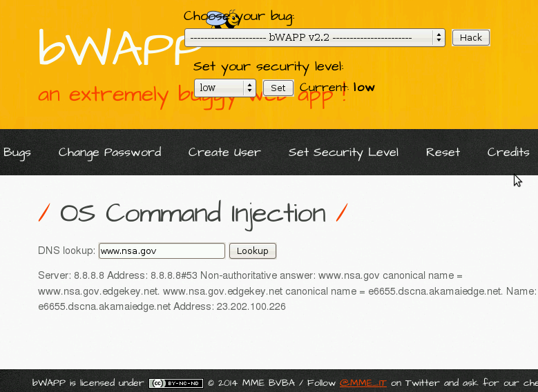
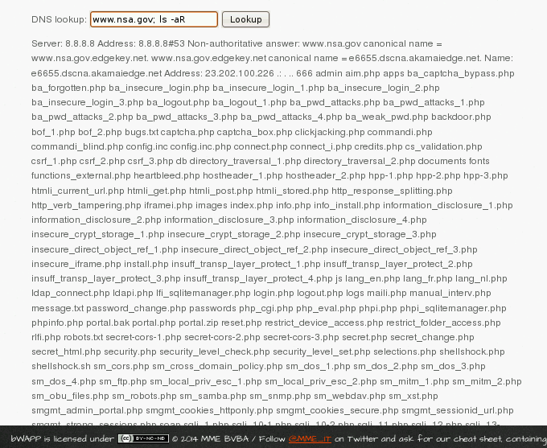

:slug: app-aprieto/
:date: 2018-02-08
:subtitle: Documentando vulnerabilidades con Gherkin
:category: documentación
:tags: documentación, vector, software
:image: cover.png
:alt: Rebanadas de pepinillo
:description: Cómo utilizar Gherkin para documentar vectores de ataque. Gherkin es un lenguaje que puede ser usado para la documentación y las pruebas automatizadas, pero aquí nos enfocaremos en cómo utilizarlo para mostrar que un sitio web puede ser atacado, y dar un tutorial con las bases de Gherkin.
:keywords: Gherkin, Vector de ataque, Documentación, Reporte, Inyección, Vulnerabilidad.
:author: Rafael Ballestas
:writer: raballestasr
:name: Rafael Ballestas
:about1: Matemático
:about2: Con interés por CS
:source-highlighter: pygments
:translate: app-pickle/

= ¿Está tu app en un aprieto?

link:https://github.com/cucumber/cucumber/wiki/Gherkin[+Gherkin+]
es un lenguaje sencillo que puede ser utilizado
para documentación de software y pruebas.
Puede ser pensado como una herramienta para la comunicación
entre los interesados en el proyecto y los desarrolladores,
la cual ayuda a minimizar los malentendidos y las regresiones
gracias a la precisión en la definición de escenarios de casos de uso.

.Desarrollo dirigido por comportamiento, por link:http://thepaulrayner.com/about/[Paul Rayner] a través de link:https://cucumber.io/[cucumber]

Pero +Gherkin+ puede ser usado para más
que solo especificación de software y documentación.
De hecho puede ser usado para especificar cualquier clase de experimento,
desde experimentos científicos hasta cómo coser un botón.

Aquí nos enfocaremos en cómo utilizar el lenguaje +Gherkin+
para documentar vectores de ataque,
o la forma en que una vulnerabilidad en un sistema
puede ser encontrada y explotada.

== Las bases de Gherkin

La mayor parte de +Gherkin+ consiste en un lenguaje natural
que describe un procedimiento.
+Gherkin+ soporte más de +60+ de estos.
Lo que le da la estructura al lenguaje es
el nivel central:
las palabras clave +When+ (Cuando) y +Then+ (Entonces),
las cuales son usadas para especificar un evento
y su salida esperada.
Por ejemplo:

.Un sencillo "paso" en +Gherkin+
[source,gherkin]
----
When I plug my phone into the AC outlet
Then it starts charging
----

Tal combinación resulta
de la construcción de bloques de un archivo +Gherkin+.
El archivo completo es llamado +feature+ (característica),
ya que normalmente son utilizados para describir
una única capacidad de una pieza de software.
pero un archivo +feature+ puede contener muchos casos de uso:
+Gherkin+ los llama +scenarios+ (escenarios).
De hecho, un +scenario+ está compuesto
por un determinado número de pasos (preferiblemente pequeño).

[source,gherkin]
----
include::/web/content/blog-en/app-pickle/coffee-example.feature[]
----

Como se vió anteriormente,
la palabra clave +And+ (Y)
puede ser utilizada para reemplazar +When+ o +Then+
para no tener demasiadas de las últimas.

Otras palabras clave funcionan como esperarías:
Por ejemplo, +Given+ (Dado) es utilizado
para describir las pre-condiciones
y +Background+ (Trasfondo) es usado
para aplicar +Given+ a varios escenarios.

También, como se vió anteriormente,
puedes escribir en lenguaje plano después del inicio de una sección.
Esto es útil para explicar lo que no se puede expresar con pasos y escenarios.
También podemos utilizar comentarios (con +#+),
pero sólo con moderación,
debido a que estamos tratando de ser tan explícitos como sea posible
sobre cómo la característica debería trabajar.

== Documentando vectores de ataque

Ahora que hemos comprendido las bases de +Gherkin+,
veamos como las podemos usar para explicar cómo atacar y explotar
una vulnerabilidad en un sistema.

Considera el siguiente sitio web de link:http://itsecgames.com/[+bWAPP+],
una aplicación web muy defectuosa.

.bWAPP sitio de búsqueda de DNS

Tiene una función muy simple:
Al dar una dirección +URL+ válida imprime detalles
sobre el nombre del dominio, como su dirección +IP+.
Podemos escribirlo en +Gherkin+ de la siguiente forma:

[source,gherkin]
----
Scenario: Normal use case
  Given I am at the page bWAPP/commandi.php
  When I type a valid URL
  Then the IP address of that URL is printed
  When I type any text that is not a URL
  Then there is no output
----

Bastante sencillo, pero concreto.
Especifica el comportamiento esperado del sitio en detalle
y más importante aún, sin ambigüedades.
También esto ayuda a evitar llamadas solicitando soporte,
debido a que el archivo en sí funciona como una especie de manual
y guía para la solución de problemas.

Sin embargo, estamos aquí para romper esa aplicación,
así que vamos a documentar eso también.

Veamos...
¿Cómo puede la aplicación obtener todos estos detalles?
En realidad, la salida parece más un comando +UNIX+.
Si la entrada del usuario no es validada adecuadamente,
podríamos aprovecharnos de eso
para ejecutar algún otro comando en el servidor.
Si, como esperamos, el servidor ejecuta un *+comando+*
con la entrada del usuario como argumento,
es como si hiciéramos esto en una terminal:

[source,bash]
----
$ comando entrada_usuario
----

En sistemas operativos similares a +UNIX+,
podemos utilizar "+;+" para ejecutar un comando después de otro.
Por ejemplo, podemos decir:

[source,bash]
----
$ echo "first line"; echo "second line"
first line
second line
----

y así hemos ejecutado dos comandos a la vez.

De esta manera, si añadimos
+; otro_comando argumentos+
en la entrada,
el comando ejecutado por la aplicación se volvería este:

[source,bash]
----
$ comando entrada_usuario; otro_comando argumentos
----

Veamos si eso funciona con algo sencillo como +ls -aR /+
el cual *lista todos los archivos recursivamente en /*,
es decir, todos los archivos en el servidor:

.Inyección de comando UNIX en el mismo sitio.

Funciona!
Si podemos "inyectar" ese comando
un usuario malicioso definitivamente
podría inyectar comandos más dañinos.

Podemos documentar este procedimiento completo
(excepto las explicaciones,
las cuales son un beneficio único para el lector)
de la siguiente manera:

[source,gherkin]
----
Scenario: Dynamic detection and explotation
  When I type ";ls -aR /" in the field
  Then all files in / are listed recursively
----

Le hemos dado a este escenario el epíteto "dinámico"
ya que encontramos y explotamos esta vulnerabilidad
al interactuar "dinámicamente" con la aplicación.
Esto, en contraste con la detección "estática"
donde encontramos y explotamos el +bug+
al revisar el código de la aplicación,
lo cual haremos a continuación.

El sitio web está escrito en +PHP+,
sin embargo, mientras puedas comprender cualquier código,
estas listo para empezar.
Echemos un vistazo al archivo +commandi.php+.
Las líneas que ejecutan el comando van algo así:

[source,php]
----
$input = $_POST["target"]
echo shell_exec("nslookup " . $input);
----

Así que estábamos en lo cierto!
+PHP+ le pide a la +shell+ del servidor
que ejecute el comando +nslookup+.
La entrada del usuario (+$input+) no es validada ni cambiada.
Esa es la razón por la que pudimos explotar esa vulnerabilidad
de la forma en que lo hicimos.

Una simple validación o desinfección
puede prevenir que ésto le ocurra a tu aplicación.
Si +bWAPP+ hubiera añadido solo +3+ líneas
para limpiar los operadores de control +;+ , +&+ y +|+:

[source,php]
----
$input = str_replace("&", "", $data);
$input = str_replace(";", "", $input);
$input = str_replace("|", "", $input);
----

Esta vulnerabilidad sería mucho más difícil de explotar,
o quizás no existiría.

Combinando todos los pasos anteriores,
obtenemos la documentación completa
para esta vulnerabilidad en +Gherkin+:

[source,gherkin]
----
include::/web/content/blog-en/app-pickle/command-injection.feature[]
----

Cubrimos las líneas largas (especialmente código)
en +docstrings+ similares a los de +Python+ (+"""+).
Esta característica incluye la palabra clave
+Scenario Outline+ la cual es similar a tener variables en escenarios
para evitar repeticiones.
La utilizamos para mostrar la salida producida
por diferentes comandos o intentos.

Si estás interesado, puedes revisar la
link:https://cucumber.io/docs/reference[documentación de Cucumber]
para una introducción a +Gherkin+ más completa, agradable y corta.

'''

Como hemos visto,
a pesar de que el lenguaje +Gherkin+ no ha sido diseñado
para la documentación de hacking,
podemos convertirlo en una herramienta útil para este propósito.
Nos permite escribir documentación sin ambigüedades, reproducible
y -- dadas la configuración y ambiente adecuados -- ejecutables,
que también simplifican las pruebas.
