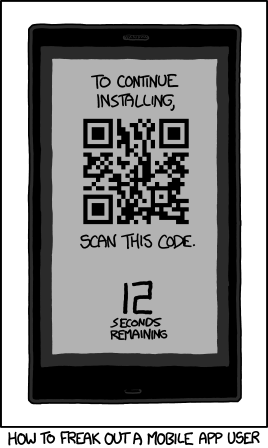

:slug: ardilla-contra-mundo/
:date: 2018-03-06
:category: Identidad
:tags: seguridad, criptografía, protocolo, autenticación
:Image: usuario-password.png
:alt: logo SQRL, Secure +QR+ Login
:description: Más que una simple ardilla, SQRl es la promesa que quiere dar solución a la paradoja de la autenticación segura en sitios web con códigos +QR+ seguros generados por firmas criptográficas, en un equilibrio entre usabilidad y seguridad, SQRL quiere cambiar el modo en que nos autenticamos en Internet.
:keywords: SQRL, autenticación, seguridad, usabilidad, protocolo, cripografía
:author: Santiago Muñoz
:writer: smunoz
:name: Santiago Muñoz Ortega
:about1: Ingeniero de sistemas, C|EH
:about2: "Los sueños son mentiras que algún día dejarán de serlo"

= SQRL, una ardilla contra el mundo

*_SQRL_* por sus siglas en inglés *_(Secure Quick Reliable Login)_* apodado *_Squirrel_*, 
es una solución potencial a los problemas 
asociados con el uso del modelo más popular de autenticación (usuario/contraseña) en los sitios web, 
pasando al uso de códigos +QR+ seguros y firmas criptográficas 
entre el dominio y el usuario para validar su autenticidad.

*_SQRL_* tiene como objetivo reemplazar los nombres de usuario y contraseñas 
porque a pesar de ser nuestra identidad, no podemos confiar en los sitios web 
para mantener nuestra información personal segura. 
Una ventaja del uso de *_SQRL_* es que los usuarios solo necesitan recordar una clave maestra 
para la aplicación en lugar de un número elevado de contraseñas 
para todos servicios de autenticación que utilizan.

== Las contraseñas: ¿Un arma de doble filo?

Las contraseñas débiles son simples de recordar y predecir, 
lo que las hace fáciles de romper. 
Las contraseñas complejas son difíciles de recordar 
y requieren ser anotadas en algún lugar 
perdiendo confidencialidad. 
Es por esto que el elemento humano 
genera una disminución en la gestión de la seguridad. 
Las personas no son buenas gestionando contraseñas seguras. 
A menudo optan por contraseñas fáciles de recordar
dejando la puerta abierta a los piratas informáticos.

== SQRL: ¿Que hay detrás de la magia?

Desde la perspectiva de los usuarios, *_SQRL_*, 
simplemente implica escanear un código +QR+ 
presentado en la página de inicio de sesión de un sitio web, *¡Es muy sencillo!*

.How to freak out a mobile app user link:https://xkcd.com/1237/[xkdc].

Lo que sucede detrás de escena es un poco más complejo. 
Cada usuario tiene una clave maestra única, 
la cual es conocida por la aplicación *_SQRL_* en el dispositivo inteligente. 
Cuando un usuario quiere iniciar sesión 
se le presenta un código +QR+
con un número aleatorio largo 
adjunto al nombre de dominio del sitio. 
La aplicación utiliza la clave maestra
para crear un par de claves públicas 
específicas para el sitio cuya clave privada se utiliza 
para firmar la combinación nombre de dominio-número aleatorio. 

Luego, a través de una conexión segura, 
la clave pública y la firma criptográfica de la +URL+ del código +QR+ 
se envían al servidor de autenticación. 
El servidor conoce su nombre de dominio 
y el número aleatorio puede usar la clave pública 
para verificar que la clave privada 
asociada se haya utilizado para firmar la +URL+.

=== ¿Qué tipo de tecnología usa?

*_SQRL_* utiliza criptografía asimétrica para proporcionar seguridad. 
El cliente tiene una llave maestra que representa su identidad completa a través de Internet. 
Un par de claves públicas/privadas se genera utilizando el algoritmo de resumen +HMAC+ *_(SHA-256)_*. 

La llave maestra y el nombre de dominio (el sitio web en el que el usuario intenta autenticarse), 
son cifrados para derivar una clave privada que se manipula para derivar una llave pública. 
Cada sitio tiene un par de claves pública/privada distintas para diferentes usuarios 
pero el mismo usuario siempre tendrá el mismo par de claves pública/privada para el mismo sitio 
porque la clave maestra y el nombre de dominio nunca cambian.

["graphviz", "diagram1.png"]
----
digraph G {
  node [fontname="helvetica",fillcolor=aquamarine, style=filled]
  "Llave maestra" -> "abcd.com" -> "Llave privada/pública 1"
  "Llave maestra" -> "foo.com" -> "Llave privada/pública 2"
  "Llave maestra" -> "test.com" -> "Llave privada/pública 3"
}
----

Para el proceso de login, el usuario envía una solicitud al servidor. 
El servidor responde de vuelta un +Token+ 
generado de forma segura codificado en un código +QR+. 
La aplicación *_SQRL_* escanea el código 
para generar el par de claves públicas/privadas para ese sitio, 
firma el +Token+ con la clave privada específica del sitio 
y luego envía una solicitud al servidor 
que contiene la clave pública específica del sitio y el +Token+ firmado. 
El servidor verifica la firma usando la clave pública 
y luego almacena la clave pública para validar al usuario en el futuro.

["plantuml", "diagram2.png"]
----
@startuml
autonumber
skinparam sequenceArrowThickness 2
skinparam roundcorner 40
skinparam maxmessagesize 250
== Proceso de autenticación ==

Usuario -> Browser: Escanea el código SQRL

Browser -> Servidor: Petición

Servidor -> Browser: Token

Browser -> Usuario: Token firmado + llave pública

Usuario -> Browser: Identidad confirmada

Browser -> Servidor: Login exitoso

@enduml

----

== La llave maestra: ¿Dependemos 100% de los dispositivos inteligentes?

Los teléfonos sirven como un identificador único 
que reúne el principio del doble factor de autenticación 
_"de algo que usted conoce y algo que usted tiene"_ para una seguridad flexible en capas. 
En pocas palabras, los teléfonos eliminan la necesidad de nombres de usuario y contraseñas.

La dependencia del smartphone es algo que es muy discutido en muchos foros del protocolo *_SQRL_*, 
ya que ahí es donde se almacena nuestra llave maestra, 
si el dispositivo es robado o vulnerado por algún tipo de virus para dispositivos inteligentes 
perderíamos nuestra identidad ante todos los sitios registrados en Internet.

== Equilibrio entre seguridad y usabilidad: ¿Es posible?

El protocolo *_SQRL_* tiene unos aumentos notables tanto en seguridad como en usabilidad, 
evita que el usuario teclee su contraseña en algún periférico de entrada, 
suprimiendo el almacenamiento de contraseñas en bases de datos que pueden ser comprometidas.

El protocolo obliga a tener credenciales específicas para cada sitio. 
Así los atacantes no puedan reutilizar las credenciales comprometidas 
en otros sitios evitando la suplantación de identidad.

*_SQRL_* reduce el riesgo de un ataque a los usuarios logrando un equilibrio entre usabilidad y seguridad 
sin sacrificar la confidencialidad de la información de los usuarios.

== ¿Qué comen las ardillas?

image::ardilla-comiendo.gif[Squirrel masticando comida]

Una de las ventajas más notables del *_SQRL_*, 
es que elimina la necesidad de que un tercero gestione las credenciales de los usuarios 
y evita que estos terceros como _(OAuth2, OpenID, SAML 2.0)_ guarden este tipo de informaciónsecreta.

== Conclusiones

*_SQRL_* es muy superior a las contraseñas de distintas maneras. 
No solo es más fácil de usar una vez configurado en un sitio web, 
ya que los usuarios no tienen que preocuparse por recordar,volver a escribir o memorizar 
múltiples contraseñas diferentes para cada sitio 
sino que también protege contra la reutilización de contraseñas y/o contraseñas débiles, 
y en cierta medida la suplantación de identidad.

Hasta ahora el protocolo tiene algunas consideraciones de seguridad 
como ataques de tipo +MitM+ *_(Man in the Middle)_*, 
suplantaciones de dominio usando +DNS+ poisoning e ingeniería social. 
Aunque sus vectores de ataque son más complicados de ejecutar. 

Lo que quiere lograr el *_SQRL_* como 1er factor de autenticación es balancear las falencias 
que existen entre costo-beneficio durante los procesos de autenticación.

== References

. [[r1]] link:https://www.grc.com/sqrl/sqrl.htm[Gibson, Steve (2013). 'Secure Quick Reliable Login'.]
. [[r2]] link:https://www.novainfosec.com/2013/12/10/do-you-sqrl/[GRECS (2013). 'Do You SQRL?']

