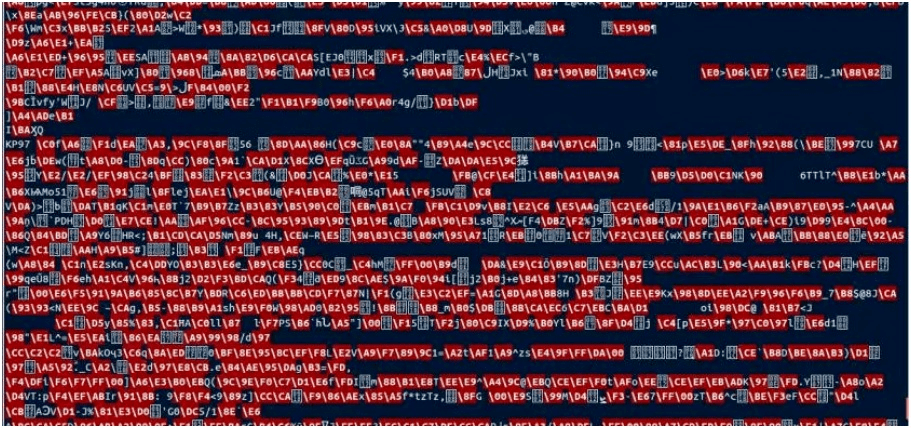

:slug: arte-ocultar-informacion-imagen/
:date: 2016-10-25
:category: retos
:tags: reto, esteganografía, solucionar, ocultar
:Image: estegano.png
:alt: Lupa buscando información en una imagen de la Mona Lisa
:description: La esteganografía parece algo sacado de una película de espías, pero en realidad existe. Es el arte de ocultar información en imágenes, videos, audios, archivos de texto y archivos ejecutables a través de diversas técnicas. A continuación abordaremos algunas aplicaciones de la esteganografía. 
:keywords: Esteganografía, Seguridad, Mensaje , Ocultar, Imagen, Información.
:author: Alejandro Aguirre
:writer: alejoa
:name: Alejandro Aguirre Soto
:about1: Ingeniero mecatrónico, Escuela de Ingeniería de Antioquia, Maestría en Simulación de sistemas fluidos, Arts et Métiers Paristech, Francia, Java programming specialization, Duke University , USA
:about2: Apasionado por el conocimiento, el arte y la ciencia.

= El arte de ocultar información en las imágenes 

La esteganografía es el campo de estudio que se encarga de ocultar mensajes en 
objetos, con el propósito de crear un mensaje encubierto cuyo medio de 
comunicación es visible al público pero el mensaje como tal permanece oculto. 
No se debe confundir la esteganografía con la criptografía, ya que esta última 
solo se encarga de cifrar el mensaje y dejarlo visible al público. Existen 
varios objetos con los cuales se pueden esconder mensajes, en la antigüedad 
bastaba solo con hacer invisibles estos objetos al público, en la actualidad 
los objetos más comunes para ocultar información son elementos digitales tales 
como: imágenes, audio, vídeo, archivos de texto y archivos ejecutables 
informáticos.

== Esteganografía en imágenes digitales

En las imágenes hay dos métodos principales para ocultar la información, el
primero es el método *LSB* (bit menos signicativo)el cual consiste en ocultar 
una imagen (mensaje) dentro de otra imagen (contenedor). Esto funciona debido 
a que las imágenes digitales no son más que un mapa de pixeles donde cada pixel 
es un punto de información representado en bits. Transformando el bit menos 
signicativo de cada pixel podemos obtener una sola imagen que oculta a otra 
imagen.

.Imagen donde se ve la combinación de dos imágenes en una sola,https://upload.wikimedia.org/wikipedia/commons/a/a2/Lsb-example.JPG[wikipedia]

El segundo método consiste en simplemente poner el mensaje dentro de la 
información digital de la imagen, ocultando el mensaje en medio de una nube de 
caracteres representados como los “datos crudos de la imagen”. A continuación 
resolveremos un reto de esteganografía para profundizar más este segundo 
método.

== Reto – ChallengeLand Steganography 1

Este reto consiste en descubrir el mensaje oculto dentro de una imagen, sólo 
nos proporcionan la siguiente imagen:

.Imagen del reto, http://challengeland.co/Dashboard/[Challengeland]
image::image1.png[reto]

Ahora nos disponemos a abrir la imagen con un editor de texto, para este caso 
se utilizará el https://wiki.gnome.org/Apps/Gedit[Gedit], que es el editor de 
texto por defecto de GNOME.

.Imagen abierta con el Gedit

Como vemos en la figura 3, sólo se muestran los “datos crudos” e ilegibles de 
la imagen, debemos entonces navegar en estos datos hasta encontrar una palabra 
(mensaje) que esté en un idioma legible.

.Palabra encontrada

Encontramos casi al final de este texto una palabra “legible” bastante
relacionada al tema y que seguramente es la solución a este reto.

Gracias a la esteganografía podemos transmitir nuestros mensajes de manera 
oculta al público en un medio visible y crear un canal de comunicación, vimos 
como podemos esconder información en imágenes digitales que a simple vista 
parecen sólo fotos o imágenes sin indicaciones.

Existe una amplia gama de maneras de utilizar la esteganografía, así como 
también existen muchos software creados especialmente para descubrir estos 
mensajes “encubiertos”. Por eso, a la hora de decidir qué método utilizar para 
ocultar nuestros mensajes debemos ser muy precavidos e investigar muy bien cuál 
utilizar para esconder nuestros mensajes.
