:slug: busca-encuentra/
:date: 2017-12-15
:category: retos
:description: Las buenas prácticas de programación son pautas que deben tenerse en cuenta a la hora de desarrollar una aplicación, para evitar que ésta sea vulneradas por atacantes. En este artículo se describen algunos tips sencillos para desarrollar aplicaciones seguras.
:keywords: Web, JavasCript, Seguridad, Credenciales, HTML, Aplicación.
:author: Luis Arteaga
:tags: solucionar, browser, reto
:Image: htmlcode.png
:alt: Snippet de código en HTML
:writer: stiwar
:name: Luis Arteaga
:about1: Ingeniero en Electrónica y Telecomunicaciones.
:about2: Apasionado por el desarrollo de aplicaciones web/móviles, la seguridad informática y los videojuegos.
:figure-caption: Imagen

= El que busca ¡encuentra!

En los inicios de la +web+, 
cuando aún los dispositivos móviles no se apoderaban del mercado, 
el usuario final, es decir, la persona detrás de un navegador +web+, 
sólo se limitaba a consumir información estática. 
Con el tiempo, y gracias a los avances tecnológicos, 
el usuario pasó de un rol pasivo a uno activo. 
Lo cual dio origen al término +web 2.0+, 
cuya filosofía es el diseño centrado en el usuario. 
Sin duda alguna, esto representa un gran desafío para los desarrolladores 
que con el pasar de los días, 
deben satisfacer las necesidades cada vez más exigentes de estos. 
Exigencias, que implican entre otras cosas, 
garantizar la confidencialidad de información 
como las credenciales de acceso a un sitio +web+. 
Para tal propósito, existen diversas herramientas 
o tecnologías empleadas por los desarrolladores, 
que van desde validaciones en el lado del servidor (+back-end+) 
hasta validaciones en el lado del cliente (+front-end+). 
En esta entrada, hablaremos un poco de +JavaScript+ (en adelante +JS+) 
y sobre algunos consejos básicos a tener en cuenta 
al momento de desarrollar un sitio +web+. 
En especial si eres un desarrollador sin experiencia 
que apenas está aprendiendo sobre buenas prácticas de desarrollo +web+.

Los ejemplos presentados aquí, 
son soluciones a retos de seguridad informática 
del sitio +web+ https://www.hackthis.co.uk/[+hackthis+], el cual, 
permite validar tus habilidades 
para superar controles de seguridad en diferentes categorías. 
En esta oportunidad, daremos solución a los retos 1,2 y 6 
de la categoría +MAIN+ del sitio en cuestión. 
Una vez registrados en +hackthis+, 
podremos acceder a todos los retos disponibles:

.+hackthis:+ los 10 niveles de la categoría +MAIN+
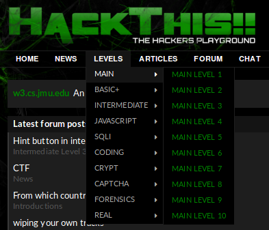

== Reto: Main Level 1

.+hackthis:+ nivel 1 de la categoría +MAIN+
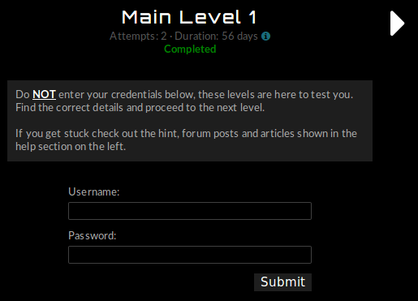

Como se aprecia en la anterior imagen, 
este reto solicita credenciales de acceso 
válidas tanto para el usuario como su contraseña. 
Para este nivel básico, 
podemos hacer uso de herramientas precargadas en los navegadores +web+ 
como es el visualizador de código fuente. 
El código fuente de un sitio +web+, 
es un conjunto de etiquetas conocidas como etiquetas https://www.w3schools.com/html/[+html+], 
hojas de estilos en cascada (https://www.w3schools.com/css/[+CSS+]-+Cascading Stylesheets+) 
y algunas veces, segmentos de código denominados +scripts+ de https://www.w3schools.com/js/[+JS+]. 
Podemos acceder a dicha herramienta 
pulsando el atajo +Ctrol+U+ o haciendo +click+ derecho en el navegador 
y seleccionando la opción +"View Page Source"+ 
(en algunos casos puede aparecer distinto, 
dependiendo del navegador utilizado 
y el idioma en el que está configurado tu sistema operativo), 
tal como se muestra en la siguiente imagen:

.uso de la herramienta +View Page Source+
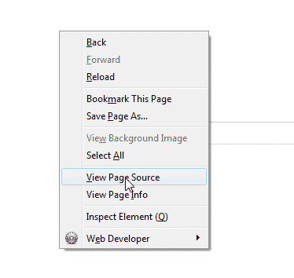

Una vez realizada dicha acción, 
se despliega una nueva pestaña en el navegador 
donde podrás ver todo el +html+, +CSS+ y +JS+ que componen la página +web+. 
La línea que nos interesa es la 29. 
En esta, podemos observar un comentario +html+ 
(los comentarios en +html+ van entre las etiquetas <!-- y -\-> 
y no son desplegados o mostrados por el navegador) 
el cual contiene las credenciales de acceso válidas para el reto:

.+hackthis:+ solución al reto +MAIN 1+
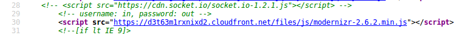

Con esto, sólo basta ingresar las credenciales +in+ y +out+ 
en los campos +Username+ y +Password+ respectivamente para resolver el reto.

== Reto: +Main Level 2+

.+hackthis:+ nivel 2 de la categoría +MAIN+
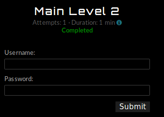

Al igual que el primer reto, 
en este se solicita ingresar credenciales válidas para un determinado usuario. 
Pero esta vez, haremos uso de una nueva herramienta 
incorporada en los navegadores +web:+ 
+Inspect Element+ (o inspeccionar elemento 
si tu sistema operativo está en español). 
Podemos acceder a esta funcionalidad 
presionando +click+ derecho y buscar la opción con dicho nombre, 
o también puedes presionar la tecla +f12+. 
Una vez desplegada la herramienta, 
busca la siguiente línea dentro de las etiquetas +html:+

.+hackthis:+ solución al reto +MAIN 2+
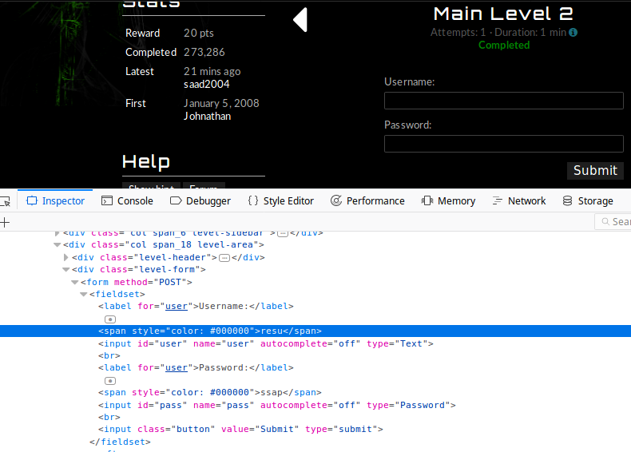

Debemos prestar especial atención al contenido 
entre las dos etiquetas ++ y ++, 
como se aprecia en la imagen, la primera contiene el valor: +resu+ 
y la segunda: +ssap+. 
Al ingresar dichas credenciales, el reto es resuelto. 
En realidad, existe una tercer y cuarta forma de resolver este ejercicio 
además de la descrita anteriormente y en el primer reto. 
La tercera, simplemente consiste en resaltar el texto oculto 
a la derecha de las palabras +Username+ y +Password+ 
tal como se aprecia a continuación:

.+hackthis:+ solución al reto +MAIN 2+ (tercer solución)
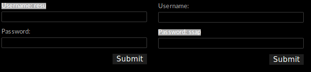

La cuarta forma, consiste en cambiar el valor +#00000+ 
(que corresponde al color negro en +RGB-Red,Green,Blue+) 
de las dos etiquetas +span+ 
por un valor visible en pantalla, por ejemplo +#0000ff+, 
lo anterior los podemos llevar a cabo 
mediante la herramienta +Inspect Element+. 
Al hacer esto, podemos ver que los cambios 
se reflejan de manera instantánea en el navegador:

.+hackthis:+ solución al reto +MAIN 2+ (cuarta solución)
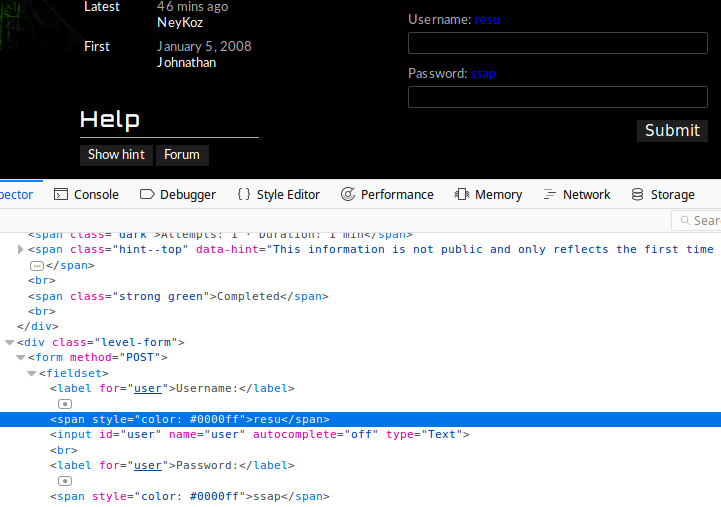

== Reto: +Main Level 6+

.+hackthis:+ nivel 6 de la categoría +MAIN+
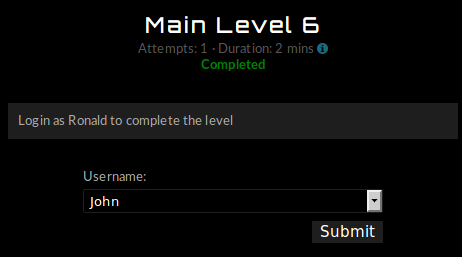

En esta ocasión, se solicita ingresar con el usuario *Ronald*, 
el cual, no se encuentra disponible entre las opciones por defecto. 
Sin embargo, podemos jugar nuevamente con las etiquetas +html+ 
que conforman la página +web+ (presionando la tecla +f12+) 
y agregar la opción _Ronald_ dentro de la etiqueta +<select>+:

.Agregando la opción "Ronald" dentro de la etiqueta +option+
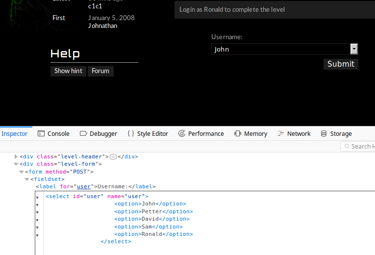

Con esto, ya podremos seleccionar el usuario Ronald 
entre las opciones desplegables y por lo tanto, resolver el reto:

.+hackthis:+ solución al reto +MAIN 6+
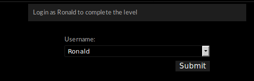

Existe una segunda solución, la cual, a mi parecer 
es más "elegante" e "interesante", 
pero que requiere algunos conocimientos básicos en cuanto al uso de +JS+. 
Sin embargo, trataré de explicar 
de una forma clara y sencilla el +script+ utilizado para este reto. 
En primer lugar, usaremos una nueva herramienta disponible 
en el navegador +web Firefox+, para ello, vamos a: 
+Tools\->Web Developer\->Scratchpad+. 
+Scratchpad+ entre sus funcionalidades permite ejecutar código +JS+ 
y ver los cambios reflejados en el navegador de manera instantánea:

.uso de la herramienta +scratchpad+
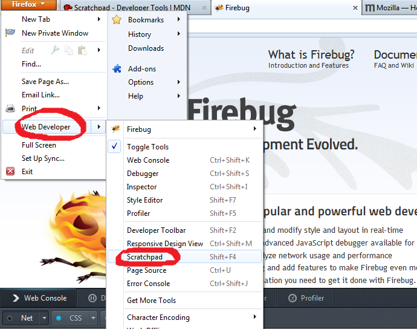

Una vez, desplegada la herramienta, 
procedemos a ejecutar el siguiente +script+ de +JS+:

  javascript:void(document.forms[1].user.options[1].value='Ronald');
  void(document.forms[1].user.options[1].text='Ronald');

En la primer línea, mediante el objeto +document+ 
accedemos al segundo formulario (representado por el valor 1) 
contenido dentro de la página +web+. 
Una vez capturado el formulario (+forms[1]+), 
accedemos a la etiqueta +select+ cuya propiedad +name+ 
es igual a +user+ y reemplazamos la opción en la posición 1 
por el valor de _Ronald_. 
La segunda línea realiza prácticamente la misma función, 
con la única diferencia de que accede a la propiedad +text+ 
cuya función es establecer el texto que será desplegado por el navegador 
dentro del menú desplegable. 
Una vez descrito el +script+, 
procedemos a ejecutarlo pulsando en en botón +Run:+

.ejecutando código +JS+ en +scratchpad+
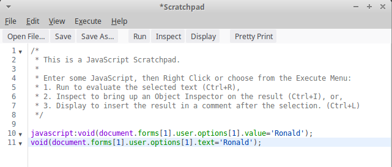

Al regresar a la página del reto, 
la segunda opción contiene el valor de _Ronald_ 
y podremos resolver el reto.

Para concluir, *BAJO NINGUNA CIRCUNSTANCIA* se debe almacenar información 
confidencial dentro del código fuente (lo cual es considerado una mala práctica), 
sin importar si es +html+, +CSS+ o +JS+. 
Además, si bien es cierto que dominar un lenguaje de programación 
es muy importante, en lo personal, 
considero que aprender sobre buenas prácticas de desarrollo 
ayuda a que puedas crear sistemas más robustos, escalables y seguros.