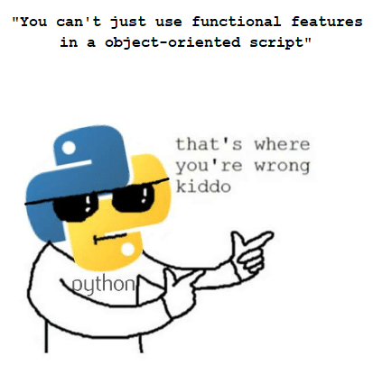

:slug: camino-hacia-python-funcional/
:date: 2018-07-27
:category: programación
:subtitle: Programación funcional en Python
:tags: aplicación, funcional, python, multiparadigma
:image: cover.png
:alt: Swiss army knives with Python logo
:description: Una introducción a los aspectos esenciales de programación funcional en Python. Que beneficios tiene Python funcional. Cómo iniciar la migración hacia Python funtional. Cuales son la librerías más usadas. Una reflexión de por qué debemos enfocar nuestros esfuerzos en crear código funcional.
:keywords: Functional paradigm, Object-oriented, Stateless, Multiparadigm application, Python, Programming future.
:author: Oswaldo Parada
:writer: oparada
:name: Oswaldo José Parada Cuadros
:about1: Ingeniero Mecánico
:about2: Familia, amigos y pequeños detalles. Ahí está la respuesta.

= El camino hacia Python funcional

Probablemente no hay nada mejor para el espíritu
que tener un hobby que nos apasiona,
que nos haga sentir enamorados todo el tiempo,
que nos haga desear volver a él.
Y qué mejor, si este hobby, sin intención alguna
se convierte en un fenómeno mundial,
que hace parte de la economía, usado por empresas grandes
y pequeñas, representando la fuente de ingresos para muchos.
Así surgió Python, un proyecto inicialmente como hobby
pero que con el pasar de los lustros a ganado terreno
entre los lenguajes más usados,
no solo por su facilidad sino por su versatilidad.
Python ha sido capaz de adaptarse a los frenéticos cambios de la tecnología
y ha sido un fuerte contendiente en muchos campos.
Hoy quiere nuevamente ser el cambio,
hoy quiere evolucionar antes de que la misma evolución llegue.
Hoy quiere ser funcional!

== Antes de ponerse los zapatos

Antes de empezar, debo advertirte
que este viaje no es para principiantes.
No podrás enfrentar al Python funcional
y sobrevivir si no conoces lo básico de Python.
Si este es tu caso, no te sientas mal,
no puedes caminar sin antes aprender a mantenerte de pie,
por eso ve y juega un poco con Python.
También te recomiendo que leas
[button]#link:/web/es/blog/por-que-somos-funcionales/[Por qué somos funcionales?]#,
el cual es la primera parte de este artículo.
Cuando creas estar listo, regresa al camino,
siempre estaremos esperando por ti.

== Prepara tu mochila

Por supuesto necesitamos provisiones para el camino.
Pero sorpresa! Si ya tienes Python entonces ya
estás listo para empezar a caminar.
Una de las características más importantes de Python
es que es multiparadigma, que como su nombre lo indica,
soporta varios paradigmas en su código, entre ellos,
procedural, orientado a objetos, funcional, entre otros.
Existen también librerías con características funcionales
como link:https://docs.python.org/2/library/itertools.html[+itertools+] ó
link:https://docs.python.org/2/library/functools.html[+functools+]
(de las cuales profundizaremos más adelante)
que vienen incluidas dentro de la instalación básica.

== Primeros pasos

Una de las principales características del paradigma funcional,
es la capacidad de tener métodos que reciben
o retornan código funcional.
Es algo difícil de entender en algunos lenguajes
pero en Python se facilitan las cosas, por ejemplo:

.Primera aproximación para algunas operaciones básicas en Python funcional.
[source, python]
----
def calc (f, x, y):
  return f(x, y)

def subtract (x, y):
  return x - y

def mult (x, y):
  return x * y

calc(subtract, 10, 3) # 7
calc(mult, 2, 4) # 8
----

== Camina

Quizás una de las cosas más difíciles de entender
en el paradigma funcional es que no existen ciclos iterativos
y si alguna vez has programado en algún lenguaje
orientado a objetos estarás pensando
que sin ciclos iterativos no se puede hacer mucho
o no se puede generar código limpio y corto.
Puede que en parte sea cierto.
El paradigma funcional no tiene algo como un +for+ o un +while+,
pero si cuenta con funciones que imitan
o reemplazan el comportamiento de los ciclos.
A continuación se muestra un ejemplo básico
sobre ciclos iterativos en Python:

.[[increment-example]]Ejemplo de incremento en cada elemento de una lista.
[source, python]
----
integer_list = [7, 8, 9]

def increment (x):
  return x + 1

def increment_in_list (list):
  result = []
  for integer in list:
    result.append(increment(integer))
  return result

increment_in_list(integer_list) # [8, 9, 10]
----

Si queremos realizar esto de manera funcional
entonces procedemos a usar +map+,
una función que le aplica una función
a todos los elementos de una lista:

.Incremento en cada elemento de una lista con _map_.
[source, python]
----
integer_list = [7, 8, 9]

map(increment, integer_list) # [8, 9, 10]
----
Otra función que permite realizar
operaciones iterativas es +filter+,
la cual retorna una nueva lista con los elementos que retornan
+true+ al aplicar cierta función, por ejemplo:

.Ejemplo del método Filter.
[source, python]
----
integer_list = [7, 8, 9]

def greater_than (x, y):
  return True if x > y else False

filter(lambda x: greater_than(x, 7), integer_list) # [8, 9]
----

Estas son funciones realmente útiles
y simples para empezar a programar funcional,
pero tienen sus limitantes (puede ya las hayas notado),
como por ejemplo, la funciones para aplicar a las listas
no pueden tener más de un argumento.
Esto no es problema.
Pronto veremos métodos funcionales aún más poderosos, capaces de mucho más.

== Toma un descanso

Cómo te sientes hasta ahora?
Ya has recorrido mucho camino, felicitaciones!.
Tienes casi todas los conocimientos para entrar
a las grandes ligas de las grandes ligas,
sólo debes aprender algo más:  expresiones Lambda,
descritas como funciones de una línea
(quizás las conoces en otros lenguajes como _funciones anónimas_).
A continuación reescribimos el
<<increment-example, ejemplo de incremento en cada elemento de una lista>>
usando expresiones lambda:

.Incremento en cada elemento de una lista con una expresión lambda.
[source, python]
----
integer_list = [7, 8, 9]

map(lambda x: x + 1,integer_list) # [8, 9, 10]
----

== Corre Forrest, corre!

Ahora estamos junto a los atletas de talla mundial
y podemos aprender mucho de ellos.
Uno de los más destacados es
link:https://docs.python.org/2/library/itertools.html[+itertools+],
un módulo diseñado específicamente para hacer loops eficientes
en objetos iterables, basado en lenguajes como +Haskell+ y +SML+.
De hecho, ya conoces algunas funciones de este módulo
como +map+ y +filter+, pero ahora vienen con la familia completa
y en esteroides.

Algunos de los métodos representativos de esta librería son:

.Ejemplos de algunos métodos de itertools.
[source, python]
----
import itertools

lowercases = ['a','b','c']
uppercases = ['A','B','C']
number_as_string = '1111222334'

""" Chain, permite concatenar estructuras iterables """
list(itertools.chain(uppercases, lowercases))
# ['A', 'B', 'C', 'a', 'b', 'c']

""" Permutations, retorna las permutaciones de n elementos de longitud de estructuras iterables """
list(itertools.Permutations(uppercases, 2))
# [('A','B'),('A','C'),('B','A'),('B','C'),('C','A'),('C','B')]

""" Groupby, agrupa elementos de una estructura de datos a partir de una condición o regla """
[list(g) for k, g in itertools.groupby(number_as_string)]
# [['1', '1', '1', '1'], ['2', '2', '2'], ['3', '3'], ['4']]

""" Repeat, retorna un elemento las veces que se especifique """
list(itertools.repeat('A',6))
# ['A', 'A', 'A', 'A', 'A', 'A']

""" Islice, retorna n elementos de una estructura iterable """
list(itertools.islice(number_as_string,5))
# ['1', '1', '1', '1', '2']

----

No todas las aplicaciones funcionales
en Python se manifiestan como librerías,
también existen características funcionales
que se logran con solo escribir nuestro código de cierta manera.
El más importante de aprender quizás sea +currying+,
que se define como la transformación de una función
que recibe varios parámetros de entrada
a una secuencia de funciones que recibe un único parámetro.
¿Por qué hariamos esto? Va relacionado un poco con el tema de +laziness+
y de generación de funciones que crean funciones,
el currying permite ejecutar parcialmente un función,
haciendo que se optimicen los tiempos de ejecución
al no tener que calcular cada operación desde el inicio.
A continuación se muestra un ejemplo sobre el propósito del currying.

.Ejemplo de currying en Python.
[source, python]
----
def curried_product (a):
    def product(b):
        return a * b
    return product

curried_product(2) # function...
curried_product(2)(3)
# 6

mult = curried_product(3) # function...
mult(4)
# 12
----

== Aprendiendo a volar

¿Que tal si llevamos nuestro viaje al siguiente nivel?
Aprenderemos algo más sofisticado y exclusivo que todo lo anterior.
Te enseñaré link:https://docs.python.org/2/library/functools.html[+functools+],
un módulo con funciones de alto nivel,
creadas con el fin específico de hacer Python más funcional.
Este módulo al igual que
link:https://docs.python.org/2/library/itertools.html[+itertools+],
se encuentra en el _core_ de Python.

Mira algunos ejemplos de su funcionamiento:

.Ejemplos de algunos métodos de functools
[source, python]
----
import functools

""" Partial, crea una función a partir de la ejecución parcial de otra función """
def multiply(a,b):
  return a * b

partial_multiply = partial(multiply,6)
print(partial_multiply(2)) # 12

""" Reduce, aplica una función de 2 argumentos a una estructura de datos """
functools.reduce(lambda x, y: x + y, [1, 2, 3, 4, 5]) # 15

""" Update_wrapper, copia los atributos de una función a otra """
from functools import update_wrapper
def foo():
  """Esto es un atributo de foo"""
 pass

def bar():
 pass

update_wrapper(bar, foo)
bar.__doc__  # 'Esto es un atributo de foo'
----

Incluso puedes encontrar librerías externas fantásticas
que te ayudarán a elevar tu código a un nivel funcional más alto.
Algunas de estas librerías externas son
link:https://pypi.org/project/PyMonad/[+PyMonad+]
y link:https://pydash.readthedocs.io/en/latest/[+Pydash+].

== El límite está en tu mente

Aquí es, hemos llegado al final de nuestro viaje juntos.
Pero el camino no se acaba, todo lo contrario.
Solo te hemos enseñado a como debes recorrer el camino
pero eres tú el que decide hasta dónde llegar.
Python es sin duda un lenguaje muy poderoso
impulsado por miles de personas alrededor del mundo
que usan su tiempo libre para crear
y mejorar código para que todos lo podamos usar.
Por eso a diario, las limitaciones de Python van desapareciendo,
haciendo que el limite únicamente esté en nuestra mente.

.Lo que algunos desarrolladores piensan acerca del código multiparadigma.

Python funcional se trata de hacer las cosas más sencillas
de la forma más óptima posible, eso sí,
lo primero que debemos cambiar antes de usarlo
es nuestra forma de pensar.
Generalmente los humanos somos reacios al cambio,
nos da miedo lo nuevo pero de vez en cuando existen sujetos
que abren su mente y se arriesgan,
son esos sujetos los que impulsan a la humanidad a un nivel superior.
¿Por qué no arriesgarnos a usar Python funcional entonces?
No hay nada que perder.
Nosotros, de hecho, nos arriesgamos a usar Python funcional
y el resultado fue uno de nuestros productos más aclamados y asombrosos:
[button]#link:https://fluidattacks.com/asserts/[Asserts]#.

== Conclusiones

Python es sin duda una lenguaje muy útil
que recopila lo mejor de varios mundos.
Por su naturaleza multiparadigma,
no es problema experimentar con diferentes paradigmas
en un mismo código y por eso mismo no debemos limitarnos a uno solo.
Cada paradigma tiene ventajas y desventajas en comparación a los otros.

Posiblemente tu código en Python es orientado a objeto,
y eso no está mal, lo primero que debes hacer si quieres ser funcional,
es analizar tu código y ver que puedes transformar
o crear con alguna de las herramientas que has visto aquí
o que puedas aprender por ti mismo,
ya te lo dije, el límite está en tu mente.
Empieza a refactorizar pequeños componentes
para que sean funcionales, esto te dará más confianza
y cambiará un poco la manera de ver el mundo
y la forma en que resuelves problema.
Nada más agradecido a futuro que un buen código.
Un código que con el pasar del tiempo siga siendo útil y eficiente,
que no pierda vigencia, que sea un ejemplo a seguir.
Por eso nuestro consejo es que respires hondo
y te adéntrates en el camino hacia el Python funcional.
