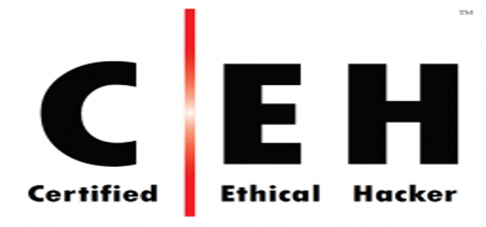

:slug: ceh-el-comienzo-de-la-travesia/
:date: 2018-03-14
:category: certificaciones
:subtitle: Experiencias sobre la certificación CEH
:tags: certificaciones, ethical hacking, seguridad, pentesting
:image: ceh-logo.png
:alt: logo CEH, Certified ethical hacker
:description: CEH es una de las certificaciones más reconocidas en el mercado laboral de la seguridad informática, en esta travesía contaré como fué mi experiencia entre las diferentes fases del proceso de aprendizaje para llegar a realizar un buen método de estudio y lograr conquistar mi primera certificación.
:keywords: CEH, profesional, certificaciones, ciberseguridad, informatica, experiencia
:author: Santiago Muñoz
:writer: smunoz
:name: Santiago Muñoz Ortega
:about1: Ingeniero de sistemas, C|EH
:about2: "Los sueños son mentiras que algún día dejarán de serlo"

= CEH: El comienzo de la travesía

A diferencia de muchas certificaciones del enfoque +Red Team+ que miden las habilidades de forma práctica como +OSCP+ y +OSWP+,
existen también muchas que evalúan el conocimiento de forma teórica como +CEH+.
En este artículo plasmaré mi recorrido a lo largo de mi primer viaje del camino de las certificaciones.
Hacía al destino final, la estación +CEH+.
El recorrido empieza desde por qué la escogí,
los tropiezos y frustraciones,las mini batallas ganadas,
desde consejos de cómo estudiar hasta la experiencia de haber llegado al final.

Cuando compré mi tiquete para la travesía no sabía a qué me enfrentaba,
constantemente me preguntaba, ¿Qué tan dificil será el camino?.
La única forma de saber era montarme en el tren y estudiar.

== CEH: Por qué escogí ese destino?

Al pensar en mis pocos años de experiencia pensé en cuál sería la mejor forma de empezar en el mundo de la seguridad informática.
Indagando en muchos foros
llegué a la conclusión de que el +CEH+ me podía ayudar a ambientarme en un mundo en el que apenas era un novato.
Junto con la motivación de que era mi primera certificación, me monté al tren.

== El primer vagón: Enfrentarse al fracaso

¿Qué tanto sabía superar el fracaso? La verdad no mucho.
Hasta que me di cuenta de que +CEH+ me estaba pateando en la cara,
la combinación de complejidad de los diferentes temas de la certificación resultaba un poco tedioso de digerir.
Cada capítulo era como un ladrillo más encima de mi espalda.
El tren hacía mi destino era turbulento y lleno de mucha información nueva.
La cual no fui capaz de digerir de un bocado.

El fracaso se sentaba en el mismo vagón conmigo 4 horas diarias para que la pelea entre él y yo se fuera acabando.
Al mismo tiempo entraba ansiedad porque el tiempo que tenía antes del examen era relativamente corto.

image::persona-fracasando.gif[persona fracasando sentado lluvia]

== El plato del tren: ¿Cómo se come eso?

Los conceptos del libro a veces no son muy amigables.
Enfrentandome a cada uno fue una tarea no muy sencilla, pues tan solo disponía de 4 horas diarias y las tenía que hacer rendir.
Los mapas conceptuales me ayudaban a hacer resúmenes muy gráficos de lo que estaba haciendo.
Un repaso lento con los temas principales de cada capítulo me ayudaba a captar ideas que se me habían escapado.

[quote]
*_"Slow and steady wins the race"_*

No hay que afanarse a leerse el libro a la velocidad de la luz, aún si tenemos un poco de prisa es mejor ir a paso lento pero seguro.
Devorando y saboreando cada bocado de los capítulos ayuda a no tener que tragar entero la comida y sufrir las consecuencias.
Discutir los temas con alguien o preparando monólogos ayudan a reforzar las falencias que se tiene de los temas.

== El eterno conflicto: Los exámenes de prueba

Durante el proceso de estudio compré varios exámenes virtuales para practicar mis conocimientos adquiridos de las lecturas del libro.
Los cuales a veces me torturaban más de lo que me ayudaban.
Darme cuenta de cuanto sabía era una tarea diaria que daba lugar a un conflicto interno entre mi cerebro y yo.

Mientras el camino se hacía más tedioso, me di cuenta de que esa frustración al final me estaba ayudando y me supe aprovechar de ella.
Simplemente aprendiendo de mis errores, aprendiendo de lo que me había equivocado.
En los exámenes trataba de responder cada opción de respuesta.
Me tomaba la tarea de escribir su justificación de porqué era o no la respuesta. Al final esta práctica me dio una luz de esperanza y un aviso de que mi hora de llegar a la estación del exámen final se acercaba.

== La estación final: El examen final

Faltaba la prueba final para que pudiera entrar a la última estación, la gran estación +CEH+.
125 preguntas con única respuesta y 4 horas me separaban de mi destino final.
Después de una ardua pelea contra todas mis dudas, todos mis pensamientos, el desespero de saber si la respuesta estaba correcta o no,
la lucha contra el cronómetro se hacía más y más corta.
Cuando el reloj marcaba las 3 horas y 20 minutos me arriesgué a mandar mi examen,
como fué modalidad virtual, el sistema arrojó la respuesta en tan solo 1 minuto,
dándome el paso al final de mi viaje, ya era un miembro más de la comunidad +CEH+.

== Consejos para realizar la certificación

=== Evitar la sobrecarga del cerebro

Evitando estudiar 10 horas un mismo día y tratar de repartirlas durante la semana,
es más efectivo estudiar 2 horas cada día ya que así nos evitamos sobre esforzarnos mucho durante un solo día.
Así también captamos las ideas rápido y en corto plazo, lo que nos deja también más tiempo para investigar si es necesario.

=== Escenarios reales

Existen diferentes herramientas en el curso oficial que imitan escenarios reales
para ver más a fondo cómo funcionan las herramientas, protocolos, ataques, tipos de defensa, entre otros.
Así se puede entender más a fondo un concepto en el cual se tenga duda.

No es cuestión de memorizar.
No es la mejor práctica aprenderse todo de memoria.
Así se tome un día más,
es mejor leer todo y entenderlo mucho mejor que solo aprenderse de memoria lo que dice el libro.

[quote]
*_"To beat a hacker, you need to think like a hacker"_*

=== Investigar: Tu mejor amigo

A veces el libro no soporta todo lo que preguntan en los cuestionarios en línea,
hay que ser más proactivos e investigar a fondo todo lo que se está aprendiendo.
El libro está diseñado para ser un apoyo en las investigaciones.
¡Depende mucho de tu cuenta ir hasta más allá!

=== El “bla, bla, bla” ayuda

Tratar de hablar de los temas con alguien, en foros, en chats, entre otros.
Ayuda mucho a saber que tan claro tenemos los temas y hasta cuánto hemos profundizado.
Esto con el fin de que nuestro cerebro se familiarice con el contenido y los conceptos de los temas del libro.

image::persona-bailando.gif[persona bailando feliz]

Al final del recorrido solo queda pensar en que lo lograste,
fueron 2 meses difíciles sacrificando tiempo de calidad con los seres queridos.
No fue fácil la travesía pero estás en tu destino, ya eres miembro oficial de los +CEH+.
Aunque es la primera estación de las muchas que faltan en el viaje de las certificaciones en seguridad informática.
