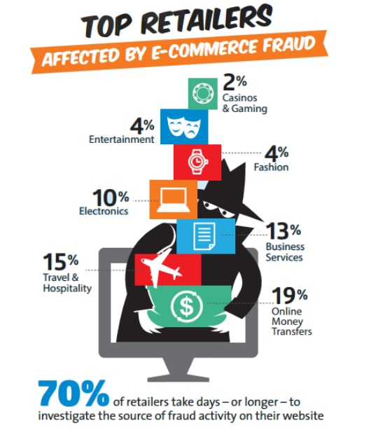

:slug: comportamiento-enemigo/
:date: 2016-11-08
:category: opiniones-de-seguridad
:tags: atacar, rsa, seguridad
:Image: 1.png
:author: Paula Velez
:writer: paulav
:name: Paula Velez
:about1: Ingeniera en informatica
:about2: Viajar para correr es un mundo de posibilidades

= El comportamiento del enemigo

La mayoría de la veces cuando pensamos en fraude electrónico siempre lo 
asociamos con los bancos, es común que tanto los usuarios como las 
instituciones nancieras relacionen el fraude con las bancas virtuales porque en 
la mayoría de los casos reportados siempre están relacionados de alguna forma a 
bancos y/o tarjetas. Con los avances tecnológicos y la apropiación de la 
tecnología todos los comercios están migrando a la web, ya que es mucho más 
fácil para el usuario solucionar todo por medio de un click desde la comodidad 
de su casa lo que genera un nuevo escenario para la seguridad de la información 
de cualquier tipo de organización, ya que no solo los bancos son susceptibles 
al fraude electrónico el cual se debe dejar de asociar sólo con el dinero, ya 
que la pérdida de reputación para una compañía genera muchas más pérdidas que 
el ataque a un solo usuario.

Con este nuevo escenario se debe pensar en una forma de mitigar este tipo de 
ataques, por un lado debemos concientizar a los usuarios para que usen 
responsablemente este tipo de servicios que van desde realizar transacciones 
en su banco hasta comprar el traje para la fiesta de navidad sin salir de casa, 
es por esto que analizar el comportamiento de los usuarios se convierte en un 
punto clave para descubrir posibles fraudes y de esta manera evitarlo antes de 
que logre afectar a la organización y/o dañar a los usuarios legítimos.

image::1.png[]
.*_Vision for fraud and risk management – https://globalsummit.rsa.com/wp-content/uploads/2015/09/RSA%E2%80%99s-Vision-For-Fraud-And-Risk-Management.pdf[RSA]_*

La realidad es que las amenazas no se anuncian abiertamente, sino todo lo 
contrario tienden a ocultar sus actividades entre las acciones de los usuarios 
legítimos. Sin embargo, un atacante al final va a terminar haciendo algo fuera 
de lo normal, por lo que sí podemos entender lo que es normal, las actividades 
sospechosas pueden sobresalir fácilmente.

Por esta razón es necesario entender el comportamiento de un usuario legítimo 
y a partir de allí comenzar a perlar (TTPs – Tactics, Techniques and 
Procedures) toda acción por fuera del patrón como un comportamiento sospechoso 
y tomar una acción una vez sea detectado; ya sea bloquearlo directamente o 
crear un incidente para que un analista revise el caso y decida si hace parte o 
no de una acción fraudulenta.

Aunque los comportamientos de un atacante siempre tratan de permanecer ocultos, 
existen patrones que los delatan, para esto se debe prestar mayor atención a:

* La velocidad en la navegación, un usuario real interactúa en un tiempo
especíco con la aplicación cualquier interacción con un tiempo menor debe 
considerarse sospechoso, ya que puede tratarse de actividad robótica.
* El orden de los flujos dentro de las funcionalidades del sistema, es decir un 
usuario legítimo antes de realizar una transacción no cambia de contraseña y 
actualiza su dirección, ese tipo de acciones antes de realizar una transacción 
debe generar una alerta en el sistema, porque no hace parte del comportamiento 
normal de un usuario antes de realizar un pago.
* La geolocalización del usuario y sus dispositivos, los usuarios suelen 
conectarse desde el mismo país y casi siempre usan los mismos dispositivos, 
cuando exista un cambio estos debe bloquearse directamente o validar con un 
segundo factor si el usuario es legítimo.

Herramientas para apoyar este tipo de actividades de perlamiento, detección y 
monitoreo existen en el mercado y cada una de ellas se adaptan según la 
necesidad de la organización pero más allá de una herramienta poderosa se debe 
tener un conocimiento claro del negocio y entender el comportamiento que tienen 
los usuarios para identicar con mayor facilidad las acciones que se consideran 
sospechosas. Cualquier estrategia que se decida implementar debería considerar 3 
puntos claves.

. Debe basarse en el *riesgo* que representa y de acuerdo a esto definir que 
tipo de acción se va a tomar. El nivel de riesgo debe medirse a partir: de los 
usuarios, su comportamiento, los dispositivos y el tipo de transacción.
. Debe ser *consciente* del contexto del negocio y estar presente en todo el 
ciclo de vida de un usuario dentro de la aplicación. (Antes, durante y al 
cerrar la sesión)
. Debe ser *ágil*, implementar acciones de detección y respuesta en tiempo real 
sin castigar la experiencia de los usuarios.

.*_Top retailers affected by e-commerce fraud – https://www.rsa.com/en-us/resources/2017-global-fraud-and-cybercrime-forecast[RSA]_*

Para finalizar es importante tener claro que no solo los bancos son 
susceptibles a este tipo de riesgos; los blancos de los atacantes evolucionan
día a día y se vuelven más creativos al descubrir técnicas que les generan 
dinero a través de cualquier tipo de plataformas. No importa qué tipo de 
negocio tengas, si tienes expuesto un servicio eres susceptible a cualquier 
tipo de ataque, desde el típico hijacking que afecta la reputación de una 
organización, hasta una actividad fraudulenta que no solo afecta la 
credibilidad, también compromete la seguridad de los usuarios sobretodo si se 
maneja algún tipo de e-commerce.
