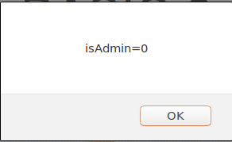
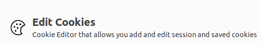
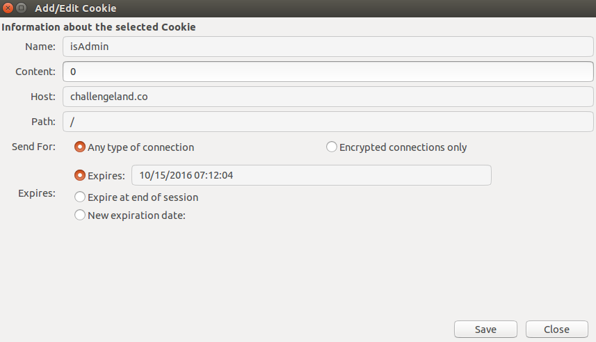

:slug: cookie-cool-mundo/
:date: 2016-12-24
:category: retos
:tags: cookie, reto, solucionar, herramienta
:Image: cookie-cool.png
:alt: Galleta usando gafas de sol de marco verde
:description: Las cookies informáticas contienen información de las preferencias y configuraciones de un usuario. Normalmente son usadas para hacer más práctica la navegación web sin embargo, también pueden ser utilizadas para el mal. A continuación resolveremos un reto de hacking utilizando las cookies.
:keywords: Cookie, Seguridad, Web, Hacking, Reto, Challengeland.
:author: Alejandro Aguirre
:writer: alejoa
:name: Alejandro Aguirre Soto
:about1: Ingeniero mecatrónico, Escuela de Ingeniería de Antioquia, Maestría en Simulación de sistemas fluidos, Arts et Métiers Paristech, Francia, Java programming specialization, Duke University , USA
:about2: Apasionado por el conocimiento, el arte y la ciencia.

= La cookie mas cool del mundo

== Cookies

Las cookies o galletas informáticas fueron inventadas con el propósito de hacer 
mas práctica la navegación web, en un principio se implementaron para 
identificar la información de los usuarios que visitan un sitio web. Cuando un 
usuario ingresa con sus credenciales en una página de validación, su 
información se guarda en una cookie, de manera que el servidor de este sitio 
web reconoce a este usuario, el cual obtiene privilegios de acceso que no 
tienen usuarios no identificados. Las cookies también son utilizadas por sitios 
web para personalizar el sitio según las preferencias y gustos del usuario.

== Seguridad y cookies

Como las cookies guardan información acerca del usuario-navegador deben 
implementarse datos anónimos (es decir sin involucrar la verdadera identidad 
del usuario) y aunque las cookies solo son leídas y entendidas por el servidor 
que las creó, en la web existen diversas formas de extraer o robar las 
preferencias de un usuario establecidas en una cookie, y crear por ejemplo 
campañas de publicidad de acuerdo al gusto de determinado usuario. 

Es por esto que se ha formado todo un debate acerca de las cookies y su 
implementación, muchos países tiene reglas estrictas con respecto a la 
utilización de estas famosas galletas informáticas.

== Reto

En este reto de link:http://challengeland.co/Challenges/Basic/b5961b4554[ChallengeLand] 
solo nos muestran una imagen de una galleta con gafas de sol! y no nos dicen 
nada más, como es una galleta inferimos que se trata de una cookie (galleta en 
inglés).

Debido a que la única información que poseemos es una imagen chistosa de una 
galleta, lo que tenemos que hacer es ejecutar el siguiente comando de 
javascript en cualquier campo URL de cualquier navegador, le damos enter y 
sabremos que nos quiere decir esta cookie.

.test.py
[source, javascript,linenums]
----
alert (document.cookie);
----

.Alerta que nos muestra la información de la cookie

Bien ahora sabemos algo más y es que la variable isAdmin es igual a 0, 
suponemos que la debemos cambiar a 1 para pasar este reto.

Ahora que sabemos leer la información de una cookie, vamos a proceder a 
editarla y para esto debemos instalarle un plugin a nuestro navegador llamado:
cookie editor en inglés (para mozilla firefox):

.Cookie editor para el mozilla firefox

Una vez instalado este plugin, reiniciamos el navegador y procedemos a 
implementar nuestro nuevo editor de galletas informáticas!

En nuestro cookie editor buscamos el sitio web en cuestión, en nuestro caso es 
Challengeland:

.Cookie editor funcionando
image::editor-2.png[editor-run]

Podemos ver toda la información de nuestra cookie y editarla en los campos que 
se muestran en la imagen de abajo, para nuestro ejemplo nos ocuparemos 
simplemente del campo de content el cual es igual a 0. Cambiamos este valor por 
1 (suponiendo que es el valor que necesitamos) y guardamos los cambios.

.Un vistazo a la información de nuestra galleta

Bien, ahora actualizamos nuestra página para enviarle al servidor nuestra 
cookie modificada, y pasa algo! La cookie mas cool del mundo nos revela la 
contraseña y no por arte de magia!

== Conclusión

Desde los años noventa las cookies han jugado un papel muy importante para la 
internet, gracias a ellas funcionan los carritos de compras en las tiendas de 
comercio electrónico.

También es importante reconocer su papel para modificar y guardar las 
preferencias de nuestros sitios web favoritos como los que usa Google.

Debemos ser precavidos con las cookies y no poner información importante en 
cualquier sitio web ya que alguna galleta maliciosa estará rondando siempre por 
ahí y podrá robarnos nuestra preciada información, y para esto lo mejor que se 
puede hacer es saber navegar en internet, es decir, no ingresar nuestros datos 
en sitios web que no sean confiables.

Ahora que sabemos manipular el cookie editor, lo único que nos falta hacer, es 
empezar a degustar todo tipo de galletas de todas partes del mundo!
