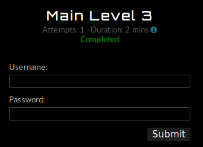
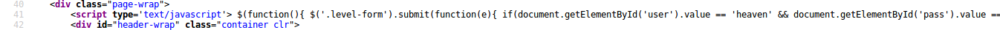
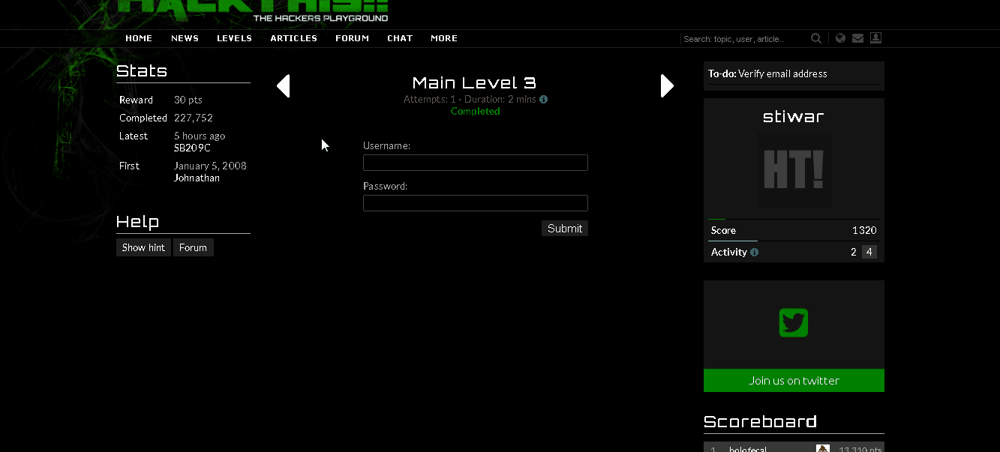

:slug: cuidado-con-el-javascript/
:date: 2017-12-20
:category: retos
:subtitle: Solución al reto Main 3 de Hackthis
:description: Los lenguajes de programación han construido el mundo de la web que conocemos hoy en día, entre ellos cabe destacar el uso de JavaScript, uno de los lenguajes más conocidos y utilizados en el desarrollo web. En este artículo utilizaremos JavaScript para solucionar un reto de hacking de hackthis.
:keywords: JavaScript, Seguridad, Web, Solución, Reto, Hackthis.
:author: Luis Arteaga
:tags: solucionar, javascript, reto
:image: js-pwd.png
:alt: Pinzas extrayendo la contraseña de unos datos binarios
:writer: stiwar
:name: Luis Arteaga
:about1: Ingeniero en Electrónica y Telecomunicaciones.
:about2: Apasionado por el desarrollo de aplicaciones web/móviles, la seguridad informática y los videojuegos.
:figure-caption: Imagen

= ¡Cuidado con el JavaScript!

El mundo de la web tal como se conoce hoy en día, ha sido posible gracias a los
avances tecnológicos. O entre otras cosas, gracias al grado de madurez que han
alcanzado los diferentes link:https://goo.gl/9ict5K[lenguajes de programación] con los
que se desarrolla la web en la actualidad.

Con el pasar de los días, salen al mercado nuevos lenguajes y
link:https://goo.gl/rjcdL3[frameworks], los cuales facilitan el trabajo a los
desarrolladores. Sin embargo, así mismo, cada vez se descubren nuevas
vulnerabilidades para estas tecnologías, las cuales son aprovechadas por
diferentes individuos conocidos como hackers, cuyo fin es aprovecharse de dichas
debilidades para beneficio propio; causando un mal servicio de un determinado
sitio web (o aplicación), o, en el peor de los casos, anular completamente dicho
servicio.

En esta oportunidad, y continuando con una serie de artículos sobre soluciones a
retos de link:https://www.hackthis.co.uk[hackthis], hablaremos un poco sobre las
precauciones que se deben tener en cuenta al trabajar con JavaScript; sobre todo
en cuanto a malos hábitos se refiere.

== JavaScript, un veterano de guerra

Si bien es cierto que existen muchas tecnologías en el mercado, útiles y con un
gran soporte en cuanto a mantenimiento y actualizaciones se refiere. No cabe duda
de que JavaScript (JS en adelante) sobresale de entre todas ellas. Y es que, con
el pasar de los años, JS ha mostrado un alto grado de madurez permitiéndonos
experimentar la web tal y como la conocemos hoy en día. Es tal su acogida, que es
uno de los lenguajes de programación con más variaciones (sino el que más) de
frameworks existentes en el mercado. Como por ejemplo:
link:https://angular.io/[Angular.js], link:https://vuejs.org/[Vue.js] y
link:https://jquery.com/[jQuery], solo por nombrar algunos.

== Reto: Main Level 3

En la web puedes encontrar una gran variedad de tutoriales acerca de JS. Sin
embargo, en este artículo daremos solución al reto 3 de la categoría _MAIN_ del
sitio web hackthis:

.hackthis: nivel 3 de la categoría MAIN

Al igual que en los primeros dos niveles, en este tercer nivel se solicita
ingresar credenciales de acceso válidas para un determinado usuario. Con el fin
de dar solución a este reto (y por ende burlar la seguridad basada en
formulario), haremos uso del visualizador de código fuente con el que cuentan
los navegadores web modernos, y también analizaremos su contenido JS.

Como he explicado en tutoriales pasados, para observar el código fuente de todo
sitio web, presionamos click derecho en cualquier lugar de la página y buscamos
la opción _View Page Source_ (en algunos casos puede aparecer distinto,
dependiendo del navegador utilizado y del idioma en el que esté configurado tu
sistema operativo) o también mediante el atajo _Ctrl+U_:

.uso de la herramienta View Page Source
image::viewsourcecode.png[vps]

Una vez desplegado el código fuente, debemos prestar especial atención al script
contenido en la línea 41:

.script JS (jQuery) contenido en el reto de nivel 3

Trataré de explicar el anterior script de jQuery de la manera más clara y sobre
todo, más sencilla posible:

En primer lugar se ejecuta una link:https://goo.gl/BRkKou[función anónima], la cual
captura el elemento html con el id (un identificador único para cada etiqueta)
igual a _level-form_. Posterior a ello, cuando el usuario pulsa el botón
_Submit_, se ejecuta un evento que en este caso tiene el mismo nombre que el
botón, realizando una comparación de los valores ingresados en los campos
Username y Password con los valores "heaven" y "hell" respectivamente.

En caso de coincidir el reto es resuelto, de lo contrario, se podrá visualizar
un mensaje de alerta con el texto: "Incorrect login". A continuación, se presenta
una imagen gif ilustrando el procedimiento descrito anteriormente:

.hackthis: animación y solución al reto MAIN 3

Por lo anterior, podemos resaltar que almacenar información _sensible_ o
confidencial en cualquier lugar del código fuente de un sitio web, es considerado
una mala práctica y NO se debe hacer bajo ninguna circunstancia. Sin importar si
lo haces dentro un comentario en html o dentro de un script de JS.

Además, si bien es cierto que realizar validaciones mediante JS en el lado del
cliente (front-end) agrega una capa de seguridad a nuestro sistema, también es
importante validar datos de un usuario en la parte del servidor (back-end). Ya
que, como hemos visto en entradas anteriores, el código fuente puede ser alterado
en el lado del cliente y por ende, un hacker podría burlar la validación de JS
accediendo a contenido no autorizado.

[quote]
Un gran poder conlleva una gran responsabilidad.
