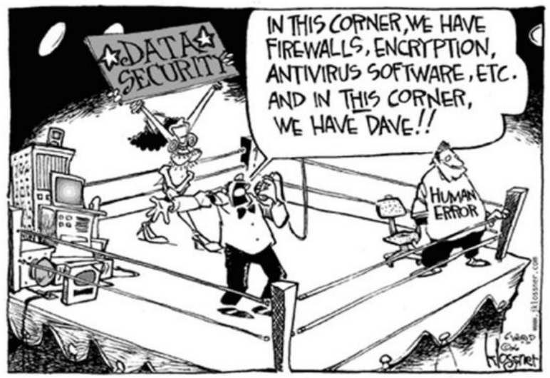
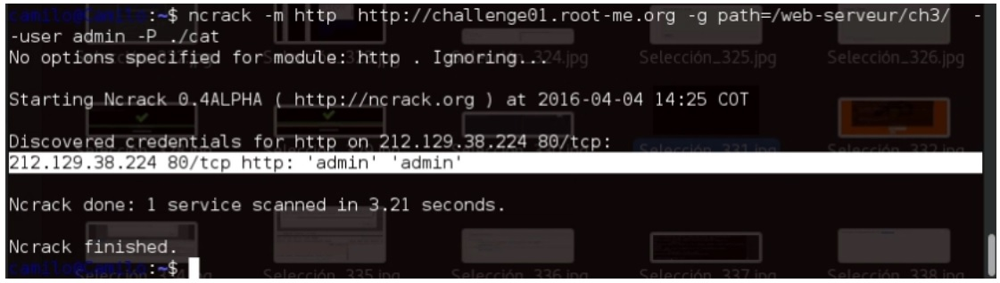
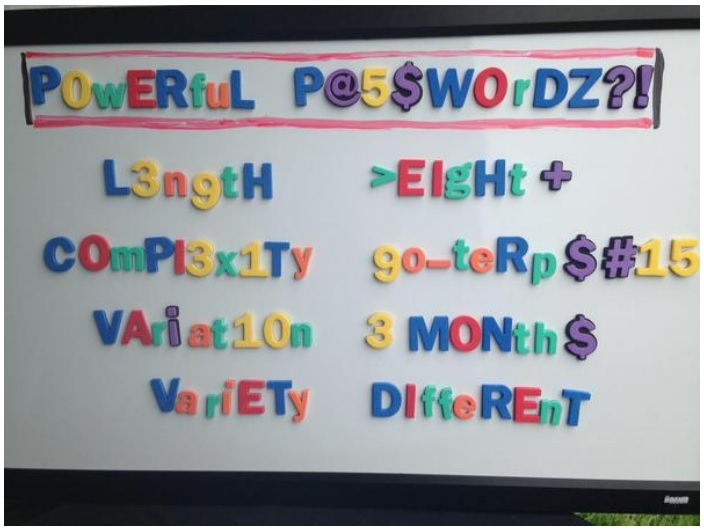

:slug: default-password/
:date: 2016-07-13
:category: opiniones-de-seguridad
:tags: seguridad, password, atacar
:Image: default-password.png
:author: Camilo Cardona
:writer: camiloc
:name: Camilo Cardona
:about1: Ingeniero de sistemas y computación, OSCP, OSWP
:about2: "No tengo talentos especiales, pero sí soy profundamente curioso" Albert Einstein

= Simplemente default

Las contraseñas o credenciales son uno de los mecanismos más comunes en los
sistemas actuales, las usamos a diario en nuestras redes sociales, nuestras
cuentas bancarias, nuestros dispositivos y en un sin fin de aplicaciones y
sistemas. Es por esto que en esta publicación hablaremos y mostraremos con
ejemplos prácticos cuales son los errores más comunes al momento de crear
contraseñas, como se aprovechan de esto los atacantes y como corregir estos
errores.

== El reto

Para esto resolveremos los retos que veremos a continuación usando herramientas 
como metasploit, medusa y ncrack.

.*_Figura 1. Errores de capa 8_*

Uno de los errores más comunes de los administradores es dejar las credenciales
de autenticación de las aplicaciones o dispositivos por defecto, ejemplo de 
ello son dispositivos o S.O con las siguientes combinaciones:

* Admin Admin
* Root Root
* Cisco Cisco
* Root Toor
* Mysql Mysql
* Etc

Lo que haría un atacante en este caso es crear un diccionario con todas las
posibles credenciales que tenga el dispositivo o aplicación que haya 
identificado y realizar un ataque de fuerza bruta, como lo vemos en el primer 
ejercicio Weak password en https://www.root-me.org/?lang=es[root-me.org]

Para esto podemos usar uno de los muchos diccionarios que hay internet o crear
uno propio con recursos como http://www.defaultpassword.com/[defaultpassword] 
y con las herramientas descritas anteriormente podemos realizar un ataque de 
fuerza bruta.

En este ocasión usaremos ncrack que soporta el protocolo *http*, (igualmente lo
podríamos hacer con medusa o metasploit). como se ve en la figura 2 y en 
cuestión de tiempo nos arroja las credenciales que fueron validadas. Es así 
como en cuestión de tiempo y un poco de astucia al momento de crear los 
diccionarios podríamos conseguir el acceso.

.*_Figura 2. Ataque de fuerza bruta_*

*Nota:*  Si queremos saber más de como usar esta herramienta podemos consultar
el manual de Linux “man ncrack” o en la fuente oficial.

== La solución

Para mitigar estas amenazas las organizaciones deben tener estipuladas 
políticas de contraseñas, donde enmarque cuan fuerte debe ser la contraseña, 
cada cuanto deben cambiarse y cada cuanto deben auditarse. Igualmente las 
personas deben usar contraseñas fuertes, no usar palabras de diccionarios o 
palabras con las que puedan relacionarnos como es nuestros gustos, direcciones, 
fechas u otras.

.*_Figura 3. Principio de las contraseñas fuertes Fuente: @UofMaryland_*
