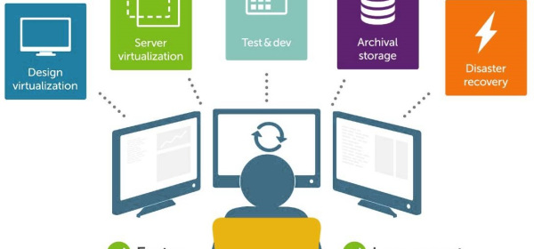
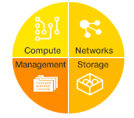

:slug: definiendo-software/
:date: 2017-03-07
:category: opiniones
:tags: sde, sdlc, software, definir
:Image: definiendo-software.png
:alt: Programandor trabajando en 3 monitores las etapas de diseño de software
:description: Definir por software componentes de operación resulta muy ventajoso. Para ello se puede utilizar un Entorno Definido por Software (SDE). Los SDE ofrecen una alternativa para la infraestructura centrada en hardware utilizando una interfaz programable y una plataforma común.
:keywords: Seguridad, SDE, SDLC, Software, Definir, Componentes.
:author: Ivan Velez
:writer: ivanv
:name: Ivan Velez
:about1: Ingeniero de sistemas con mas de 25 años de experiencia, en estrategia, diseño y operación de TI.
:about2: Linkedin

= Definiendo X Software

Existe la tendencia a definir por software los componentes de operación de 
infraestructuras TI, el almacenamiento, la computación, los centros de datos,
la red y otros, al definir por software un componente crítico de operación se 
obtienen beneficios operativos, al separar la capa física del modelo de operación.

Entre las visiones de los expertos, se encuentran frases como:

* “Una infraestructura definida por software incluye aceleradores de virtualización
a nivel de chip, aceleradores de almacenamiento virtual, aceleradores de paquetes 
de red, etc. Estamos acostumbrados a esto en los servidores. Ahora tenemos el 
mismo concepto en almacenamiento y redes”  – Shannon Poulin
* “En tanto que el procesamiento se mueve hacia la pila de red, habrá demanda por 
recursos del CPU para inspeccionar el tráfico de red y tomar decisiones. Los 
controladores de red permitirán la centralización y flexibilidad con poderosos 
grupos de CPU subyacentes a la infraestructura definida por software, en lugar 
de los elementos de red ubicados localmente, aislados y que consumen mucha energía. 
Esto incluye hardware “inteligente” que se integra con el software de control en 
todo el centro de datos, y un renovado enfoque en el CPU. Más control de la red 
tendrá lugar en el CPU” – Zeev Draer
* “El valor de SDN y la virtualización de la red se encuentra en la capa de control” – Lori MacVittie

.Software Defined Storage

El reto en infraestructuras de TI es controlar los excesos de aprovisionamiento,
y el aprovisionamiento y entrega de recursos definidos por software nos ayuda 
a esa labor, simplificando la labor de gestión, entregando herramientas de 
control y seguimiento, y permitiendo un aprovisionamiento rápido, con facilidades 
para la medición de capacidades y mejorar los planes de entrega de los servicios 
asociados.

== Entornos definidos por software (SDE)

A partir de una avalancha de datos nuevos para plataformas móviles y con base 
en cloud, las tecnologías disruptivas se mueven rápidamente; demasiado rápido 
para los sistemas de TI tradicionales que se encuentran obstaculizados por una 
gestión que exige mucho trabajo y altos costos para mantenerse al día. Las 
organizaciones ahora operan dentro de un mundo de requisitos de seguridad 
complejos, demasiados datos y cambios bruscos, lo que demanda una infraestructura 
de TI más simple, más adaptada y con mejor reacción.
Los Entornos Definidos por Software (SDE) ofrecen una alternativa para la 
infraestructura fijada y centrada en hardware. Utilizando una interfaz programable 
y una plataforma común, un SDE optimiza dinámicamente su infraestructura con la 
finalidad de ofrecer servicios de TI, de la forma más eficiente posible.

=== Beneficios

Con una infraestructura de SDE, las organizaciones pueden:

* *Simplificar las operaciones* con el ajuste y la configuración de una infraestructura 
automatizada
* *Reducir el tiempo de cálculo* con una arquitectura conectable sencilla y rica en APIs 
compatibles
* *Convertir en realidad mejores resultados de negocios* a través del aprendizaje cognitivo
y analítica avanzada
* *Detectar y responder* a las demandas de cargas de trabajo de forma automática
* *Optimizar los recursos* mediante la asignación de activos sin intervención manual
* *Mantener la gestión de seguridad y privacidad* a través de una plataforma común.

=== Cómo funciona

Con Entornos Definidos por Software, el uso de la automatización, patrones y 
reglas de despliegue, la configuración de su infraestructura puede ser 
reestructurada sin cambiar o trasladar los componentes físicos. Los Entornos 
Definidos por Software las capas de infraestructura de TI, que incluyen los 
elementos claves de redes, almacenamiento y servidores, así como también la 
administración.

.Software Defined Environments: 
link:https://www-935.ibm.com/services/nl/nl/it-services/systems/server-services/software-defined-environment/index.html[IBM]

* *El Almacenamiento Definido por Software (SDS):* Unifica el almacenamiento para 
todos los tipos de datos y gestiona enormes cantidades de datos con automatización 
avanzada, agilidad y rentabilidad, sin depender de la tecnología propietaria de 
los elementos de almacenamiento.
* *Redes Definidas por Software (SDN):* Se virtualizan y automatizan la creación de redes 
y aplicaciones de las mismas.
* *Cálculo Definido por Software (SDC):* Brinda la gestión y optimización de la 
infraestructura con conocimiento de la carga.
* *Gestión Definida por Software (SDM):* Automatización de la carga de trabajo, se 
define, optimice y organizan los recursos para ayudar a cumplir los requisitos de 
la carga de trabajo en tiempo real.

Estos elementos se pueden trabajar de diversas maneras utilizando los desarrollos 
implementados por el proyecto abierto de OpenStack.
