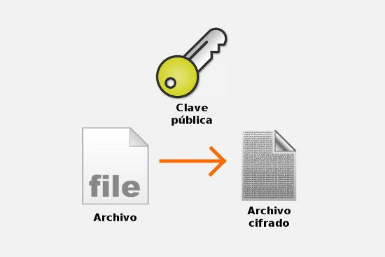
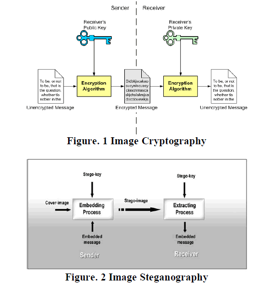
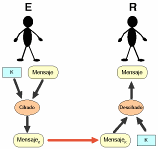
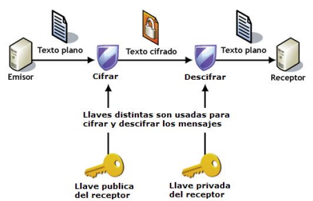

:slug: descifrando-mensaje/
:date: 2017-04-04
:category: opiniones
:tags: cifrar, seguridad, criptografía
:Image: cifrado-preview.png
:alt: Colección de datos hexadecimales con candados
:description: La protección de información sensible debe ser una prioridad en cualquier empresa. Mediante el uso de algoritmos de cifrado ésta información puede ser protegida, trayendo consigo muchas ventajas. En este artículo explicamos la importancia del cifrado y sus principales ventajas y desventajas.
:keywords: Seguridad, Criptografía, Mensaje, Información, Cifrar, Empresa.
:author: Francisco Bernal
:writer: pacho
:name: Francisco Bernal Baquero
:about1: Ingeniero Electrónico.
:about2: Programador en Python y Ruby, siempre dispuesto a aprender.

= D3SCIFR4ND0 UN M3NS4J3

El cifrado es un complemento indispensable para que la información no sea utilizada por quien no queremos, aunque se piense que 
cifrar es un término moderno la raza humana ha cifrado información casi desde sus inicios, desde lenguajes inventados hasta 
sustitución del orden del alfabeto.

El principio básico del cifrado es proteger los mensajes que se consideran importantes de las personas ajenas, guerras enteras 
se han perdido por cifrados deficientes 
(link:https://hipertextual.com/2011/07/la-maquina-enigma-el-sistema-de-cifrado-que-puso-en-jaque-a-europa[Máquina Enigma]).
En resumen, el cifrado de la información tiene una gran importancia a la hora de proteger los datos y la información que recibimos 
frente ataques contra nuestra red.

== Cifrar vs. Ocultar

No hay que confundir el cifrado que es alterar un mensaje, con ocultar. La esteganografía es la disciplina que se encarga de ocultar 
a través de diversas técnicas que generalmente se combinan con el proceso de cifrado como hablaban en *artículos anteriores.*

.Esteganografía vs. Cifrado – TuxyLinux

El objetivo principal de la criptografía es evitar que el contenido sea interpretado y el objetivo de la esteganografía es evitar 
que la existencia del contenido sea conocida.

== Tipos de cifrado

=== Cifrado simétrico

Es un cifrado que consiste en usar una clave que tanto el emisor como el receptor conocen.

.Cifrado simétrico- link:https://www.ibiblio.org/[ibiblio]

Este algoritmo realiza operaciones de link:http://unicrom.com/compuerta-xor-o-exclusiva/[XOR] (Or exclusivo)
link:https://es.khanacademy.org/computing/computer-science/cryptography/modarithmetic/a/modular-addition-and-subtraction[suma modular] y
link:https://msdn.microsoft.com/es-es/library/336xbhcz.aspx[desplazamiento de bits]. Es un cifrado en bloque de tamaño variable, cifras 
de bloques de texto de 32, 64 o 128 bits.

*Características*

* Es muy rápido.
* Arquitectura simple
* Bajos requisitos de memoria.
* Alta seguridad.
* Las rotaciones dependientes fortalecen el criptoanálisis.

=== AES

Es el estándar más avanzado del momento, su cifrado se basa en 128, 192 y 256 de longitud de clave.

*Características*

* Se trabaja a nivel de byte para reflejar los coeficientes de los polinomios.
* Tiene sus propias operaciones aritméticas.
* No es de tipo link:http://cifradofeistel.blogspot.com.co/[Feistel]

=== BlowFish

Es de clave variable, cifra bloques de texto de 64 bits, el tamaño de clave va desde los 32 a los 448 bits, genera 18 sub-claves 
de 32 bits y cuatro link:https://es.wikipedia.org/wiki/Cajas-S[cajas-S] de 9*32 bits, en total 4168 bytes.

*Características*

* Usa una función con las cuatro cajas-S y operaciones aritméticas básicas y XOR. Para su funcionamiento se requieren solo 5K.
* Es muy rápido a comparación de link:http://es.ccm.net/contents/130-introduccion-al-cifrado-mediante-des[DES] (Data Encryption Standard).
* Su concepto es simple.
* La longitud de clave es su fuerte.

=== Cifrado Asimétrico

Este método usa un par de claves para el envío de mensajes. Estas claves pertenecen a la misma persona a la que se le ha enviado 
el mensaje. Una clave es pública y la otra es privada, el emisor cifra el mensaje con la clave pública y el receptor descifra 
el mensaje con la clave privada.

.Cifrado Asimétrico- link:https://msdn.microsoft.com/en-us/library/ff650720.aspx[Microsoft]

* *RSA* (Rivest, Shamir y Adleman): Los mensajes enviados usando este algoritmo se representan mediante números y el funcionamiento
se basa en el producto de dos primos grandes -mayores que 10100- elegidos al azar para conformar la clave de descifrado.
* *Diffie-Hellman:* Permite acordar una clave secreta entre dos máquinas, a través de un canal inseguro y enviando únicamente 
dos mensajes. La clave secreta resultante no puede ser descubierta por un atacante, aunque éste obtenga los dos mensajes enviados 
por el protocolo.
* *DSA* (Digital Signature Algorithm): Es el algoritmo de firmado digital incluido en el DSS (Digital Signature Standard) del 
NIST (National Institute of Standards and Technology). Está basado en el problema de los logaritmos discretos y únicamente puede 
emplearse para las firmas digitales.
* *Elgammal:* Se utiliza en muchas aplicaciones y utiliza logaritmos discretos. En la raíz está la generación de P que es un 
número primo y G (que es un valor entre 1 y P-1)

== ¿Por qué cifrar los datos en una empresa?

Cifrar no es un proceso difícil el coste no es exagerado y los beneficios se muestran inmediatamente. Cifrar en la actualidad 
es un proceso más fácil que en el pasado, las herramientas de cifrado son más comunes, así como desarrolladores de software 
que desarrollan soluciones personalizadas de cifrado para empresas de todos los tamaños y hacerlo de la forma correcta además 
de garantizar la protección de datos -lo cual es un link:http://www.constitucioncolombia.com/titulo-2/capitulo-1/articulo-15[derecho fundamental],
respalda la seguridad de los valores de la compañía y otorgar confianza en los clientes.

== Desventajas de cifrar la información

Las ventajas de cifrar los datos son evidentes: protección de identidad, integridad de los datos, así como la seguridad de la 
información en redes abiertas, pero el cifrado también tiene algunas desventajas.

El principal inconveniente es que si se pierde la clave de cifrado la información cifrada también se pierde, este inconveniente 
es muy común para contraseñas muy difíciles de recordar. Adicionalmente la cantidad de recursos que se utilizan para descifrar 
la información puede afectar fácilmente el rendimiento de un proceso, debido a la cantidad de procesamiento que supone un cifrado 
fuerte, aunque a través del tiempo la potencia de los ordenadores ha ido aumentando y por ende se ha disminuido el tiempo de cifrado, 
pero aún sigue representando un problema, sobretodo cuando día a día van vulnerando cifrados de gran rendimiento como sucedió con 
link:https://security.googleblog.com/2017/02/announcing-first-sha1-collision.html[SHA-1] que aunque no era seguro si era muy popular.

== ¿Qué empresas deben cifrar la información?

Se podría decir que la deben cifrar todas aquellas empresas que traten datos personales en sus bases de datos, empresas que 
acepten el link:http://computerhoy.com/noticias/moviles/que-es-byod-ventajas-e-inconvenientes-7250[BYOD] (Bring Your Own Device), y 
todas aquellas empresas que desean mejorar su seguridad más allá de lo requerido. 

Para reducir el riesgo de fuga de información, las amenazas internas y otros ataques maliciosos, es recomendable utilizar el 
cifrado para proteger los datos sensibles en cualquier entorno, ya sea un entorno virtual, una nube pública, o incluso en 
servidores privados; esto incluye las bases de datos, los archivos almacenados en red, y todos los movimientos realizados en la 
infraestructura. A medida que crecen los activos el cifrado de los datos se convierte en una barrera indispensable ya que aplica 
un control de seguridad y de acceso a los datos sensibles así ya no se tenga acceso a ellos. *–Seguridad vs Privacidad–*
