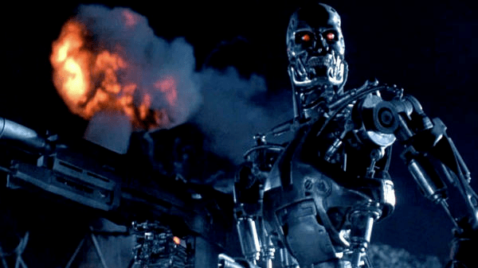
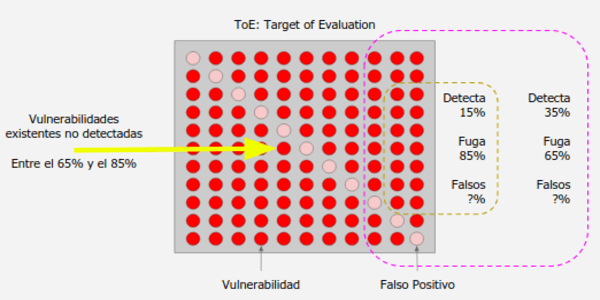
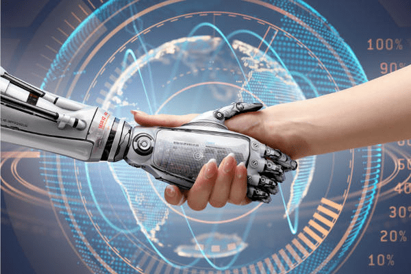

:slug: desplazados-maquinas/
:date: 2018-02-13
:category: opiniones
:tags: aplicación, detectar, vulnerabilidad, escáner
:Image: humano-vs-maquina.png
:alt: Persona jugando ajedrez contra un brazo mecánico
:description: La detección de vulnerabilidades en manos de una herramienta automática no es suficiente para concluir que una aplicación es segura. El conocimiento y experiencia de una persona siguen siendo necesarios para lograr una evaluación efectiva de la seguridad de dicha aplicación.
:keywords: Detección de Vulnerabilidades, Detección Manual, Detección Automática, Seguridad, Aplicación web, Herramientas Automatizadas.
:translate: replaced-machines/
:author: Andres Cuberos
:writer: cuberos
:name: Andrés Cuberos Lopera
:about1: Ingeniero Electrónico
:about2: Gusto por disfrutar los momentos pequeños de la vida, como tomarse una cerveza, escuchar música o dormir

= ¿Seremos Desplazados por las Máquinas?

Han pasado más de 20 años
desde que Garry Kasparov, el campeón mundial de ajedrez,
fue derrotado por +Deep Blue+, la supercomputadora diseñada por +IBM+.
Ese evento fue, para muchos, la prueba de que
las máquinas habían logrado superar la inteligencia humana <<r1,^[1]^>>.
Muchas inquietudes surgieron producto de esa creencia,
inquietudes acerca del avance tecnológico,
que iban desde trabajadores preocupados por sus empleos,
hasta creencias más apocalípticas, incentivadas por +Hollywood+,
donde las máquinas deciden conquistarnos y oprimirnos.

Dejando a un lado la ciencia ficción,
la primera inquietud está bien fundamentada.
Cada año vemos como salen máquinas al mercado
que realizan una tarea con una velocidad y precisión
capaz de superar a decenas de trabajadores experimentados.
Y con máquina no nos referimos a un robot
con la apariencia de un joven Arnold Schwarzenegger con gafas oscuras.
Puede ser cualquier equipo programado
para hacer una tarea específica.

Carros que se manejan solos,
brazos mecánicos que reducen costos y aumentan la eficiencia de un proceso,
y en el ambiente de la Seguridad de la Información,
herramientas que pueden encontrar vulnerabilidades y
fallas en una aplicación Web.
¿Qué nos espera a los que nos dedicamos a esto último?
¿Nos estamos volviendo cada vez más prescindibles?

.El inevitable desenlace que nos muestra +Hollywood+ del avance tecnológico

Afortunadamente, nuestro futuro no es tan oscuro.
Aunque existen herramientas automatizadas muy poderosas
para la detección de vulnerabilidades en aplicaciones Web,
todavía el rol del ser humano es de vital importancia
si se desea un análisis de seguridad detallado y efectivo.
Todavía existen situaciones donde tenemos la ventaja:

* Las herramientas pueden tener conocimiento de muchas vulnerabilidades,
saber cómo encontrarlas y qué nivel de riesgo pueden suponer.
Sin embargo, no poseen esa malicia humana que viene con la experiencia,
ese instinto que le permite a un analista de seguridad
identificar qué fallas se pueden combinar
para crear un vector de ataque que cause un mayor impacto.
Además de que esta malicia le puede permitir a una persona
encontrar vulnerabilidades que una máquina pase por alto.

* Sí, los analizadores generan un reporte con todos sus hallazgos
y criticidad pero, ¿qué tan completo es dicho reporte?
Te dice cuántos campos son afectados por una vulnerabilidad determinada pero,
¿te dice cuáles de ellos permiten la extracción de información sensible y
cuáles no?
¿Te dice cómo aprovechar algún formulario para modificar la base de datos?
Lastimosamente, no, las herramientas solamente
determinan la existencia de una falla.
El "cómo"  puede ser esa falla explotada y aprovechada
por un atacante para afectar tu situación particular de negocio
es una habilidad netamente humana, adquirida gracias a la misma malicia y experiencia mencionada anteriormente.

* Los falsos positivos, tal vez la mayor debilidad de los analizadores,
reportar el hallazgo de una vulnerabilidad que,
en realidad, no está presente <<r2,^[2]^>>.
Un problema muy común en la mayoría de estas herramientas,
que resulta de la incapacidad de explotar una falla.
Una herramienta que no filtre bien los falsos positivos
puede traer más daño que beneficio.
Si se utilizó para evitar incurrir en gastos
contratando a un profesional de seguridad,
ahora se tienen X vulnerabilidades encontradas.
De estas, no se sabe cuántas son falsos positivos.
Recaerá en el desarrollador,
alguien que no necesariamente domina el tema de seguridad,
revisar cuáles efectivamente son fallos y cuáles no.
¿El remedio fue peor que la enfermedad?
+
La característica de los falsos positivos
también es una de las razones por las que estas herramientas
no son muy utilizadas en ambientes de Integración Continua.
Si programamos un Integrador a que revise
cada cambio que se haga en un código,
y evite el despliegue de la aplicación en caso de encontrar algún fallo,
los falsos positivos podrían hacer que desplegar la aplicación
se convierta en toda una odisea.

* +Netsparker+ (un desarrollador de una de estas herramientas),
está de acuerdo con esta posición <<r3,^[3]^>>,
no existe un analizador capaz de detectar
todas las vulnerabilidades que están clasificadas dentro del
link:https://www.owasp.org/index.php/Top_10-2017_Top_10[Top 10]
más críticas.
Llega a la conclusión de que un analizador
no puede saber si la aplicación está funcionando como debe,
si está alineada con los objetivos de la empresa,
si la información sensible (que puede variar dependiendo del negocio)
está siendo correctamente protegida,
si los privilegios de los usuarios están siendo asignados correctamente,
y otros casos más donde el criterio humano debe tomar la decisión.

Nuestro objetivo no es quitarle el mérito a estas herramientas,
pues utilizamos muchas de ellas en nuestra vida profesional
y son aliados muy poderosos.
Lo que queremos es purgar la idea
de que son suficientes para llegar a la conclusión
de que una aplicación Web es segura.

Para eso, desarrollamos nuestro propio experimento.
Utilizamos la aplicación Web insegura +bWAPP+
y los analizadores +W3af+, +Wapiti+ y +OWASP ZAP+.
Estos últimos comparten las características de ser
+Open Source+ y poderse ejecutar por la línea de comandos.
Gracias a esto, es posible utilizarlos en un
ambiente de Integración Continua.
Para +bWAPP+ asumimos un total de vulnerabilidades de 170,
basado en el resultado del análisis de la empresa que la desarrolló
<<r4,^[4]^>>.
Veamos cómo les fue a nuestros concursantes:

[role="tb-row"]
.Análisis de Vulnerabilidades de +bWAPP+
[cols="^,^,^,^"]
|====
s| Herramienta s| Detectadas s| % de Fuga (No Detectadas) s| Tiempo

a|+W3af+ | 28 | 83.5% | 00:02:30

a|+Wapiti+ | 26 | 84.7% | 00:02:00

a|+ZAP-Short+ | 42 | 75.3% | 00:19:00

a|+ZAP-Full+ | 59 | 65.3% | 01:30:00
|====

En la información anterior,
+ZAP-Short+ se refiere a la herramienta +ZAP+
únicamente con los +plugins+ de +XSS+ y +SQLi+ habilitados.
+ZAP-Full+ se refiere a la misma herramienta
con todos sus +plugins+ activados.
Cabe resaltar, también, que fue necesario
desactivar la autenticación en la aplicación.
Esto se hizo para obtener un correcto funcionamiento
de las herramientas desde la línea de comandos.
Este hecho no solo aleja el experimento
de una situación real, sino que también
deja una capa de la aplicación sin analizar.

Otro detalle importante de mencionar es que
los analizadores no se apuntaron a la página principal,
como se haría en una prueba real.
El objetivo del ataque fue una página particular de +bWAPP+
donde se listaban enlaces a todas las demás páginas de la aplicación.
De esta manera se logra una identificación completa por parte de la herramienta.
+bWAPP+ utiliza formularios para llegar a las demás páginas,
por lo que apuntar las herramientas a la página principal
resultaba en que ninguna página de interés era encontrada.
Existen herramientas como +Burp+ que solucionan este problema
mediante la evaluación de formularios <<r5,^[5]^>>,
pero existen otras que fallan ante esta situación
debido a su incapacidad de navegar la aplicación.

Para facilitar el análisis de resultados,
tomemos el mejor resultado (+ZAP-Full+) y
el más bajo (+Wapiti+),
y comparémoslos con la totalidad de la aplicación,
veamos qué tanta cobertura se alcanzó.

.Representación visual del mejor y peor resultado de la Tabla 1- +ZAP-Full+ y +Wapiti+

Como podemos ver, incluso la mejor de las herramientas utilizadas
dejó por fuera más de la mitad de las vulnerabilidades y,
entre las encontradas, pueden existir falsos positivos.
Además, se demoró una hora y media
en terminar el análisis,
tiempo que no es adecuado en un ambiente de Integración Continua.

Un desarrollador que quisiera ahorrar costos,
evitando la contratación de analistas de seguridad
y dependiera únicamente de las herramientas,
remediaría las vulnerabilidades y adquiriría
una falsa sensación de seguridad.
Ignoraría que más de la mitad de errores
siguen ahí, esperando ser encontrados y explotados
por un usuario malicioso.
Así, los recursos que se ahorraron durante el desarrollo
se verán gastados, con intereses, en la etapa de producción.

== Conclusiones

Sí, la rivalidad humano-máquina ha estado presente
desde hace mucho, y seguirá estando presente por mucho tiempo.
Sin embargo, no es necesario verlo
como una rivalidad en todos los ámbitos.
En la seguridad de la información,
más que una rivalidad, puede existir
una relación complementaria, donde la herramienta
ayuda al analista en las tareas repetitivas
y éste añade su instinto y experiencia
para detectar de manera efectiva el mayor número de vulnerabilidades.
Logrando así, ofrecer un mayor nivel de seguridad
y satisfacción a los desarrolladores de aplicaciones Web.

Parafraseando a Garry Kasparov en su charla de +TED+ <<r6,^[6]^>>,
donde utiliza como ejemplo un torneo de ajedrez estilo libre
en el cual jugadores amateurs con tres máquinas comunes
derrotaron a grandes maestros y supercomputadoras;
la relación entre humano y máquina, a través de un proceso efectivo,
es la receta para lograr nuestros sueños más grandes.

.Desenlace alternativo a la relación humanos-máquina

== Referencias

. [[r1]] link:https://theconversation.com/twenty-years-on-from-deep-blue-vs-kasparov-how-a-chess-match-started-the-big-data-revolution-76882[Twenty years on from Deep Blue vs Kasparov: how a chess match started the big data revolution]
. [[r2]] link:http://resources.infosecinstitute.com/automated-tools-vs-a-manual-approach/#gref[Automated Tools vs a Manual Approach]
. [[r3]] link:https://www.netsparker.com/blog/web-security/owasp-top-10-web-security-scanner/[An Automated Scanner That Finds All OWASP Top 10 Security Flaws, Really?]
. [[r4]] link:http://www.mmebvba.com/sites/default/files/downloads/bWAPP_sample_report.pdf[BWAPP OWASP TOP TEN 2013 SCAN REPORT SUMMARY]
. [[r5]] link:https://support.portswigger.net/customer/portal/questions/12285606-spidering-form-submission[Burp Pro - Spidering + Form Submission]
. [[r6]] link:https://www.ted.com/talks/garry_kasparov_don_t_fear_intelligent_machines_work_with_them[Dont't fear intelligent machines. Work with them - Garry Kasparov en TED]
