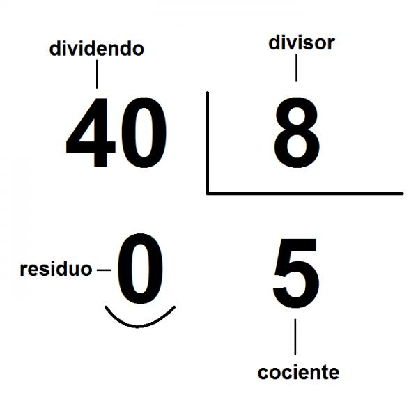

:slug: division-residual/
:date: 2016-12-24
:category: retos
:subtitle: Solución al reto 62 de CodeEval
:tags: matemática, reto, solucionar
:image: division.png
:alt: Monedas con números de diferentes colores
:description: A la hora de programar es común encontrar el operador MOD o módulo, que se utiliza en aplicaciones que involucran operaciones matemáticas o algoritmos sencillos para encontrar números primos. En este artículo utilizaremos el operador MOD para resolver un reto de programación de CodeEval.
:keywords: Matemática, Programación, Módulo, CodeEval, División, Residuo.
:author: Alejandro Aguirre
:writer: alejoa
:name: Alejandro Aguirre Soto
:about1: Ingeniero mecatrónico, Escuela de Ingeniería de Antioquia, Maestría en Simulación de sistemas fluidos, Arts et Métiers Paristech, Francia, Java programming specialization, Duke University , USA
:about2: Apasionado por el conocimiento, el arte y la ciencia.

= División Residual

En mátematicas se conoce como residuo a la operación matemática que proporciona
lo que sobra de una división entre dos enteros, así pues el residuo de *2/2* es
igual a *0* ya que el dos está una sola vez en el dos mas CERO. Pero el residuo
de *3/2* es igual a *1* ya que el dos está una sola vez en el tres mas UNO.

.Ejemplo

Mas concretamente: "el resto o residuo de una división de dos números enteros
es el número que se le ha de restar al dividendo para que sea igual a un
determinado número de veces el divisor" (Tomado de
https://es.wikipedia.org/wiki/Resto[Wikipedia])

En informática la operación conocida como modulus o módulo es la operación que
nos da el valor residual de una división. Normalmente la encontramos en varios
lenguajes de programación como: %. Por ejemplo:

* 2%2 = 0
* 3%2 = 1
* 4%2 = 0
* 5%3 = 2

Está operación es bastante utilizada ya que gracias a ella podemos saber por
ejemplo si un número es par o impar, ya que si el residuo de cualquier número
entero divido entre dos nos da cero significa que es par. Por el contrario si
dividimos cualquier número entero entre dos y el residuo de esta división nos
da uno, esto quiere decir que este número es impar. También es muy común
utilizar la operación modulus en informática para encontrar de la manera más
simple los *números primos*.

A continuación se explica la solución a un reto informático de
https://www.codeeval.com/browse/62/[CodeEval] para encontrar el residuo de una
división entre enteros en lenguaje python.

== Codeeval Reto 62

Se debe encontrar el residuo de una división entre enteros, pero con la
condición de no utilizar la operación modulus (%). Como entrada nos dan los
valores a los cuales les debemos encontrar el residuo de la división separados
por coma:

M,N → M modulus N → M%N

=== Entrada:

* 20,6
* 2,3
* 7,3

=== Salida:

* 2 → el 6 está 3 veces en el 20 → 3*6 = 18 → y le falta 2  para llegar a 20
* 2 → el 3 está 0 veces en el 2  → 0*3 = 0  → y le falta 2  para llegar a 2
* 1 → el 3 está 2 veces en el 7  → 2*3 = 6  → y le falta 1  para llegar a 7

.remainder.py
[source, python,linenums]
----
# encoding: utf-8
# Solution by Goso (Alejandro Aguirre Soto)

import sys #<1>

#expected input: num1,num2
test = sys.argv[1] #<2>
num = test.split(",")  #<3>
num1 = int(num[0]) #<4>
num2 = int(num[1]) #<5>
modu = num1 - (num2*(num1/num2)) #<6>
print(modu) #<7>
# Here ends our script
----

=== Explicación

El +script+ anterior calcula el residuo de la división
sin hacer uso del operador módulo (+%+) definido en el lenguaje.
El divisor nunca será +0+ por lo que no requiere de una validación de entradas.
La entradas válidas son dos enteros positivos,
separados por una coma, sin espacios.
A continuación se presenta una explicación del código:

. Importamos la librería +sys+ para recibir los parámetros del programa.
. Leemos la entrada y la almacenamos en la variable +test+.
. Separamos los números por coma en el array +num[]+.
. El primer número (dividendo) se almacena en la variable +num1+.
. El segundo número (divisor) se almacena en la variable +num2+.
. En la variable +modu+ calculamos el residuo de la siguiente manera:
+
* Calculamos la división normal +/+ entre el dividendo y el divisor
para saber la cantidad de veces que +num2+ esta contenido en +num1+.
* Esa cantidad de veces la multiplicamos por el número divisor
con el fin de obtener una aproximación al dividendo.
* El número 1 (dividendo) lo restamos a la operación anterior.
La diferencia entre el dividendo y divisor es el residuo.
* Si el residuo es +0+ la división es exacta.
. Finalmente mostramos el residuo calculado.
